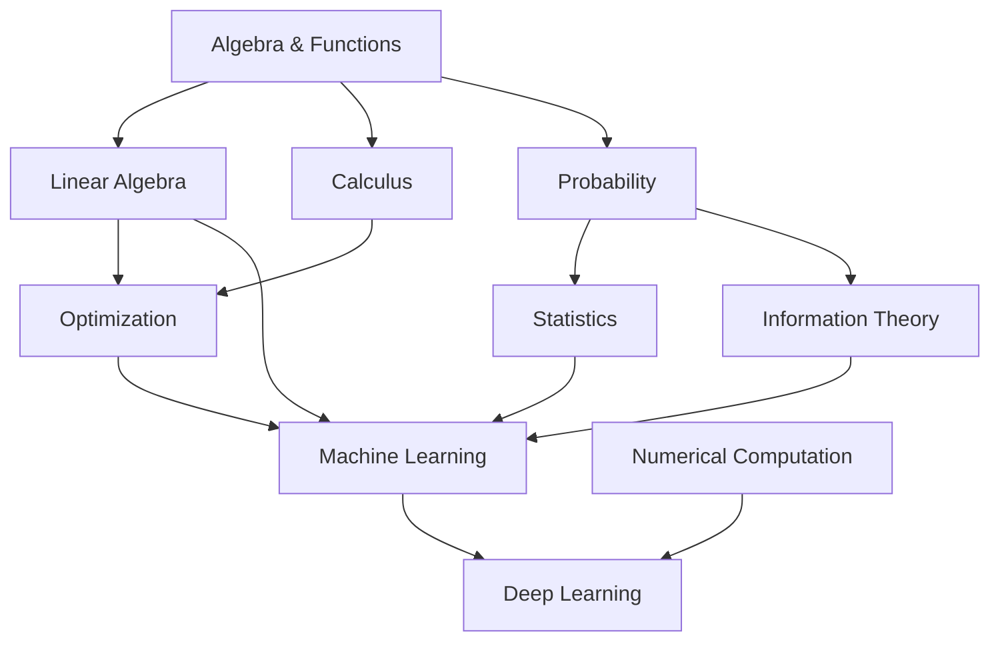

# Mathematics for Artificial Intelligence

AI không “dùng toán” như một phụ kiện. Mathematics là language giúp ta biểu diễn data, uncertainty, transformation, objective và learning process. Nếu bỏ toán hoàn toàn, nhiều concept AI sẽ biến thành rule cần học thuộc: “softmax dùng ở đây”, “gradient descent dùng ở kia”, “embedding là vector”. Nếu hiểu vai trò của từng mathematical tool, các concept đó nối lại thành một hệ thống reasoning thống nhất.

Chapter này là bản đồ dependency. Các topic Linear Algebra, Probability, Statistics, Calculus, Information Theory, Optimization và Numerical Computation sẽ được tách thành chapter riêng sau; ở đây mục tiêu là hiểu **tại sao từng nhánh toán xuất hiện trong AI**.

## Một model như một mathematical function

Ở abstraction đơn giản nhất, model là function:

\[
f_\theta: X \rightarrow Y
\]

`X` là input space, `Y` là output space, còn `θ` là parameters.

Ví dụ linear model:

\[
\hat{y}=\mathbf{w}^T\mathbf{x}+b
\]

Ở đây input không còn là “khách hàng” mà là vector `x`; parameters `w` xác định cách mỗi component ảnh hưởng output; `b` là bias/intercept.

Training là process chọn `θ` sao cho model behavior phù hợp data và objective.

Một large neural network vẫn có thể nhìn theo cùng abstraction, chỉ khác là `f_θ` là composition của rất nhiều transformations.

## Linear Algebra: language của representation và transformation

Machine Learning xử lý rất nhiều quantities cùng lúc. Một image có hàng trăm nghìn pixel. Một embedding có hàng trăm hoặc hàng nghìn dimensions. Một training batch chứa nhiều examples.

Linear Algebra cho ta vector, matrix và tensor để biểu diễn những quantities đó compactly.

Một vector:

\[
\mathbf{x}=\begin{bmatrix}x_1\\x_2\\x_3\end{bmatrix}
\]

có thể biểu diễn feature của một sample.

Matrix:

\[
W\in\mathbb{R}^{m\times n}
\]

có thể biến vector `n` dimensions thành representation `m` dimensions:

\[
\mathbf{y}=W\mathbf{x}
\]

Đây không chỉ là notation. GPU đặc biệt hiệu quả với large matrix multiplication, nên architecture của Deep Learning và hardware evolution có quan hệ rất chặt.

Transformer chứa nhiều phép matrix multiplication. Query, Key và Value đều là linear projections của hidden states:

\[
Q=XW_Q,\quad K=XW_K,\quad V=XW_V
\]

Nếu không hiểu matrix multiplication như transformation giữa vector spaces, attention sẽ dễ trở thành công thức cần ghi nhớ thay vì mechanism có thể reasoning.

### Dot Product và Similarity

Dot product:

\[
\mathbf{a}\cdot\mathbf{b}=\sum_i a_i b_i
\]

xuất hiện liên tục trong AI. Nó đo alignment theo một nghĩa geometric. Attention sử dụng query-key dot products. Embedding retrieval thường dùng dot product hoặc cosine similarity.

Cosine similarity:

\[
\cos(\theta)=\frac{\mathbf{a}\cdot\mathbf{b}}{\|\mathbf{a}\|\|\mathbf{b}\|}
\]

so sánh direction thay vì magnitude tuyệt đối.

Trong semantic search, nếu learned embedding space đặt semantically related documents theo directions gần nhau, cosine similarity trở thành useful retrieval signal.

Nhưng cần nhớ: similarity có ý nghĩa vì representation đã được trained để geometry phản ánh objective nào đó. Dot product tự nó không “hiểu meaning”.

## Calculus: language của change

Training cần biết: nếu thay parameter một chút, loss thay đổi thế nào?

Derivative trả lời câu hỏi đó.

Với scalar function:

\[
y=f(x)
\]

derivative:

\[
\frac{dy}{dx}
\]

mô tả local rate of change.

Neural network có hàng triệu parameters nên ta dùng gradient:

\[
\nabla_\theta L
\]

Gradient là vector partial derivatives của loss đối với parameters. Nó chỉ direction local làm loss tăng nhanh; vì vậy negative gradient là direction local để giảm loss.

Gradient descent:

\[
\theta_{t+1}=\theta_t-\eta\nabla_\theta L(\theta_t)
\]

trong đó `η` là learning rate.

Điểm cốt lõi là: calculus biến câu hỏi “parameter nào nên thay đổi?” thành một computable signal.

### Chain Rule và Backpropagation

Neural network là composition:

\[
f(x)=f_3(f_2(f_1(x)))
\]

Muốn biết parameter ở layer đầu ảnh hưởng final loss ra sao, cần chain rule.

Nếu:

\[
y=f(u),\quad u=g(x)
\]

thì:

\[
\frac{dy}{dx}=\frac{dy}{du}\frac{du}{dx}
\]

Backpropagation là efficient application của chain rule trên computation graph. Nó không phải một “AI algorithm bí ẩn”; nó là cách reuse intermediate derivatives để tính gradient cho nhiều parameters hiệu quả.

## Probability: language của uncertainty

AI system thường không biết chắc outcome. Classification model có thể trả distribution:

\[
P(y=k\mid x)
\]

Language model trả probability của next token:

\[
P(x_t\mid x_{<t})
\]

Bayesian reasoning cập nhật belief khi có evidence:

\[
P(H\mid E)=\frac{P(E\mid H)P(H)}{P(E)}
\]

Probability giúp phân biệt ba thứ thường bị trộn:

- uncertainty về world;
- uncertainty do thiếu data/knowledge;
- randomness do sampling process.

Một model output probability `0.9` không tự động có nghĩa trong 100 prediction như vậy sẽ đúng 90 lần. Muốn interpretation đó đáng tin, model cần **calibration** tốt.

## Statistics: từ sample tới population

Machine Learning train trên finite dataset nhưng muốn hoạt động trên unseen cases. Đây là statistical problem.

Giả sử true data distribution là `P(X,Y)` nhưng ta chỉ thấy sample:

\[
D=\{(x_i,y_i)\}_{i=1}^n
\]

Training loss đo performance trên sample, trong khi mục tiêu thật là expected risk trên underlying distribution:

\[
R(\theta)=\mathbb{E}_{(x,y)\sim P}[L(f_\theta(x),y)]
\]

Ta không biết `P` chính xác, nên thường minimize empirical risk:

\[
\hat{R}(\theta)=\frac{1}{n}\sum_{i=1}^n L(f_\theta(x_i),y_i)
\]

Khoảng cách giữa training performance và real-world performance đưa ta tới generalization, overfitting, validation, confidence interval, hypothesis testing và distribution shift.

Statistics vì vậy không chỉ dùng để “vẽ chart data”. Nó là nền để biết một kết luận học từ sample có đáng tin trên population hay không.

## Optimization: biến objective thành parameters

Một model architecture xác định hypothesis space. Loss function xác định model behavior nào được thưởng/phạt. Optimization tìm parameters đạt objective tốt hơn.

General form:

\[
\theta^*=\arg\min_\theta J(\theta)
\]

Trong supervised learning:

\[
J(\theta)=\frac{1}{n}\sum_i L(f_\theta(x_i),y_i)+\lambda\Omega(\theta)
\]

Term đầu fit data. `Ω(θ)` có thể regularize model. `λ` điều khiển trade-off.

Optimization không đảm bảo objective đại diện đúng real-world goal. Nếu loss function không encode đúng điều ta quan tâm, optimizer có thể làm rất tốt một objective sai.

Đây là connection giữa Mathematics và AI Safety: specification của objective quan trọng không kém khả năng optimize.

## Information Theory: uncertainty và information

**Entropy (엔트로피)** của discrete distribution:

\[
H(X)=-\sum_x p(x)\log p(x)
\]

đo mức uncertainty trung bình.

Nếu distribution rất tập trung, entropy thấp. Nếu nhiều outcome có probability gần nhau, entropy cao.

Cross-entropy:

\[
H(p,q)=-\sum_x p(x)\log q(x)
\]

xuất hiện như loss trong classification và language modeling. Khi target distribution `p` là one-hot, minimizing cross-entropy tương ứng tăng probability model gán cho correct class/token.

Kullback-Leibler divergence:

\[
D_{KL}(p\|q)=\sum_x p(x)\log\frac{p(x)}{q(x)}
\]

đo difference giữa distributions theo một direction. KL xuất hiện trong variational inference, VAEs, RL, distillation và preference optimization.

Information Theory giúp giải thích vì sao log probability và entropy xuất hiện liên tục trong Generative AI.

## Geometry của high-dimensional spaces

AI hiện đại sống trong high-dimensional vector spaces. Trực giác 2D/3D đôi khi không còn đúng.

Khi dimension tăng:

- volume phân bố khác trực giác;
- nearest-neighbor behavior thay đổi;
- data cần nhiều sample hơn để cover space;
- distance có thể concentrate;
- optimization landscape trở nên phức tạp.

Đây là background của curse of dimensionality và lý do representation learning quan trọng: ta muốn tìm một space nơi structure relevant trở nên dễ xử lý hơn.

## Numerical Computation: công thức đúng vẫn có thể tính sai

Computer dùng finite precision. Floating-point arithmetic không phải real-number arithmetic hoàn hảo.

Ví dụ softmax naive:

\[
softmax(z_i)=\frac{e^{z_i}}{\sum_j e^{z_j}}
\]

Nếu `z_i` rất lớn, `e^{z_i}` có thể overflow. Ta dùng identity:

\[
softmax(z_i)=\frac{e^{z_i-c}}{\sum_j e^{z_j-c}}
\]

với:

\[
c=\max_j z_j
\]

để ổn định numerical computation mà không đổi result mathematically.

Những issue như overflow, underflow, precision, conditioning và accumulation error trở nên rất quan trọng khi train model lớn bằng FP16/BF16 hoặc quantized inference.

## Discrete Mathematics và Graphs

Không phải AI chỉ dùng continuous mathematics. Search, logic, graph algorithms, combinatorics và constraint solving dựa mạnh vào discrete mathematics.

Knowledge graph:

\[
G=(V,E)
\]

Search tree, planning graph, dependency graph và computational graph đều là graph structures.

Transformer cuối cùng vẫn chạy trên token sequence rời rạc ở input/output, dù internal computation dùng continuous vectors.

AI vì vậy nằm ở intersection của discrete và continuous computation.

## Một example nối các nhánh toán: binary classification

Giả sử logistic regression:

\[
z=\mathbf{w}^T\mathbf{x}+b
\]

Linear Algebra tạo weighted combination.

Sigmoid:

\[
\sigma(z)=\frac{1}{1+e^{-z}}
\]

map real number thành `(0,1)`, có thể interpret như probability model.

Binary cross-entropy:

\[
L=-[y\log p+(1-y)\log(1-p)]
\]

đến từ probabilistic likelihood / Information Theory perspective.

Calculus tính gradient của loss theo `w,b`.

Optimization update parameters.

Statistics đánh giá model có generalize ngoài training sample hay không.

Chỉ một model đơn giản đã cho thấy Linear Algebra, Probability, Information Theory, Calculus, Optimization và Statistics cùng làm việc.

## Một example hiện đại: Transformer Attention

Scaled dot-product attention:

\[
Attention(Q,K,V)=softmax\left(\frac{QK^T}{\sqrt{d_k}}\right)V
\]

Có thể unpack theo Mathematics:

`QK^T` là matrix of pairwise alignment scores. Đây là Linear Algebra.

Chia cho `\sqrt{d_k}` giúp scale variance của dot products để softmax không quá saturated khi dimension lớn.

Softmax biến scores thành normalized positive weights, gần với probability-like distribution.

Nhân weights với `V` tạo weighted combination của value vectors.

Training toàn module dựa vào Calculus/backpropagation và Optimization.

Như vậy công thức attention không phải một magic block. Nó là composition của những mathematical operations đã quen.

## Thứ tự học toán cho AI

Dependency thực dụng:



Không cần “học xong toàn bộ toán” rồi mới học AI. Cách hiệu quả hơn là học concept toán đúng lúc AI cần nó, nhưng vẫn có chapter riêng để xây understanding sâu và tránh kiến thức rời rạc.

## Mental Model

Có thể nén vai trò của mathematics trong AI thành:

```text
Linear Algebra   → representation & transformation
Calculus         → sensitivity & gradients
Probability      → uncertainty
Statistics       → learning/generalization from samples
Optimization     → search for parameters/actions
Information Theory → uncertainty, likelihood & representation
Numerical Methods → make mathematics executable on real hardware
Discrete Math    → structure, logic, graph & search
```

## Common Misconceptions

### “AI chỉ cần Linear Algebra và Calculus”

Hai nhánh này rất quan trọng cho Deep Learning nhưng Probability, Statistics, Optimization, Information Theory và Numerical Computation đều cần để hiểu model behavior và evaluation.

### “Framework tự tính gradient nên không cần hiểu derivative”

Autograd giúp tính, nhưng không giải thích vanishing/exploding gradient, learning-rate behavior, gradient clipping hoặc why optimization fails. Hiểu mechanism vẫn cần thiết để debug.

### “Probability output là confidence thật”

Model score chỉ trở thành interpretable confidence dưới assumptions và calibration phù hợp. Neural network có thể rất overconfident khi distribution shift.

### “Công thức đúng về lý thuyết thì implementation cũng đúng”

Floating-point limitations, overflow, precision và hardware kernels có thể làm numerical behavior khác kỳ vọng lý thuyết.

## Knowledge Connection

Toán trong AI không nên học như một prerequisite tách rời. Mỗi chapter sau sẽ quay lại các công cụ này trong context: Linear Algebra khi học embeddings/attention, Probability khi học classification và generative models, Calculus khi học backpropagation, Statistics khi học evaluation/generalization, Information Theory khi học language modeling, và Optimization khi học training/alignment.

Xem lại: [Problem Representation](../00_foundations/03_problem_representation.md) và [AI vs ML vs DL vs Generative AI](../00_foundations/05_ai_vs_ml_vs_dl_vs_generative_ai.md).