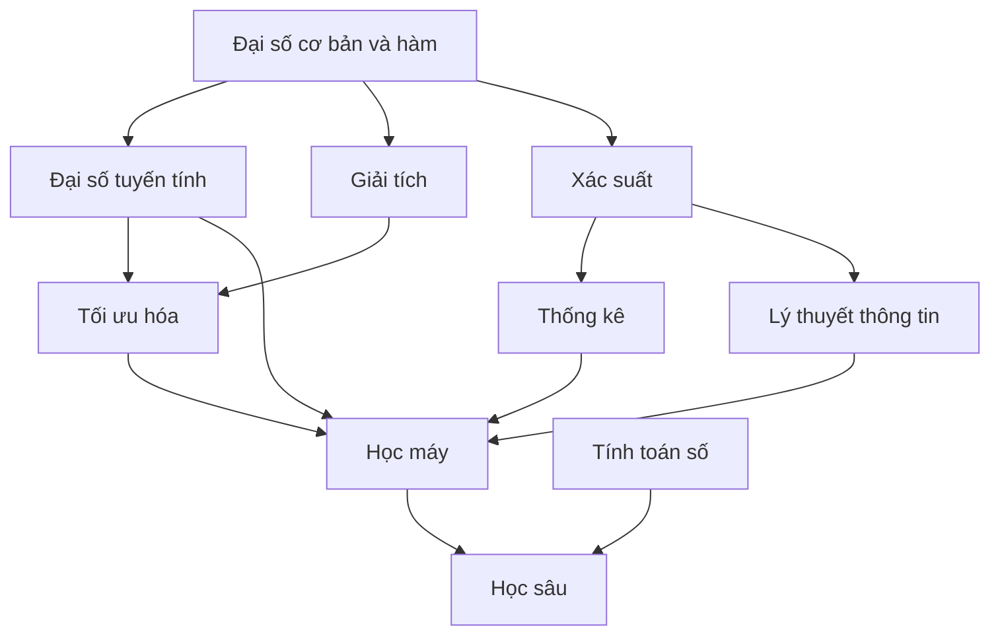

# Toán học cho Trí tuệ nhân tạo

AI không “dùng toán” như một phụ kiện. **Toán học (Mathematics)** là ngôn ngữ giúp ta biểu diễn dữ liệu, sự bất định, phép biến đổi, hàm mục tiêu và quá trình học. Nếu bỏ toán hoàn toàn, nhiều khái niệm AI sẽ biến thành các quy tắc phải học thuộc như “softmax dùng ở đây”, “gradient descent dùng ở kia”, “embedding là vector”. Khi hiểu vai trò của từng công cụ toán học, các khái niệm đó nối lại thành một hệ thống suy luận thống nhất.

Chapter này đóng vai trò bản đồ phụ thuộc. Đại số tuyến tính, xác suất, thống kê, giải tích, lý thuyết thông tin, tối ưu hóa và tính toán số sẽ được tách thành chapter riêng; ở đây mục tiêu là hiểu **vì sao từng nhánh toán xuất hiện trong AI**.

## Mô hình như một hàm toán học

Ở mức trừu tượng đơn giản nhất, mô hình là một hàm:

\[
f_\theta: X \rightarrow Y
\]

`X` là không gian đầu vào, `Y` là không gian đầu ra, còn `θ` là tập tham số.

Ví dụ mô hình tuyến tính:

\[
\hat{y}=\mathbf{w}^T\mathbf{x}+b
\]

Ở đây đầu vào không còn là “khách hàng” theo nghĩa đời thực mà là vector `x`; các tham số `w` xác định mức ảnh hưởng của từng thành phần lên đầu ra; `b` là hệ số chệch (bias/intercept).

**Huấn luyện (training)** là quá trình chọn `θ` sao cho hành vi của mô hình phù hợp với dữ liệu và hàm mục tiêu.

Một mạng nơ-ron lớn vẫn có thể được nhìn bằng cùng phép trừu tượng này; điểm khác là `f_θ` là phép hợp thành của rất nhiều phép biến đổi.

## Đại số tuyến tính: ngôn ngữ của biểu diễn và biến đổi

Học máy phải xử lý rất nhiều đại lượng cùng lúc. Một ảnh có thể chứa hàng trăm nghìn điểm ảnh. Một vector nhúng có hàng trăm hoặc hàng nghìn chiều. Một lô huấn luyện chứa nhiều mẫu dữ liệu.

**Đại số tuyến tính (Linear Algebra)** cung cấp vector, ma trận và tensor để biểu diễn các đại lượng đó một cách gọn gàng.

Một vector:

\[
\mathbf{x}=\begin{bmatrix}x_1\\x_2\\x_3\end{bmatrix}
\]

có thể biểu diễn các đặc trưng của một mẫu dữ liệu.

Ma trận:

\[
W\in\mathbb{R}^{m\times n}
\]

có thể biến vector `n` chiều thành biểu diễn `m` chiều:

\[
\mathbf{y}=W\mathbf{x}
\]

Đây không chỉ là ký hiệu. GPU đặc biệt hiệu quả với phép nhân ma trận lớn, nên kiến trúc học sâu và sự phát triển phần cứng có quan hệ rất chặt.

Transformer chứa rất nhiều phép nhân ma trận. Query, Key và Value đều là các phép chiếu tuyến tính của trạng thái ẩn:

\[
Q=XW_Q,\quad K=XW_K,\quad V=XW_V
\]

Nếu không hiểu phép nhân ma trận như phép biến đổi giữa các không gian vector, attention dễ trở thành công thức phải ghi nhớ thay vì một cơ chế có thể suy luận được.

### Tích vô hướng và độ tương đồng

**Tích vô hướng (dot product)**:

\[
\mathbf{a}\cdot\mathbf{b}=\sum_i a_i b_i
\]

xuất hiện liên tục trong AI. Về hình học, nó phản ánh mức độ hai vector cùng hướng. Attention sử dụng tích vô hướng giữa Query và Key. Hệ thống truy xuất bằng embedding thường dùng tích vô hướng hoặc **độ tương đồng cosine (cosine similarity)**.

\[
\cos(\theta)=\frac{\mathbf{a}\cdot\mathbf{b}}{\|\mathbf{a}\|\|\mathbf{b}\|}
\]

Cosine similarity so sánh hướng của vector thay vì chỉ nhìn độ lớn tuyệt đối.

Trong tìm kiếm ngữ nghĩa, nếu không gian nhúng đã học cách đặt các tài liệu có ý nghĩa gần nhau theo hướng gần nhau, cosine similarity trở thành tín hiệu truy xuất hữu ích.

Tuy nhiên, cần nhớ rằng độ tương đồng chỉ có ý nghĩa vì biểu diễn đã được huấn luyện để hình học của không gian phản ánh một mục tiêu nào đó. Tích vô hướng tự nó không “hiểu ý nghĩa”.

## Giải tích: ngôn ngữ của sự thay đổi

Trong huấn luyện, ta cần biết: nếu thay đổi một tham số một chút, hàm mất mát thay đổi thế nào?

**Đạo hàm (derivative)** trả lời câu hỏi này.

Với hàm vô hướng:

\[
y=f(x)
\]

đạo hàm:

\[
\frac{dy}{dx}
\]

mô tả tốc độ thay đổi cục bộ của `y` theo `x`.

Mạng nơ-ron có hàng triệu tham số nên ta dùng **gradient**:

\[
\nabla_\theta L
\]

Gradient là vector chứa các đạo hàm riêng của hàm mất mát theo từng tham số. Nó chỉ hướng cục bộ làm hàm mất mát tăng nhanh nhất; vì vậy hướng ngược gradient thường được dùng để giảm mất mát.

**Hạ gradient (gradient descent)**:

\[
\theta_{t+1}=\theta_t-\eta\nabla_\theta L(\theta_t)
\]

trong đó `η` là **tốc độ học (learning rate)**.

Điểm cốt lõi là: giải tích biến câu hỏi “tham số nào nên thay đổi?” thành một tín hiệu có thể tính được.

### Quy tắc dây chuyền và lan truyền ngược

Mạng nơ-ron là phép hợp thành nhiều hàm:

\[
f(x)=f_3(f_2(f_1(x)))
\]

Muốn biết tham số ở tầng đầu ảnh hưởng tới hàm mất mát cuối như thế nào, ta cần **quy tắc dây chuyền (chain rule)**.

Nếu:

\[
y=f(u),\quad u=g(x)
\]

thì:

\[
\frac{dy}{dx}=\frac{dy}{du}\frac{du}{dx}
\]

**Lan truyền ngược (backpropagation)** là cách áp dụng hiệu quả quy tắc dây chuyền trên đồ thị tính toán. Nó không phải một “thuật toán AI bí ẩn”, mà là cách tái sử dụng các đạo hàm trung gian để tính gradient cho rất nhiều tham số với chi phí hợp lý.

## Xác suất: ngôn ngữ của sự bất định

Hệ thống AI thường không biết chắc kết quả. Mô hình phân loại có thể trả về phân phối:

\[
P(y=k\mid x)
\]

Mô hình ngôn ngữ trả xác suất của token tiếp theo:

\[
P(x_t\mid x_{<t})
\]

**Suy luận Bayes (Bayesian reasoning)** cập nhật niềm tin khi có bằng chứng:

\[
P(H\mid E)=\frac{P(E\mid H)P(H)}{P(E)}
\]

Xác suất giúp phân biệt ít nhất ba nguồn không chắc chắn:

- bất định vốn có của thế giới;
- bất định do thiếu dữ liệu hoặc tri thức;
- tính ngẫu nhiên do quá trình lấy mẫu.

Một mô hình trả xác suất `0.9` không tự động có nghĩa rằng trong 100 dự đoán như vậy sẽ đúng đúng 90 lần. Muốn diễn giải theo cách đó, mô hình cần có **hiệu chuẩn (calibration)** tốt.

## Thống kê: từ mẫu tới quần thể

Học máy huấn luyện trên một tập dữ liệu hữu hạn nhưng lại muốn hoạt động tốt trên các trường hợp chưa từng thấy. Đây là một bài toán thống kê.

Giả sử phân phối dữ liệu thật là `P(X,Y)` nhưng ta chỉ quan sát mẫu:

\[
D=\{(x_i,y_i)\}_{i=1}^n
\]

Hàm mất mát huấn luyện đo hiệu năng trên mẫu, trong khi mục tiêu thật là **rủi ro kỳ vọng (expected risk)** trên phân phối dữ liệu nền:

\[
R(\theta)=\mathbb{E}_{(x,y)\sim P}[L(f_\theta(x),y)]
\]

Ta không biết `P` chính xác nên thường tối thiểu hóa **rủi ro thực nghiệm (empirical risk)**:

\[
\hat{R}(\theta)=\frac{1}{n}\sum_{i=1}^n L(f_\theta(x_i),y_i)
\]

Khoảng cách giữa hiệu năng huấn luyện và hiệu năng ngoài thực tế dẫn tới các khái niệm như khả năng khái quát hóa (generalization), quá khớp (overfitting), xác thực (validation), khoảng tin cậy, kiểm định giả thuyết và dịch chuyển phân phối (distribution shift).

Vì vậy thống kê không chỉ dùng để “vẽ biểu đồ dữ liệu”; nó là nền tảng để đánh giá liệu kết luận rút ra từ mẫu có đáng tin trên quần thể hay không.

## Tối ưu hóa: biến hàm mục tiêu thành tham số

Kiến trúc mô hình xác định không gian giả thuyết. Hàm mất mát xác định hành vi nào của mô hình được thưởng hoặc bị phạt. **Tối ưu hóa (optimization)** tìm các tham số giúp hàm mục tiêu tốt hơn.

Dạng tổng quát:

\[
\theta^*=\arg\min_\theta J(\theta)
\]

Trong học có giám sát:

\[
J(\theta)=\frac{1}{n}\sum_i L(f_\theta(x_i),y_i)+\lambda\Omega(\theta)
\]

Hạng đầu đo mức độ khớp dữ liệu. `Ω(θ)` có thể đóng vai trò **điều chuẩn (regularization)**. `λ` điều khiển mức đánh đổi giữa hai thành phần.

Tối ưu hóa không đảm bảo hàm mục tiêu đại diện đúng mục tiêu ngoài đời thực. Nếu hàm mất mát không mã hóa đúng điều ta quan tâm, bộ tối ưu vẫn có thể tối ưu rất tốt một mục tiêu sai.

Đây là liên kết trực tiếp giữa toán học và an toàn AI: **đặc tả hàm mục tiêu quan trọng không kém khả năng tối ưu nó**.

## Lý thuyết thông tin: bất định và lượng thông tin

**Entropy (엔트로피)** của một phân phối rời rạc:

\[
H(X)=-\sum_x p(x)\log p(x)
\]

đo mức bất định trung bình.

Nếu phân phối tập trung mạnh vào một vài kết quả, entropy thấp. Nếu nhiều kết quả có xác suất gần nhau, entropy cao.

**Entropy chéo (cross-entropy)**:

\[
H(p,q)=-\sum_x p(x)\log q(x)
\]

xuất hiện như hàm mất mát trong phân loại và mô hình ngôn ngữ. Khi phân phối mục tiêu `p` là one-hot, giảm cross-entropy tương ứng với tăng xác suất mà mô hình gán cho lớp hoặc token đúng.

**Độ phân kỳ Kullback-Leibler (KL divergence)**:

\[
D_{KL}(p\|q)=\sum_x p(x)\log\frac{p(x)}{q(x)}
\]

đo mức khác biệt có hướng giữa hai phân phối. KL xuất hiện trong suy luận biến phân, VAE, học tăng cường, chưng cất tri thức và tối ưu hóa theo sở thích.

Lý thuyết thông tin giúp giải thích vì sao log-xác suất và entropy xuất hiện liên tục trong AI tạo sinh.

## Hình học của không gian nhiều chiều

AI hiện đại hoạt động chủ yếu trong các **không gian vector nhiều chiều (high-dimensional vector space)**. Trực giác từ 2D hoặc 3D đôi khi không còn đúng.

Khi số chiều tăng:

- thể tích phân bố khác trực giác thông thường;
- hành vi láng giềng gần nhất thay đổi;
- cần nhiều mẫu hơn để bao phủ không gian;
- khoảng cách có thể trở nên tập trung;
- bề mặt tối ưu hóa trở nên phức tạp.

Đây là nền của **lời nguyền số chiều (curse of dimensionality)** và cũng là lý do học biểu diễn quan trọng: ta muốn tìm một không gian nơi cấu trúc liên quan tới nhiệm vụ trở nên dễ xử lý hơn.

## Tính toán số: công thức đúng vẫn có thể tính sai

Máy tính dùng độ chính xác hữu hạn. Số dấu phẩy động không phải số thực toán học hoàn hảo.

Ví dụ softmax trực tiếp:

\[
softmax(z_i)=\frac{e^{z_i}}{\sum_j e^{z_j}}
\]

Nếu `z_i` rất lớn, `e^{z_i}` có thể **tràn số (overflow)**. Ta dùng đẳng thức:

\[
softmax(z_i)=\frac{e^{z_i-c}}{\sum_j e^{z_j-c}}
\]

với:

\[
c=\max_j z_j
\]

để tăng ổn định số mà không đổi kết quả toán học.

Các vấn đề như tràn số, hụt số (underflow), độ chính xác, điều kiện số (conditioning) và lỗi tích lũy trở nên đặc biệt quan trọng khi huấn luyện mô hình lớn bằng FP16/BF16 hoặc suy luận lượng tử hóa.

## Toán rời rạc và đồ thị

AI không chỉ sử dụng toán liên tục. Tìm kiếm, logic, thuật toán đồ thị, tổ hợp và giải ràng buộc phụ thuộc mạnh vào **toán rời rạc (discrete mathematics)**.

Đồ thị tri thức có thể viết:

\[
G=(V,E)
\]

Cây tìm kiếm, đồ thị lập kế hoạch, đồ thị phụ thuộc và đồ thị tính toán đều là các cấu trúc đồ thị.

Transformer cuối cùng vẫn nhận và sinh chuỗi token rời rạc dù phần tính toán bên trong sử dụng vector liên tục. AI vì vậy nằm ở giao điểm của tính toán rời rạc và liên tục.

## Ví dụ nối nhiều nhánh toán: phân loại nhị phân

Giả sử dùng hồi quy logistic:

\[
z=\mathbf{w}^T\mathbf{x}+b
\]

Đại số tuyến tính tạo tổ hợp có trọng số.

Hàm sigmoid:

\[
\sigma(z)=\frac{1}{1+e^{-z}}
\]

ánh xạ số thực vào khoảng `(0,1)`, có thể được diễn giải như xác suất của mô hình.

Entropy chéo nhị phân:

\[
L=-[y\log p+(1-y)\log(1-p)]
\]

có thể được hiểu từ góc nhìn hợp lý cực đại và lý thuyết thông tin.

Giải tích tính gradient của hàm mất mát theo `w,b`; tối ưu hóa cập nhật tham số; thống kê đánh giá mô hình có khái quát hóa ra ngoài tập huấn luyện hay không.

Chỉ một mô hình đơn giản đã cho thấy đại số tuyến tính, xác suất, lý thuyết thông tin, giải tích, tối ưu hóa và thống kê cùng làm việc.

## Ví dụ hiện đại: Attention trong Transformer

**Attention tích vô hướng có tỉ lệ (scaled dot-product attention)**:

\[
Attention(Q,K,V)=softmax\left(\frac{QK^T}{\sqrt{d_k}}\right)V
\]

Có thể tách công thức này theo từng nhánh toán:

`QK^T` là ma trận các điểm tương hợp từng cặp, thuộc đại số tuyến tính.

Chia cho `\sqrt{d_k}` giúp kiểm soát phương sai của tích vô hướng để softmax không bão hòa quá mạnh khi số chiều lớn.

Softmax biến các điểm số thành các trọng số dương được chuẩn hóa, gần với một phân phối xác suất.

Nhân các trọng số với `V` tạo tổ hợp có trọng số của các vector giá trị.

Toàn bộ module được huấn luyện nhờ giải tích, lan truyền ngược và tối ưu hóa.

Như vậy attention không phải một “khối phép thuật”; nó là phép hợp thành của những phép toán quen thuộc.

## Thứ tự học toán cho AI

Một thứ tự phụ thuộc thực dụng:



Không cần “học xong toàn bộ toán” rồi mới học AI. Cách hiệu quả hơn là học công cụ toán đúng lúc AI cần nó, đồng thời vẫn có chapter riêng để xây hiểu biết sâu và tránh kiến thức rời rạc.

## Mô hình tư duy (mental model)

```text
Đại số tuyến tính    → biểu diễn và phép biến đổi
Giải tích            → độ nhạy và gradient
Xác suất             → sự bất định
Thống kê             → học và khái quát hóa từ mẫu
Tối ưu hóa           → tìm tham số hoặc hành động tốt hơn
Lý thuyết thông tin  → bất định, likelihood và biểu diễn
Tính toán số         → biến toán học thành phép tính chạy được trên phần cứng thật
Toán rời rạc         → cấu trúc, logic, đồ thị và tìm kiếm
```

## Các hiểu lầm thường gặp

### “AI chỉ cần Đại số tuyến tính và Giải tích”

Hai nhánh này rất quan trọng cho học sâu, nhưng xác suất, thống kê, tối ưu hóa, lý thuyết thông tin và tính toán số đều cần để hiểu hành vi và đánh giá mô hình.

### “Framework tự tính gradient nên không cần hiểu đạo hàm”

Tự động vi phân (autograd) giúp tính gradient nhưng không giải thích gradient biến mất/bùng nổ, hành vi của tốc độ học, cắt gradient hoặc nguyên nhân tối ưu hóa thất bại. Hiểu cơ chế vẫn rất cần khi gỡ lỗi.

### “Xác suất đầu ra chính là độ tin cậy thật”

Điểm xác suất của mô hình chỉ trở thành độ tin cậy có thể diễn giải dưới các giả định và mức hiệu chuẩn phù hợp. Mạng nơ-ron có thể rất tự tin dù dữ liệu đã dịch chuyển khỏi phân phối huấn luyện.

### “Công thức đúng về lý thuyết thì triển khai cũng đúng”

Giới hạn số dấu phẩy động, tràn số, độ chính xác và kernel phần cứng có thể làm hành vi số khác với kỳ vọng toán học.

## Liên kết kiến thức

Toán trong AI không nên được học như một điều kiện tiên quyết tách rời. Các chapter sau sẽ quay lại từng công cụ trong đúng ngữ cảnh: đại số tuyến tính khi học embedding và attention; xác suất khi học phân loại và mô hình tạo sinh; giải tích khi học lan truyền ngược; thống kê khi học đánh giá và khái quát hóa; lý thuyết thông tin khi học mô hình ngôn ngữ; tối ưu hóa khi học huấn luyện và căn chỉnh.

Xem lại: [Biểu diễn bài toán](../00_foundations/03_problem_representation.md) và [AI, Học máy, Học sâu và AI tạo sinh](../00_foundations/05_ai_vs_ml_vs_dl_vs_generative_ai.md).