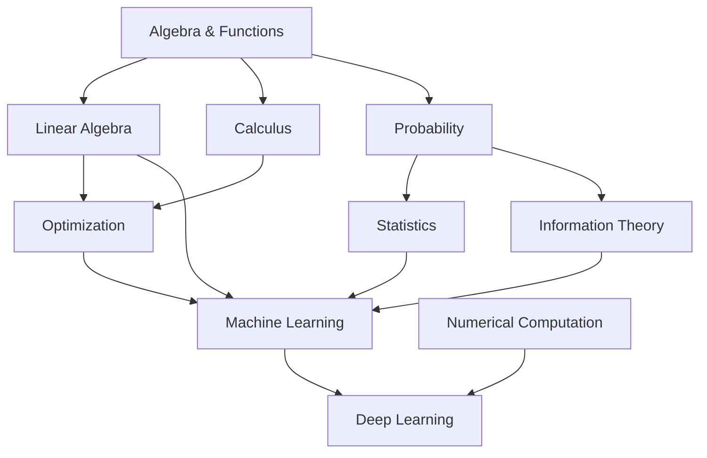

# Mathematics for Artificial Intelligence

> **Mạch đọc:** Đặt **Mathematics for Artificial Intelligence** trong bản đồ [README](./README.md) để thấy đơn vị sở hữu (owner / 오너) và vị trí của nó. Nội dung đi từ **Một mô hình (model / 모델) như một mathematical hàm (function / 함수)** sang **tuyến tính (linear / 선형) Algebra: ngôn ngữ (language / 언어) của biểu diễn (representation / 표현) và transformation**; điểm nối này chuẩn bị câu hỏi cho các mục sau thay vì dừng ở định nghĩa đầu tiên.


AI không “dùng toán” như một phụ kiện. Mathematics là ngôn ngữ (language / 언어) giúp ta biểu diễn dữ liệu (data / 데이터), bất định (uncertainty / 불확실성), transformation, mục tiêu (objective / 목표) và học tập (learning / 학습) tiến trình (process / 프로세스). Nếu bỏ toán hoàn toàn, nhiều concept AI sẽ biến thành quy tắc (rule / 규칙) cần học thuộc: “softmax dùng ở đây”, “độ dốc (gradient / 기울기) descent dùng ở kia”, “embedding là véc-tơ (vector / 벡터)”. Nếu hiểu vai trò của từng mathematical công cụ (tool / 도구), các concept đó nối lại thành một hệ thống lập luận (reasoning / 추론) thống nhất.

Chapter này là bản đồ phụ thuộc (dependency / 의존성). Các topic tuyến tính (linear / 선형) Algebra, xác suất (probability / 확률), Statistics, Calculus, thông tin (information / 정보) lý thuyết (theory / 이론), tối ưu hóa (optimization / 최적화) và Numerical Computation sẽ được tách thành chapter riêng sau; ở đây mục tiêu là hiểu **tại sao từng nhánh toán xuất hiện trong AI**.

## Một mô hình (model / 모델) như một mathematical hàm (function / 함수)

Ở lớp trừu tượng (abstraction / 추상화) đơn giản nhất, mô hình (model / 모델) là hàm (function / 함수):

\[
f_\theta: X \rightarrow Y
\]

`X` là đầu vào (input / 입력) không gian (space / 공간), `Y` là đầu ra (output / 출력) không gian (space / 공간), còn `θ` là parameters.

Ví dụ mô hình tuyến tính (linear model / 선형 모델):

\[
\hat{y}=\mathbf{w}^T\mathbf{x}+b
\]

Ở đây đầu vào (input / 입력) không còn là “khách hàng” mà là véc-tơ (vector / 벡터) `x`; parameters `w` xác định cách mỗi thành phần (component / 컴포넌트) ảnh hưởng đầu ra (output / 출력); `b` là độ lệch (bias / 편향)/intercept.

Huấn luyện (training / 학습) là tiến trình (process / 프로세스) chọn `θ` sao cho mô hình (model / 모델) hành vi (behavior / 동작) phù hợp dữ liệu (data / 데이터) và mục tiêu (objective / 목표).

Một large neural mạng (network / 네트워크) vẫn có thể nhìn theo cùng lớp trừu tượng (abstraction / 추상화), chỉ khác là `f_θ` là composition của rất nhiều transformations.

## Tuyến tính (linear / 선형) Algebra: ngôn ngữ (language / 언어) của biểu diễn (representation / 표현) và transformation

Machine học tập (learning / 학습) xử lý rất nhiều quantities cùng lúc. Một ảnh (image / 이미지) có hàng trăm nghìn điểm ảnh (pixel / 픽셀). Một embedding có hàng trăm hoặc hàng nghìn dimensions. Một huấn luyện (training / 학습) batch chứa nhiều examples.

Tuyến tính (linear / 선형) Algebra cho ta véc-tơ (vector / 벡터), ma trận (matrix / 행렬) và tensor để biểu diễn những quantities đó compactly.

Một véc-tơ (vector / 벡터):

\[
\mathbf{x}=\begin{bmatrix}x_1\\x_2\\x_3\end{bmatrix}
\]

có thể biểu diễn tính năng (feature / 기능) của một mẫu (sample / 표본).

Ma trận (matrix / 행렬):

\[
W\in\mathbb{R}^{m\times n}
\]

có thể biến véc-tơ (vector / 벡터) `n` dimensions thành biểu diễn (representation / 표현) `m` dimensions:

\[
\mathbf{y}=W\mathbf{x}
\]

Đây không chỉ là notation. GPU đặc biệt hiệu quả với large phép nhân ma trận (matrix multiplication / 행렬 곱셈), nên kiến trúc (architecture / 아키텍처) của Deep học tập (learning / 학습) và hardware evolution có quan hệ rất chặt.

Transformer chứa nhiều phép phép nhân ma trận (matrix multiplication / 행렬 곱셈). truy vấn (query / 쿼리), Key và giá trị (value / 값) đều là tuyến tính (linear / 선형) projections của hidden states:

\[
Q=XW_Q,\quad K=XW_K,\quad V=XW_V
\]

Nếu không hiểu phép nhân ma trận (matrix multiplication / 행렬 곱셈) như transformation giữa véc-tơ (vector / 벡터) spaces, attention sẽ dễ trở thành công thức cần ghi nhớ thay vì cơ chế (mechanism / 메커니즘) có thể lập luận (reasoning / 추론).

### Dot sản phẩm (product / 제품) và Similarity

Dot sản phẩm (product / 제품):

\[
\mathbf{a}\cdot\mathbf{b}=\sum_i a_i b_i
\]

xuất hiện liên tục trong AI. Nó đo alignment theo một nghĩa geometric. Attention sử dụng query-key dot products. Embedding retrieval thường dùng dot sản phẩm (product / 제품) hoặc cosine similarity.

Cosine similarity:

\[
\cos(\theta)=\frac{\mathbf{a}\cdot\mathbf{b}}{\|\mathbf{a}\|\|\mathbf{b}\|}
\]

so sánh direction thay vì magnitude tuyệt đối.

Trong ngữ nghĩa (semantic / 의미적) tìm kiếm (search / 검색), nếu learned embedding không gian (space / 공간) đặt semantically related documents theo directions gần nhau, cosine similarity trở thành useful retrieval tín hiệu (signal / 신호).

Nhưng cần nhớ: similarity có ý nghĩa vì biểu diễn (representation / 표현) đã được trained để hình học (geometry / 기하학) phản ánh mục tiêu (objective / 목표) nào đó. Dot sản phẩm (product / 제품) tự nó không “hiểu meaning”.

## Calculus: ngôn ngữ (language / 언어) của thay đổi (change / 변경)

Huấn luyện (training / 학습) cần biết: nếu thay parameter một chút, mất mát (loss / 손실) thay đổi thế nào?

Derivative trả lời câu hỏi đó.

Với scalar hàm (function / 함수):

\[
y=f(x)
\]

derivative:

\[
\frac{dy}{dx}
\]

mô tả cục bộ (local / 로컬) tỷ lệ (rate / 비율) of thay đổi (change / 변경).

Neural mạng (network / 네트워크) có hàng triệu parameters nên ta dùng độ dốc (gradient / 기울기):

\[
\nabla_\theta L
\]

Độ dốc (gradient / 기울기) là véc-tơ (vector / 벡터) partial derivatives của mất mát (loss / 손실) đối với parameters. Nó chỉ direction cục bộ (local / 로컬) làm mất mát (loss / 손실) tăng nhanh; vì vậy negative độ dốc (gradient / 기울기) là direction cục bộ (local / 로컬) để giảm mất mát (loss / 손실).

Độ dốc (gradient / 기울기) descent:

\[
\theta_{t+1}=\theta_t-\eta\nabla_\theta L(\theta_t)
\]

trong đó `η` là học tập (learning / 학습) tỷ lệ (rate / 비율).

Điểm cốt lõi là: calculus biến câu hỏi “parameter nào nên thay đổi?” thành một computable tín hiệu (signal / 신호).

### Chuỗi (chain / 사슬) quy tắc (rule / 규칙) và Backpropagation

Neural mạng (network / 네트워크) là composition:

\[
f(x)=f_3(f_2(f_1(x)))
\]

Muốn biết parameter ở tầng (layer / 계층) đầu ảnh hưởng final mất mát (loss / 손실) ra sao, cần chuỗi (chain / 사슬) quy tắc (rule / 규칙).

Nếu:

\[
y=f(u),\quad u=g(x)
\]

thì:

\[
\frac{dy}{dx}=\frac{dy}{du}\frac{du}{dx}
\]

Backpropagation là efficient ứng dụng (application / 애플리케이션) của chuỗi (chain / 사슬) quy tắc (rule / 규칙) trên computation đồ thị (graph / 그래프). Nó không phải một “AI thuật toán (algorithm / 알고리즘) bí ẩn”; nó là cách reuse intermediate derivatives để tính độ dốc (gradient / 기울기) cho nhiều parameters hiệu quả.

## Xác suất (probability / 확률): ngôn ngữ (language / 언어) của bất định (uncertainty / 불확실성)

AI hệ thống (system / 시스템) thường không biết chắc kết quả (outcome / 결과). Classification mô hình (model / 모델) có thể trả phân phối (distribution / 분포):

\[
P(y=k\mid x)
\]

Ngôn ngữ (language / 언어) mô hình (model / 모델) trả xác suất (probability / 확률) của next đơn vị từ (token / 토큰):

\[
P(x_t\mid x_{<t})
\]

Bayesian lập luận (reasoning / 추론) cập nhật belief khi có bằng chứng (evidence / 증거):

\[
P(H\mid E)=\frac{P(E\mid H)P(H)}{P(E)}
\]

Xác suất (probability / 확률) giúp phân biệt ba thứ thường bị trộn:

- bất định (uncertainty / 불확실성) về world;
- bất định (uncertainty / 불확실성) do thiếu dữ liệu (data / 데이터)/kiến thức (knowledge / 지식);
- randomness do sampling tiến trình (process / 프로세스).

Một mô hình (model / 모델) đầu ra (output / 출력) xác suất (probability / 확률) `0.9` không tự động có nghĩa trong 100 prediction như vậy sẽ đúng 90 lần. Muốn interpretation đó đáng tin, mô hình (model / 모델) cần **calibration** tốt.

## Statistics: từ mẫu (sample / 표본) tới population

Machine học tập (learning / 학습) train trên finite dataset nhưng muốn hoạt động trên unseen cases. Đây là statistical bài toán (problem / 문제).

Giả sử true dữ liệu (data / 데이터) phân phối (distribution / 분포) là `P(X,Y)` nhưng ta chỉ thấy mẫu (sample / 표본):

\[
D=\{(x_i,y_i)\}_{i=1}^n
\]

Huấn luyện (training / 학습) mất mát (loss / 손실) đo hiệu năng (performance / 성능) trên mẫu (sample / 표본), trong khi mục tiêu thật là expected rủi ro (risk / 위험) trên underlying phân phối (distribution / 분포):

\[
R(\theta)=\mathbb{E}_{(x,y)\sim P}[L(f_\theta(x),y)]
\]

Ta không biết `P` chính xác, nên thường minimize empirical rủi ro (risk / 위험):

\[
\hat{R}(\theta)=\frac{1}{n}\sum_{i=1}^n L(f_\theta(x_i),y_i)
\]

Khoảng cách giữa huấn luyện (training / 학습) hiệu năng (performance / 성능) và real-world hiệu năng (performance / 성능) đưa ta tới generalization, overfitting, kiểm tra hợp lệ (validation / 검증), confidence interval, hypothesis testing và phân phối (distribution / 분포) shift.

Statistics vì vậy không chỉ dùng để “vẽ chart dữ liệu (data / 데이터)”. Nó là nền để biết một kết luận học từ mẫu (sample / 표본) có đáng tin trên population hay không.

## Tối ưu hóa (optimization / 최적화): biến mục tiêu (objective / 목표) thành parameters

Một mô hình (model / 모델) kiến trúc (architecture / 아키텍처) xác định hypothesis không gian (space / 공간). hàm mất mát (loss function / 손실 함수) xác định mô hình (model / 모델) hành vi (behavior / 동작) nào được thưởng/phạt. tối ưu hóa (optimization / 최적화) tìm parameters đạt mục tiêu (objective / 목표) tốt hơn.

General form:

\[
\theta^*=\arg\min_\theta J(\theta)
\]

Trong supervised học tập (learning / 학습):

\[
J(\theta)=\frac{1}{n}\sum_i L(f_\theta(x_i),y_i)+\lambda\Omega(\theta)
\]

Term đầu fit dữ liệu (data / 데이터). `Ω(θ)` có thể regularize mô hình (model / 모델). `λ` điều khiển sự đánh đổi (trade-off / 트레이드오프).

Tối ưu hóa (optimization / 최적화) không đảm bảo mục tiêu (objective / 목표) đại diện đúng real-world goal. Nếu hàm mất mát (loss function / 손실 함수) không encode đúng điều ta quan tâm, optimizer có thể làm rất tốt một mục tiêu (objective / 목표) sai.

Đây là liên kết (connection / 연결) giữa Mathematics và AI an toàn (safety / 안전): specification của mục tiêu (objective / 목표) quan trọng không kém khả năng optimize.

## Thông tin (information / 정보) lý thuyết (theory / 이론): bất định (uncertainty / 불확실성) và thông tin (information / 정보)

**Entropy (엔트로피)** của discrete phân phối (distribution / 분포):

\[
H(X)=-\sum_x p(x)\log p(x)
\]

đo mức bất định (uncertainty / 불확실성) trung bình.

Nếu phân phối (distribution / 분포) rất tập trung, entropy thấp. Nếu nhiều kết quả (outcome / 결과) có xác suất (probability / 확률) gần nhau, entropy cao.

Cross-entropy:

\[
H(p,q)=-\sum_x p(x)\log q(x)
\]

xuất hiện như mất mát (loss / 손실) trong classification và ngôn ngữ (language / 언어) modeling. Khi mục tiêu (target / 대상) phân phối (distribution / 분포) `p` là one-hot, minimizing cross-entropy tương ứng tăng xác suất (probability / 확률) mô hình (model / 모델) gán cho correct lớp (class / 클래스)/đơn vị từ (token / 토큰).

Kullback-Leibler divergence:

\[
D_{KL}(p\|q)=\sum_x p(x)\log\frac{p(x)}{q(x)}
\]

đo difference giữa distributions theo một direction. KL xuất hiện trong variational suy luận (inference / 추론), VAEs, RL, distillation và preference tối ưu hóa (optimization / 최적화).

Thông tin (information / 정보) lý thuyết (theory / 이론) giúp giải thích vì sao log xác suất (probability / 확률) và entropy xuất hiện liên tục trong Generative AI.

## Hình học (geometry / 기하학) của high-dimensional spaces

AI hiện đại sống trong high-dimensional véc-tơ (vector / 벡터) spaces. Trực giác 2D/3D đôi khi không còn đúng.

Khi dimension tăng:

- volume phân bố khác trực giác;
- nearest-neighbor hành vi (behavior / 동작) thay đổi;
- dữ liệu (data / 데이터) cần nhiều mẫu (sample / 표본) hơn để cover không gian (space / 공간);
- distance có thể concentrate;
- tối ưu hóa (optimization / 최적화) landscape trở nên phức tạp.

Đây là background của curse of dimensionality và lý do biểu diễn (representation / 표현) học tập (learning / 학습) quan trọng: ta muốn tìm một không gian (space / 공간) nơi cấu trúc (structure / 구조) relevant trở nên dễ xử lý hơn.

## Numerical Computation: công thức đúng vẫn có thể tính sai

Computer dùng finite precision. Floating-point arithmetic không phải real-number arithmetic hoàn hảo.

Ví dụ softmax naive:

\[
softmax(z_i)=\frac{e^{z_i}}{\sum_j e^{z_j}}
\]

Nếu `z_i` rất lớn, `e^{z_i}` có thể overflow. Ta dùng định danh (identity / 식별자):

\[
softmax(z_i)=\frac{e^{z_i-c}}{\sum_j e^{z_j-c}}
\]

với:

\[
c=\max_j z_j
\]

để ổn định numerical computation mà không đổi kết quả (result / 결과) mathematically.

Những issue như overflow, underflow, precision, conditioning và accumulation lỗi (error / 오류) trở nên rất quan trọng khi train mô hình (model / 모델) lớn bằng FP16/BF16 hoặc quantized suy luận (inference / 추론).

## Discrete Mathematics và Graphs

Không phải AI chỉ dùng continuous mathematics. tìm kiếm (search / 검색), lô-gic (logic / 논리), đồ thị (graph / 그래프) algorithms, combinatorics và ràng buộc (constraint / 제약조건) solving dựa mạnh vào discrete mathematics.

Kiến thức (knowledge / 지식) đồ thị (graph / 그래프):

\[
G=(V,E)
\]

Tìm kiếm (search / 검색) cây (tree / 트리), planning đồ thị (graph / 그래프), phụ thuộc (dependency / 의존성) đồ thị (graph / 그래프) và computational đồ thị (graph / 그래프) đều là đồ thị (graph / 그래프) structures.

Transformer cuối cùng vẫn chạy trên đơn vị từ (token / 토큰) chuỗi (sequence / 시퀀스) rời rạc ở đầu vào (input / 입력)/đầu ra (output / 출력), dù nội bộ (internal / 내부) computation dùng continuous vectors.

AI vì vậy nằm ở intersection của discrete và continuous computation.

## Một example nối các nhánh toán: nhị phân (binary / 이진) classification

Giả sử logistic regression:

\[
z=\mathbf{w}^T\mathbf{x}+b
\]

Tuyến tính (linear / 선형) Algebra tạo weighted combination.

Sigmoid:

\[
\sigma(z)=\frac{1}{1+e^{-z}}
\]

map real number thành `(0,1)`, có thể interpret như xác suất (probability / 확률) mô hình (model / 모델).

Nhị phân (binary / 이진) cross-entropy:

\[
L=-[y\log p+(1-y)\log(1-p)]
\]

đến từ probabilistic likelihood / thông tin (information / 정보) lý thuyết (theory / 이론) perspective.

Calculus tính độ dốc (gradient / 기울기) của mất mát (loss / 손실) theo `w,b`.

Tối ưu hóa (optimization / 최적화) cập nhật (update / 업데이트) parameters.

Statistics đánh giá mô hình (model / 모델) có generalize ngoài huấn luyện (training / 학습) mẫu (sample / 표본) hay không.

Chỉ một mô hình (model / 모델) đơn giản đã cho thấy tuyến tính (linear / 선형) Algebra, xác suất (probability / 확률), thông tin (information / 정보) lý thuyết (theory / 이론), Calculus, tối ưu hóa (optimization / 최적화) và Statistics cùng làm việc.

## Một example hiện đại: Transformer Attention

Scaled dot-product attention:

\[
Attention(Q,K,V)=softmax\left(\frac{QK^T}{\sqrt{d_k}}\right)V
\]

Có thể unpack theo Mathematics:

`QK^T` là ma trận (matrix / 행렬) of pairwise alignment scores. Đây là tuyến tính (linear / 선형) Algebra.

Chia cho `\sqrt{d_k}` giúp quy mô (scale / 규모) variance của dot products để softmax không quá saturated khi dimension lớn.

Softmax biến scores thành normalized positive weights, gần với probability-like phân phối (distribution / 분포).

Nhân weights với `V` tạo weighted combination của giá trị (value / 값) vectors.

Huấn luyện (training / 학습) toàn mô-đun (module / 모듈) dựa vào Calculus/backpropagation và tối ưu hóa (optimization / 최적화).

Như vậy công thức attention không phải một magic khối (block / 블록). Nó là composition của những mathematical operations đã quen.

## Thứ tự học toán cho AI

Phụ thuộc (dependency / 의존성) thực dụng:


```mermaid
flowchart TD
    A[Algebra & Functions] --> LA[Linear Algebra]
    A --> C[Calculus]
    A --> P[Probability]
    P --> S[Statistics]
    P --> IT[Information Theory]
    LA --> O[Optimization]
    C --> O
    O --> ML[Machine Learning]
    S --> ML
    IT --> ML
    LA --> ML
    ML --> DL[Deep Learning]
    NC[Numerical Computation] --> DL
```

Không cần “học xong toàn bộ toán” rồi mới học AI. Cách hiệu quả hơn là học concept toán đúng lúc AI cần nó, nhưng vẫn có chapter riêng để xây understanding sâu và tránh kiến thức rời rạc.

## Mô hình tư duy (mental model / 사고 모델)

Có thể nén vai trò của mathematics trong AI thành:

```text
Linear Algebra   → representation & transformation
Calculus         → sensitivity & gradients
Probability      → uncertainty
Statistics       → learning/generalization from samples
Optimization     → search for parameters/actions
Information Theory → uncertainty, likelihood & representation
Numerical Methods → make mathematics executable on real hardware
Discrete Math    → structure, logic, graph & search
```

## Dùng chung (common / 공통) Misconceptions

### “AI chỉ cần tuyến tính (linear / 선형) Algebra và Calculus”

Hai nhánh này rất quan trọng cho Deep học tập (learning / 학습) nhưng xác suất (probability / 확률), Statistics, tối ưu hóa (optimization / 최적화), thông tin (information / 정보) lý thuyết (theory / 이론) và Numerical Computation đều cần để hiểu mô hình (model / 모델) hành vi (behavior / 동작) và evaluation.

### “khung phần mềm (framework / 프레임워크) tự tính độ dốc (gradient / 기울기) nên không cần hiểu derivative”

Autograd giúp tính, nhưng không giải thích vanishing/exploding độ dốc (gradient / 기울기), learning-rate hành vi (behavior / 동작), độ dốc (gradient / 기울기) clipping hoặc why tối ưu hóa (optimization / 최적화) fails. Hiểu cơ chế (mechanism / 메커니즘) vẫn cần thiết để gỡ lỗi (debug / 디버그).

### “xác suất (probability / 확률) đầu ra (output / 출력) là confidence thật”

Mô hình (model / 모델) score chỉ trở thành interpretable confidence dưới các giả định (assumptions / 가정들) và calibration phù hợp. Neural mạng (network / 네트워크) có thể rất overconfident khi phân phối (distribution / 분포) shift.

### “Công thức đúng về lý thuyết thì hiện thực (implementation / 구현) cũng đúng”

Floating-point limitations, overflow, precision và hardware kernels có thể làm numerical hành vi (behavior / 동작) khác kỳ vọng lý thuyết.

## Liên kết kiến thức (knowledge connection / 지식 연결)

Toán trong AI không nên học như một prerequisite tách rời. Mỗi chapter sau sẽ quay lại các công cụ này trong ngữ cảnh (context / 맥락): tuyến tính (linear / 선형) Algebra khi học embeddings/attention, xác suất (probability / 확률) khi học classification và generative các mô hình (models / 모델들), Calculus khi học backpropagation, Statistics khi học evaluation/generalization, thông tin (information / 정보) lý thuyết (theory / 이론) khi học ngôn ngữ (language / 언어) modeling, và tối ưu hóa (optimization / 최적화) khi học huấn luyện (training / 학습)/alignment.

Xem lại: [Problem Representation](../00_foundations/03_problem_representation.md) và [AI vs ML vs DL vs Generative AI](../00_foundations/05_ai_vs_ml_vs_dl_vs_generative_ai.md).

> **Bàn giao:** Sau **liên kết kiến thức (knowledge connection / 지식 연결)**, hãy chốt bất biến (invariant / 불변식) và giới hạn của mục này trước khi nối sang kiến thức kế tiếp. Có thể đọc tiếp [01 linear algebra for ai](./01_linear_algebra_for_ai.md) để đối chiếu ranh giới (boundary / 경계) gần nhất.
