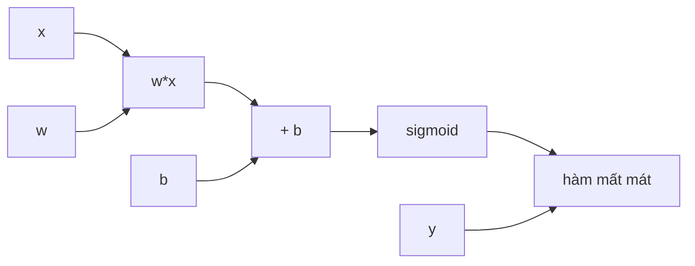

# Giải tích cho Trí tuệ nhân tạo

**Giải tích (Calculus / 미적분학)** là ngôn ngữ để mô tả **sự thay đổi**. Trong AI, câu hỏi quan trọng không chỉ là “hàm mất mát hiện tại bằng bao nhiêu?”, mà còn là: nếu thay đổi một tham số rất nhỏ, hàm mất mát sẽ thay đổi theo hướng nào và nhanh đến mức nào? Đạo hàm, đạo hàm riêng và gradient biến câu hỏi đó thành những đại lượng có thể tính được.

Nếu đại số tuyến tính mô tả biểu diễn và phép biến đổi, giải tích cho ta biết phép biến đổi **nhạy với đầu vào hoặc tham số ra sao**. Huấn luyện mạng nơ-ron, lan truyền ngược, tối ưu hóa dựa trên gradient, phân tích độ nhạy và nhiều phần của mô hình xác suất đều dựa trên ý tưởng này.

Xem trước: [Đại số tuyến tính cho AI](./01_linear_algebra_for_ai.md).

## Hàm là điểm xuất phát

Một mô hình có thể viết:

\[
\hat y=f_\theta(x)
\]

Hàm mất mát:

\[
L(\theta)=\ell(f_\theta(x),y)
\]

Huấn luyện muốn thay đổi `θ` để `L` nhỏ hơn.

Nếu `θ` chỉ là một số, đạo hàm:

\[
\frac{dL}{d\theta}
\]

mô tả tốc độ thay đổi cục bộ.

Nếu đạo hàm dương, tăng `θ` một chút thường làm hàm mất mát tăng; giảm `θ` có xu hướng làm mất mát giảm. Nếu đạo hàm âm thì hướng tác động ngược lại.

Đây là trực giác nền của **hạ gradient (gradient descent)**.

## Giới hạn và đạo hàm

Đạo hàm được định nghĩa qua giới hạn:

\[
f'(x)=\lim_{h\to0}\frac{f(x+h)-f(x)}{h}
\]

Tỷ số này đo độ dốc của đường cát tuyến khi khoảng `h` tiến dần tới 0.

Trong tính toán số, máy không thực sự dùng `h=0`; đạo hàm giải tích hoặc **vi phân tự động (automatic differentiation)** tránh nhiều sai số của cách xấp xỉ sai phân hữu hạn ngây thơ.

## Xấp xỉ tuyến tính cục bộ

Đạo hàm quan trọng vì một hàm trơn gần một điểm có thể được xấp xỉ tuyến tính:

\[
f(x+\Delta x)\approx f(x)+f'(x)\Delta x
\]

Trong nhiều chiều:

\[
f(\mathbf{x}+\Delta\mathbf{x})\approx f(\mathbf{x})+\nabla f(\mathbf{x})^T\Delta\mathbf{x}
\]

Vì vậy gradient là tín hiệu tuyến tính cục bộ mô tả đầu ra thay đổi thế nào theo các hướng của đầu vào.

## Đạo hàm riêng

Nếu một hàm phụ thuộc nhiều biến:

\[
f(x,y)
\]

đạo hàm riêng theo `x`:

\[
\frac{\partial f}{\partial x}
\]

mô tả sự thay đổi khi chỉ thay `x` và giữ `y` cố định.

Mạng nơ-ron có thể có hàng triệu hoặc hàng tỷ tham số, nên hàm mất mát là một hàm nhiều chiều:

\[
L(\theta_1,\theta_2,\ldots,\theta_p)
\]

Mỗi đạo hàm riêng trả lời một tham số ảnh hưởng cục bộ tới hàm mất mát như thế nào.

## Gradient

Gradient gom các đạo hàm riêng thành một vector:

\[
\nabla_\theta L=
\begin{bmatrix}
\frac{\partial L}{\partial \theta_1}\\
\vdots\\
\frac{\partial L}{\partial \theta_p}
\end{bmatrix}
\]

Dưới hình học Euclid, gradient chỉ hướng tăng cục bộ nhanh nhất. Vì vậy hướng âm của gradient là hướng giảm cục bộ nhanh nhất.

Cập nhật hạ gradient:

\[
\theta_{t+1}=\theta_t-\eta\nabla_\theta L(\theta_t)
\]

trong đó `η` là tốc độ học (learning rate).

Gradient không nói điểm cực tiểu toàn cục nằm ở đâu; nó chỉ cung cấp thông tin cục bộ.

## Đạo hàm theo hướng

Nếu muốn biết `f` thay đổi theo vector đơn vị `u`:

\[
D_{\mathbf{u}}f=\nabla f^T\mathbf{u}
\]

Tích vô hướng này nối giải tích với đại số tuyến tính. Gradient chứa đủ thông tin để tính tốc độ thay đổi cục bộ theo mọi hướng.

## Quy tắc dây chuyền

**Quy tắc dây chuyền (chain rule)** là nền tảng của lan truyền ngược.

Nếu:

\[
y=f(u),\quad u=g(x)
\]

thì:

\[
\frac{dy}{dx}=\frac{dy}{du}\frac{du}{dx}
\]

Ý nghĩa là ảnh hưởng của `x` lên `y` đi qua biến trung gian `u`; độ nhạy tổng thể là tích của các độ nhạy cục bộ.

Mạng nơ-ron chính là phép hợp thành của nhiều hàm:

\[
f(x)=f_L(f_{L-1}(...f_1(x)))
\]

Quy tắc dây chuyền cho phép truyền ảnh hưởng của hàm mất mát cuối cùng ngược qua từng tầng.

## Ví dụ đơn giản về lan truyền ngược

Giả sử:

\[
z=wx+b
\]

\[
\hat y=\sigma(z)
\]

\[
L=-[y\log\hat y+(1-y)\log(1-\hat y)]
\]

Ta cần:

\[
\frac{\partial L}{\partial w}
\]

Theo quy tắc dây chuyền:

\[
\frac{\partial L}{\partial w}=
\frac{\partial L}{\partial \hat y}
\frac{\partial \hat y}{\partial z}
\frac{\partial z}{\partial w}
\]

Với sigmoid kết hợp entropy chéo nhị phân, các thành phần rút gọn thành:

\[
\frac{\partial L}{\partial z}=\hat y-y
\]

và:

\[
\frac{\partial L}{\partial w}=(\hat y-y)x
\]

Gradient có cấu trúc trực quan: **sai số dự đoán × tín hiệu đầu vào**.

## Đồ thị tính toán

Một mô hình có thể được biểu diễn thành **đồ thị tính toán (computation graph)** có hướng của các phép toán.



**Lượt truyền xuôi (forward pass)** tính giá trị từ đầu vào tới hàm mất mát.

**Lượt truyền ngược (backward pass)** dùng quy tắc dây chuyền để truyền đạo hàm từ hàm mất mát về các tham số.

Framework vi phân tự động lưu đồ thị hoặc thông tin đủ để tính các tích vector–Jacobian hiệu quả.

## Lan truyền ngược không phải hạ gradient

Hai khái niệm này thường bị trộn lẫn.

**Lan truyền ngược (backpropagation / 역전파)** là thuật toán hiệu quả để tính gradient của hàm hợp bằng quy tắc dây chuyền.

**Hạ gradient (gradient descent)** là chiến lược tối ưu hóa dùng gradient để cập nhật tham số.

Ta có thể dùng lan truyền ngược cùng Adam, SGD, RMSProp hoặc các bộ tối ưu khác. Hạ gradient cũng có thể dùng cho các hàm không phải mạng nơ-ron.

## Jacobian

Nếu hàm ánh xạ vector sang vector:

\[
\mathbf{y}=f(\mathbf{x})
\]

**Ma trận Jacobian** là:

\[
J_{ij}=\frac{\partial y_i}{\partial x_j}
\]

Jacobian mô tả phép biến đổi tuyến tính cục bộ từ nhiễu nhỏ của đầu vào sang thay đổi đầu ra:

\[
\Delta \mathbf{y}\approx J\Delta\mathbf{x}
\]

Trong học sâu, việc tạo tường minh Jacobian khổng lồ thường quá tốn kém. Vi phân tự động tính các tích với Jacobian mà không cần vật chất hóa toàn bộ ma trận.

## Hessian và độ cong

Với hàm vô hướng `f(x)`, **ma trận Hessian** chứa các đạo hàm bậc hai:

\[
H_{ij}=\frac{\partial^2 f}{\partial x_i\partial x_j}
\]

Gradient nói về độ dốc; Hessian nói về **độ cong (curvature)**.

Xấp xỉ bậc hai:

\[
f(\mathbf{x}+\Delta)\approx f(\mathbf{x})+\nabla f^T\Delta+\frac{1}{2}\Delta^T H\Delta
\]

Phương pháp Newton dùng thông tin độ cong:

\[
\theta_{new}=\theta-H^{-1}\nabla L
\]

Nhưng Hessian của mạng nơ-ron lớn quá lớn để nghịch đảo trực tiếp, nên tối ưu hóa thực tế thường dùng phương pháp bậc nhất hoặc các xấp xỉ phù hợp.

## Đạo hàm của một số hàm kích hoạt

### Sigmoid

\[
\sigma(x)=\frac{1}{1+e^{-x}}
\]

Đạo hàm:

\[
\sigma'(x)=\sigma(x)(1-\sigma(x))
\]

Khi `|x|` lớn, đạo hàm gần 0. Xếp nhiều tầng sigmoid dễ gặp **gradient biến mất (vanishing gradient)**.

### Tanh

\[
\tanh'(x)=1-\tanh^2(x)
\]

Tanh có tâm quanh 0 tốt hơn sigmoid nhưng vẫn có vùng bão hòa.

### ReLU

\[
ReLU(x)=\max(0,x)
\]

Đạo hàm:

\[
ReLU'(x)=
\begin{cases}
1 & x>0\\
0 & x<0
\end{cases}
\]

Tại `x=0`, đạo hàm theo nghĩa nghiêm ngặt không tồn tại, nhưng triển khai thực tế chọn một **đạo hàm dưới (subgradient)** theo quy ước.

ReLU giúp giảm vấn đề bão hòa ở miền dương nhưng nơ-ron có thể “chết” nếu liên tục nằm trong miền âm.

## Gradient biến mất

Quy tắc dây chuyền nhân nhiều đạo hàm:

\[
\frac{\partial L}{\partial h_1}=\frac{\partial L}{\partial h_L}
\prod_{k=2}^{L}\frac{\partial h_k}{\partial h_{k-1}}
\]

Nếu chuẩn của các thừa số thường nhỏ hơn 1, gradient có thể co theo cấp số nhân qua chiều sâu.

Điều này từng khiến việc huấn luyện mạng sâu và RNN dài rất khó.

Các giải pháp kiến trúc thường gồm:

- hàm kích hoạt kiểu ReLU;
- khởi tạo cẩn thận;
- kết nối dư;
- chuẩn hóa;
- cơ chế cổng của LSTM/GRU cho mô hình chuỗi.

## Gradient bùng nổ

Nếu tích các đạo hàm có chuẩn lớn hơn 1 lặp đi lặp lại, gradient có thể tăng rất lớn.

Hậu quả gồm cập nhật không ổn định, `NaN/Inf` và hàm mất mát tăng đột biến.

**Cắt gradient (gradient clipping)** giới hạn chuẩn:

\[
g\leftarrow g\cdot\min\left(1,\frac{c}{\|g\|}\right)
\]

Nó không giải quyết nguyên nhân gốc của mọi bất ổn nhưng thường hữu ích khi huấn luyện RNN và Transformer.

## Kết nối dư dưới góc nhìn giải tích

Một khối dư:

\[
y=x+F(x)
\]

có đạo hàm:

\[
\frac{dy}{dx}=I+\frac{\partial F}{\partial x}
\]

Đường đồng nhất `I` cung cấp một tuyến gradient trực tiếp. Đây là một lý do kiến trúc residual giúp huấn luyện mô hình rất sâu dễ hơn.

## Đạo hàm của phép toán ma trận

Học sâu sử dụng giải tích ma trận. Ví dụ:

\[
\mathbf{y}=W\mathbf{x}
\]

Nếu `L` là hàm mất mát vô hướng, gradient theo `W` liên hệ với tích ngoài giữa gradient từ tầng sau và đầu vào.

Framework autograd che đi ký hiệu phức tạp, nhưng suy luận theo kích thước vẫn cần thiết:

```text
W: m × n
x: n
y: m
∂L/∂y: m
∂L/∂W: m × n
```

Gradient của một tham số phải có cùng kích thước với tham số đó.

## Gradient của softmax kết hợp cross-entropy

Với logit `z`, softmax:

\[
p_i=\frac{e^{z_i}}{\sum_j e^{z_j}}
\]

Entropy chéo với nhãn one-hot `y`:

\[
L=-\sum_i y_i\log p_i
\]

Gradient rút gọn thành:

\[
\frac{\partial L}{\partial z_i}=p_i-y_i
\]

Đây là một liên kết đẹp: gradient trực tiếp là chênh lệch giữa phân phối dự đoán và phân phối mục tiêu.

## Vi phân tự động

Cần phân biệt ba cơ chế:

**Vi phân ký hiệu (symbolic differentiation)** tạo công thức đạo hàm dưới dạng biểu thức.

**Vi phân số (numerical differentiation)** xấp xỉ đạo hàm bằng sai phân hữu hạn.

**Vi phân tự động (automatic differentiation / 자동 미분)** áp dụng quy tắc dây chuyền qua các phép toán nguyên thủy để tính đạo hàm chính xác tới giới hạn số dấu phẩy động.

Vi phân tự động chế độ ngược đặc biệt hiệu quả khi có rất nhiều tham số đầu vào và chỉ một hàm mất mát vô hướng, đúng với cấu trúc huấn luyện mạng nơ-ron.

Lan truyền ngược có thể xem là dạng chuyên biệt của vi phân chế độ ngược trên đồ thị mạng.

## Kiểm tra gradient bằng sai phân hữu hạn

Có thể kiểm tra triển khai gradient bằng:

\[
\frac{\partial f}{\partial x}\approx\frac{f(x+\epsilon)-f(x-\epsilon)}{2\epsilon}
\]

Nếu gradient từ autograd khác xấp xỉ này quá nhiều, có thể có lỗi triển khai.

Tuy nhiên `ε` quá nhỏ gây triệt tiêu số dấu phẩy động; quá lớn gây sai số xấp xỉ. Kiểm tra gradient phù hợp để gỡ lỗi trường hợp nhỏ, không phải phương pháp huấn luyện.

## Khả vi và đạo hàm dưới

Không phải mọi hàm hữu ích đều khả vi ở mọi điểm. ReLU không khả vi tại 0. Chuẩn L1 không khả vi tại 0.

Tối ưu hóa vẫn có thể dùng **đạo hàm dưới (subgradient)** hoặc các khái niệm đạo hàm tổng quát.

Vì vậy câu “học sâu yêu cầu mọi phép toán phải khả vi tuyệt đối” là quá đơn giản. Điều cần thiết thường là có tín hiệu tương tự đạo hàm đủ tốt gần như mọi nơi hoặc dùng hàm thay thế phù hợp.

## Phép toán rời rạc và vấn đề gradient

Lấy mẫu token, `argmax` hoặc định tuyến cứng là các phép toán rời rạc và không có đạo hàm trực tiếp theo cách thông thường.

Đây là lý do nhiều phương pháp dùng:

- xấp xỉ mềm;
- policy gradient / REINFORCE;
- straight-through estimator;
- Gumbel-softmax;
- hàm mất mát thay thế khả vi.

Liên kết này quan trọng khi học học tăng cường và mô hình sinh dữ liệu rời rạc.

## Gradient không phải lời giải thích nhân quả

Biết gradient của đầu ra theo đầu vào có thể tạo bản đồ độ nổi bật (saliency map), nhưng độ nhạy đạo hàm không tự động là lời giải thích nhân quả.

Một đặc trưng có gradient nhỏ tại điểm hiện tại vẫn có thể quan trọng trên toàn miền; các đặc trưng tương quan cũng khiến diễn giải khó hơn.

Vì vậy không nên kết luận đơn giản “gradient cao = đặc trưng quan trọng”.

## Giải tích trong mô hình thời gian liên tục

Một số mô hình AI xem động lực học như phương trình vi phân:

\[
\frac{d\mathbf{h}(t)}{dt}=f(\mathbf{h}(t),t,\theta)
\]

Neural ODE và các biểu diễn liên tục liên quan tới mô hình khuếch tán nối học sâu với phương trình vi phân.

Không cần học phương trình vi phân để bắt đầu học máy, nhưng ví dụ này cho thấy giải tích không chỉ nằm ở gradient huấn luyện mà còn có thể nằm ngay trong động lực của mô hình.

## Tích phân và kỳ vọng

Kỳ vọng của biến liên tục:

\[
\mathbb{E}[f(X)]=\int f(x)p(x)dx
\]

Nhiều hàm mục tiêu xác suất đòi hỏi tích phân khó giải dạng đóng, dẫn tới xấp xỉ Monte Carlo, suy luận biến phân hoặc tích phân số.

Giải tích và xác suất vì vậy gắn chặt với nhau, không phải hai môn tách rời.

## Mô hình tư duy (mental model)

```text
Đạo hàm          = đầu ra nhạy thế nào với thay đổi nhỏ của đầu vào
Đạo hàm riêng    = độ nhạy theo một biến
Gradient         = vector độ nhạy cục bộ theo mọi tham số
Quy tắc dây chuyền = nối các độ nhạy cục bộ qua phép hợp thành
Lan truyền ngược = tính quy tắc dây chuyền hiệu quả trên đồ thị tính toán
Jacobian         = ánh xạ tuyến tính cục bộ từ vector sang vector
Hessian          = độ cong cục bộ
Autograd         = cơ chế tự động tính đạo hàm từ các phép toán nguyên thủy
```

## Các hiểu lầm thường gặp

### “Gradient chỉ thẳng tới điểm cực tiểu”

Gradient chỉ hướng tăng cục bộ nhanh nhất; hướng âm gradient cho hướng giảm cục bộ. Nó không biết điểm cực tiểu toàn cục nằm ở đâu.

### “Backpropagation chính là cách mạng nơ-ron học”

Lan truyền ngược chỉ tính gradient. Hành vi học còn phụ thuộc vào hàm mất mát, bộ tối ưu, dữ liệu, kiến trúc, điều chuẩn và lịch huấn luyện.

### “Đạo hàm bằng 0 nghĩa là đã tối ưu”

Điểm đó có thể là cực tiểu cục bộ, cực đại cục bộ, điểm yên ngựa hoặc vùng phẳng.

### “Có autograd thì không cần hiểu giải tích”

Autograd giúp tính đạo hàm nhưng không giải thích gradient biến mất, bão hòa, động lực học của quá trình học hoặc bất ổn số.

## Liên kết kiến thức

Giải tích nối trực tiếp tới [Tối ưu hóa](./06_optimization.md), mạng nơ-ron và lan truyền ngược. Khi gỡ lỗi huấn luyện, hãy hỏi: độ lớn gradient ra sao, đường tính toán nào truyền gradient, hàm kích hoạt có bão hòa không, hình học cục bộ của hàm mất mát thế nào và độ chính xác số có đang làm gradient biến mất hay không.

Xem tiếp: [Tối ưu hóa cho AI](./06_optimization.md) và [Tính toán số](./07_numerical_computation.md).