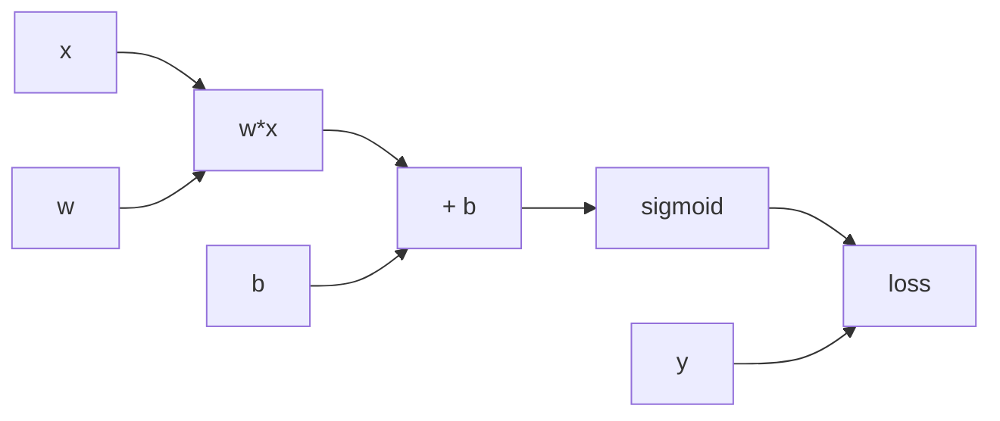

# Calculus cho Artificial Intelligence

Calculus (미적분학 / giải tích) là ngôn ngữ để mô tả **change**. Trong AI, câu hỏi quan trọng không chỉ là “loss hiện tại bằng bao nhiêu?” mà còn là: nếu thay một parameter rất nhỏ, loss sẽ thay đổi theo hướng nào và nhanh đến mức nào? Derivative, partial derivative và gradient biến câu hỏi đó thành quantities có thể tính được.

Nếu Linear Algebra mô tả representation và transformation, Calculus cho ta biết transformation **nhạy** với input hoặc parameter ra sao. Neural-network training, backpropagation, gradient-based optimization, sensitivity analysis và nhiều phần của probabilistic modeling đều dựa trên idea này.

Xem trước: [Linear Algebra for AI](./01_linear_algebra_for_ai.md).

## Function là điểm xuất phát

Một model có thể viết:

\[
\hat y=f_\theta(x)
\]

Loss:

\[
L(\theta)=\ell(f_\theta(x),y)
\]

Training muốn thay `θ` để `L` nhỏ hơn.

Nếu `θ` chỉ là một số, derivative:

\[
\frac{dL}{d\theta}
\]

mô tả local rate of change.

Nếu derivative positive, tăng `θ` một chút có xu hướng tăng loss; giảm `θ` có xu hướng giảm loss. Nếu derivative negative, direction ngược lại.

Đây là intuition phía sau gradient descent.

## Limit và derivative

Derivative được định nghĩa qua limit:

\[
f'(x)=\lim_{h\to0}\frac{f(x+h)-f(x)}{h}
\]

Ratio này đo slope của secant line khi interval `h` nhỏ dần tới 0.

Trong numerical computation, máy không thật sự lấy `h=0`; analytic derivative hoặc automatic differentiation tránh nhiều error của naive finite difference.

## Local linear approximation

Derivative quan trọng vì smooth function gần một point có thể được approximate tuyến tính:

\[
f(x+\Delta x)\approx f(x)+f'(x)\Delta x
\]

Trong nhiều dimensions:

\[
f(\mathbf{x}+\Delta\mathbf{x})\approx f(\mathbf{x})+\nabla f(\mathbf{x})^T\Delta\mathbf{x}
\]

Gradient vì vậy là best local linear signal mô tả output thay đổi theo input directions.

## Partial derivative

Nếu function phụ thuộc nhiều variables:

\[
f(x,y)
\]

partial derivative theo `x`:

\[
\frac{\partial f}{\partial x}
\]

thay đổi `x` trong khi giữ `y` cố định.

Neural network có millions/billions parameters, nên loss là function high-dimensional:

\[
L(\theta_1,\theta_2,\ldots,\theta_p)
\]

Mỗi partial derivative trả lời parameter đó locally ảnh hưởng loss thế nào.

## Gradient

Gradient gom partial derivatives thành vector:

\[
\nabla_\theta L=
\begin{bmatrix}
\frac{\partial L}{\partial \theta_1}\\
\vdots\\
\frac{\partial L}{\partial \theta_p}
\end{bmatrix}
\]

Gradient point theo direction steepest local increase dưới Euclidean geometry. Vì vậy negative gradient là steepest local decrease direction.

Gradient-descent update:

\[
\theta_{t+1}=\theta_t-\eta\nabla_\theta L(\theta_t)
\]

`η` là learning rate.

Gradient không nói minimum toàn cục ở đâu; nó chỉ cung cấp local information.

## Directional derivative

Nếu muốn biết `f` thay đổi theo direction unit vector `u`:

\[
D_{\mathbf{u}}f=\nabla f^T\mathbf{u}
\]

Dot product này nối Calculus với Linear Algebra. Gradient là vector chứa đủ information để tính local rate theo mọi direction.

## Chain rule

Chain rule là foundation của backpropagation.

Nếu:

\[
y=f(u),\quad u=g(x)
\]

thì:

\[
\frac{dy}{dx}=\frac{dy}{du}\frac{du}{dx}
\]

Ý nghĩa: ảnh hưởng của `x` lên `y` đi qua intermediate `u`; tổng sensitivity là product của local sensitivities.

Neural network chính là composition nhiều functions:

\[
f(x)=f_L(f_{L-1}(...f_1(x)))
\]

Chain rule cho phép propagate effect của final loss ngược qua từng layer.

## Một example đơn giản của backpropagation

Giả sử:

\[
z=wx+b
\]

\[
\hat y=\sigma(z)
\]

\[
L=-[y\log\hat y+(1-y)\log(1-\hat y)]
\]

Ta cần:

\[
\frac{\partial L}{\partial w}
\]

Chain rule:

\[
\frac{\partial L}{\partial w}=
\frac{\partial L}{\partial \hat y}
\frac{\partial \hat y}{\partial z}
\frac{\partial z}{\partial w}
\]

Với sigmoid + binary cross-entropy, terms simplify đẹp thành:

\[
\frac{\partial L}{\partial z}=\hat y-y
\]

và:

\[
\frac{\partial L}{\partial w}=(\hat y-y)x
\]

Gradient vì vậy có intuitive structure: prediction error nhân với input signal.

## Computation graph

Một model có thể được biểu diễn như directed acyclic graph của operations.



Forward pass tính values từ input tới loss.

Backward pass dùng chain rule để truyền derivatives từ loss về parameters.

Framework autograd lưu graph hoặc information đủ để compute vector-Jacobian products hiệu quả.

## Backpropagation không phải gradient descent

Hai khái niệm thường bị trộn.

**Backpropagation (역전파)** là algorithm hiệu quả để compute gradients của composed function bằng chain rule.

**Gradient descent** là optimization strategy dùng gradients để update parameters.

Ta có thể dùng backprop với Adam, SGD, RMSProp hoặc optimizer khác. Và gradient descent có thể dùng cho functions không phải neural network.

## Jacobian

Nếu function map vector sang vector:

\[
\mathbf{y}=f(\mathbf{x})
\]

Jacobian là matrix:

\[
J_{ij}=\frac{\partial y_i}{\partial x_j}
\]

Jacobian mô tả local linear transformation từ input perturbation sang output perturbation:

\[
\Delta \mathbf{y}\approx J\Delta\mathbf{x}
\]

Trong Deep Learning, explicitly constructing huge Jacobian thường quá expensive. Automatic differentiation tính products với Jacobian mà không materialize toàn matrix.

## Hessian và curvature

Với scalar function `f(x)`, Hessian là matrix second derivatives:

\[
H_{ij}=\frac{\partial^2 f}{\partial x_i\partial x_j}
\]

Gradient nói slope; Hessian nói curvature.

Second-order approximation:

\[
f(\mathbf{x}+\Delta)\approx f(\mathbf{x})+\nabla f^T\Delta+\frac{1}{2}\Delta^T H\Delta
\]

Newton's method uses curvature:

\[
\theta_{new}=\theta-H^{-1}\nabla L
\]

Nhưng Hessian của large neural networks quá lớn để invert trực tiếp, nên practical optimization thường dùng first-order methods hoặc approximations.

## Derivatives của common activations

### Sigmoid

\[
\sigma(x)=\frac{1}{1+e^{-x}}
\]

Derivative:

\[
\sigma'(x)=\sigma(x)(1-\sigma(x))
\]

Khi `|x|` lớn, derivative gần 0. Deep stacks sigmoid dễ gặp vanishing gradient.

### Tanh

\[
\tanh'(x)=1-\tanh^2(x)
\]

Tanh zero-centered hơn sigmoid nhưng vẫn saturate.

### ReLU

\[
ReLU(x)=\max(0,x)
\]

Derivative:

\[
ReLU'(x)=
\begin{cases}
1 & x>0\\
0 & x<0
\end{cases}
\]

Tại `x=0`, derivative strict không defined, nhưng implementation chọn subgradient convention.

ReLU giúp mitigate saturation ở positive region nhưng neurons có thể “die” nếu persistently negative.

## Vanishing gradients

Chain rule multiply nhiều derivatives:

\[
\frac{\partial L}{\partial h_1}=\frac{\partial L}{\partial h_L}
\prod_{k=2}^{L}\frac{\partial h_k}{\partial h_{k-1}}
\]

Nếu norms của factors thường <1, gradient shrink exponentially qua depth.

Điều này từng làm train deep networks và long RNNs rất khó.

Architectural solutions gồm:

- ReLU-like activations;
- careful initialization;
- residual connections;
- normalization;
- LSTM/GRU gating cho sequence models.

## Exploding gradients

Nếu derivative products có norms >1 repeatedly, gradients có thể grow rất lớn.

Consequences:

- unstable updates;
- NaN/Inf;
- loss spikes.

Gradient clipping giới hạn norm:

\[
g\leftarrow g\cdot\min\left(1,\frac{c}{\|g\|}\right)
\]

Nó không giải quyết root cause mọi instability nhưng thường useful trong RNN/Transformer training.

## Residual connections từ Calculus perspective

Residual block:

\[
y=x+F(x)
\]

Derivative:

\[
\frac{dy}{dx}=I+\frac{\partial F}{\partial x}
\]

Identity path cung cấp direct gradient route. Đây là một reason residual architectures train deep models tốt hơn.

## Derivative của matrix operations

Deep Learning dùng matrix calculus. Ví dụ:

\[
\mathbf{y}=W\mathbf{x}
\]

Nếu scalar loss `L`, gradient theo `W` phụ thuộc outer product giữa upstream gradient và input.

Framework autograd che notation phức tạp, nhưng shape reasoning vẫn cần:

```text
W: m × n
x: n
 y: m
∂L/∂y: m
∂L/∂W: m × n
```

Gradient của parameter phải có same shape với parameter.

## Gradient của softmax + cross-entropy

Cho logits `z`, softmax:

\[
p_i=\frac{e^{z_i}}{\sum_j e^{z_j}}
\]

Cross-entropy với one-hot target `y`:

\[
L=-\sum_i y_i\log p_i
\]

Gradient simplify thành:

\[
\frac{\partial L}{\partial z_i}=p_i-y_i
\]

Đây là một elegant connection: gradient trực tiếp là difference giữa predicted distribution và target distribution.

## Automatic differentiation

Có ba ideas cần phân biệt:

**Symbolic differentiation** tạo symbolic formula derivative.

**Numerical differentiation** approximate bằng finite differences.

**Automatic differentiation (자동 미분)** áp dụng chain rule qua primitive operations để compute derivative chính xác tới floating-point arithmetic.

Reverse-mode autodiff đặc biệt hiệu quả khi có many inputs/parameters và một scalar loss, đúng shape của neural-network training.

Backpropagation là reverse-mode differentiation specialized trên network/computation graph.

## Finite-difference gradient checking

Có thể verify gradient implementation bằng:

\[
\frac{\partial f}{\partial x}\approx\frac{f(x+\epsilon)-f(x-\epsilon)}{2\epsilon}
\]

Nếu autograd gradient khác finite difference nhiều, có thể có bug.

Nhưng `ε` quá nhỏ gây floating-point cancellation; quá lớn gây approximation error. Gradient checking phù hợp debugging small cases, không phải training method.

## Differentiability và subgradients

Không phải mọi useful function differentiable mọi nơi. ReLU nondifferentiable tại 0. L1 norm nondifferentiable tại 0.

Optimization vẫn có thể dùng **subgradient** hoặc generalized derivatives.

Do đó “Deep Learning cần mọi operation differentiable tuyệt đối” là oversimplification. Cần derivative-like signal đủ cho optimization almost everywhere hoặc surrogate approach phù hợp.

## Discrete operations và gradient problem

Sampling token, argmax hoặc hard routing là discrete và derivative không straightforward.

Đây là lý do nhiều methods dùng:

- soft relaxations;
- policy gradient / REINFORCE;
- straight-through estimators;
- Gumbel-softmax;
- differentiable surrogate losses.

Connection này quan trọng khi học Reinforcement Learning và generative discrete models.

## Gradient không phải explanation

Biết gradient của output theo input có thể tạo saliency map, nhưng derivative sensitivity không tự động là causal explanation.

Một feature có gradient nhỏ tại current point vẫn có thể quan trọng globally; correlated features làm interpretation khó.

Explainability cần thận trọng hơn “gradient cao = feature quan trọng”.

## Calculus của continuous-time models

Một số AI models nhìn dynamics như differential equation:

\[
\frac{d\mathbf{h}(t)}{dt}=f(\mathbf{h}(t),t,\theta)
\]

Neural ODEs và diffusion-related continuous formulations nối Deep Learning với differential equations.

Không cần differential equations để bắt đầu ML, nhưng chúng cho thấy Calculus không chỉ tồn tại ở training gradient mà còn có thể nằm trong model dynamics.

## Integral và expectation

Probability expectation continuous:

\[
\mathbb{E}[f(X)]=\int f(x)p(x)dx
\]

Nhiều objective probabilistic yêu cầu integral khó giải closed-form, dẫn tới Monte Carlo approximation, variational inference hoặc numerical integration.

Calculus và Probability vì vậy gắn chặt, không phải hai môn tách rời.

## Mental Model

```text
Derivative      = output nhạy thế nào với một input nhỏ
Partial derivative = sensitivity theo một variable
Gradient        = vector local sensitivity theo mọi parameter
Chain rule      = nối local sensitivities qua composition
Backpropagation = compute chain rule hiệu quả trên computation graph
Jacobian        = local linear map vector → vector
Hessian         = local curvature
Autograd        = engine tự động tính derivative từ primitive operations
```

## Common Misconceptions

### “Gradient chỉ direction tới minimum”

Gradient cho local steepest ascent; negative gradient cho local descent. Nó không biết global minimum nằm ở đâu.

### “Backpropagation là cách neural network học”

Backprop chỉ compute gradients. Learning behavior còn phụ thuộc loss, optimizer, data, architecture, regularization và training schedule.

### “Derivative bằng 0 nghĩa là optimum”

Có thể là local minimum, local maximum, saddle point hoặc flat region.

### “Autograd khiến Calculus không cần thiết”

Autograd tính derivative, nhưng không giải thích vanishing gradients, saturation, learning dynamics hoặc instability.

## Knowledge Connection

Calculus nối trực tiếp sang [Optimization](./06_optimization.md), Neural Networks và Backpropagation. Khi debug training, hãy hỏi: gradient magnitude ra sao, computation path nào truyền gradient, activation có saturate không, loss geometry local thế nào và numerical precision có làm gradient biến mất không.

Xem tiếp: [Optimization for AI](./06_optimization.md) và [Numerical Computation](./07_numerical_computation.md).