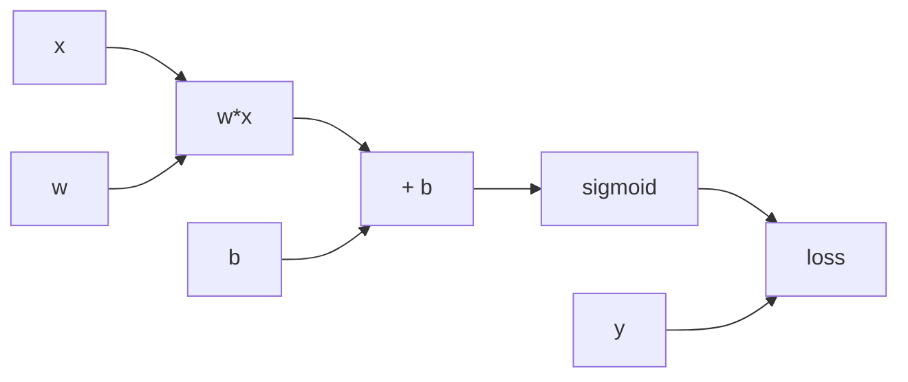

# Calculus cho Artificial Intelligence

> **Mạch đọc:** Đặt **Calculus cho Artificial Intelligence** trong bản đồ [README](./README.md) để thấy đơn vị sở hữu (owner / 오너) và vị trí của nó. Nội dung đi từ **hàm (function / 함수) là điểm xuất phát** sang **Limit và derivative**; điểm nối này chuẩn bị câu hỏi cho các mục sau thay vì dừng ở định nghĩa đầu tiên.


Calculus (미적분학 / giải tích) là ngôn ngữ để mô tả **thay đổi (change / 변경)**. Trong AI, câu hỏi quan trọng không chỉ là “mất mát (loss / 손실) hiện tại bằng bao nhiêu?” mà còn là: nếu thay một parameter rất nhỏ, mất mát (loss / 손실) sẽ thay đổi theo hướng nào và nhanh đến mức nào? Derivative, partial derivative và độ dốc (gradient / 기울기) biến câu hỏi đó thành quantities có thể tính được.

Nếu tuyến tính (linear / 선형) Algebra mô tả biểu diễn (representation / 표현) và transformation, Calculus cho ta biết transformation **nhạy** với đầu vào (input / 입력) hoặc parameter ra sao. Neural-network huấn luyện (training / 학습), backpropagation, gradient-based tối ưu hóa (optimization / 최적화), sensitivity phân tích (analysis / 분석) và nhiều phần của probabilistic modeling đều dựa trên idea này.

Xem trước: [Linear Algebra for AI](./01_linear_algebra_for_ai.md).

## Hàm (function / 함수) là điểm xuất phát

Một mô hình (model / 모델) có thể viết:

\[
\hat y=f_\theta(x)
\]

Mất mát (loss / 손실):

\[
L(\theta)=\ell(f_\theta(x),y)
\]

Huấn luyện (training / 학습) muốn thay `θ` để `L` nhỏ hơn.

Nếu `θ` chỉ là một số, derivative:

\[
\frac{dL}{d\theta}
\]

mô tả cục bộ (local / 로컬) tỷ lệ (rate / 비율) of thay đổi (change / 변경).

Nếu derivative positive, tăng `θ` một chút có xu hướng tăng mất mát (loss / 손실); giảm `θ` có xu hướng giảm mất mát (loss / 손실). Nếu derivative negative, direction ngược lại.

Đây là intuition phía sau độ dốc (gradient / 기울기) descent.

## Limit và derivative

Derivative được định nghĩa qua limit:

\[
f'(x)=\lim_{h\to0}\frac{f(x+h)-f(x)}{h}
\]

Ratio này đo slope của secant line khi interval `h` nhỏ dần tới 0.

Trong numerical computation, máy không thật sự lấy `h=0`; analytic derivative hoặc automatic differentiation tránh nhiều lỗi (error / 오류) của naive finite difference.

## Cục bộ (local / 로컬) tuyến tính (linear / 선형) approximation

Derivative quan trọng vì smooth hàm (function / 함수) gần một điểm (point / 지점) có thể được approximate tuyến tính:

\[
f(x+\Delta x)\approx f(x)+f'(x)\Delta x
\]

Trong nhiều dimensions:

\[
f(\mathbf{x}+\Delta\mathbf{x})\approx f(\mathbf{x})+\nabla f(\mathbf{x})^T\Delta\mathbf{x}
\]

Độ dốc (gradient / 기울기) vì vậy là best cục bộ (local / 로컬) tuyến tính (linear / 선형) tín hiệu (signal / 신호) mô tả đầu ra (output / 출력) thay đổi theo đầu vào (input / 입력) directions.

## Partial derivative

Nếu hàm (function / 함수) phụ thuộc nhiều variables:

\[
f(x,y)
\]

partial derivative theo `x`:

\[
\frac{\partial f}{\partial x}
\]

thay đổi `x` trong khi giữ `y` cố định.

Neural mạng (network / 네트워크) có millions/billions parameters, nên mất mát (loss / 손실) là hàm (function / 함수) high-dimensional:

\[
L(\theta_1,\theta_2,\ldots,\theta_p)
\]

Mỗi partial derivative trả lời parameter đó locally ảnh hưởng mất mát (loss / 손실) thế nào.

## Độ dốc (gradient / 기울기)

Độ dốc (gradient / 기울기) gom partial derivatives thành véc-tơ (vector / 벡터):

\[
\nabla_\theta L=
\begin{bmatrix}
\frac{\partial L}{\partial \theta_1}\\
\vdots\\
\frac{\partial L}{\partial \theta_p}
\end{bmatrix}
\]

Độ dốc (gradient / 기울기) điểm (point / 지점) theo direction steepest cục bộ (local / 로컬) increase dưới Euclidean hình học (geometry / 기하학). Vì vậy negative độ dốc (gradient / 기울기) là steepest cục bộ (local / 로컬) decrease direction.

Gradient-descent cập nhật (update / 업데이트):

\[
\theta_{t+1}=\theta_t-\eta\nabla_\theta L(\theta_t)
\]

`η` là học tập (learning / 학습) tỷ lệ (rate / 비율).

Độ dốc (gradient / 기울기) không nói minimum toàn cục ở đâu; nó chỉ cung cấp cục bộ (local / 로컬) thông tin (information / 정보).

## Directional derivative

Nếu muốn biết `f` thay đổi theo direction đơn vị (unit / 단위) véc-tơ (vector / 벡터) `u`:

\[
D_{\mathbf{u}}f=\nabla f^T\mathbf{u}
\]

Dot sản phẩm (product / 제품) này nối Calculus với tuyến tính (linear / 선형) Algebra. độ dốc (gradient / 기울기) là véc-tơ (vector / 벡터) chứa đủ thông tin (information / 정보) để tính cục bộ (local / 로컬) tỷ lệ (rate / 비율) theo mọi direction.

## Chuỗi (chain / 사슬) quy tắc (rule / 규칙)

Chuỗi (chain / 사슬) quy tắc (rule / 규칙) là foundation của backpropagation.

Nếu:

\[
y=f(u),\quad u=g(x)
\]

thì:

\[
\frac{dy}{dx}=\frac{dy}{du}\frac{du}{dx}
\]

Ý nghĩa: ảnh hưởng của `x` lên `y` đi qua intermediate `u`; tổng sensitivity là sản phẩm (product / 제품) của cục bộ (local / 로컬) sensitivities.

Neural mạng (network / 네트워크) chính là composition nhiều functions:

\[
f(x)=f_L(f_{L-1}(...f_1(x)))
\]

Chuỗi (chain / 사슬) quy tắc (rule / 규칙) cho phép propagate tác động (effect / 효과) của final mất mát (loss / 손실) ngược qua từng tầng (layer / 계층).

## Một example đơn giản của backpropagation

Giả sử:

\[
z=wx+b
\]

\[
\hat y=\sigma(z)
\]

\[
L=-[y\log\hat y+(1-y)\log(1-\hat y)]
\]

Ta cần:

\[
\frac{\partial L}{\partial w}
\]

Chuỗi (chain / 사슬) quy tắc (rule / 규칙):

\[
\frac{\partial L}{\partial w}=
\frac{\partial L}{\partial \hat y}
\frac{\partial \hat y}{\partial z}
\frac{\partial z}{\partial w}
\]

Với sigmoid + nhị phân (binary / 이진) cross-entropy, terms simplify đẹp thành:

\[
\frac{\partial L}{\partial z}=\hat y-y
\]

và:

\[
\frac{\partial L}{\partial w}=(\hat y-y)x
\]

Độ dốc (gradient / 기울기) vì vậy có intuitive cấu trúc (structure / 구조): prediction lỗi (error / 오류) nhân với đầu vào (input / 입력) tín hiệu (signal / 신호).

## Computation đồ thị (graph / 그래프)

Một mô hình (model / 모델) có thể được biểu diễn như directed acyclic đồ thị (graph / 그래프) của operations.


```mermaid
flowchart LR
    X[x] --> MUL[w*x]
    W[w] --> MUL
    MUL --> ADD[+ b]
    B[b] --> ADD
    ADD --> SIG[sigmoid]
    SIG --> LOSS[loss]
    Y[y] --> LOSS
```

Forward pass tính values từ đầu vào (input / 입력) tới mất mát (loss / 손실).

Backward pass dùng chuỗi (chain / 사슬) quy tắc (rule / 규칙) để truyền derivatives từ mất mát (loss / 손실) về parameters.

Khung phần mềm (framework / 프레임워크) autograd lưu đồ thị (graph / 그래프) hoặc thông tin (information / 정보) đủ để compute vector-Jacobian products hiệu quả.

## Backpropagation không phải độ dốc (gradient / 기울기) descent

Hai khái niệm thường bị trộn.

**Backpropagation (역전파)** là thuật toán (algorithm / 알고리즘) hiệu quả để compute gradients của composed hàm (function / 함수) bằng chuỗi (chain / 사슬) quy tắc (rule / 규칙).

**độ dốc (gradient / 기울기) descent** là tối ưu hóa (optimization / 최적화) chiến lược (strategy / 전략) dùng gradients để cập nhật (update / 업데이트) parameters.

Ta có thể dùng backprop với Adam, SGD, RMSProp hoặc optimizer khác. Và độ dốc (gradient / 기울기) descent có thể dùng cho functions không phải neural mạng (network / 네트워크).

## Jacobian

Nếu hàm (function / 함수) map véc-tơ (vector / 벡터) sang véc-tơ (vector / 벡터):

\[
\mathbf{y}=f(\mathbf{x})
\]

Jacobian là ma trận (matrix / 행렬):

\[
J_{ij}=\frac{\partial y_i}{\partial x_j}
\]

Jacobian mô tả cục bộ (local / 로컬) tuyến tính (linear / 선형) transformation từ đầu vào (input / 입력) perturbation sang đầu ra (output / 출력) perturbation:

\[
\Delta \mathbf{y}\approx J\Delta\mathbf{x}
\]

Trong Deep học tập (learning / 학습), explicitly constructing huge Jacobian thường quá expensive. Automatic differentiation tính products với Jacobian mà không materialize toàn ma trận (matrix / 행렬).

## Hessian và curvature

Với scalar hàm (function / 함수) `f(x)`, Hessian là ma trận (matrix / 행렬) second derivatives:

\[
H_{ij}=\frac{\partial^2 f}{\partial x_i\partial x_j}
\]

Độ dốc (gradient / 기울기) nói slope; Hessian nói curvature.

Second-order approximation:

\[
f(\mathbf{x}+\Delta)\approx f(\mathbf{x})+\nabla f^T\Delta+\frac{1}{2}\Delta^T H\Delta
\]

Newton's phương thức (method / 메서드) uses curvature:

\[
\theta_{new}=\theta-H^{-1}\nabla L
\]

Nhưng Hessian của large neural networks quá lớn để invert trực tiếp, nên practical tối ưu hóa (optimization / 최적화) thường dùng first-order methods hoặc approximations.

## Derivatives của dùng chung (common / 공통) activations

### Sigmoid

\[
\sigma(x)=\frac{1}{1+e^{-x}}
\]

Derivative:

\[
\sigma'(x)=\sigma(x)(1-\sigma(x))
\]

Khi `|x|` lớn, derivative gần 0. Deep stacks sigmoid dễ gặp vanishing độ dốc (gradient / 기울기).

### Tanh

\[
\tanh'(x)=1-\tanh^2(x)
\]

Tanh zero-centered hơn sigmoid nhưng vẫn saturate.

### ReLU

\[
ReLU(x)=\max(0,x)
\]

Derivative:

\[
ReLU'(x)=
\begin{cases}
1 & x>0\\
0 & x<0
\end{cases}
\]

Tại `x=0`, derivative strict không defined, nhưng hiện thực (implementation / 구현) chọn subgradient convention.

ReLU giúp mitigate saturation ở positive region nhưng neurons có thể “die” nếu persistently negative.

## Vanishing gradients

Chuỗi (chain / 사슬) quy tắc (rule / 규칙) multiply nhiều derivatives:

\[
\frac{\partial L}{\partial h_1}=\frac{\partial L}{\partial h_L}
\prod_{k=2}^{L}\frac{\partial h_k}{\partial h_{k-1}}
\]

Nếu norms của factors thường <1, độ dốc (gradient / 기울기) shrink exponentially qua độ sâu (depth / 깊이).

Điều này từng làm train deep networks và long RNNs rất khó.

Architectural solutions gồm:

- ReLU-like activations;
- careful initialization;
- residual connections;
- normalization;
- LSTM/GRU gating cho chuỗi (sequence / 시퀀스) các mô hình (models / 모델들).

## Exploding gradients

Nếu derivative products có norms >1 repeatedly, gradients có thể grow rất lớn.

Consequences:

- unstable updates;
- NaN/Inf;
- mất mát (loss / 손실) spikes.

Độ dốc (gradient / 기울기) clipping giới hạn norm:

\[
g\leftarrow g\cdot\min\left(1,\frac{c}{\|g\|}\right)
\]

Nó không giải quyết nguyên nhân gốc (root cause / 근본 원인) mọi instability nhưng thường useful trong RNN/Transformer huấn luyện (training / 학습).

## Residual connections từ Calculus perspective

Residual khối (block / 블록):

\[
y=x+F(x)
\]

Derivative:

\[
\frac{dy}{dx}=I+\frac{\partial F}{\partial x}
\]

Định danh (identity / 식별자) đường dẫn (path / 경로) cung cấp direct độ dốc (gradient / 기울기) tuyến (route / 경로). Đây là một reason residual architectures train deep các mô hình (models / 모델들) tốt hơn.

## Derivative của ma trận (matrix / 행렬) operations

Deep học tập (learning / 학습) dùng ma trận (matrix / 행렬) calculus. Ví dụ:

\[
\mathbf{y}=W\mathbf{x}
\]

Nếu scalar mất mát (loss / 손실) `L`, độ dốc (gradient / 기울기) theo `W` phụ thuộc outer sản phẩm (product / 제품) giữa upstream độ dốc (gradient / 기울기) và đầu vào (input / 입력).

Khung phần mềm (framework / 프레임워크) autograd che notation phức tạp, nhưng shape lập luận (reasoning / 추론) vẫn cần:

```text
W: m × n
x: n
 y: m
∂L/∂y: m
∂L/∂W: m × n
```

Độ dốc (gradient / 기울기) của parameter phải có same shape với parameter.

## Độ dốc (gradient / 기울기) của softmax + cross-entropy

Cho logits `z`, softmax:

\[
p_i=\frac{e^{z_i}}{\sum_j e^{z_j}}
\]

Cross-entropy với one-hot mục tiêu (target / 대상) `y`:

\[
L=-\sum_i y_i\log p_i
\]

Độ dốc (gradient / 기울기) simplify thành:

\[
\frac{\partial L}{\partial z_i}=p_i-y_i
\]

Đây là một elegant liên kết (connection / 연결): độ dốc (gradient / 기울기) trực tiếp là difference giữa predicted phân phối (distribution / 분포) và mục tiêu (target / 대상) phân phối (distribution / 분포).

## Automatic differentiation

Có ba ideas cần phân biệt:

**Symbolic differentiation** tạo symbolic formula derivative.

**Numerical differentiation** approximate bằng finite differences.

**Automatic differentiation (자동 미분)** áp dụng chuỗi (chain / 사슬) quy tắc (rule / 규칙) qua thành phần nguyên thủy (primitive / 기본 요소) operations để compute derivative chính xác tới floating-point arithmetic.

Reverse-mode autodiff đặc biệt hiệu quả khi có many inputs/parameters và một scalar mất mát (loss / 손실), đúng shape của neural-network huấn luyện (training / 학습).

Backpropagation là reverse-mode differentiation specialized trên mạng (network / 네트워크)/computation đồ thị (graph / 그래프).

## Finite-difference độ dốc (gradient / 기울기) checking

Có thể verify độ dốc (gradient / 기울기) hiện thực (implementation / 구현) bằng:

\[
\frac{\partial f}{\partial x}\approx\frac{f(x+\epsilon)-f(x-\epsilon)}{2\epsilon}
\]

Nếu autograd độ dốc (gradient / 기울기) khác finite difference nhiều, có thể có bug.

Nhưng `ε` quá nhỏ gây floating-point cancellation; quá lớn gây approximation lỗi (error / 오류). độ dốc (gradient / 기울기) checking phù hợp debugging small cases, không phải huấn luyện (training / 학습) phương thức (method / 메서드).

## Differentiability và subgradients

Không phải mọi useful hàm (function / 함수) differentiable mọi nơi. ReLU nondifferentiable tại 0. L1 norm nondifferentiable tại 0.

Tối ưu hóa (optimization / 최적화) vẫn có thể dùng **subgradient** hoặc generalized derivatives.

Do đó “Deep học tập (learning / 학습) cần mọi thao tác (operation / 연산) differentiable tuyệt đối” là oversimplification. Cần derivative-like tín hiệu (signal / 신호) đủ cho tối ưu hóa (optimization / 최적화) almost everywhere hoặc surrogate approach phù hợp.

## Discrete operations và độ dốc (gradient / 기울기) bài toán (problem / 문제)

Sampling đơn vị từ (token / 토큰), argmax hoặc hard routing là discrete và derivative không straightforward.

Đây là lý do nhiều methods dùng:

- soft relaxations;
- chính sách (policy / 정책) độ dốc (gradient / 기울기) / REINFORCE;
- straight-through estimators;
- Gumbel-softmax;
- differentiable surrogate losses.

Liên kết (connection / 연결) này quan trọng khi học Reinforcement học tập (learning / 학습) và generative discrete các mô hình (models / 모델들).

## Độ dốc (gradient / 기울기) không phải explanation

Biết độ dốc (gradient / 기울기) của đầu ra (output / 출력) theo đầu vào (input / 입력) có thể tạo saliency map, nhưng derivative sensitivity không tự động là nhân quả (causal / 인과적) explanation.

Một tính năng (feature / 기능) có độ dốc (gradient / 기울기) nhỏ tại hiện tại (current / 현재) điểm (point / 지점) vẫn có thể quan trọng globally; correlated features làm interpretation khó.

Explainability cần thận trọng hơn “độ dốc (gradient / 기울기) cao = tính năng (feature / 기능) quan trọng”.

## Calculus của continuous-time các mô hình (models / 모델들)

Một số AI các mô hình (models / 모델들) nhìn dynamics như differential equation:

\[
\frac{d\mathbf{h}(t)}{dt}=f(\mathbf{h}(t),t,\theta)
\]

Neural ODEs và diffusion-related continuous formulations nối Deep học tập (learning / 학습) với differential equations.

Không cần differential equations để bắt đầu ML, nhưng chúng cho thấy Calculus không chỉ tồn tại ở huấn luyện (training / 학습) độ dốc (gradient / 기울기) mà còn có thể nằm trong mô hình (model / 모델) dynamics.

## Integral và expectation

Xác suất (probability / 확률) expectation continuous:

\[
\mathbb{E}[f(X)]=\int f(x)p(x)dx
\]

Nhiều mục tiêu (objective / 목표) probabilistic yêu cầu integral khó giải closed-form, dẫn tới Monte Carlo approximation, variational suy luận (inference / 추론) hoặc numerical tích hợp (integration / 통합).

Calculus và xác suất (probability / 확률) vì vậy gắn chặt, không phải hai môn tách rời.

## Mô hình tư duy (mental model / 사고 모델)

Phần này chốt mental model thành một chuỗi có thể dùng lại: bối cảnh → cơ chế → quan sát → giới hạn → quyết định. Hãy đọc sơ đồ như công cụ suy luận, không như một khẩu hiệu tách khỏi chapter.

```text
Derivative      = output nhạy thế nào với một input nhỏ
Partial derivative = sensitivity theo một variable
Gradient        = vector local sensitivity theo mọi parameter
Chain rule      = nối local sensitivities qua composition
Backpropagation = compute chain rule hiệu quả trên computation graph
Jacobian        = local linear map vector → vector
Hessian         = local curvature
Autograd        = engine tự động tính derivative từ primitive operations
```

## Dùng chung (common / 공통) Misconceptions

### “độ dốc (gradient / 기울기) chỉ direction tới minimum”

Độ dốc (gradient / 기울기) cho cục bộ (local / 로컬) steepest ascent; negative độ dốc (gradient / 기울기) cho cục bộ (local / 로컬) descent. Nó không biết toàn cục (global / 전역) minimum nằm ở đâu.

### “Backpropagation là cách neural mạng (network / 네트워크) học”

Backprop chỉ compute gradients. học tập (learning / 학습) hành vi (behavior / 동작) còn phụ thuộc mất mát (loss / 손실), optimizer, dữ liệu (data / 데이터), kiến trúc (architecture / 아키텍처), regularization và huấn luyện (training / 학습) schedule.

### “Derivative bằng 0 nghĩa là optimum”

Có thể là cục bộ (local / 로컬) minimum, cục bộ (local / 로컬) maximum, saddle điểm (point / 지점) hoặc flat region.

### “Autograd khiến Calculus không cần thiết”

Autograd tính derivative, nhưng không giải thích vanishing gradients, saturation, học tập (learning / 학습) dynamics hoặc instability.

## Liên kết kiến thức (knowledge connection / 지식 연결)

Calculus nối trực tiếp sang [Optimization](./06_optimization.md), Neural Networks và Backpropagation. Khi gỡ lỗi (debug / 디버그) huấn luyện (training / 학습), hãy hỏi: độ dốc (gradient / 기울기) magnitude ra sao, computation đường dẫn (path / 경로) nào truyền độ dốc (gradient / 기울기), activation có saturate không, mất mát (loss / 손실) hình học (geometry / 기하학) cục bộ (local / 로컬) thế nào và numerical precision có làm độ dốc (gradient / 기울기) biến mất không.

Xem tiếp: [Optimization for AI](./06_optimization.md) và [Numerical Computation](./07_numerical_computation.md).
