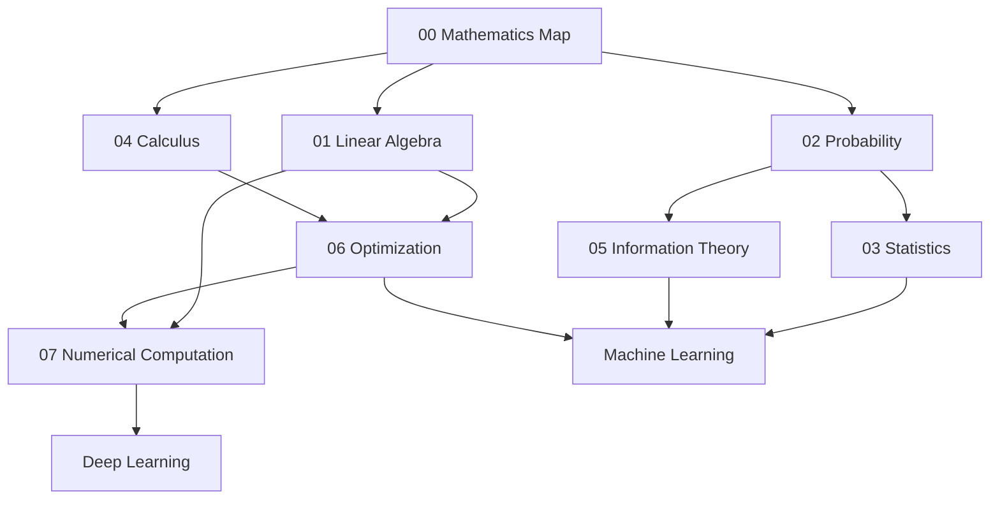

# Mathematical Foundations for Artificial Intelligence

Folder này không phải một “khóa toán trước khi học AI”. Nó là tập các chapter giải thích những mathematical tools xuất hiện lặp lại trong AI và vì sao chúng cần tồn tại.

Bắt đầu bằng [Mathematics for AI](./00_mathematics_for_ai.md) để có bản đồ tổng thể, sau đó đọc các chapter chuyên sâu theo dependency thực tế của topic đang học.

## Chapters

1. [Mathematics for AI](./00_mathematics_for_ai.md) — bản đồ vai trò của toán trong AI.
2. [Linear Algebra for AI](./01_linear_algebra_for_ai.md) — vector, matrix, tensor, geometry, rank, SVD/PCA, embeddings và attention.
3. [Probability for AI](./02_probability_for_ai.md) — conditional probability, Bayes, likelihood, distributions, calibration và sampling.
4. [Statistics for AI](./03_statistics_for_ai.md) — finite sample, estimation, generalization, data leakage, metrics, experiments và distribution shift.
5. [Calculus for AI](./04_calculus_for_ai.md) — derivative, gradient, chain rule, Jacobian/Hessian, backpropagation và automatic differentiation.
6. [Information Theory](./05_information_theory.md) — entropy, cross-entropy, KL divergence, mutual information, perplexity và compression.
7. [Optimization for AI](./06_optimization.md) — SGD, momentum, Adam/AdamW, schedules, conditioning, constraints và objective alignment.
8. [Numerical Computation](./07_numerical_computation.md) — floating point, stability, mixed precision, quantization, stable kernels và hardware-aware computation.

## Dependency map



Không cần đọc theo một đường duy nhất. Nếu đang học Transformer, Linear Algebra + Calculus + Optimization + Numerical Computation có priority cao. Nếu đang học evaluation, Statistics + Probability quan trọng hơn. Nếu đang học language modeling, Probability + Information Theory là dependency trực tiếp.

## Mental model

```text
Linear Algebra      → biểu diễn và biến đổi
Probability         → uncertainty và distributions
Statistics          → suy luận từ sample tới population
Calculus            → sensitivity và gradients
Information Theory  → surprise, uncertainty và coding
Optimization        → tìm parameters/actions theo objective
Numerical Computing → làm toán chạy ổn định trên hardware thật
```

Các chapter sau trong library sẽ cross-reference lại folder này khi mathematical mechanism thực sự cần thiết.