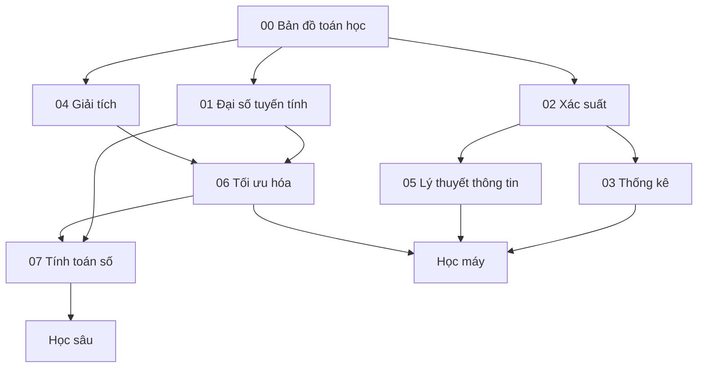

# Nền tảng toán học cho Trí tuệ nhân tạo

Thư mục này không phải một “khóa toán phải học xong trước khi học AI”. Đây là tập các chapter giải thích những **công cụ toán học (mathematical tools)** xuất hiện lặp lại trong AI, chúng giải quyết vấn đề gì và vì sao cần tồn tại.

Bắt đầu bằng [Toán học cho AI](./00_mathematics_for_ai.md) để có bản đồ tổng thể, sau đó đọc các chapter chuyên sâu theo quan hệ phụ thuộc của chủ đề đang học.

## Các chapter

1. [Toán học cho AI](./00_mathematics_for_ai.md) — bản đồ vai trò của toán trong AI.
2. [Đại số tuyến tính cho AI](./01_linear_algebra_for_ai.md) — vector, ma trận, tensor, hình học, hạng, SVD/PCA, embedding và attention.
3. [Xác suất cho AI](./02_probability_for_ai.md) — xác suất có điều kiện, Bayes, likelihood, phân phối, hiệu chuẩn và lấy mẫu.
4. [Thống kê cho AI](./03_statistics_for_ai.md) — mẫu hữu hạn, ước lượng, khái quát hóa, rò rỉ dữ liệu, chỉ số, thí nghiệm và dịch chuyển phân phối.
5. [Giải tích cho AI](./04_calculus_for_ai.md) — đạo hàm, gradient, quy tắc dây chuyền, Jacobian/Hessian, lan truyền ngược và vi phân tự động.
6. [Lý thuyết thông tin](./05_information_theory.md) — entropy, entropy chéo, KL divergence, thông tin tương hỗ, perplexity và nén.
7. [Tối ưu hóa cho AI](./06_optimization.md) — SGD, momentum, Adam/AdamW, lịch tốc độ học, mức điều kiện, ràng buộc và căn chỉnh mục tiêu.
8. [Tính toán số](./07_numerical_computation.md) — dấu phẩy động, độ ổn định, độ chính xác hỗn hợp, lượng tử hóa, kernel ổn định và tính toán theo phần cứng.

## Bản đồ phụ thuộc



Không cần đọc theo một đường duy nhất. Nếu đang học Transformer, Đại số tuyến tính + Giải tích + Tối ưu hóa + Tính toán số có độ ưu tiên cao. Nếu đang học đánh giá mô hình, Thống kê + Xác suất quan trọng hơn. Nếu đang học mô hình ngôn ngữ, Xác suất + Lý thuyết thông tin là các nền tảng trực tiếp.

## Mô hình tư duy (mental model)

```text
Đại số tuyến tính   → biểu diễn và biến đổi
Xác suất            → sự bất định và phân phối
Thống kê            → suy luận từ mẫu tới quần thể
Giải tích           → độ nhạy và gradient
Lý thuyết thông tin → độ bất ngờ, bất định và mã hóa
Tối ưu hóa          → tìm tham số/hành động theo mục tiêu
Tính toán số        → làm toán chạy ổn định trên phần cứng thật
```

Các chapter phía sau trong thư viện sẽ liên kết ngược về phần này khi một cơ chế toán học thực sự cần thiết.