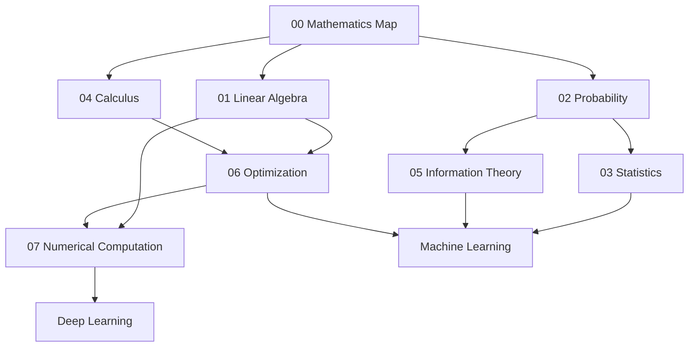

# Mathematical Foundations for Artificial Intelligence

> **Mạch đọc:** [README](./README.md) là bản đồ owner của **Mathematical Foundations for Artificial Intelligence**; nhìn vào vị trí đó trước để biết file này đang phục vụ nhánh kiến thức nào. **Chapters** mở đối tượng chính của file và câu hỏi cần theo dõi; sau đó sang **Phụ thuộc (dependency / 의존성) map** để mở rộng đối tượng sang phạm vi kế cận. Cách đi này giữ lại điểm tựa của section đầu và cho biết kết luận sẽ được dùng ở đâu, thay vì dừng ở định nghĩa đầu tiên.

Folder này không phải một “khóa toán trước khi học AI”. Nó là tập các chapter giải thích những mathematical tools xuất hiện lặp lại trong AI và vì sao chúng cần tồn tại.

Bắt đầu bằng [Mathematics for AI](./00_mathematics_for_ai.md) để có bản đồ tổng thể, sau đó đọc các chapter chuyên sâu theo phụ thuộc (dependency / 의존성) thực tế của topic đang học.

## Chapters

1. [Mathematics for AI](./00_mathematics_for_ai.md) — bản đồ vai trò của toán trong AI.
2. [Linear Algebra for AI](./01_linear_algebra_for_ai.md) — véc-tơ (vector / 벡터), ma trận (matrix / 행렬), tensor, hình học (geometry / 기하학), rank, SVD/PCA, embeddings và attention.
3. [Probability for AI](./02_probability_for_ai.md) — conditional xác suất (probability / 확률), Bayes, likelihood, distributions, calibration và sampling.
4. [Statistics for AI](./03_statistics_for_ai.md) — finite mẫu (sample / 표본), estimation, generalization, dữ liệu (data / 데이터) leakage, metrics, experiments và phân phối (distribution / 분포) shift.
5. [Calculus for AI](./04_calculus_for_ai.md) — derivative, độ dốc (gradient / 기울기), chuỗi (chain / 사슬) quy tắc (rule / 규칙), Jacobian/Hessian, backpropagation và automatic differentiation.
6. [Information Theory](./05_information_theory.md) — entropy, cross-entropy, KL divergence, mutual thông tin (information / 정보), perplexity và compression.
7. [Optimization for AI](./06_optimization.md) — SGD, momentum, Adam/AdamW, schedules, conditioning, các ràng buộc (constraints / 제약조건들) và mục tiêu (objective / 목표) alignment.
8. [Numerical Computation](./07_numerical_computation.md) — floating điểm (point / 지점), stability, mixed precision, quantization, stable kernels và hardware-aware computation.

> **Chuyển mạch:** Trong **Mathematical Foundations for Artificial Intelligence**, **Phụ thuộc (dependency / 의존성) map** tiếp nhận điểm tựa từ **Chapters** nhưng đổi góc nhìn sang câu hỏi của chính nó; đọc liền hai mục để thấy mối quan hệ đó. Từ đây, **Mô hình tư duy (mental model / 사고 모델)** sẽ cho biết hệ quả hoặc giới hạn ấy hiện ra ở đâu.

## Phụ thuộc (dependency / 의존성) map

Sơ đồ hoặc danh sách này mô tả thứ tự phụ thuộc của các khái niệm. Hãy đọc theo mũi tên để biết phần nào là prerequisite, phần nào là ứng dụng và khi nào cần quay lại nền tảng.


```mermaid
flowchart TD
    M[00 Mathematics Map] --> LA[01 Linear Algebra]
    M --> P[02 Probability]
    M --> C[04 Calculus]
    P --> S[03 Statistics]
    P --> IT[05 Information Theory]
    LA --> O[06 Optimization]
    C --> O
    LA --> NC[07 Numerical Computation]
    O --> NC
    S --> ML[Machine Learning]
    IT --> ML
    O --> ML
    NC --> DL[Deep Learning]
```

Không cần đọc theo một đường duy nhất. Nếu đang học Transformer, tuyến tính (linear / 선형) Algebra + Calculus + tối ưu hóa (optimization / 최적화) + Numerical Computation có priority cao. Nếu đang học evaluation, Statistics + xác suất (probability / 확률) quan trọng hơn. Nếu đang học ngôn ngữ (language / 언어) modeling, xác suất (probability / 확률) + thông tin (information / 정보) lý thuyết (theory / 이론) là phụ thuộc (dependency / 의존성) trực tiếp.

> **Chuyển mạch:** Ở chặng này của **Mathematical Foundations for Artificial Intelligence**, **Mô hình tư duy (mental model / 사고 모델)** gom các mảnh từ **Phụ thuộc (dependency / 의존성) map** thành một kết luận có thể mang sang phần kế tiếp. Phần còn lại của file dùng kết quả này để khép lại mạch giải thích.

## Mô hình tư duy (mental model / 사고 모델)

Phần này chốt mental model thành một chuỗi có thể dùng lại: bối cảnh → cơ chế → quan sát → giới hạn → quyết định. Hãy đọc sơ đồ như công cụ suy luận, không như một khẩu hiệu tách khỏi chapter.

```text
Linear Algebra      → biểu diễn và biến đổi
Probability         → uncertainty và distributions
Statistics          → suy luận từ sample tới population
Calculus            → sensitivity và gradients
Information Theory  → surprise, uncertainty và coding
Optimization        → tìm parameters/actions theo objective
Numerical Computing → làm toán chạy ổn định trên hardware thật
```

Các chapter sau trong library sẽ cross-reference lại folder này khi mathematical mechanism thực sự cần thiết.

> **Bàn giao:** Sau **Mô hình tư duy (mental model / 사고 모델)**, hãy giữ lại kết luận và ranh giới của mục này; quay về [README](./README.md) khi cần định vị owner hoặc chọn nhánh học tiếp theo.
