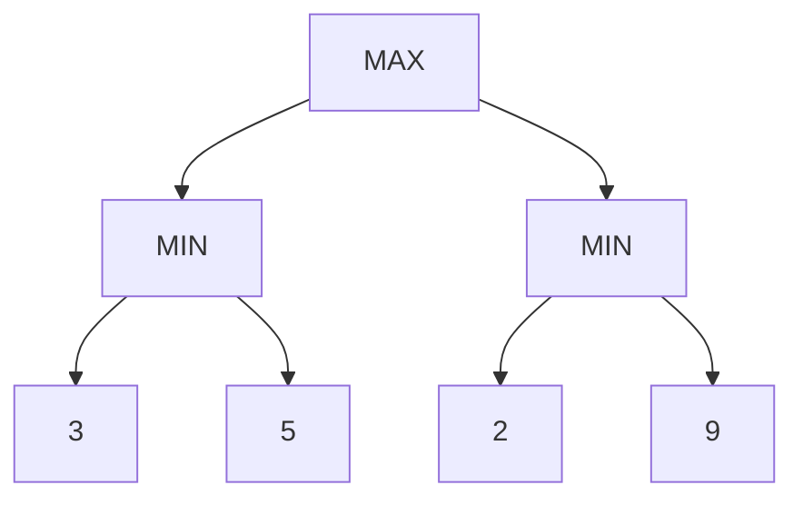
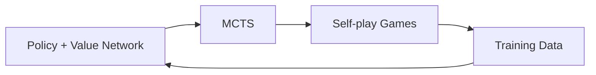

# Adversarial Search và Game Playing

Nhiều search problem giả định environment thụ động: ta chọn action, transition xảy ra theo rules, goal không chống lại ta. Trong games và adversarial settings, một actor khác chủ động chọn action làm outcome của ta xấu đi. Khi đó “tìm path tốt” trở thành “chọn strategy tốt khi đối thủ cũng tối ưu”.

**Adversarial Search (적대적 탐색)** nghiên cứu decision making trong multi-agent environments có competitive objectives. Classical examples là chess, checkers, Go; ideas của nó cũng hữu ích cho security, negotiation, robust decision making và multi-agent systems.

Xem trước: [State Space and Search](./00_state_space_and_search.md).

## Từ path search tới game tree

Single-agent search:

```text
state → action → successor → ... → goal
```

Two-player turn-taking game:

```text
MAX chooses action
    ↓
MIN chooses response
    ↓
MAX chooses action
    ↓
...
```

Mỗi node không chỉ có state mà còn player-to-move.

Game tree branches theo legal actions của both sides.

## Zero-sum games

Trong two-player zero-sum game, utility của hai players đối nhau:

\[
U_{MAX}=-U_{MIN}
\]

Nếu MAX thắng +1, MIN nhận -1; draw 0.

Zero-sum assumption làm analysis clean nhưng không cover cooperation, bargaining hoặc general-sum multi-agent environments.

## Perfect information

Chess là perfect-information game: board state visible đầy đủ, không hidden cards.

Poker có imperfect information.

Deterministic perfect-information zero-sum games là setting kinh điển cho minimax. Chance hoặc hidden information cần extensions khác.

## Minimax principle

MAX chọn action maximize utility assuming MIN sẽ choose response minimize MAX utility.

Recursive value:

\[
V(s)=
\begin{cases}
U(s), & s\text{ terminal}\\
\max_{a}V(T(s,a)), & MAX\text{ turn}\\
\min_{a}V(T(s,a)), & MIN\text{ turn}
\end{cases}
\]

MAX không chọn move có outcome tốt nhất nếu opponent cooperate. Nó chọn move có **best worst-case guarantee**.

## Example nhỏ

Suppose MAX has two moves:

```text
A → MIN can force {3, 5}
B → MIN can force {2, 9}
```

MIN chooses minimum under each branch:

```text
A value = min(3,5)=3
B value = min(2,9)=2
```

MAX chooses A because:

\[
\max(3,2)=3
\]

Move B has attractive possible 9, nhưng rational adversary sẽ not allow it.

## Minimax as backward induction

Minimax solves leaves first then propagate values backward.



`A=min(3,5)=3`, `B=min(2,9)=2`, root `max(3,2)=3`.

This is dynamic-programming-like recursive structure on game tree.

## Complexity

Nếu branching factor là `b` và search depth `m`:

\[
O(b^m)
\]

time, with depth-first implementation space roughly `O(bm)` under common analysis.

Chess branching ~tens moves/position and game depth large, making exhaustive minimax impossible.

Hence pruning, evaluation functions, move ordering and learned guidance.

## Evaluation function

If cannot search to terminal state, stop at cutoff depth and estimate position value:

\[
\hat V(s)
\]

Chess evaluation might combine material, king safety, piece activity, pawn structure.

Modern systems may use neural value networks.

Evaluation error can propagate up minimax. Search depth may compensate some errors but also encounter **horizon effect**.

## Horizon effect

If bad event lies just beyond search cutoff, model may choose move that merely delays event past horizon.

Example: losing queen unavoidable in 6 moves, search depth 5 prefers line postponing loss because evaluator chưa thấy consequence.

Quiescence search extends tactical/noisy positions until state becomes more stable for evaluation.

## Alpha–Beta pruning

Alpha–Beta pruning computes same minimax value while avoiding branches that cannot affect decision.

Maintain:

- `α`: best value MAX can guarantee so far;
- `β`: best value MIN can guarantee so far.

If at some point:

\[
\alpha\ge\beta
\]

remaining branch can be pruned under standard logic.

## Why pruning is safe

Suppose MAX already has option worth 5. While evaluating another move, MIN finds response limiting branch to ≤3.

MAX will never choose that branch over guaranteed 5, so no need inspect other MIN responses.

Pruning removes computation, not possible optimal decision.

## Move ordering matters

Alpha–Beta worst case remains roughly minimax complexity. With ideal move ordering, effective search depth can roughly double for same computation in classic analysis:

\[
O(b^{m/2})
\]

rather than `O(b^m)`.

Thus good move ordering is huge.

Learned policy networks can order promising moves, making search more efficient.

## Transposition tables

Same game position can arise through different move orders, called **transposition**.

Caching evaluated positions avoids repeated search.

Transposition table entries may store:

```text
state hash
searched depth
value or bound type
best move
```

Zobrist hashing is common efficient board hashing technique.

Because table finite, replacement policy matters.

## Iterative deepening in games

Game engines often search depth 1,2,3,... repeatedly.

Although repeated work occurs, advantages include:

- always have best move from completed depth;
- use previous iteration best move for ordering;
- fit uncertain time budget;
- warm transposition table.

This combines well with Alpha–Beta.

## Principal variation

Principal variation is current best sequence of moves under search.

It is useful for:

- move ordering;
- explain/debug engine;
- display expected line;
- iterative deepening reuse.

But it is contingent on evaluation/search depth; not guaranteed actual future play.

## Expectiminimax: chance nodes

Games like backgammon include dice/chance.

Tree contains MAX, MIN and CHANCE nodes.

Chance value:

\[
V(s)=\sum_o P(o)V(T(s,o))
\]

At chance node, take expectation rather than min/max.

Tree complexity grows further because chance outcomes add branching.

## Imperfect information

Poker players do not know opponent cards. State is not fully observed.

Naively minimax over visible state fails because player must reason over information sets/beliefs and mixed strategies.

Game Theory concepts like Nash equilibrium, counterfactual regret minimization (CFR) become relevant.

This is conceptual bridge from adversarial search to broader multi-agent decision theory.

## Mixed strategies

In games like rock-paper-scissors, deterministic strategy exploitable. Optimal play uses probability distribution over actions.

A mixed strategy:

\[
\pi(a)
\]

For symmetric rock-paper-scissors equilibrium:

\[
\pi(R)=\pi(P)=\pi(S)=1/3
\]

No pure action guarantees value against rational opponent.

This shows “best action” may be stochastic.

## Nash equilibrium

A strategy profile is Nash equilibrium if no player can improve utility by unilateral deviation.

In two-player zero-sum games, minimax theorem connects equilibrium value with maximin/minimax under suitable finite-game assumptions.

General-sum games can have multiple equilibria and more complex incentives.

## Monte Carlo Tree Search

Monte Carlo Tree Search (MCTS) builds search tree selectively using sampling rather than exhaustive depth expansion.

Canonical loop:

```text
Selection
   ↓
Expansion
   ↓
Simulation / Evaluation
   ↓
Backpropagation of value
   ↺
```

MCTS is especially useful when branching large and good heuristic evaluation difficult.

## Exploration vs exploitation in MCTS

UCT-like selection rule:

\[
\bar X_j + C\sqrt{\frac{\ln N}{n_j}}
\]

First term prefers moves with high observed value (exploitation).

Second term prefers less-visited moves (exploration).

`N` parent visits, `n_j` child visits.

This is connection to multi-armed bandits and uncertainty-aware search.

## Neural-guided MCTS

AlphaGo/AlphaZero-style systems combine:

- policy network → prior over promising moves;
- value network → estimate outcome without full rollout;
- MCTS → structured search/refinement.

This is key lesson:

> Learning did not simply replace search. Learning made search much more informed.

Policy narrows branching; value reduces need reach terminal states; search improves over raw network output.

## AlphaZero-style feedback loop

Conceptually:



Self-play creates data from current policy/search. Network learns improved policy/value targets derived from search/outcomes.

This is Learning + Search + Reinforcement Learning integrated.

## Minimax vs MCTS

Minimax/Alpha–Beta works well when:

- deterministic transitions;
- relatively manageable branching;
- evaluation function strong;
- tactical precision matters.

MCTS works well when:

- branching large;
- stochastic sampling useful;
- rollout/value estimates available;
- incremental anytime behavior desired.

This is not strict binary. Hybrid engines combine multiple techniques.

## Adversarial search outside board games

### Security

Defender chooses detection/resource strategy while attacker adapts.

### Robust ML

Adversarial examples can be formulated as inner optimization:

\[
\max_{\|\delta\|\le\epsilon} L(f(x+\delta),y)
\]

while training minimizes outer objective:

\[
\min_\theta \mathbb{E}[\max_\delta L(f_\theta(x+\delta),y)]
\]

This is continuous adversarial optimization rather than game-tree search, but same strategic structure: one player seeks failure, other robustness.

### Multi-agent systems

Agents may compete for resources, negotiate or cooperate. General-sum environments need beyond minimax.

## Search depth vs evaluation quality

A deeper search with poor evaluator and a shallower search with strong evaluator can trade off.

Compute allocation question:

```text
spend FLOPs on deeper tree?
        vs
spend FLOPs on stronger model evaluation?
```

Modern AI systems repeatedly face this inference-time compute trade-off.

## Test-time compute connection

Reasoning systems can generate/evaluate multiple candidates rather than one answer. Conceptually similar to game search:

```text
model prior
   ↓
branch candidates
   ↓
score/verify
   ↓
expand promising paths
```

But unless environment is literal zero-sum alternating game, minimax terminology should not be applied casually.

## Opponent modeling

Minimax assumes opponent optimal in worst-case sense. Real opponents may be bounded or patterned.

If model opponent policy:

\[
\pi_{opp}(a\mid s)
\]

agent may exploit predictable weaknesses.

Risk: model wrong, adversary changes strategy.

Security often prefers robust worst-case assumptions; games against humans may benefit opponent adaptation.

## Mental Model

```text
Single-agent search → world does not strategically oppose you
Minimax             → assume opponent chooses worst response
Alpha–Beta          → skip branches provably irrelevant to minimax decision
Evaluation          → estimate value when terminal too far
MCTS                → sample promising parts of huge tree
Neural-guided search→ learned policy/value directs computation
```

## Common Misconceptions

### “Alpha–Beta changes minimax answer”

With correct implementation/order assumptions, it prunes branches that cannot affect minimax value; answer stays same.

### “Search depth alone determines engine strength”

Evaluation, move ordering, pruning, transposition caching and selective extensions matter greatly.

### “MCTS is just random rollout”

Modern MCTS uses structured selection statistics and often learned policy/value; naive random simulation is only one possible component.

### “A strong neural network makes search unnecessary”

Sometimes direct policy is enough, but many domains gain strength from search. Choice depends latency, branching and quality requirements.

## Knowledge Connection

Adversarial search links [Heuristic Search](./02_heuristic_search.md), Game Theory, Reinforcement Learning and modern neural-guided planning. It demonstrates a recurring AI architecture: **learned prior/value + explicit search + feedback**.

Xem tiếp: [Constraint Satisfaction](./04_constraint_satisfaction.md) và [Planning](./05_planning.md).