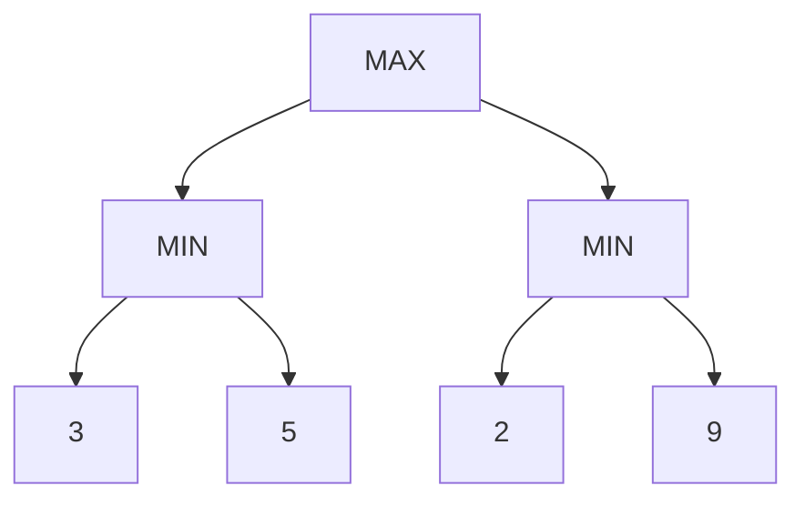
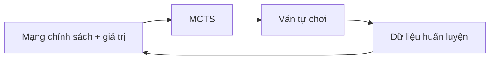

# Tìm kiếm đối kháng và chơi trò chơi

Nhiều bài toán tìm kiếm giả định môi trường thụ động: ta chọn hành động, phép chuyển xảy ra theo quy tắc và mục tiêu không chủ động chống lại ta. Trong trò chơi và môi trường đối kháng, một tác nhân khác chủ động chọn hành động để làm kết quả của ta xấu đi. Khi đó “tìm đường tốt” trở thành “chọn chiến lược tốt khi đối thủ cũng tối ưu”.

**Tìm kiếm đối kháng (Adversarial Search / 적대적 탐색)** nghiên cứu việc ra quyết định trong môi trường nhiều tác nhân có mục tiêu cạnh tranh. Ví dụ cổ điển là cờ vua, cờ đam và Go; các ý tưởng này cũng hữu ích trong an ninh, thương lượng, ra quyết định bền vững và hệ thống đa tác nhân.

Xem trước: [Không gian trạng thái và tìm kiếm](./00_state_space_and_search.md).

## Từ tìm đường tới cây trò chơi

Tìm kiếm một tác nhân:

```text
trạng thái → hành động → trạng thái kế → ... → mục tiêu
```

Trò chơi hai người luân phiên:

```text
MAX chọn hành động
    ↓
MIN chọn phản ứng
    ↓
MAX chọn hành động
    ↓
...
```

Mỗi nút không chỉ chứa trạng thái mà còn chứa thông tin lượt của người chơi nào.

**Cây trò chơi (game tree)** phân nhánh theo các hành động hợp lệ của cả hai phía.

## Trò chơi tổng bằng không

Trong **trò chơi hai người tổng bằng không (two-player zero-sum game)**, độ hữu dụng của hai người đối nghịch:

\[
U_{MAX}=-U_{MIN}
\]

Nếu MAX thắng được `+1`, MIN nhận `-1`; hòa có thể là `0`.

Giả định tổng bằng không giúp phân tích gọn hơn nhưng không bao phủ hợp tác, thương lượng hoặc môi trường đa tác nhân tổng quát.

## Thông tin hoàn hảo

Cờ vua là trò chơi **thông tin hoàn hảo (perfect information)**: trạng thái bàn cờ được cả hai bên nhìn thấy đầy đủ, không có quân bài ẩn.

Poker có thông tin không hoàn hảo.

Minimax cổ điển đặc biệt phù hợp với trò chơi xác định, thông tin hoàn hảo và tổng bằng không. Nếu có yếu tố ngẫu nhiên hoặc thông tin ẩn, cần các mở rộng khác.

## Nguyên lý minimax

MAX chọn hành động tối đa hóa độ hữu dụng với giả định MIN sẽ chọn phản ứng làm độ hữu dụng của MAX nhỏ nhất.

Giá trị đệ quy:

\[
V(s)=
\begin{cases}
U(s), & s\text{ là trạng thái kết thúc}\\
\max_{a}V(T(s,a)), & \text{lượt MAX}\\
\min_{a}V(T(s,a)), & \text{lượt MIN}
\end{cases}
\]

MAX không chọn nước đi có kết quả đẹp nhất trong trường hợp đối thủ hợp tác. Nó chọn nước có **bảo đảm tốt nhất trong trường hợp xấu nhất**.

## Ví dụ nhỏ

Giả sử MAX có hai nước:

```text
A → MIN có thể ép kết quả về {3, 5}
B → MIN có thể ép kết quả về {2, 9}
```

MIN chọn giá trị nhỏ nhất ở mỗi nhánh:

```text
A = min(3,5)=3
B = min(2,9)=2
```

MAX chọn A vì:

\[
\max(3,2)=3
\]

Nhánh B có khả năng đạt 9 rất hấp dẫn, nhưng đối thủ hợp lý sẽ không cho phép điều đó nếu có lựa chọn khác.

## Minimax như suy luận ngược

Minimax tính giá trị ở lá rồi truyền ngược lên cây.



`A=min(3,5)=3`, `B=min(2,9)=2`, và gốc `max(3,2)=3`.

Đây là cấu trúc đệ quy gần với quy hoạch động trên cây trò chơi.

## Độ phức tạp

Nếu hệ số phân nhánh là `b` và độ sâu tìm kiếm là `m`:

\[
O(b^m)
\]

về thời gian, còn cách triển khai theo chiều sâu thường cần bộ nhớ gần `O(bm)` trong phân tích phổ biến.

Cờ vua có hàng chục nước hợp lệ trung bình ở mỗi vị trí và chiều sâu trận đấu lớn, nên minimax vét cạn là bất khả thi.

Vì vậy cần cắt tỉa, hàm đánh giá, sắp xếp nước đi và hướng dẫn bằng mô hình học.

## Hàm đánh giá

Nếu không thể tìm tới trạng thái kết thúc, ta dừng ở một độ sâu giới hạn và ước lượng giá trị vị trí:

\[
\hat V(s)
\]

Trong cờ vua, hàm đánh giá có thể kết hợp giá trị quân, an toàn của vua, độ hoạt động của quân và cấu trúc tốt.

Hệ thống hiện đại có thể dùng mạng giá trị (value network).

Sai số đánh giá có thể được truyền ngược qua minimax. Tìm sâu hơn có thể bù một phần nhưng cũng gặp **hiệu ứng chân trời (horizon effect)**.

## Hiệu ứng chân trời

Nếu một sự kiện xấu nằm ngay sau độ sâu cắt, hệ thống có thể chọn nước chỉ để đẩy sự kiện đó ra ngoài chân trời tìm kiếm.

Ví dụ mất hậu là không thể tránh trong 6 nước, nhưng tìm kiếm sâu 5 nước có thể thích một phương án chỉ trì hoãn việc mất hậu vì hàm đánh giá chưa nhìn thấy hậu quả.

**Tìm kiếm trạng thái yên tĩnh (quiescence search)** kéo dài tìm kiếm ở vị trí chiến thuật hoặc nhiều biến động cho tới khi trạng thái đủ ổn định để đánh giá.

## Cắt tỉa Alpha–Beta

**Cắt tỉa Alpha–Beta (Alpha–Beta pruning)** tính cùng giá trị minimax nhưng bỏ qua những nhánh không thể ảnh hưởng tới quyết định cuối.

Duy trì:

- `α`: giá trị tốt nhất MAX đã có thể bảo đảm;
- `β`: giá trị tốt nhất MIN đã có thể ép xuống.

Nếu:

\[
\alpha\ge\beta
\]

các phần còn lại của nhánh có thể được cắt dưới logic chuẩn.

## Vì sao cắt tỉa vẫn an toàn?

Giả sử MAX đã có một lựa chọn bảo đảm giá trị 5. Khi đánh giá một lựa chọn khác, MIN đã tìm được phản ứng khiến nhánh đó chỉ còn tối đa 3.

MAX sẽ không chọn nhánh ≤3 thay cho phương án bảo đảm 5, nên không cần xem hết các phản ứng MIN còn lại.

Cắt tỉa loại bỏ tính toán, không loại bỏ quyết định minimax tối ưu.

## Thứ tự nước đi rất quan trọng

Trường hợp xấu của Alpha–Beta vẫn gần độ phức tạp minimax. Nhưng với thứ tự nước đi lý tưởng, phân tích cổ điển cho thấy cùng lượng tính toán có thể tìm sâu gần gấp đôi:

\[
O(b^{m/2})
\]

thay vì `O(b^m)`.

Vì vậy việc xếp các nước hứa hẹn lên trước rất quan trọng.

Mạng chính sách (policy network) đã học có thể dùng để sắp xếp nước đi, từ đó làm tìm kiếm hiệu quả hơn.

## Bảng chuyển vị

Cùng một vị trí trò chơi có thể xuất hiện qua nhiều thứ tự nước đi khác nhau; hiện tượng này gọi là **chuyển vị (transposition)**.

Lưu bộ nhớ đệm của các vị trí đã đánh giá giúp tránh tìm lại.

Một mục trong **bảng chuyển vị (transposition table)** có thể lưu:

```text
mã băm trạng thái
độ sâu đã tìm
giá trị hoặc loại cận
nước đi tốt nhất
```

Zobrist hashing là kỹ thuật phổ biến để băm trạng thái bàn cờ hiệu quả.

Vì bảng có kích thước hữu hạn, chính sách thay thế mục cũ cũng quan trọng.

## Đào sâu lặp trong trò chơi

Engine trò chơi thường tìm ở độ sâu 1, 2, 3,... lặp lại.

Mặc dù có phần tính lại, cách này mang nhiều lợi ích:

- luôn có nước tốt nhất từ lần tìm hoàn tất gần nhất;
- dùng nước tốt ở vòng trước để sắp xếp nước ở vòng sau;
- thích nghi với ngân sách thời gian không chắc chắn;
- làm nóng bảng chuyển vị.

Cách này phối hợp rất tốt với Alpha–Beta.

## Biến chính

**Biến chính (principal variation)** là chuỗi nước đi đang được xem là tốt nhất theo kết quả tìm kiếm hiện tại.

Nó hữu ích để sắp xếp nước, gỡ lỗi engine, hiển thị đường dự kiến và tái sử dụng trong đào sâu lặp.

Tuy nhiên nó phụ thuộc vào độ sâu và hàm đánh giá, không phải lời tiên đoán chắc chắn về trận đấu thật.

## Expectiminimax: nút ngẫu nhiên

Trò chơi như backgammon có xúc xắc nên cây chứa thêm nút ngẫu nhiên bên cạnh MAX và MIN.

Giá trị tại nút ngẫu nhiên:

\[
V(s)=\sum_o P(o)V(T(s,o))
\]

Ta lấy kỳ vọng thay vì min hoặc max.

Độ phức tạp cây tăng thêm vì các kết quả ngẫu nhiên cũng tạo phân nhánh.

## Thông tin không hoàn hảo

Trong poker, người chơi không biết bài của đối thủ. Trạng thái thật không được quan sát đầy đủ.

Áp dụng minimax ngây thơ trên trạng thái nhìn thấy là không đủ vì người chơi phải suy luận trên **tập thông tin (information set)**, niềm tin và chiến lược trộn.

Các khái niệm của lý thuyết trò chơi như cân bằng Nash và **tối thiểu hóa hối tiếc phản thực (Counterfactual Regret Minimization - CFR)** trở nên quan trọng.

Đây là cầu nối từ tìm kiếm đối kháng sang lý thuyết quyết định nhiều tác nhân rộng hơn.

## Chiến lược trộn

Trong kéo-búa-bao, chiến lược xác định luôn có thể bị khai thác. Chơi tối ưu cần phân phối xác suất trên các hành động.

Một **chiến lược trộn (mixed strategy)**:

\[
\pi(a)
\]

Trong cân bằng đối xứng của kéo-búa-bao:

\[
\pi(R)=\pi(P)=\pi(S)=1/3
\]

Không có một hành động thuần túy nào bảo đảm giá trị tốt nhất trước đối thủ hợp lý.

Điều này cho thấy “hành động tốt nhất” đôi khi cần mang tính ngẫu nhiên.

## Cân bằng Nash

Một cấu hình chiến lược là **cân bằng Nash (Nash equilibrium)** nếu không người chơi nào có thể tăng độ hữu dụng bằng cách đơn phương đổi chiến lược.

Trong trò chơi hai người tổng bằng không, định lý minimax nối giá trị cân bằng với maximin/minimax dưới các giả định trò chơi hữu hạn phù hợp.

Trò chơi tổng quát có thể có nhiều cân bằng và động lực phức tạp hơn.

## Monte Carlo Tree Search

**Monte Carlo Tree Search (MCTS)** xây cây một cách chọn lọc bằng lấy mẫu thay vì mở rộng vét cạn tới độ sâu cố định.

Vòng lặp điển hình:

```text
Lựa chọn
   ↓
Mở rộng
   ↓
Mô phỏng / Đánh giá
   ↓
Lan truyền giá trị ngược lên cây
   ↺
```

MCTS đặc biệt hữu ích khi hệ số phân nhánh lớn và khó xây hàm đánh giá viết tay tốt.

## Khám phá và khai thác trong MCTS

Quy tắc kiểu UCT thường có dạng:

\[
\bar X_j + C\sqrt{\frac{\ln N}{n_j}}
\]

Hạng đầu ưu tiên nước có giá trị quan sát cao, tức **khai thác (exploitation)**.

Hạng sau ưu tiên nước ít được thử, tức **khám phá (exploration)**.

`N` là số lần thăm nút cha, `n_j` là số lần thăm nút con.

Đây là liên kết trực tiếp với bài toán bandit nhiều tay và tìm kiếm có nhận biết bất định.

## MCTS được hướng dẫn bằng mạng nơ-ron

Các hệ thống kiểu AlphaGo/AlphaZero kết hợp:

- mạng chính sách → phân phối ưu tiên trên các nước hứa hẹn;
- mạng giá trị → ước lượng kết quả mà không cần mô phỏng tới cuối;
- MCTS → tìm kiếm có cấu trúc và tinh chỉnh quyết định.

Bài học quan trọng:

> **Học không đơn giản thay thế tìm kiếm; học có thể làm tìm kiếm thông minh hơn rất nhiều.**

Chính sách giảm hiệu quả hệ số phân nhánh; mạng giá trị giảm nhu cầu đi tới trạng thái kết thúc; tìm kiếm cải thiện quyết định so với chỉ dùng đầu ra thô của mạng.

## Vòng phản hồi kiểu AlphaZero

Về khái niệm:



Tự chơi tạo dữ liệu từ chính sách và tìm kiếm hiện tại. Mạng học từ mục tiêu chính sách/giá trị được cải thiện bởi tìm kiếm và kết quả trận đấu.

Đây là sự tích hợp của học, tìm kiếm và học tăng cường.

## Minimax và MCTS

Minimax/Alpha–Beta phù hợp khi:

- phép chuyển xác định;
- phân nhánh còn tương đối kiểm soát được;
- có hàm đánh giá mạnh;
- cần độ chính xác chiến thuật cao.

MCTS phù hợp khi:

- phân nhánh lớn;
- lấy mẫu ngẫu nhiên hữu ích;
- có mô phỏng hoặc mạng giá trị;
- muốn hành vi kiểu anytime.

Đây không phải ranh giới tuyệt đối. Engine lai có thể kết hợp nhiều kỹ thuật.

## Tìm kiếm đối kháng ngoài trò chơi bàn cờ

### An ninh

Bên phòng thủ chọn chiến lược phát hiện hoặc phân bổ tài nguyên trong khi kẻ tấn công thích nghi.

### Học máy bền vững

Ví dụ đối kháng có thể được mô hình hóa thành tối ưu phía trong:

\[
\max_{\|\delta\|\le\epsilon} L(f(x+\delta),y)
\]

trong khi huấn luyện giảm mục tiêu phía ngoài:

\[
\min_\theta \mathbb{E}[\max_\delta L(f_\theta(x+\delta),y)]
\]

Đây là tối ưu đối kháng liên tục, không phải tìm kiếm cây trò chơi, nhưng cấu trúc chiến lược tương tự: một bên tìm lỗi, một bên tối ưu độ bền vững.

### Hệ thống đa tác nhân

Các tác nhân có thể cạnh tranh tài nguyên, thương lượng hoặc hợp tác. Môi trường không tổng bằng không cần công cụ rộng hơn minimax.

## Độ sâu tìm kiếm và chất lượng đánh giá

Tìm sâu hơn với hàm đánh giá yếu và tìm nông hơn với mô hình đánh giá mạnh tạo ra một đánh đổi thực tế.

Câu hỏi phân bổ tính toán:

```text
dùng FLOPs để mở cây sâu hơn?
        hay
dùng FLOPs cho mô hình đánh giá mạnh hơn?
```

Đây là một dạng của **tính toán tại thời điểm suy luận (test-time compute)** trong hệ thống AI hiện đại.

## Liên hệ với tính toán tại thời điểm suy luận

Hệ thống suy luận có thể sinh và đánh giá nhiều ứng viên thay vì chỉ tạo một đáp án:

```text
phân phối ban đầu của mô hình
   ↓
sinh nhiều nhánh ứng viên
   ↓
chấm điểm / xác minh
   ↓
mở rộng các đường hứa hẹn
```

Tuy nhiên nếu bài toán không thật sự là trò chơi luân phiên tổng bằng không, không nên dùng thuật ngữ minimax một cách tùy tiện.

## Mô hình hóa đối thủ

Minimax giả định đối thủ tối ưu theo nghĩa trường hợp xấu nhất. Đối thủ thực có thể bị giới hạn hoặc có mẫu hành vi.

Nếu mô hình hóa chính sách đối thủ:

\[
\pi_{opp}(a\mid s)
\]

tác nhân có thể khai thác điểm yếu dự đoán được.

Rủi ro là mô hình đối thủ sai hoặc đối thủ thay đổi chiến lược.

Trong an ninh thường ưu tiên giả định bền vững theo trường hợp xấu; trong trò chơi với con người có thể hữu ích khi thích nghi theo đối thủ.

## Mô hình tư duy (mental model)

```text
Tìm kiếm một tác nhân → môi trường không chủ động chống lại bạn
Minimax             → giả định đối thủ chọn phản ứng xấu nhất cho bạn
Alpha–Beta          → bỏ nhánh chắc chắn không ảnh hưởng quyết định minimax
Hàm đánh giá         → ước lượng khi trạng thái kết thúc quá xa
MCTS                → lấy mẫu các phần hứa hẹn của cây lớn
Tìm kiếm hướng dẫn bằng mạng → chính sách/giá trị đã học định hướng tính toán
```

## Các hiểu lầm thường gặp

### “Alpha–Beta thay đổi đáp án minimax”

Nếu triển khai đúng, nó chỉ bỏ các nhánh không thể ảnh hưởng tới giá trị minimax; kết quả cuối không đổi.

### “Chỉ độ sâu tìm kiếm quyết định sức mạnh engine”

Hàm đánh giá, thứ tự nước đi, cắt tỉa, bảng chuyển vị và mở rộng chọn lọc đều rất quan trọng.

### “MCTS chỉ là mô phỏng ngẫu nhiên”

MCTS hiện đại dùng thống kê lựa chọn có cấu trúc và thường dùng chính sách/giá trị đã học; mô phỏng ngẫu nhiên ngây thơ chỉ là một thành phần có thể có.

### “Mạng nơ-ron mạnh khiến tìm kiếm trở nên không cần thiết”

Trong một số bài toán, chính sách trực tiếp là đủ. Nhưng nhiều miền vẫn mạnh hơn đáng kể khi kết hợp tìm kiếm. Lựa chọn phụ thuộc độ trễ, phân nhánh và yêu cầu chất lượng.

## Liên kết kiến thức

Tìm kiếm đối kháng nối [Tìm kiếm heuristic](./02_heuristic_search.md), lý thuyết trò chơi, học tăng cường và lập kế hoạch được hướng dẫn bằng mạng nơ-ron. Nó cho thấy một kiến trúc AI lặp lại nhiều lần: **tiên nghiệm/giá trị đã học + tìm kiếm tường minh + phản hồi**.

Xem tiếp: [Thỏa mãn ràng buộc](./04_constraint_satisfaction.md) và [Lập kế hoạch](./05_planning.md).