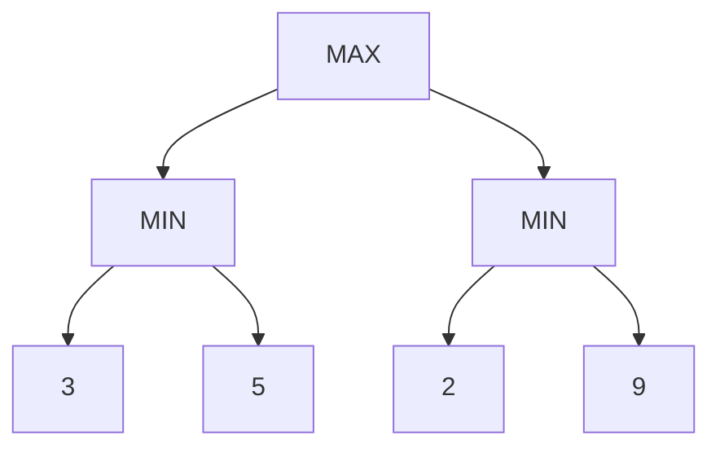
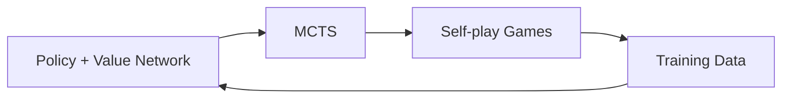

# Adversarial tìm kiếm (search / 검색) và Game Playing

> **Mạch đọc:** Đặt **Adversarial tìm kiếm (search / 검색) và Game Playing** trong bản đồ [README](./README.md) để thấy đơn vị sở hữu (owner / 오너) và vị trí của nó. Nội dung đi từ **Từ đường dẫn (path / 경로) tìm kiếm (search / 검색) tới game cây (tree / 트리)** sang **Zero-sum games**; điểm nối này chuẩn bị câu hỏi cho các mục sau thay vì dừng ở định nghĩa đầu tiên.


Nhiều tìm kiếm (search / 검색) bài toán (problem / 문제) giả định môi trường (environment / 환경) thụ động: ta chọn hành động (action / 동작), chuyển tiếp (transition / 전이) xảy ra theo rules, goal không chống lại ta. Trong games và adversarial settings, một actor khác chủ động chọn hành động (action / 동작) làm kết quả (outcome / 결과) của ta xấu đi. Khi đó “tìm đường dẫn (path / 경로) tốt” trở thành “chọn chiến lược (strategy / 전략) tốt khi đối thủ cũng tối ưu”.

**Adversarial tìm kiếm (search / 검색)** nghiên cứu quyết định (decision / 결정) making trong multi-agent environments có competitive objectives. Classical examples là chess, checkers, Go; ideas của nó cũng hữu ích cho bảo mật (security / 보안), negotiation, robust quyết định (decision / 결정) making và multi-agent các hệ thống (systems / 시스템들).

Xem trước: [State Space and Search](./00_state_space_and_search.md).

## Từ đường dẫn (path / 경로) tìm kiếm (search / 검색) tới game cây (tree / 트리)

Single-agent tìm kiếm (search / 검색):

```text
state → action → successor → ... → goal
```

Two-player turn-taking game:

```text
MAX chooses action
    ↓
MIN chooses response
    ↓
MAX chooses action
    ↓
...
```

Mỗi nút (node / 노드) không chỉ có trạng thái (state / 상태) mà còn player-to-move.

Game cây (tree / 트리) branches theo legal actions của both sides.

## Zero-sum games

Trong two-player zero-sum game, utility của hai players đối nhau:

\[
U_{MAX}=-U_{MIN}
\]

Nếu MAX thắng +1, MIN nhận -1; draw 0.

Zero-sum giả định (assumption / 가정) làm phân tích (analysis / 분석) clean nhưng không cover cooperation, bargaining hoặc general-sum multi-agent environments.

## Perfect thông tin (information / 정보)

Chess là perfect-information game: board trạng thái (state / 상태) visible đầy đủ, không hidden cards.

Poker có imperfect thông tin (information / 정보).

Deterministic perfect-information zero-sum games là setting kinh điển cho minimax. Chance hoặc hidden thông tin (information / 정보) cần extensions khác.

## Minimax principle

MAX chọn hành động (action / 동작) maximize utility assuming MIN sẽ choose phản hồi (response / 응답) minimize MAX utility.

Recursive giá trị (value / 값):

\[
V(s)=
\begin{cases}
U(s), & s\văn bản (text / 텍스트){ terminal}\\
\max_{a}V(T(s,a)), & MAX\văn bản (text / 텍스트){ turn}\\
\min_{a}V(T(s,a)), & MIN\văn bản (text / 텍스트){ turn}
\end{cases}
\]

MAX không chọn move có kết quả (outcome / 결과) tốt nhất nếu opponent cooperate. Nó chọn move có **best worst-case guarantee**.

## Example nhỏ

Suppose MAX has two moves:

```text
A → MIN can force {3, 5}
B → MIN can force {2, 9}
```

MIN chooses minimum under each branch:

```text
A value = min(3,5)=3
B value = min(2,9)=2
```

MAX chooses A because:

\[
\max(3,2)=3
\]

Move B has attractive possible 9, nhưng rational adversary sẽ not allow it.

## Minimax as backward induction

Minimax solves leaves first then propagate values backward.


```mermaid
flowchart TD
    R[MAX] --> A[MIN]
    R --> B[MIN]
    A --> A1[3]
    A --> A2[5]
    B --> B1[2]
    B --> B2[9]
```

`A=min(3,5)=3`, `B=min(2,9)=2`, gốc (root / 루트) `max(3,2)=3`.

This is dynamic-programming-like recursive cấu trúc (structure / 구조) on game cây (tree / 트리).

## Độ phức tạp (complexity / 복잡도)

Nếu branching factor là `b` và tìm kiếm (search / 검색) độ sâu (depth / 깊이) `m`:

\[
O(b^m)
\]

Thời gian (time / 시간), with depth-first hiện thực (implementation / 구현) không gian (space / 공간) roughly `O(bm)` under dùng chung (common / 공통) phân tích (analysis / 분석).

Chess branching ~tens moves/position and game độ sâu (depth / 깊이) large, making exhaustive minimax impossible.

Hence pruning, evaluation functions, move thứ tự (ordering / 순서) and learned guidance.

## Evaluation hàm (function / 함수)

If cannot tìm kiếm (search / 검색) to terminal trạng thái (state / 상태), stop at cutoff độ sâu (depth / 깊이) and estimate position giá trị (value / 값):

\[
\hat V(s)
\]

Chess evaluation might combine material, king an toàn (safety / 안전), piece activity, pawn cấu trúc (structure / 구조).

Hiện đại (modern / 현대적) các hệ thống (systems / 시스템들) may use neural giá trị (value / 값) networks.

Evaluation lỗi (error / 오류) can propagate up minimax. tìm kiếm (search / 검색) độ sâu (depth / 깊이) may compensate some errors but also encounter **horizon tác động (effect / 효과)**.

## Horizon tác động (effect / 효과)

If bad sự kiện (event / 이벤트) lies just beyond tìm kiếm (search / 검색) cutoff, mô hình (model / 모델) may choose move that merely delays sự kiện (event / 이벤트) past horizon.

Example: losing queen unavoidable in 6 moves, tìm kiếm (search / 검색) độ sâu (depth / 깊이) 5 prefers line postponing mất mát (loss / 손실) because evaluator chưa thấy consequence.

Quiescence tìm kiếm (search / 검색) extends tactical/noisy positions until trạng thái (state / 상태) becomes more stable for evaluation.

## Alpha–Beta pruning

Alpha–Beta pruning computes same minimax giá trị (value / 값) while avoiding branches that cannot affect quyết định (decision / 결정).

Maintain:

- `α`: best giá trị (value / 값) MAX can guarantee so far;
- `β`: best giá trị (value / 값) MIN can guarantee so far.

If at some điểm (point / 지점):

\[
\alpha\ge\beta
\]

remaining branch can be pruned under tiêu chuẩn (standard / 표준) lô-gic (logic / 논리).

## Why pruning is safe

Suppose MAX already has option worth 5. While evaluating another move, MIN finds phản hồi (response / 응답) limiting branch to ≤3.

MAX will never choose that branch over guaranteed 5, so no need inspect other MIN responses.

Pruning removes computation, not possible optimal quyết định (decision / 결정).

## Move thứ tự (ordering / 순서) matters

Alpha–Beta worst trường hợp (case / 사례) remains roughly minimax độ phức tạp (complexity / 복잡도). With ideal move thứ tự (ordering / 순서), effective tìm kiếm (search / 검색) độ sâu (depth / 깊이) can roughly double for same computation in classic phân tích (analysis / 분석):

\[
O(b^{m/2})
\]

rather than `O(b^m)`.

Thus good move thứ tự (ordering / 순서) is huge.

Learned chính sách (policy / 정책) networks can thứ tự (order / 순서) promising moves, making tìm kiếm (search / 검색) more efficient.

## Transposition tables

Same game position can arise through different move orders, called **transposition**.

Caching evaluated positions avoids repeated tìm kiếm (search / 검색).

Transposition bảng (table / 테이블) entries may store:

```text
state hash
searched depth
value or bound type
best move
```

Zobrist hashing is dùng chung (common / 공통) efficient board hashing technique.

Because bảng (table / 테이블) finite, replacement chính sách (policy / 정책) matters.

## Iterative deepening in games

Game engines often tìm kiếm (search / 검색) độ sâu (depth / 깊이) 1,2,3,... repeatedly.

Although repeated công việc (work / 작업) occurs, advantages include:

- always have best move from completed độ sâu (depth / 깊이);
- use previous iteration best move for thứ tự (ordering / 순서);
- fit uncertain thời gian (time / 시간) ngân sách (budget / 예산);
- warm transposition bảng (table / 테이블).

This combines well with Alpha–Beta.

## Principal variation

Principal variation is hiện tại (current / 현재) best chuỗi (sequence / 시퀀스) of moves under tìm kiếm (search / 검색).

It is useful for:

- move thứ tự (ordering / 순서);
- explain/gỡ lỗi (debug / 디버그) engine;
- display expected line;
- iterative deepening reuse.

But it is contingent on evaluation/tìm kiếm (search / 검색) độ sâu (depth / 깊이); not guaranteed actual future play.

## Expectiminimax: chance nodes

Games like backgammon include dice/chance.

Cây (tree / 트리) contains MAX, MIN and CHANCE nodes.

Chance giá trị (value / 값):

\[
V(s)=\sum_o P(o)V(T(s,o))
\]

At chance nút (node / 노드), take expectation rather than min/max.

Cây (tree / 트리) độ phức tạp (complexity / 복잡도) grows further because chance outcomes add branching.

## Imperfect thông tin (information / 정보)

Poker players do not know opponent cards. trạng thái (state / 상태) is not fully observed.

Naively minimax over visible trạng thái (state / 상태) fails because player must reason over thông tin (information / 정보) sets/beliefs and mixed strategies.

Game lý thuyết (theory / 이론) concepts like Nash equilibrium, counterfactual regret minimization (CFR) become relevant.

This is conceptual cầu nối (bridge / 브리지) from adversarial tìm kiếm (search / 검색) to broader multi-agent quyết định (decision / 결정) lý thuyết (theory / 이론).

## Mixed strategies

In games like rock-paper-scissors, deterministic chiến lược (strategy / 전략) exploitable. Optimal play uses xác suất (probability / 확률) phân phối (distribution / 분포) over actions.

A mixed chiến lược (strategy / 전략):

\[
\pi(a)
\]

For symmetric rock-paper-scissors equilibrium:

\[
\pi(R)=\pi(P)=\pi(S)=1/3
\]

No pure hành động (action / 동작) guarantees giá trị (value / 값) against rational opponent.

This shows “best hành động (action / 동작)” may be stochastic.

## Nash equilibrium

A chiến lược (strategy / 전략) profile is Nash equilibrium if no player can improve utility by unilateral deviation.

In two-player zero-sum games, minimax theorem connects equilibrium giá trị (value / 값) with maximin/minimax under suitable finite-game các giả định (assumptions / 가정들).

General-sum games can have multiple equilibria and more complex incentives.

## Monte Carlo cây (tree / 트리) tìm kiếm (search / 검색)

Monte Carlo cây (tree / 트리) tìm kiếm (search / 검색) (MCTS) builds tìm kiếm (search / 검색) cây (tree / 트리) selectively using sampling rather than exhaustive độ sâu (depth / 깊이) expansion.

Chuẩn gốc (canonical / 정본) vòng lặp (loop / 루프):

```text
Selection
   ↓
Expansion
   ↓
Simulation / Evaluation
   ↓
Backpropagation of value
   ↺
```

MCTS is especially useful when branching large and good heuristic evaluation difficult.

## Exploration vs exploitation in MCTS

UCT-like selection quy tắc (rule / 규칙):

\[
\bar X_j + C\sqrt{\frac{\ln N}{n_j}}
\]

First term prefers moves with high observed giá trị (value / 값) (exploitation).

Second term prefers less-visited moves (exploration).

`N` parent visits, `n_j` child visits.

This is liên kết (connection / 연결) to multi-armed bandits and uncertainty-aware tìm kiếm (search / 검색).

## Neural-guided MCTS

AlphaGo/AlphaZero-style các hệ thống (systems / 시스템들) combine:

- chính sách (policy / 정책) mạng (network / 네트워크) → prior over promising moves;
- giá trị (value / 값) mạng (network / 네트워크) → estimate kết quả (outcome / 결과) without full rollout;
- MCTS → structured tìm kiếm (search / 검색)/refinement.

This is key lesson:

> học tập (learning / 학습) did not simply replace tìm kiếm (search / 검색). học tập (learning / 학습) made tìm kiếm (search / 검색) much more informed.

Chính sách (policy / 정책) narrows branching; giá trị (value / 값) reduces need reach terminal states; tìm kiếm (search / 검색) improves over raw mạng (network / 네트워크) đầu ra (output / 출력).

## AlphaZero-style vòng phản hồi (feedback loop / 피드백 루프)

Conceptually:


```mermaid
flowchart LR
    N[Policy + Value Network] --> M[MCTS]
    M --> G[Self-play Games]
    G --> D[Training Data]
    D --> N
```

Self-play creates dữ liệu (data / 데이터) from hiện tại (current / 현재) chính sách (policy / 정책)/tìm kiếm (search / 검색). mạng (network / 네트워크) learns improved chính sách (policy / 정책)/giá trị (value / 값) targets derived from tìm kiếm (search / 검색)/outcomes.

This is học tập (learning / 학습) + tìm kiếm (search / 검색) + Reinforcement học tập (learning / 학습) integrated.

## Minimax vs MCTS

Minimax/Alpha–Beta works well when:

- deterministic transitions;
- relatively manageable branching;
- evaluation hàm (function / 함수) strong;
- tactical precision matters.

MCTS works well when:

- branching large;
- stochastic sampling useful;
- rollout/giá trị (value / 값) estimates available;
- incremental anytime hành vi (behavior / 동작) desired.

This is not strict nhị phân (binary / 이진). Hybrid engines combine multiple techniques.

## Adversarial tìm kiếm (search / 검색) outside board games

### Bảo mật (security / 보안)

Defender chooses detection/tài nguyên (resource / 자원) chiến lược (strategy / 전략) while attacker adapts.

### Robust ML

Adversarial examples can be formulated as inner tối ưu hóa (optimization / 최적화):

\[
\max_{\|\delta\|\le\epsilon} L(f(x+\delta),y)
\]

while huấn luyện (training / 학습) minimizes outer mục tiêu (objective / 목표):

\[
\min_\theta \mathbb{E}[\max_\delta L(f_\theta(x+\delta),y)]
\]

This is continuous adversarial tối ưu hóa (optimization / 최적화) rather than game-tree tìm kiếm (search / 검색), but same strategic cấu trúc (structure / 구조): one player seeks thất bại (failure / 실패), other robustness.

### Multi-agent các hệ thống (systems / 시스템들)

Agents may compete for resources, negotiate or cooperate. General-sum environments need beyond minimax.

## Tìm kiếm (search / 검색) độ sâu (depth / 깊이) vs evaluation chất lượng (quality / 품질)

A deeper tìm kiếm (search / 검색) with poor evaluator and a shallower tìm kiếm (search / 검색) with strong evaluator can trade off.

Compute allocation question:

```text
spend FLOPs on deeper tree?
        vs
spend FLOPs on stronger model evaluation?
```

Hiện đại (modern / 현대적) AI các hệ thống (systems / 시스템들) repeatedly face this inference-time compute sự đánh đổi (trade-off / 트레이드오프).

## Test-time compute liên kết (connection / 연결)

Lập luận (reasoning / 추론) các hệ thống (systems / 시스템들) can generate/evaluate multiple candidates rather than one answer. Conceptually similar to game tìm kiếm (search / 검색):

```text
model prior
   ↓
branch candidates
   ↓
score/verify
   ↓
expand promising paths
```

But unless môi trường (environment / 환경) is literal zero-sum alternating game, minimax terminology should not be applied casually.

## Opponent modeling

Minimax assumes opponent optimal in worst-case sense. Real opponents may be bounded or patterned.

If mô hình (model / 모델) opponent chính sách (policy / 정책):

\[
\pi_{opp}(a\mid s)
\]

Tác nhân (agent / 에이전트) may exploit predictable weaknesses.

Rủi ro (risk / 위험): mô hình (model / 모델) wrong, adversary changes chiến lược (strategy / 전략).

Bảo mật (security / 보안) often prefers robust worst-case các giả định (assumptions / 가정들); games against humans may benefit opponent adaptation.

## Mô hình tư duy (mental model / 사고 모델)

```text
Single-agent search → world does not strategically oppose you
Minimax             → assume opponent chooses worst response
Alpha–Beta          → skip branches provably irrelevant to minimax decision
Evaluation          → estimate value when terminal too far
MCTS                → sample promising parts of huge tree
Neural-guided search→ learned policy/value directs computation
```

## Dùng chung (common / 공통) Misconceptions

### “Alpha–Beta changes minimax answer”

With correct hiện thực (implementation / 구현)/thứ tự (order / 순서) các giả định (assumptions / 가정들), it prunes branches that cannot affect minimax giá trị (value / 값); answer stays same.

### “tìm kiếm (search / 검색) độ sâu (depth / 깊이) alone determines engine strength”

Evaluation, move thứ tự (ordering / 순서), pruning, transposition caching and selective extensions matter greatly.

### “MCTS is just random rollout”

Hiện đại (modern / 현대적) MCTS uses structured selection statistics and often learned chính sách (policy / 정책)/giá trị (value / 값); naive random simulation is only one possible thành phần (component / 컴포넌트).

### “A strong neural mạng (network / 네트워크) makes tìm kiếm (search / 검색) unnecessary”

Sometimes direct chính sách (policy / 정책) is enough, but many domains gain strength from tìm kiếm (search / 검색). Choice depends độ trễ (latency / 지연 시간), branching and chất lượng (quality / 품질) requirements.

## Liên kết kiến thức (knowledge connection / 지식 연결)

Adversarial tìm kiếm (search / 검색) links [Heuristic Search](./02_heuristic_search.md), Game lý thuyết (theory / 이론), Reinforcement học tập (learning / 학습) and hiện đại (modern / 현대적) neural-guided planning. It demonstrates a recurring AI kiến trúc (architecture / 아키텍처): **learned prior/giá trị (value / 값) + tường minh (explicit / 명시적) tìm kiếm (search / 검색) + phản hồi (feedback / 피드백)**.

Xem tiếp: [Constraint Satisfaction](./04_constraint_satisfaction.md) và [Planning](./05_planning.md).

> **Bàn giao:** Sau **liên kết kiến thức (knowledge connection / 지식 연결)**, hãy chốt bất biến (invariant / 불변식) và giới hạn của mục này trước khi nối sang kiến thức kế tiếp. Có thể đọc tiếp [00 state space and search](./00_state_space_and_search.md) để đối chiếu ranh giới (boundary / 경계) gần nhất.
