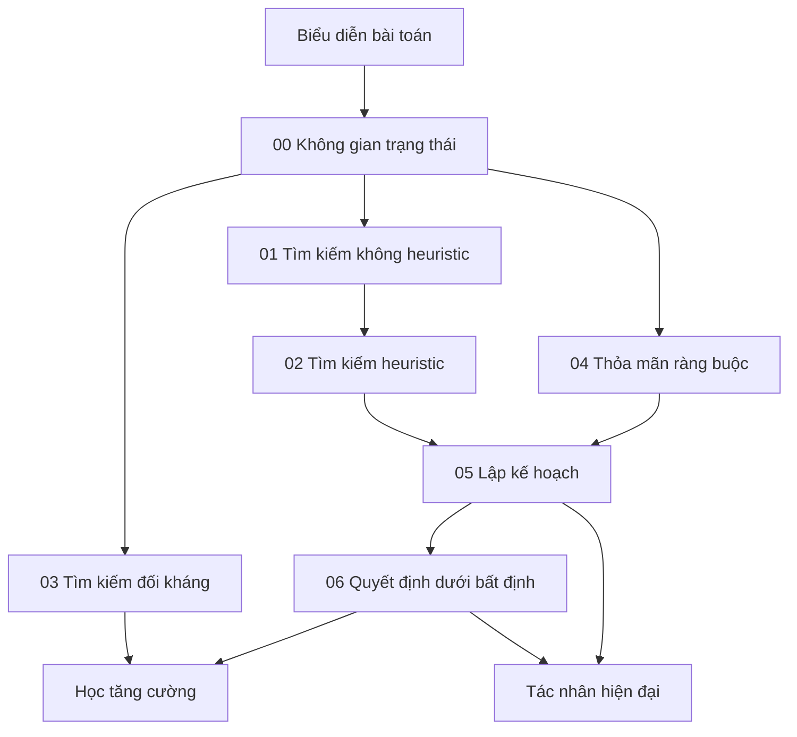

# Nền tảng tìm kiếm, suy luận và lập kế hoạch

Thư mục này xây phần **giải quyết bài toán cổ điển (classical problem solving)** của Trí tuệ nhân tạo. Nó trả lời câu hỏi: khi một tác nhân có trạng thái, hành động và mục tiêu, làm thế nào khám phá các khả năng, dùng tri thức để giảm không gian tìm kiếm, xử lý đối thủ và ràng buộc, lập kế hoạch, rồi ra quyết định khi kết quả không chắc chắn?

Các ý tưởng này không bị Học máy thay thế. AI hiện đại thường dùng mô hình đã học để cung cấp heuristic, chính sách, hàm giá trị hoặc đề xuất ứng viên, trong khi tìm kiếm và lập kế hoạch vẫn xử lý cấu trúc tổ hợp và ràng buộc thực thi.

## Các chapter

1. [Không gian trạng thái và tìm kiếm](./00_state_space_and_search.md) — trạng thái, hành động, phép chuyển, biên tìm kiếm, tính đầy đủ, tính tối ưu và bùng nổ tổ hợp.
2. [Tìm kiếm không dùng heuristic](./01_uninformed_search.md) — BFS, DFS, DLS, IDDFS, Uniform-Cost Search và tìm kiếm hai chiều.
3. [Tìm kiếm heuristic](./02_heuristic_search.md) — Greedy Best-First, A*, tính chấp nhận được, tính nhất quán, heuristic học được và các biến thể giới hạn bộ nhớ.
4. [Tìm kiếm đối kháng và trò chơi](./03_adversarial_search_and_games.md) — minimax, Alpha–Beta, hàm đánh giá, MCTS và tìm kiếm trò chơi được hướng dẫn bằng mạng nơ-ron.
5. [Thỏa mãn ràng buộc](./04_constraint_satisfaction.md) — biến, miền, ràng buộc, lan truyền, quay lui, SAT/CP và kiến trúc lai LLM + bộ giải.
6. [Lập kế hoạch](./05_planning.md) — điều kiện trước/hiệu ứng, STRIPS/PDDL, lập kế hoạch thứ tự một phần, HTN, thời gian, xác minh, thực thi và lập kế hoạch lại.
7. [Ra quyết định dưới bất định](./06_decision_making_under_uncertainty.md) — độ hữu dụng kỳ vọng, MDP/POMDP, phương trình Bellman, bandit, giá trị của thông tin và rủi ro.

## Bản đồ phụ thuộc



## Mô hình tư duy chung (mental model)

```text
Biểu diễn
    ↓
Trạng thái + Hành động + Mục tiêu
    ↓
Khám phá các khả năng
    ↓
Dùng heuristic / ràng buộc / mô hình đối thủ
    ↓
Xây kế hoạch hoặc chính sách
    ↓
Hành động
    ↓
Quan sát kết quả
    ↓
Cập nhật / lập kế hoạch lại
```

### Tìm kiếm

Tìm kiếm quyết định **ứng viên nào được mở rộng tiếp theo**.

### Suy luận ràng buộc

Ràng buộc loại bỏ **ứng viên không thể hợp lệ** trước hoặc trong khi tìm kiếm.

### Lập kế hoạch

Lập kế hoạch dùng ngữ nghĩa của hành động để tìm **chuỗi hành động và quan hệ phụ thuộc** đạt mục tiêu.

### Lý thuyết quyết định

Lý thuyết quyết định bổ sung xác suất và hậu quả để chọn hành động khi tương lai bất định.

### Học

Học máy có thể học heuristic, mô hình chuyển trạng thái, hàm giá trị hoặc chính sách từ dữ liệu, nhưng cấu trúc nền của các bài toán trên vẫn tồn tại.

## Liên hệ với AI hiện đại

```text
Heuristic A*                ↔ giá trị / chi phí còn lại đã học
Minimax / MCTS              ↔ chính sách + giá trị nơ-ron + tìm kiếm khi suy luận
CSP / SAT                   ↔ kiểm tra có cấu trúc / AI dựa trên bộ giải
Điều kiện trước khi planning↔ yêu cầu trạng thái của công cụ / API
Giám sát thực thi           ↔ trạng thái tác nhân + thử lại + lập kế hoạch lại
Hàm giá trị MDP             ↔ Học tăng cường
Trạng thái niềm tin / POMDP ↔ tác nhân có quan sát không đầy đủ
Khám phá trong bandit       ↔ hệ thống gợi ý / học trực tuyến
```

Đặc biệt khi tới `10_agents_and_ai_systems/`, thư viện sẽ tái sử dụng các khái niệm trạng thái, hành động, môi trường, lập kế hoạch, bất định và thực thi đã xây ở đây thay vì định nghĩa tác nhân bằng các từ khóa thời thượng.