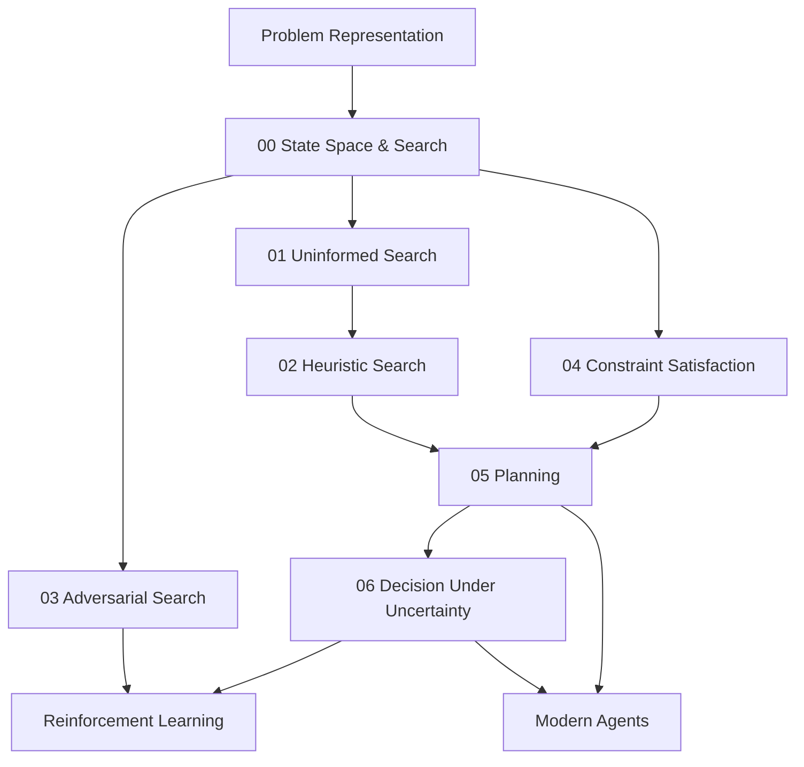

# Search, Reasoning and Planning Foundations

Folder này xây phần **classical problem solving** của Artificial Intelligence. Nó trả lời câu hỏi: khi một agent có state, actions và goal, làm thế nào khám phá possibilities, dùng knowledge để giảm search, xử lý opponent/constraints, lập plan và cuối cùng ra quyết định khi outcome không chắc chắn?

Các ideas ở đây không bị Machine Learning thay thế. Modern AI thường dùng learned model để cung cấp heuristic, policy, value hoặc proposal, còn search/planning vẫn xử lý combinatorial structure và execution constraints.

## Chapters

1. [State Space and Search](./00_state_space_and_search.md) — state, action, transition, frontier, completeness, optimality và combinatorial explosion.
2. [Uninformed Search](./01_uninformed_search.md) — BFS, DFS, DLS, IDDFS, Uniform-Cost Search và bidirectional search.
3. [Heuristic Search](./02_heuristic_search.md) — Greedy Best-First, A*, admissibility, consistency, learned heuristics và memory-bounded variants.
4. [Adversarial Search and Games](./03_adversarial_search_and_games.md) — minimax, alpha–beta, evaluation, MCTS và neural-guided game search.
5. [Constraint Satisfaction](./04_constraint_satisfaction.md) — variables/domains/constraints, propagation, backtracking, SAT/CP và hybrid LLM + solver patterns.
6. [Planning](./05_planning.md) — action preconditions/effects, STRIPS/PDDL, partial-order/HTN/temporal planning, validation, execution và replanning.
7. [Decision Making Under Uncertainty](./06_decision_making_under_uncertainty.md) — expected utility, MDP/POMDP, Bellman equations, bandits, value of information và risk.

## Dependency map



## Một mental model chung

```text
Representation
    ↓
State + Actions + Goal
    ↓
Search possibilities
    ↓
Use heuristics / constraints / opponent model
    ↓
Construct plan or policy
    ↓
Act
    ↓
Observe outcome
    ↓
Update / replan
```

### Search

Search quyết định **candidate nào được explore tiếp**.

### Constraint reasoning

Constraints loại bỏ **candidate không thể hợp lệ** trước hoặc trong search.

### Planning

Planning dùng semantics của actions để tìm **sequence/dependency** đạt goal.

### Decision theory

Decision theory thêm probabilities và consequences để chọn action khi future uncertain.

### Learning

Machine Learning có thể học heuristic, transition model, value hoặc policy từ data, nhưng không thay đổi bản chất các problem structures ở trên.

## Connection với Modern AI

Các connection quan trọng sẽ được reuse sau:

```text
A* heuristic              ↔ learned value / cost-to-go
Minimax / MCTS            ↔ neural policy + value + test-time search
CSP/SAT                    ↔ structured validation / solver-backed AI
Planning preconditions     ↔ tool/API action requirements
Execution monitoring       ↔ agent state + retries + replanning
MDP value function         ↔ Reinforcement Learning
Belief state / POMDP       ↔ agents with incomplete observations
Bandit exploration         ↔ recommendation / online learning
```

Đặc biệt, khi tới `10_agents_and_ai_systems/`, library sẽ không định nghĩa Agent từ đầu bằng buzzwords. Nó sẽ reuse state, action, environment, planning, uncertainty và execution concepts đã xây tại đây.