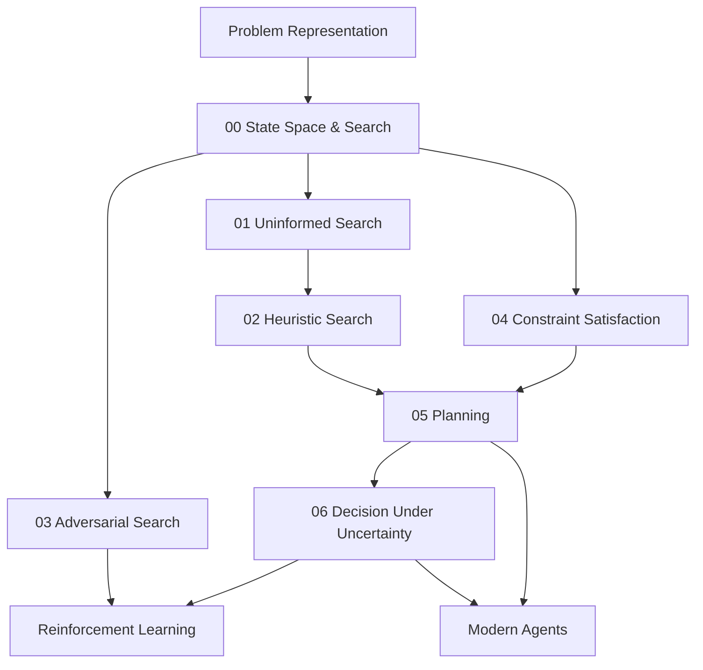

# Tìm kiếm (search / 검색), lập luận (reasoning / 추론) and Planning Foundations

> **Mạch đọc:** Đọc **tìm kiếm (search / 검색), lập luận (reasoning / 추론) and Planning Foundations** như một mắt xích của lộ trình học (learning path / 학습 경로) hiện tại, không như một ghi chú tách rời. Nội dung đi từ **Chapters** sang **phụ thuộc (dependency / 의존성) map**; điểm nối này chuẩn bị câu hỏi cho các mục sau thay vì dừng ở định nghĩa đầu tiên.


Folder này xây phần **classical bài toán (problem / 문제) solving** của Artificial Intelligence. Nó trả lời câu hỏi: khi một tác nhân (agent / 에이전트) có trạng thái (state / 상태), actions và goal, làm thế nào khám phá possibilities, dùng kiến thức (knowledge / 지식) để giảm tìm kiếm (search / 검색), xử lý opponent/các ràng buộc (constraints / 제약조건들), lập plan và cuối cùng ra quyết định khi kết quả (outcome / 결과) không chắc chắn?

Các ideas ở đây không bị Machine học tập (learning / 학습) thay thế. hiện đại (modern / 현대적) AI thường dùng learned mô hình (model / 모델) để cung cấp heuristic, chính sách (policy / 정책), giá trị (value / 값) hoặc proposal, còn tìm kiếm (search / 검색)/planning vẫn xử lý combinatorial cấu trúc (structure / 구조) và thực thi (execution / 실행) các ràng buộc (constraints / 제약조건들).

## Chapters

1. [State Space and Search](./00_state_space_and_search.md) — trạng thái (state / 상태), hành động (action / 동작), chuyển tiếp (transition / 전이), frontier, completeness, optimality và combinatorial explosion.
2. [Uninformed Search](./01_uninformed_search.md) — BFS, DFS, DLS, IDDFS, Uniform-Cost tìm kiếm (search / 검색) và bidirectional tìm kiếm (search / 검색).
3. [Heuristic Search](./02_heuristic_search.md) — Greedy Best-First, A*, admissibility, consistency, learned heuristics và memory-bounded variants.
4. [Adversarial Search and Games](./03_adversarial_search_and_games.md) — minimax, alpha–beta, evaluation, MCTS và neural-guided game tìm kiếm (search / 검색).
5. [Constraint Satisfaction](./04_constraint_satisfaction.md) — variables/domains/các ràng buộc (constraints / 제약조건들), propagation, backtracking, SAT/CP và hybrid LLM + solver patterns.
6. [Planning](./05_planning.md) — hành động (action / 동작) preconditions/effects, STRIPS/PDDL, partial-order/HTN/temporal planning, kiểm tra hợp lệ (validation / 검증), thực thi (execution / 실행) và replanning.
7. [Decision Making Under Uncertainty](./06_decision_making_under_uncertainty.md) — expected utility, MDP/POMDP, Bellman equations, bandits, giá trị (value / 값) of thông tin (information / 정보) và rủi ro (risk / 위험).


> **Chuyển mạch:** Từ **Chapters**, ta sang **phụ thuộc (dependency / 의존성) map** để mở rộng cùng câu hỏi và dùng kết quả đó để khép lại mạch giải thích.

## Phụ thuộc (dependency / 의존성) map

Sơ đồ hoặc danh sách này mô tả thứ tự phụ thuộc của các khái niệm. Hãy đọc theo mũi tên để biết phần nào là prerequisite, phần nào là ứng dụng và khi nào cần quay lại nền tảng.


```mermaid
flowchart TD
    F[Problem Representation] --> S[00 State Space & Search]
    S --> U[01 Uninformed Search]
    U --> H[02 Heuristic Search]
    S --> G[03 Adversarial Search]
    S --> C[04 Constraint Satisfaction]
    H --> P[05 Planning]
    C --> P
    P --> D[06 Decision Under Uncertainty]
    G --> RL[Reinforcement Learning]
    D --> RL
    D --> AG[Modern Agents]
    P --> AG
```


> **Chuyển mạch:** Từ **phụ thuộc (dependency / 의존성) map**, ta sang **Một mô hình tư duy (mental model / 사고 모델) chung** để mở rộng cùng câu hỏi và dùng kết quả đó để khép lại mạch giải thích.

## Một mô hình tư duy (mental model / 사고 모델) chung

Phần này chốt mental model thành một chuỗi có thể dùng lại: bối cảnh → cơ chế → quan sát → giới hạn → quyết định. Hãy đọc sơ đồ như công cụ suy luận, không như một khẩu hiệu tách khỏi chapter.

```text
Representation
    ↓
State + Actions + Goal
    ↓
Search possibilities
    ↓
Use heuristics / constraints / opponent model
    ↓
Construct plan or policy
    ↓
Act
    ↓
Observe outcome
    ↓
Update / replan
```

### Tìm kiếm (search / 검색)

Tìm kiếm (search / 검색) quyết định **candidate nào được explore tiếp**.

### Ràng buộc (constraint / 제약조건) lập luận (reasoning / 추론)

Các ràng buộc (constraints / 제약조건들) loại bỏ **candidate không thể hợp lệ** trước hoặc trong tìm kiếm (search / 검색).

### Planning

Planning dùng ngữ nghĩa (semantics / 의미론) của actions để tìm **chuỗi (sequence / 시퀀스)/phụ thuộc (dependency / 의존성)** đạt goal.

### Quyết định (decision / 결정) lý thuyết (theory / 이론)

Quyết định (decision / 결정) lý thuyết (theory / 이론) thêm probabilities và consequences để chọn hành động (action / 동작) khi future uncertain.

### Học tập (learning / 학습)

Machine học tập (learning / 학습) có thể học heuristic, chuyển tiếp (transition / 전이) mô hình (model / 모델), giá trị (value / 값) hoặc chính sách (policy / 정책) từ dữ liệu (data / 데이터), nhưng không thay đổi bản chất các bài toán (problem / 문제) structures ở trên.


> **Chuyển mạch:** Từ **Một mô hình tư duy (mental model / 사고 모델) chung**, ta sang **liên kết (connection / 연결) với hiện đại (modern / 현대적) AI** để mở rộng cùng câu hỏi và dùng kết quả đó để khép lại mạch giải thích.

## Liên kết (connection / 연결) với hiện đại (modern / 현대적) AI

Các liên kết (connection / 연결) quan trọng sẽ được reuse sau:

```text
A* heuristic              ↔ learned value / cost-to-go
Minimax / MCTS            ↔ neural policy + value + test-time search
CSP/SAT                    ↔ structured validation / solver-backed AI
Planning preconditions     ↔ tool/API action requirements
Execution monitoring       ↔ agent state + retries + replanning
MDP value function         ↔ Reinforcement Learning
Belief state / POMDP       ↔ agents with incomplete observations
Bandit exploration         ↔ recommendation / online learning
```

Đặc biệt, khi tới `10_agents_and_ai_systems/`, library sẽ không định nghĩa Agent từ đầu bằng buzzwords. Nó sẽ reuse state, action, environment, planning, uncertainty và execution concepts đã xây tại đây.
