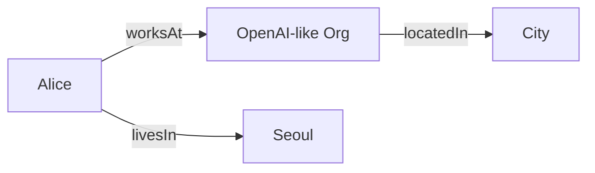

# Knowledge Representation trong Artificial Intelligence

Một AI system không thể reasoning về điều mà nó không biểu diễn được. **Knowledge Representation (KR / 지식 표현 / biểu diễn tri thức)** nghiên cứu cách encode facts, entities, relations, rules, categories, events và uncertainty thành structures mà machine có thể query và infer.

Nếu Machine Learning hỏi “pattern nào có thể học từ data?”, Knowledge Representation hỏi một câu khác nhưng complementary:

> Ta cần mô tả thế giới bằng những symbols/structures nào để facts và relationships có thể được thao tác một cách có nghĩa?

KR là foundation của expert systems, logic reasoning, ontologies, knowledge graphs, semantic web, rule engines và nhiều hybrid AI systems. Trong modern LLM era, KR quay lại qua Knowledge Graphs, structured tools, schemas, retrieval metadata và neuro-symbolic approaches.

Xem trước: [Problem Representation](../00_foundations/03_problem_representation.md).

## Data, information và knowledge

Ba từ này thường bị dùng lẫn.

```text
Data        → raw observations / recorded values
Information → data interpreted in context
Knowledge   → structured statements/relations that support reasoning/action
```

Ví dụ:

```text
"37.8"                       → data
"body temperature = 37.8°C"  → information
"fever threshold depends on context" → domain knowledge/rule
```

Boundary không tuyệt đối, nhưng distinction giúp thấy KR không chỉ là lưu rows trong database. Mục tiêu là represent **semantics và relationships** đủ để inference.

## Symbol và referent

A symbol như `Seoul`, `Person123`, `ParentOf` là token trong system. Nó **refers** tới entity/relation theo interpretation.

Machine thao tác symbols theo rules; meaning đến từ mapping giữa symbols và domain.

Đây là **symbol grounding problem**: làm thế nào internal symbols/representations connect với actual world/perception?

A database ID `customer_42` không tự chứa meaning ngoài conventions và linked data.

## Facts

Fact có thể represented như predicate:

\[
LivesIn(Alice, Seoul)
\]

hoặc triple:

```text
Alice --livesIn--> Seoul
```

Fact representation cần xác định:

- entity identity;
- relation type;
- time/context;
- provenance/source;
- certainty khi relevant.

`LivesIn(Alice, Seoul)` có thể đúng năm 2025 nhưng sai năm 2030. Knowledge without temporal scope dễ become stale.

## Relations

Relation có arity.

Unary predicate:

\[
Human(Alice)
\]

Binary:

\[
Parent(Alice,Bob)
\]

Ternary:

\[
Transferred(Alice,100,AccountB)
\]

Higher-arity relation thường khó represent bằng simple graph edge; knowledge graphs có thể use reification/event nodes để attach amount/time/provenance.

## Categories và hierarchy

Taxonomy:

```text
Animal
 └── Mammal
      └── Dog
```

If:

\[
Dog(x)\rightarrow Mammal(x)
\]

and:

\[
Mammal(x)\rightarrow Animal(x)
\]

then:

\[
Dog(x)\rightarrow Animal(x)
\]

Inheritance giúp avoid duplicate facts.

But real categories không luôn strict hierarchy: a person can be Employee, Student và Parent simultaneously. Ontology often forms graph, not simple tree.

## Instance vs class

`Dog` is class/category.

`Fido` is instance.

```text
Fido rdf:type Dog
Dog  subClassOf Mammal
```

Confusing instance/class causes modeling errors.

For example `Vietnam` is instance of `Country`, not subclass of Country.

## Ontology

**Ontology (온톨로지)** explicitly specifies concepts, relations, constraints và sometimes axioms of a domain.

It answers questions like:

```text
What types of things exist?
How are types related?
What properties can entities have?
What constraints apply?
```

Healthcare ontology may define Disease, Symptom, Medication, AnatomicalStructure and relations.

Ontology is not merely taxonomy; it can encode richer semantics.

## Schema vs ontology

Database schema defines structural constraints for stored data: tables, columns, types, keys.

Ontology aims at domain semantics and inferable relationships.

Overlap exists. Modern data systems may use schemas with semantic constraints, and knowledge graphs may have lightweight schemas.

Useful distinction:

```text
schema   → how data is structurally organized
ontology → what concepts/relations mean in domain
```

## Open-world vs closed-world assumptions

**Closed World Assumption (CWA)**:

> If fact is not known true, treat it as false.

Relational databases often operationally behave this way in query contexts.

**Open World Assumption (OWA)**:

> If fact is not known true, it may be unknown rather than false.

Semantic Web/knowledge bases often need OWA because data incomplete.

Example:

```text
Knowledge base does not contain HasChild(Alice, ...)
```

Under CWA → infer Alice has no child.

Under OWA → only know no child fact is recorded.

This difference changes inference fundamentally.

## Negation: false vs unknown

Three states may matter:

```text
true
false
unknown
```

A SQL `NULL` is not identical to logical unknown in every semantic sense, but it illustrates why binary true/false may be insufficient.

Medical knowledge often needs “not tested” distinct from “test negative”.

## Rules

Rule example:

\[
Human(x)\rightarrow Mortal(x)
\]

Facts:

\[
Human(Socrates)
\]

Inference yields:

\[
Mortal(Socrates)
\]

Rule systems separate declarative knowledge from inference engine.

This allows changing facts/rules without rewriting procedural control logic.

## Declarative vs procedural knowledge

**Declarative knowledge** states what is true:

```text
Parent(Alice,Bob)
```

**Procedural knowledge** states how to do something:

```text
function verify_parent_record(...)
```

AI systems often need both.

Planning action models are procedural-ish transition knowledge expressed declaratively via preconditions/effects.

## Semantic networks

Early KR used graph-like semantic networks where nodes entities/concepts and edges relations.

Modern Knowledge Graphs are descendants in spirit, though implementations/data models differ.

Graph representation is intuitive for relations:



Graph structure enables multi-hop query/inference.

## Frames

Frame represents stereotyped entity/situation with slots.

```text
Frame: Person
  name
  birthDate
  nationality
  employer
```

Frames resemble objects/records but can include defaults/inheritance.

Object-oriented classes and schema-based representations share conceptual similarities, though goals differ.

## Scripts

Scripts encode typical event sequence, e.g. restaurant:

```text
enter
sit
order
eat
pay
leave
```

They were used in early AI/NLP to represent common event structures.

Modern models learn event patterns statistically, but explicit workflows/scripts still useful in business process automation and agent orchestration.

## Logic-based representation

Propositional Logic represents atomic statements and Boolean combinations.

First-Order Logic adds variables, predicates and quantifiers.

Logic gives precise semantics and proof theory, enabling correctness guarantees.

Limitations include brittleness under noisy/incomplete data and computational complexity.

See [Propositional Logic](./01_propositional_logic.md) and [First-Order Logic](./02_first_order_logic.md).

## Probabilistic representation

Real knowledge often uncertain:

```text
P(Disease | Symptoms)=0.7
```

Bayesian Networks represent conditional dependencies graphically.

Probabilistic logic and graphical models combine relational/causal-like structure with uncertainty.

See [Probabilistic Reasoning](./04_probabilistic_reasoning.md).

## Distributed representation

Neural networks represent concepts as patterns across many dimensions rather than explicit symbols.

Embedding:

\[
entity\rightarrow\mathbf{v}\in\mathbb{R}^d
\]

Advantages:

- similarity/generalization;
- robust statistical learning;
- scalable representation.

Weakness:

- semantics not explicit;
- hard constraints difficult;
- exact logical inference not guaranteed;
- interpretability limited.

## Symbolic vs distributed representation

Symbolic:

```text
Paris --capitalOf--> France
```

Distributed:

```text
Paris → [0.12, -0.44, ...]
France → [...]
```

Symbolic representation excels exact relation/query. Distributed representation excels similarity and learning from data.

Modern AI often benefits from both.

## Knowledge Graph

A Knowledge Graph represents entities and typed relations, often as triples:

\[
(subject, predicate, object)
\]

Example:

```text
(Seoul, capitalOf, SouthKorea)
```

But production KG also needs schema, IDs, provenance, temporal validity and entity resolution.

See [Knowledge Graphs](./06_knowledge_graphs.md).

## Entity resolution

Same real entity can appear under different names:

```text
"OpenAI"
"Open AI"
"OpenAI, Inc."
```

Entity resolution decides whether records refer same entity.

Without it, KG fragments facts. Incorrect merging is equally dangerous.

This is connection KR ↔ Data Engineering ↔ ML.

## Provenance

Knowledge should answer:

```text
Where did this fact come from?
When was it observed?
How trustworthy is source?
Was it inferred or directly asserted?
```

A bare fact without provenance is hard to audit/update.

RAG systems similarly need citation/source metadata, showing old KR concerns reappear in modern AI.

## Temporal knowledge

Facts can change:

```text
CEO(company, Alice, validFrom=2025, validTo=2027)
```

Temporal KR distinguishes event time, transaction time and validity intervals.

Without time, historical facts can conflict with current facts.

## Default reasoning

Rule:

```text
Bird(x) → normally Flies(x)
```

Exception:

```text
Penguin(x) → not Flies(x)
```

Classical monotonic logic struggles with defaults/exceptions if modeled naively.

**Non-monotonic reasoning** allows conclusions to be withdrawn when new information arrives.

This is closer to commonsense reasoning.

## Monotonicity

In monotonic logic, adding premises never invalidates previously derived conclusions.

Real-world knowledge often non-monotonic:

```text
Assume meeting tomorrow at 10
new email says cancelled
→ previous conclusion withdrawn
```

Rule engines need conflict resolution/default semantics to handle updates.

## Commonsense knowledge

Humans rely on enormous background assumptions:

```text
objects persist
people cannot be in two distant places simultaneously
containers hold things
events have causes/effects
```

Explicitly encoding all commonsense is difficult. Projects like Cyc attempted large-scale symbolic commonsense KB.

LLMs absorb much commonsense statistically, but can violate hard consistency because knowledge is not explicit proof database.

## Knowledge base vs database

Database primarily stores/retrieves explicit records.

Knowledge base often supports inference from explicit + rule/ontology knowledge.

Example:

```text
DB stores:
Alice type Doctor
Doctor subclass MedicalProfessional

KB reasoner can answer:
Alice type MedicalProfessional
```

Real products blur line: SQL views, constraints and recursive queries also perform derived computation.

## Query answering

KR usefulness measured by questions it supports.

Examples:

```text
Who works at company X?
Which medications interact with drug Y?
What entities connect A to B within 3 hops?
Does policy rule permit action Z?
```

Representation should be designed from intended query/inference workload, not aesthetic taxonomy alone.

## Knowledge compilation

Some representations are expressive but expensive to reason over. **Knowledge compilation** transforms knowledge into form allowing faster queries at cost of preprocessing/space.

This is analogous to database indexing and model compilation: pay upfront to answer many queries faster.

## Expressiveness vs tractability

More expressive logic can represent more relationships but inference may become undecidable/intractable.

KR design balances:

```text
expressiveness
correctness guarantees
inference complexity
maintainability
```

Description Logics intentionally restrict First-Order Logic to retain decidable reasoning; they underpin OWL ontology languages.

## Schema evolution

Knowledge model changes as domain changes.

If relation `employedBy` semantics change, old data/inferences may break.

Versioning ontology/schema is Software/Data Engineering problem. Knowledge is not static artifact.

## Knowledge freshness

LLM parameter knowledge frozen at training cutoff/update cycle. External KB can be updated independently.

This motivates Retrieval-Augmented Generation:

```text
parameterized statistical knowledge
        +
retrieved external knowledge
```

RAG does not automatically become symbolic reasoning, but it separates mutable factual source from model weights.

## KR trong RAG

Naive RAG chunks text and retrieves vectors.

Structured KR can enrich retrieval:

- entity metadata;
- relation filters;
- temporal constraints;
- graph traversal;
- provenance;
- ontology-aware query expansion.

GraphRAG-like approaches combine text chunks with entity/relation graph structures in various architectures.

## KR trong tool calling

Tool schema defines:

```text
function name
parameters
types
allowed values
semantics
```

This is a lightweight formal representation of action interface.

JSON Schema, OpenAPI and typed function signatures constrain model output and enable validation.

Thus Software Engineering schemas become part of AI knowledge/action representation.

## Mental Model

```text
Knowledge Representation = choose a language for what the system can state and reason about

Entity      → what things exist?
Relation    → how are things connected?
Rule        → what follows from what?
Ontology    → what concepts/types constrain domain?
Provenance  → why should we believe a fact?
Time        → when is it valid?
Uncertainty → how sure are we?
Inference   → what new statements can be derived?
```

## Common Misconceptions

### “Knowledge Representation = database design”

They overlap, but KR emphasizes semantics, inference, ontology and reasoning beyond structural storage.

### “Knowledge Graph automatically understands relationships”

Graph only stores encoded relations. Quality depends entity resolution, schema, provenance and inference/query logic.

### “LLM embeddings replace symbolic knowledge”

Embeddings excel similarity/generalization; explicit knowledge excels exact relation, update, provenance and constraints. They solve different needs.

### “More expressive representation always better”

Expressiveness can make inference expensive or undecidable. Practical KR chooses enough semantics for required tasks.

## Knowledge Connection

Knowledge Representation links Logic, Databases, Graphs, NLP and Modern RAG/Agents. It is the semantic counterpart of [Problem Representation](../00_foundations/03_problem_representation.md): not only how to encode state for computation, but how to encode claims about the world so they can be queried, verified and inferred.

Xem tiếp: [Propositional Logic](./01_propositional_logic.md) và [First-Order Logic](./02_first_order_logic.md).