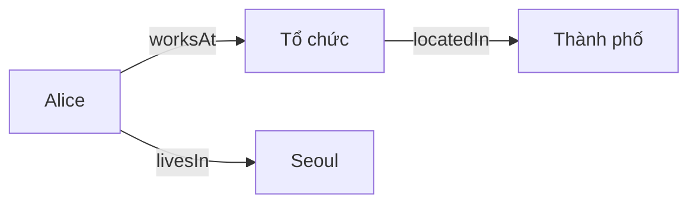

# Biểu diễn tri thức trong Trí tuệ nhân tạo

Một hệ thống AI không thể suy luận về điều mà nó không biểu diễn được. **Biểu diễn tri thức (Knowledge Representation - KR / 지식 표현)** nghiên cứu cách mã hóa sự kiện, thực thể, quan hệ, quy tắc, loại, sự kiện theo thời gian và mức bất định thành cấu trúc mà máy có thể truy vấn và suy luận.

Nếu Học máy hỏi “mẫu nào có thể học từ dữ liệu?”, Biểu diễn tri thức đặt một câu hỏi bổ sung:

> Ta cần mô tả thế giới bằng những ký hiệu và cấu trúc nào để các sự kiện và mối quan hệ có thể được thao tác một cách có nghĩa?

KR là nền tảng của hệ chuyên gia, suy luận logic, ontology, đồ thị tri thức, Semantic Web, bộ máy luật và nhiều hệ thống AI lai. Trong thời đại LLM, các ý tưởng KR quay lại qua Knowledge Graph, công cụ có cấu trúc, schema, metadata truy xuất và cách tiếp cận thần kinh-ký hiệu.

Xem trước: [Biểu diễn bài toán](../00_foundations/03_problem_representation.md).

## Dữ liệu, thông tin và tri thức

Ba khái niệm này thường bị dùng lẫn.

```text
Dữ liệu    → quan sát thô hoặc giá trị được ghi lại
Thông tin  → dữ liệu đã được diễn giải trong ngữ cảnh
Tri thức   → phát biểu và quan hệ có cấu trúc hỗ trợ suy luận/hành động
```

Ví dụ:

```text
"37.8"                         → dữ liệu
"nhiệt độ cơ thể = 37.8°C"    → thông tin
"ngưỡng sốt phụ thuộc ngữ cảnh" → tri thức miền / quy tắc
```

Ranh giới không tuyệt đối, nhưng sự phân biệt giúp thấy KR không chỉ là lưu các hàng trong cơ sở dữ liệu. Mục tiêu là biểu diễn **ngữ nghĩa và quan hệ** đủ để hệ thống suy luận.

## Ký hiệu và đối tượng được tham chiếu

Một **ký hiệu (symbol)** như `Seoul`, `Person123` hoặc `ParentOf` là token bên trong hệ thống. Nó tham chiếu tới thực thể hoặc quan hệ theo một cách diễn giải đã định.

Máy thao tác ký hiệu bằng quy tắc; ý nghĩa đến từ cách ký hiệu được gắn với miền thực tế.

Đây dẫn tới **bài toán gắn nghĩa ký hiệu (symbol grounding problem)**: làm thế nào ký hiệu hoặc biểu diễn nội bộ liên hệ với thế giới thật và nhận thức?

Một ID cơ sở dữ liệu như `customer_42` không tự chứa ý nghĩa ngoài quy ước và dữ liệu liên kết với nó.

## Sự kiện

Một sự kiện có thể được biểu diễn như vị từ:

\[
LivesIn(Alice, Seoul)
\]

hoặc bộ ba:

```text
Alice --livesIn--> Seoul
```

Biểu diễn sự kiện cần xác định khi phù hợp:

- danh tính thực thể;
- loại quan hệ;
- thời gian hoặc ngữ cảnh;
- nguồn gốc dữ liệu (provenance);
- mức chắc chắn.

`LivesIn(Alice, Seoul)` có thể đúng năm 2025 nhưng sai năm 2030. Tri thức không có phạm vi thời gian dễ trở nên lỗi thời.

## Quan hệ

Quan hệ có **bậc (arity)** khác nhau.

Vị từ một ngôi:

\[
Human(Alice)
\]

Hai ngôi:

\[
Parent(Alice,Bob)
\]

Ba ngôi:

\[
Transferred(Alice,100,AccountB)
\]

Quan hệ nhiều ngôi khó biểu diễn chỉ bằng một cạnh đồ thị đơn giản. Đồ thị tri thức có thể dùng nút sự kiện hoặc **tái vật hóa (reification)** để gắn thêm số tiền, thời gian và nguồn gốc.

## Loại và hệ phân cấp

Một taxonomy đơn giản:

```text
Động vật
 └── Động vật có vú
      └── Chó
```

Nếu:

\[
Dog(x)\rightarrow Mammal(x)
\]

và:

\[
Mammal(x)\rightarrow Animal(x)
\]

thì:

\[
Dog(x)\rightarrow Animal(x)
\]

Kế thừa giúp tránh lặp lại cùng sự kiện ở nhiều mức.

Tuy nhiên loại trong thế giới thật không luôn tạo thành cây nghiêm ngặt: một người có thể đồng thời là Nhân viên, Sinh viên và Cha/Mẹ. Ontology thường có cấu trúc đồ thị chứ không chỉ là cây.

## Thể hiện và lớp

`Dog` là một lớp hoặc loại.

`Fido` là một **thể hiện (instance)**.

```text
Fido rdf:type Dog
Dog  subClassOf Mammal
```

Nhầm lớp với thể hiện gây lỗi mô hình hóa.

Ví dụ `Vietnam` là một thể hiện của `Country`, không phải lớp con của `Country`.

## Ontology

**Ontology (온톨로지)** mô tả tường minh các khái niệm, quan hệ, ràng buộc và đôi khi cả tiên đề của một miền.

Nó trả lời các câu hỏi như:

```text
Miền này có những loại đối tượng nào?
Các loại liên hệ với nhau ra sao?
Thực thể có thể có những thuộc tính gì?
Ràng buộc nào phải được tuân thủ?
```

Ontology y tế có thể định nghĩa Bệnh, Triệu chứng, Thuốc, Cấu trúc giải phẫu và các quan hệ giữa chúng.

Ontology không chỉ là taxonomy; nó có thể mã hóa ngữ nghĩa phong phú hơn nhiều.

## Schema và ontology

**Schema cơ sở dữ liệu** xác định cấu trúc dữ liệu được lưu: bảng, cột, kiểu dữ liệu và khóa.

Ontology nhấn mạnh ngữ nghĩa miền và các quan hệ có thể suy ra.

Hai khái niệm có vùng chồng lấn. Hệ thống dữ liệu hiện đại có thể dùng schema giàu ràng buộc ngữ nghĩa, còn Knowledge Graph có thể chỉ dùng schema nhẹ.

Một cách phân biệt hữu ích:

```text
schema   → dữ liệu được tổ chức về cấu trúc như thế nào
ontology → khái niệm và quan hệ mang nghĩa gì trong miền
```

## Giả định thế giới đóng và thế giới mở

**Giả định thế giới đóng (Closed World Assumption - CWA)**:

> Nếu một sự kiện không được biết là đúng, hãy xem nó là sai.

Cơ sở dữ liệu quan hệ thường vận hành gần cách này trong nhiều ngữ cảnh truy vấn.

**Giả định thế giới mở (Open World Assumption - OWA)**:

> Nếu một sự kiện không được biết là đúng, nó có thể chỉ là chưa biết chứ không nhất thiết sai.

Semantic Web và cơ sở tri thức thường cần OWA vì dữ liệu không bao giờ hoàn chỉnh.

Ví dụ:

```text
Cơ sở tri thức không chứa HasChild(Alice, ...)
```

Theo CWA → suy ra Alice không có con.

Theo OWA → chỉ biết rằng chưa có thông tin về con của Alice.

Sự khác biệt này làm thay đổi cơ chế suy luận một cách nền tảng.

## Phủ định: sai và chưa biết là khác nhau

Trong nhiều miền cần ít nhất ba trạng thái:

```text
đúng
sai
chưa biết
```

`NULL` trong SQL không hoàn toàn đồng nhất với “chưa biết” của logic ở mọi khía cạnh, nhưng nó cho thấy vì sao chỉ dùng đúng/sai đôi khi không đủ.

Trong y tế, “chưa xét nghiệm” phải được phân biệt với “xét nghiệm âm tính”.

## Quy tắc

Ví dụ quy tắc:

\[
Human(x)\rightarrow Mortal(x)
\]

Sự kiện:

\[
Human(Socrates)
\]

Suy luận được:

\[
Mortal(Socrates)
\]

Hệ thống luật tách tri thức khai báo khỏi bộ máy suy luận.

Nhờ đó ta có thể thay sự kiện hoặc quy tắc mà không phải viết lại toàn bộ luồng điều khiển thủ tục.

## Tri thức khai báo và tri thức thủ tục

**Tri thức khai báo (declarative knowledge)** mô tả điều gì là đúng:

```text
Parent(Alice,Bob)
```

**Tri thức thủ tục (procedural knowledge)** mô tả cách thực hiện điều gì đó:

```text
function verify_parent_record(...)
```

Hệ thống AI thường cần cả hai.

Mô hình hành động trong lập kế hoạch có tính thủ tục, nhưng được biểu diễn khai báo bằng điều kiện trước và hiệu ứng.

## Mạng ngữ nghĩa

KR đời đầu sử dụng **mạng ngữ nghĩa (semantic network)**, nơi nút là thực thể hoặc khái niệm và cạnh là quan hệ.

Đồ thị tri thức hiện đại có thể xem là hậu duệ về mặt ý tưởng, dù mô hình dữ liệu và cách triển khai khác nhau.



Cấu trúc đồ thị cho phép truy vấn và suy luận nhiều bước.

## Khung (frame)

**Khung (frame)** biểu diễn một thực thể hoặc tình huống điển hình bằng các ô thuộc tính.

```text
Khung: Person
  name
  birthDate
  nationality
  employer
```

Frame giống đối tượng hoặc bản ghi nhưng có thể chứa giá trị mặc định và kế thừa.

Lớp trong lập trình hướng đối tượng và biểu diễn dựa trên schema có nhiều nét tương đồng về khái niệm, dù mục tiêu sử dụng khác nhau.

## Kịch bản (script)

**Kịch bản (script)** mã hóa chuỗi sự kiện thường gặp, ví dụ trong nhà hàng:

```text
đi vào
ngồi
gọi món
ăn
thanh toán
rời đi
```

AI và NLP đời đầu dùng script để biểu diễn cấu trúc sự kiện quen thuộc.

Mô hình hiện đại có thể học mẫu sự kiện theo thống kê, nhưng workflow và script tường minh vẫn rất hữu ích trong tự động hóa nghiệp vụ và điều phối tác nhân.

## Biểu diễn dựa trên logic

**Logic mệnh đề (Propositional Logic)** biểu diễn các phát biểu nguyên tử và tổ hợp Boolean.

**Logic vị từ bậc nhất (First-Order Logic - FOL)** bổ sung biến, vị từ và lượng từ.

Logic có ngữ nghĩa và quy tắc chứng minh chính xác, nhờ đó có thể cung cấp bảo đảm về tính đúng.

Hạn chế là dễ cứng nhắc khi dữ liệu nhiễu hoặc không đầy đủ và có thể có độ phức tạp suy luận cao.

Xem [Logic mệnh đề](./01_propositional_logic.md) và [Logic vị từ bậc nhất](./02_first_order_logic.md).

## Biểu diễn xác suất

Tri thức ngoài thực tế thường bất định:

```text
P(Disease | Symptoms)=0.7
```

**Mạng Bayes (Bayesian Network)** biểu diễn các phụ thuộc có điều kiện bằng đồ thị.

Logic xác suất và mô hình đồ thị kết hợp cấu trúc quan hệ với bất định.

Xem [Suy luận xác suất](./04_probabilistic_reasoning.md).

## Biểu diễn phân tán

Mạng nơ-ron biểu diễn khái niệm bằng mẫu phân tán trên nhiều chiều thay vì ký hiệu tường minh.

Embedding:

\[
entity\rightarrow\mathbf{v}\in\mathbb{R}^d
\]

Ưu điểm:

- đo tương đồng và khái quát hóa;
- học thống kê bền vững;
- mở rộng tốt ở quy mô lớn.

Hạn chế:

- ngữ nghĩa không tường minh;
- khó bảo đảm ràng buộc cứng;
- suy luận logic chính xác không được bảo đảm;
- khả năng diễn giải hạn chế.

## Biểu diễn ký hiệu và biểu diễn phân tán

Ký hiệu:

```text
Paris --capitalOf--> France
```

Phân tán:

```text
Paris → [0.12, -0.44, ...]
France → [...]
```

Biểu diễn ký hiệu mạnh ở quan hệ chính xác, truy vấn và cập nhật. Biểu diễn phân tán mạnh ở tương đồng và học từ dữ liệu.

AI hiện đại thường hưởng lợi khi kết hợp cả hai.

## Đồ thị tri thức

**Đồ thị tri thức (Knowledge Graph - KG)** biểu diễn thực thể và quan hệ có kiểu, thường dưới dạng bộ ba:

\[
(subject, predicate, object)
\]

Ví dụ:

```text
(Seoul, capitalOf, SouthKorea)
```

Nhưng KG production còn cần schema, ID ổn định, nguồn gốc, hiệu lực theo thời gian và giải quyết đồng nhất thực thể.

Xem [Đồ thị tri thức](./06_knowledge_graphs.md).

## Giải quyết đồng nhất thực thể

Cùng một thực thể ngoài đời có thể xuất hiện dưới nhiều tên:

```text
"OpenAI"
"Open AI"
"OpenAI, Inc."
```

**Giải quyết thực thể (entity resolution)** xác định các bản ghi có thực sự nói về cùng một thực thể hay không.

Nếu không làm tốt, KG bị phân mảnh sự kiện. Nếu gộp nhầm, tri thức cũng bị sai.

Đây là điểm giao giữa Biểu diễn tri thức, Kỹ nghệ dữ liệu và Học máy.

## Nguồn gốc tri thức

Tri thức đáng tin cần trả lời được:

```text
Sự kiện này đến từ đâu?
Được quan sát khi nào?
Nguồn đáng tin tới mức nào?
Được khẳng định trực tiếp hay suy ra?
```

Một sự kiện không có **nguồn gốc (provenance)** rất khó kiểm toán và cập nhật.

RAG cũng cần metadata nguồn và trích dẫn, cho thấy các vấn đề cổ điển của KR quay lại trong hệ thống AI hiện đại.

## Tri thức theo thời gian

Sự kiện có thể thay đổi:

```text
CEO(company, Alice, validFrom=2025, validTo=2027)
```

Biểu diễn tri thức thời gian cần phân biệt thời điểm sự kiện xảy ra, thời điểm dữ liệu được ghi và khoảng hiệu lực.

Nếu không có thông tin thời gian, sự kiện lịch sử có thể xung đột với sự kiện hiện tại.

## Suy luận mặc định

Quy tắc mặc định:

```text
Bird(x) → thông_thường Flies(x)
```

Ngoại lệ:

```text
Penguin(x) → not Flies(x)
```

Logic đơn điệu cổ điển khó xử lý mặc định và ngoại lệ nếu mô hình hóa ngây thơ.

**Suy luận không đơn điệu (non-monotonic reasoning)** cho phép rút lại kết luận khi có thông tin mới.

Điều này gần với suy luận đời thường hơn.

## Tính đơn điệu

Trong logic đơn điệu, thêm tiền đề không làm mất các kết luận đã suy ra.

Tri thức thế giới thực thường không như vậy:

```text
Giả định cuộc họp diễn ra ngày mai lúc 10 giờ
email mới báo cuộc họp bị hủy
→ kết luận trước phải được rút lại
```

Bộ máy luật cần cơ chế xử lý xung đột và mặc định để hỗ trợ cập nhật kiểu này.

## Tri thức thường thức

Con người dựa vào lượng lớn giả định nền:

```text
vật thể tồn tại liên tục
một người không thể cùng lúc ở hai nơi rất xa nhau
vật chứa có thể chứa vật khác
sự kiện có nguyên nhân và hậu quả
```

Mã hóa tường minh toàn bộ tri thức thường thức là rất khó. Các dự án như Cyc từng cố xây cơ sở tri thức thường thức quy mô lớn bằng ký hiệu.

LLM hấp thụ nhiều quy luật thường thức theo thống kê, nhưng vẫn có thể vi phạm tính nhất quán cứng vì tri thức trong tham số không phải một cơ sở chứng minh tường minh.

## Cơ sở tri thức và cơ sở dữ liệu

Cơ sở dữ liệu chủ yếu lưu và truy xuất bản ghi tường minh.

**Cơ sở tri thức (knowledge base)** thường còn hỗ trợ suy luận từ sự kiện, quy tắc và ontology.

Ví dụ:

```text
CSDL lưu:
Alice type Doctor
Doctor subclass MedicalProfessional

Bộ suy luận có thể trả lời:
Alice type MedicalProfessional
```

Trong sản phẩm thực tế, ranh giới có thể mờ vì SQL view, constraint và truy vấn đệ quy cũng tạo dữ liệu dẫn xuất.

## Trả lời truy vấn

Giá trị của một biểu diễn tri thức phụ thuộc vào loại câu hỏi mà nó hỗ trợ.

Ví dụ:

```text
Ai làm việc tại công ty X?
Thuốc nào tương tác với thuốc Y?
Thực thể nào nối A với B trong tối đa 3 bước?
Quy tắc chính sách có cho phép hành động Z không?
```

Biểu diễn nên được thiết kế từ nhu cầu truy vấn và suy luận thật, không chỉ vì taxonomy “đẹp”.

## Biên dịch tri thức

Một số biểu diễn rất giàu sức biểu đạt nhưng suy luận chậm. **Biên dịch tri thức (knowledge compilation)** chuyển tri thức sang dạng cho phép trả lời truy vấn nhanh hơn, đổi lại phải trả chi phí tiền xử lý và bộ nhớ.

Điều này tương tự lập chỉ mục cơ sở dữ liệu hoặc biên dịch mô hình: trả chi phí trước để trả lời nhiều truy vấn về sau nhanh hơn.

## Sức biểu đạt và khả năng tính toán

Logic càng giàu sức biểu đạt càng có thể mô tả nhiều quan hệ, nhưng suy luận có thể trở nên quá đắt hoặc thậm chí không quyết định được.

Thiết kế KR phải cân bằng:

```text
sức biểu đạt
bảo đảm tính đúng
độ phức tạp suy luận
khả năng bảo trì
```

**Logic mô tả (Description Logic)** cố ý hạn chế Logic vị từ bậc nhất để giữ khả năng suy luận quyết định được; đây là nền của các ngôn ngữ ontology như OWL.

## Tiến hóa schema

Mô hình tri thức thay đổi khi miền nghiệp vụ thay đổi.

Nếu ngữ nghĩa quan hệ `employedBy` đổi, dữ liệu cũ và các kết luận suy ra có thể bị ảnh hưởng.

Versioning ontology và schema là bài toán Kỹ nghệ phần mềm và Kỹ nghệ dữ liệu. Tri thức không phải artifact bất biến.

## Độ mới của tri thức

Tri thức trong tham số LLM bị đóng băng theo chu kỳ huấn luyện hoặc cập nhật. Cơ sở tri thức bên ngoài có thể được cập nhật độc lập.

Đây là một động lực cho **Sinh tăng cường bằng truy xuất (Retrieval-Augmented Generation - RAG)**:

```text
tri thức thống kê trong tham số
        +
tri thức bên ngoài được truy xuất
```

RAG không tự động trở thành suy luận ký hiệu, nhưng nó tách nguồn sự kiện có thể thay đổi khỏi trọng số mô hình.

## KR trong RAG

RAG đơn giản chia tài liệu thành đoạn và truy xuất embedding.

KR có cấu trúc có thể làm truy xuất giàu hơn bằng:

- metadata thực thể;
- bộ lọc quan hệ;
- ràng buộc thời gian;
- duyệt đồ thị;
- nguồn gốc;
- mở rộng truy vấn dựa trên ontology.

Các kiến trúc GraphRAG kết hợp đoạn văn với cấu trúc thực thể và quan hệ theo nhiều cách khác nhau.

## KR trong gọi công cụ

Schema công cụ mô tả:

```text
tên hàm
tham số
kiểu dữ liệu
giá trị hợp lệ
ngữ nghĩa
```

Đây là một dạng biểu diễn hình thức nhẹ của giao diện hành động.

JSON Schema, OpenAPI và chữ ký hàm có kiểu ràng buộc đầu ra mô hình và cho phép kiểm tra hợp lệ.

Vì vậy schema của Kỹ nghệ phần mềm cũng trở thành một phần của biểu diễn tri thức và hành động trong AI.

## Mô hình tư duy (mental model)

```text
Biểu diễn tri thức = chọn ngôn ngữ để hệ thống có thể phát biểu và suy luận

Thực thể     → có những đối tượng nào?
Quan hệ      → các đối tượng liên hệ ra sao?
Quy tắc      → điều gì suy ra từ điều gì?
Ontology     → khái niệm/loại nào ràng buộc miền?
Nguồn gốc    → vì sao nên tin một sự kiện?
Thời gian    → sự kiện đúng trong khoảng nào?
Bất định     → chắc chắn tới mức nào?
Suy luận     → có thể dẫn xuất thêm phát biểu nào?
```

## Các hiểu lầm thường gặp

### “Biểu diễn tri thức = thiết kế cơ sở dữ liệu”

Hai lĩnh vực có vùng chồng lấn, nhưng KR nhấn mạnh ngữ nghĩa, ontology và suy luận ngoài cấu trúc lưu trữ.

### “Knowledge Graph tự hiểu các mối quan hệ”

Đồ thị chỉ lưu những quan hệ đã được mã hóa. Chất lượng phụ thuộc giải quyết thực thể, schema, nguồn gốc và logic truy vấn/suy luận.

### “Embedding của LLM thay thế tri thức ký hiệu”

Embedding mạnh ở tương đồng và khái quát hóa; tri thức tường minh mạnh ở quan hệ chính xác, cập nhật, nguồn gốc và ràng buộc. Hai dạng giải quyết nhu cầu khác nhau.

### “Biểu diễn càng giàu sức biểu đạt càng tốt”

Sức biểu đạt cao có thể khiến suy luận đắt hoặc không quyết định được. KR thực tế chọn vừa đủ ngữ nghĩa cho nhiệm vụ cần thiết.

## Liên kết kiến thức

Biểu diễn tri thức nối Logic, Cơ sở dữ liệu, Đồ thị, NLP và RAG/Tác nhân hiện đại. Đây là phần đối ứng về ngữ nghĩa của [Biểu diễn bài toán](../00_foundations/03_problem_representation.md): không chỉ mã hóa trạng thái để tính toán, mà còn mã hóa các phát biểu về thế giới để có thể truy vấn, xác minh và suy luận.

Xem tiếp: [Logic mệnh đề](./01_propositional_logic.md) và [Logic vị từ bậc nhất](./02_first_order_logic.md).