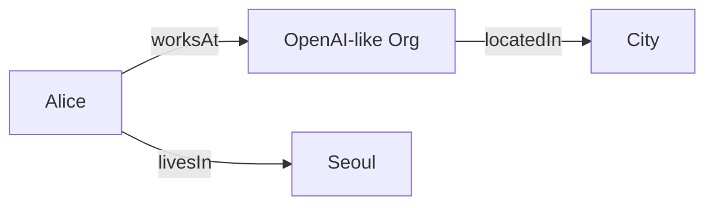

# Kiến thức (knowledge / 지식) biểu diễn (representation / 표현) trong Artificial Intelligence

> **Mạch đọc:** [README](./README.md) là bản đồ owner của **Knowledge representation trong AI**. Route đi từ data/information/knowledge → symbols/referents → ontologies/rules → logical/probabilistic representations → inference interface, để biểu diễn được đánh giá theo suy luận nó cho phép.

Một AI hệ thống (system / 시스템) không thể lập luận (reasoning / 추론) về điều mà nó không biểu diễn được. **kiến thức (knowledge / 지식) biểu diễn (representation / 표현)** nghiên cứu cách encode facts, entities, relations, rules, categories, events và bất định (uncertainty / 불확실성) thành structures mà machine có thể truy vấn (query / 쿼리) và infer.

Nếu Machine học tập (learning / 학습) hỏi “mẫu (pattern / 패턴) nào có thể học từ dữ liệu (data / 데이터)?”, kiến thức (knowledge / 지식) biểu diễn (representation / 표현) hỏi một câu khác nhưng complementary:

> Ta cần mô tả thế giới bằng những symbols/structures nào để facts và relationships có thể được thao tác một cách có nghĩa?

KR là foundation của expert các hệ thống (systems / 시스템들), lô-gic (logic / 논리) lập luận (reasoning / 추론), ontologies, kiến thức (knowledge / 지식) graphs, ngữ nghĩa (semantic / 의미적) web, quy tắc (rule / 규칙) engines và nhiều hybrid AI các hệ thống (systems / 시스템들). Trong hiện đại (modern / 현대적) LLM era, KR quay lại qua kiến thức (knowledge / 지식) Graphs, structured tools, schemas, retrieval siêu dữ liệu (metadata / 메타데이터) và neuro-symbolic approaches.

Xem trước: [Problem Representation](../00_foundations/03_problem_representation.md).

## Dữ liệu (data / 데이터), thông tin (information / 정보) và kiến thức (knowledge / 지식)

Ba từ này thường bị dùng lẫn.

```text
Data        → raw observations / recorded values
Information → data interpreted in context
Knowledge   → structured statements/relations that support reasoning/action
```

Ví dụ:

```text
"37.8"                       → data
"body temperature = 37.8°C"  → information
"fever threshold depends on context" → domain knowledge/rule
```

Ranh giới (boundary / 경계) không tuyệt đối, nhưng distinction giúp thấy KR không chỉ là lưu rows trong cơ sở dữ liệu (database / 데이터베이스). Mục tiêu là represent **ngữ nghĩa (semantics / 의미론) và relationships** đủ để suy luận (inference / 추론).

> **Chuyển mạch:** Trong **Kiến thức (knowledge / 지식) biểu diễn (representation / 표현) trong Artificial Intelligence**, **Dữ liệu (data / 데이터), thông tin (information / 정보) và kiến thức (knowledge / 지식)** nêu điều cần giải thích; **Symbol và referent** đối chiếu nó với bằng chứng hoặc nguồn kiểm chứng. Từ đây, **Facts** sẽ cho biết hệ quả hoặc giới hạn ấy hiện ra ở đâu.

## Symbol và referent

A symbol như `Seoul`, `Person123`, `ParentOf` là đơn vị từ (token / 토큰) trong hệ thống (system / 시스템). Nó **refers** tới thực thể (entity / 엔터티)/quan hệ (relation / 관계) theo interpretation.

Machine thao tác symbols theo rules; meaning đến từ ánh xạ (mapping / 매핑) giữa symbols và lĩnh vực (domain / 도메인).

Đây là **symbol grounding bài toán (problem / 문제)**: làm thế nào nội bộ (internal / 내부) symbols/representations connect với actual world/perception?

A cơ sở dữ liệu (database / 데이터베이스) ID `customer_42` không tự chứa meaning ngoài conventions và linked dữ liệu (data / 데이터).

> **Chuyển mạch:** Ở chặng này của **Kiến thức (knowledge / 지식) biểu diễn (representation / 표현) trong Artificial Intelligence**, **Facts** tiếp nhận điểm tựa từ **Symbol và referent** nhưng đổi góc nhìn sang câu hỏi của chính nó; đọc liền hai mục để thấy mối quan hệ đó. Từ đây, **Relations** sẽ cho biết hệ quả hoặc giới hạn ấy hiện ra ở đâu.

## Facts

Fact có thể represented như predicate:

\[
LivesIn(Alice, Seoul)
\]

hoặc triple:

```text
Alice --livesIn--> Seoul
```

Fact biểu diễn (representation / 표현) cần xác định:

- thực thể (entity / 엔터티) định danh (identity / 식별자);
- quan hệ (relation / 관계) kiểu (type / 타입);
- thời gian (time / 시간)/ngữ cảnh (context / 맥락);
- provenance/nguồn (source / 소스);
- certainty khi relevant.

`LivesIn(Alice, Seoul)` có thể đúng năm 2025 nhưng sai năm 2030. kiến thức (knowledge / 지식) without temporal phạm vi (scope / 범위) dễ become stale.

> **Chuyển mạch:** Đặt trong câu hỏi lớn của **Kiến thức (knowledge / 지식) biểu diễn (representation / 표현) trong Artificial Intelligence**, **Relations** tiếp nhận điểm tựa từ **Facts** nhưng đổi góc nhìn sang câu hỏi của chính nó; đọc liền hai mục để thấy mối quan hệ đó. Từ đây, **Categories và hierarchy** sẽ cho biết hệ quả hoặc giới hạn ấy hiện ra ở đâu.

## Relations

Quan hệ (relation / 관계) có arity.

Unary predicate:

\[
Human(Alice)
\]

Nhị phân (binary / 이진):

\[
Parent(Alice,Bob)
\]

Ternary:

\[
Transferred(Alice,100,AccountB)
\]

Higher-arity quan hệ (relation / 관계) thường khó represent bằng simple đồ thị (graph / 그래프) edge; kiến thức (knowledge / 지식) graphs có thể use reification/sự kiện (event / 이벤트) nodes để attach amount/thời gian (time / 시간)/provenance.

> **Chuyển mạch:** Trong **Kiến thức (knowledge / 지식) biểu diễn (representation / 표현) trong Artificial Intelligence**, **Categories và hierarchy** tiếp nhận điểm tựa từ **Relations** nhưng đổi góc nhìn sang câu hỏi của chính nó; đọc liền hai mục để thấy mối quan hệ đó. Từ đây, **Instance vs lớp (class / 클래스)** sẽ cho biết hệ quả hoặc giới hạn ấy hiện ra ở đâu.

## Categories và hierarchy

Taxonomy:

```text
Animal
 └── Mammal
      └── Dog
```

If:

\[
Dog(x)\rightarrow Mammal(x)
\]

and:

\[
Mammal(x)\rightarrow Animal(x)
\]

then:

\[
Dog(x)\rightarrow Animal(x)
\]

Inheritance giúp avoid duplicate facts.

But real categories không luôn strict hierarchy: a person can be Employee, Student và Parent simultaneously. Ontology often forms đồ thị (graph / 그래프), not simple cây (tree / 트리).

> **Chuyển mạch:** Ở chặng này của **Kiến thức (knowledge / 지식) biểu diễn (representation / 표현) trong Artificial Intelligence**, **Instance vs lớp (class / 클래스)** tiếp nhận điểm tựa từ **Categories và hierarchy** nhưng đổi góc nhìn sang câu hỏi của chính nó; đọc liền hai mục để thấy mối quan hệ đó. Từ đây, **Ontology** sẽ cho biết hệ quả hoặc giới hạn ấy hiện ra ở đâu.

## Instance vs lớp (class / 클래스)

`Dog` is lớp (class / 클래스)/category.

`Fido` is instance.

```text
Fido rdf:type Dog
Dog  subClassOf Mammal
```

Confusing instance/lớp (class / 클래스) causes modeling errors.

For example `Vietnam` is instance of `Country`, not subclass of Country.

> **Chuyển mạch:** Đặt trong câu hỏi lớn của **Kiến thức (knowledge / 지식) biểu diễn (representation / 표현) trong Artificial Intelligence**, **Ontology** tiếp nhận điểm tựa từ **Instance vs lớp (class / 클래스)** nhưng đổi góc nhìn sang câu hỏi của chính nó; đọc liền hai mục để thấy mối quan hệ đó. Từ đây, **Lược đồ (schema / 스키마) vs ontology** sẽ cho biết hệ quả hoặc giới hạn ấy hiện ra ở đâu.

## Ontology

**Ontology (온톨로지)** explicitly specifies concepts, relations, các ràng buộc (constraints / 제약조건들) và sometimes axioms of a lĩnh vực (domain / 도메인).

It answers questions like:

```text
What types of things exist?
How are types related?
What properties can entities have?
What constraints apply?
```

Healthcare ontology may define Disease, Symptom, Medication, AnatomicalStructure and relations.

Ontology is not merely taxonomy; it can encode richer ngữ nghĩa (semantics / 의미론).

> **Chuyển mạch:** Trong **Kiến thức (knowledge / 지식) biểu diễn (representation / 표현) trong Artificial Intelligence**, **Lược đồ (schema / 스키마) vs ontology** tiếp nhận điểm tựa từ **Ontology** nhưng đổi góc nhìn sang câu hỏi của chính nó; đọc liền hai mục để thấy mối quan hệ đó. Từ đây, **Open-world vs closed-world các giả định (assumptions / 가정들)** sẽ cho biết hệ quả hoặc giới hạn ấy hiện ra ở đâu.

## Lược đồ (schema / 스키마) vs ontology

Cơ sở dữ liệu (database / 데이터베이스) lược đồ (schema / 스키마) defines structural các ràng buộc (constraints / 제약조건들) for stored dữ liệu (data / 데이터): tables, columns, types, keys.

Ontology aims at lĩnh vực (domain / 도메인) ngữ nghĩa (semantics / 의미론) and inferable relationships.

Overlap exists. hiện đại (modern / 현대적) dữ liệu (data / 데이터) các hệ thống (systems / 시스템들) may use schemas with ngữ nghĩa (semantic / 의미적) các ràng buộc (constraints / 제약조건들), and kiến thức (knowledge / 지식) graphs may have lightweight schemas.

Useful distinction:

```text
schema   → how data is structurally organized
ontology → what concepts/relations mean in domain
```

> **Chuyển mạch:** Ở chặng này của **Kiến thức (knowledge / 지식) biểu diễn (representation / 표현) trong Artificial Intelligence**, **Open-world vs closed-world các giả định (assumptions / 가정들)** tiếp nhận điểm tựa từ **Lược đồ (schema / 스키마) vs ontology** nhưng đổi góc nhìn sang câu hỏi của chính nó; đọc liền hai mục để thấy mối quan hệ đó. Từ đây, **Negation: false vs unknown** sẽ cho biết hệ quả hoặc giới hạn ấy hiện ra ở đâu.

## Open-world vs closed-world các giả định (assumptions / 가정들)

**Closed World giả định (assumption / 가정) (CWA)**:

> If fact is not known true, treat it as false.

Relational databases often operationally behave this way in truy vấn (query / 쿼리) contexts.

**Open World giả định (assumption / 가정) (OWA)**:

> If fact is not known true, it may be unknown rather than false.

Ngữ nghĩa (semantic / 의미적) Web/kiến thức (knowledge / 지식) bases often need OWA because dữ liệu (data / 데이터) incomplete.

Example:

```text
Knowledge base does not contain HasChild(Alice, ...)
```

Under CWA → infer Alice has no child.

Under OWA → only know no child fact is recorded.

This difference changes suy luận (inference / 추론) fundamentally.

> **Chuyển mạch:** Đặt trong câu hỏi lớn của **Kiến thức (knowledge / 지식) biểu diễn (representation / 표현) trong Artificial Intelligence**, **Negation: false vs unknown** tiếp nhận điểm tựa từ **Open-world vs closed-world các giả định (assumptions / 가정들)** nhưng đổi góc nhìn sang câu hỏi của chính nó; đọc liền hai mục để thấy mối quan hệ đó. Từ đây, **Rules** sẽ cho biết hệ quả hoặc giới hạn ấy hiện ra ở đâu.

## Negation: false vs unknown

Three states may matter:

```text
true
false
unknown
```

A SQL `NULL` is not identical to logical unknown in every ngữ nghĩa (semantic / 의미적) sense, but it illustrates why nhị phân (binary / 이진) true/false may be insufficient.

Medical kiến thức (knowledge / 지식) often needs “not tested” distinct from “kiểm thử (test / 테스트) negative”.

> **Chuyển mạch:** Trong **Kiến thức (knowledge / 지식) biểu diễn (representation / 표현) trong Artificial Intelligence**, **Rules** tiếp nhận điểm tựa từ **Negation: false vs unknown** nhưng đổi góc nhìn sang câu hỏi của chính nó; đọc liền hai mục để thấy mối quan hệ đó. Từ đây, **Declarative vs procedural kiến thức (knowledge / 지식)** sẽ cho biết hệ quả hoặc giới hạn ấy hiện ra ở đâu.

## Rules

Quy tắc (rule / 규칙) example:

\[
Human(x)\rightarrow Mortal(x)
\]

Facts:

\[
Human(Socrates)
\]

Suy luận (inference / 추론) yields:

\[
Mortal(Socrates)
\]

Quy tắc (rule / 규칙) các hệ thống (systems / 시스템들) separate declarative kiến thức (knowledge / 지식) from bộ máy suy luận (inference engine / 추론 엔진).

This allows changing facts/rules without rewriting procedural điều khiển (control / 제어) lô-gic (logic / 논리).

> **Chuyển mạch:** Ở chặng này của **Kiến thức (knowledge / 지식) biểu diễn (representation / 표현) trong Artificial Intelligence**, **Declarative vs procedural kiến thức (knowledge / 지식)** tiếp nhận điểm tựa từ **Rules** nhưng đổi góc nhìn sang câu hỏi của chính nó; đọc liền hai mục để thấy mối quan hệ đó. Từ đây, **Ngữ nghĩa (semantic / 의미적) networks** sẽ cho biết hệ quả hoặc giới hạn ấy hiện ra ở đâu.

## Declarative vs procedural kiến thức (knowledge / 지식)

**Declarative kiến thức (knowledge / 지식)** states what is true:

```text
Parent(Alice,Bob)
```

**Procedural kiến thức (knowledge / 지식)** states how to do something:

```text
function verify_parent_record(...)
```

AI các hệ thống (systems / 시스템들) often need both.

Planning hành động (action / 동작) các mô hình (models / 모델들) are procedural-ish chuyển tiếp (transition / 전이) kiến thức (knowledge / 지식) expressed declaratively via preconditions/effects.

> **Chuyển mạch:** Đặt trong câu hỏi lớn của **Kiến thức (knowledge / 지식) biểu diễn (representation / 표현) trong Artificial Intelligence**, **Ngữ nghĩa (semantic / 의미적) networks** tiếp nhận điểm tựa từ **Declarative vs procedural kiến thức (knowledge / 지식)** nhưng đổi góc nhìn sang câu hỏi của chính nó; đọc liền hai mục để thấy mối quan hệ đó. Từ đây, **Frames** sẽ cho biết hệ quả hoặc giới hạn ấy hiện ra ở đâu.

## Ngữ nghĩa (semantic / 의미적) networks

Early KR used graph-like ngữ nghĩa (semantic / 의미적) networks where nodes entities/concepts and edges relations.

Hiện đại (modern / 현대적) kiến thức (knowledge / 지식) Graphs are descendants in spirit, though implementations/dữ liệu (data / 데이터) các mô hình (models / 모델들) differ.

Đồ thị (graph / 그래프) biểu diễn (representation / 표현) is intuitive for relations:


```mermaid
flowchart LR
    A[Alice] -->|worksAt| O[OpenAI-like Org]
    A -->|livesIn| S[Seoul]
    O -->|locatedIn| C[City]
```

Đồ thị (graph / 그래프) cấu trúc (structure / 구조) enables multi-hop truy vấn (query / 쿼리)/suy luận (inference / 추론).

> **Chuyển mạch:** Trong **Kiến thức (knowledge / 지식) biểu diễn (representation / 표현) trong Artificial Intelligence**, **Frames** tiếp nhận điểm tựa từ **Ngữ nghĩa (semantic / 의미적) networks** nhưng đổi góc nhìn sang câu hỏi của chính nó; đọc liền hai mục để thấy mối quan hệ đó. Từ đây, **Scripts** sẽ cho biết hệ quả hoặc giới hạn ấy hiện ra ở đâu.

## Frames

Frame represents stereotyped thực thể (entity / 엔터티)/situation with slots.

```text
Frame: Person
  name
  birthDate
  nationality
  employer
```

Frames resemble objects/records but can include defaults/inheritance.

Object-oriented classes and schema-based representations share conceptual similarities, though goals differ.

> **Chuyển mạch:** Ở chặng này của **Kiến thức (knowledge / 지식) biểu diễn (representation / 표현) trong Artificial Intelligence**, **Scripts** tiếp nhận điểm tựa từ **Frames** nhưng đổi góc nhìn sang câu hỏi của chính nó; đọc liền hai mục để thấy mối quan hệ đó. Từ đây, **Logic-based biểu diễn (representation / 표현)** sẽ cho biết hệ quả hoặc giới hạn ấy hiện ra ở đâu.

## Scripts

Scripts encode typical sự kiện (event / 이벤트) chuỗi (sequence / 시퀀스), e.g. restaurant:

```text
enter
sit
order
eat
pay
leave
```

They were used in early AI/NLP to represent dùng chung (common / 공통) sự kiện (event / 이벤트) structures.

Hiện đại (modern / 현대적) các mô hình (models / 모델들) learn sự kiện (event / 이벤트) patterns statistically, but tường minh (explicit / 명시적) workflows/scripts still useful in nghiệp vụ (business / 비즈니스) tiến trình (process / 프로세스) automation and tác nhân (agent / 에이전트) orchestration.

> **Chuyển mạch:** Đặt trong câu hỏi lớn của **Kiến thức (knowledge / 지식) biểu diễn (representation / 표현) trong Artificial Intelligence**, **Logic-based biểu diễn (representation / 표현)** tiếp nhận điểm tựa từ **Scripts** nhưng đổi góc nhìn sang câu hỏi của chính nó; đọc liền hai mục để thấy mối quan hệ đó. Từ đây, **Probabilistic biểu diễn (representation / 표현)** sẽ cho biết hệ quả hoặc giới hạn ấy hiện ra ở đâu.

## Logic-based biểu diễn (representation / 표현)

Propositional lô-gic (logic / 논리) represents atomic statements and Boolean combinations.

First-Order lô-gic (logic / 논리) adds variables, predicates and quantifiers.

Lô-gic (logic / 논리) gives precise ngữ nghĩa (semantics / 의미론) and proof lý thuyết (theory / 이론), enabling tính đúng đắn (correctness / 정확성) guarantees.

Limitations include brittleness under noisy/incomplete dữ liệu (data / 데이터) and computational độ phức tạp (complexity / 복잡도).

See [Propositional Logic](./01_propositional_logic.md) and [First-Order Logic](./02_first_order_logic.md).

> **Chuyển mạch:** Trong **Kiến thức (knowledge / 지식) biểu diễn (representation / 표현) trong Artificial Intelligence**, **Probabilistic biểu diễn (representation / 표현)** tiếp nhận điểm tựa từ **Logic-based biểu diễn (representation / 표현)** nhưng đổi góc nhìn sang câu hỏi của chính nó; đọc liền hai mục để thấy mối quan hệ đó. Từ đây, **Phân tán (distributed / 분산) biểu diễn (representation / 표현)** sẽ cho biết hệ quả hoặc giới hạn ấy hiện ra ở đâu.

## Probabilistic biểu diễn (representation / 표현)

Real kiến thức (knowledge / 지식) often uncertain:

```text
P(Disease | Symptoms)=0.7
```

Bayesian Networks represent conditional dependencies graphically.

Probabilistic lô-gic (logic / 논리) and graphical các mô hình (models / 모델들) combine relational/causal-like cấu trúc (structure / 구조) with bất định (uncertainty / 불확실성).

See [Probabilistic Reasoning](./04_probabilistic_reasoning.md).

> **Chuyển mạch:** Ở chặng này của **Kiến thức (knowledge / 지식) biểu diễn (representation / 표현) trong Artificial Intelligence**, **Phân tán (distributed / 분산) biểu diễn (representation / 표현)** tiếp nhận điểm tựa từ **Probabilistic biểu diễn (representation / 표현)** nhưng đổi góc nhìn sang câu hỏi của chính nó; đọc liền hai mục để thấy mối quan hệ đó. Từ đây, **Symbolic vs phân tán (distributed / 분산) biểu diễn (representation / 표현)** sẽ cho biết hệ quả hoặc giới hạn ấy hiện ra ở đâu.

## Phân tán (distributed / 분산) biểu diễn (representation / 표현)

Neural networks represent concepts as patterns across many dimensions rather than tường minh (explicit / 명시적) symbols.

Embedding:

\[
thực thể (entity / 엔터티)\rightarrow\mathbf{v}\in\mathbb{R}^d
\]

Advantages:

- similarity/generalization;
- robust statistical học tập (learning / 학습);
- scalable biểu diễn (representation / 표현).

Weakness:

- ngữ nghĩa (semantics / 의미론) not tường minh (explicit / 명시적);
- hard các ràng buộc (constraints / 제약조건들) difficult;
- chính xác (exact / 정확한) logical suy luận (inference / 추론) not guaranteed;
- interpretability limited.

> **Chuyển mạch:** Đặt trong câu hỏi lớn của **Kiến thức (knowledge / 지식) biểu diễn (representation / 표현) trong Artificial Intelligence**, **Symbolic vs phân tán (distributed / 분산) biểu diễn (representation / 표현)** tiếp nhận điểm tựa từ **Phân tán (distributed / 분산) biểu diễn (representation / 표현)** nhưng đổi góc nhìn sang câu hỏi của chính nó; đọc liền hai mục để thấy mối quan hệ đó. Từ đây, **Kiến thức (knowledge / 지식) đồ thị (graph / 그래프)** sẽ cho biết hệ quả hoặc giới hạn ấy hiện ra ở đâu.

## Symbolic vs phân tán (distributed / 분산) biểu diễn (representation / 표현)

Symbolic:

```text
Paris --capitalOf--> France
```

Phân tán (distributed / 분산):

```text
Paris → [0.12, -0.44, ...]
France → [...]
```

Symbolic biểu diễn (representation / 표현) excels chính xác (exact / 정확한) quan hệ (relation / 관계)/truy vấn (query / 쿼리). phân tán (distributed / 분산) biểu diễn (representation / 표현) excels similarity and học tập (learning / 학습) from dữ liệu (data / 데이터).

Hiện đại (modern / 현대적) AI often benefits from both.

> **Chuyển mạch:** Trong **Kiến thức (knowledge / 지식) biểu diễn (representation / 표현) trong Artificial Intelligence**, **Kiến thức (knowledge / 지식) đồ thị (graph / 그래프)** tiếp nhận điểm tựa từ **Symbolic vs phân tán (distributed / 분산) biểu diễn (representation / 표현)** nhưng đổi góc nhìn sang câu hỏi của chính nó; đọc liền hai mục để thấy mối quan hệ đó. Từ đây, **Thực thể (entity / 엔터티) resolution** sẽ cho biết hệ quả hoặc giới hạn ấy hiện ra ở đâu.

## Kiến thức (knowledge / 지식) đồ thị (graph / 그래프)

A kiến thức (knowledge / 지식) đồ thị (graph / 그래프) represents entities and typed relations, often as triples:

\[
(subject, predicate, object)
\]

Example:

```text
(Seoul, capitalOf, SouthKorea)
```

But môi trường vận hành (production / 운영 환경) KG also needs lược đồ (schema / 스키마), IDs, provenance, temporal validity and thực thể (entity / 엔터티) resolution.

See [Knowledge Graphs](./06_knowledge_graphs.md).

> **Chuyển mạch:** Ở chặng này của **Kiến thức (knowledge / 지식) biểu diễn (representation / 표현) trong Artificial Intelligence**, **Thực thể (entity / 엔터티) resolution** tiếp nhận điểm tựa từ **Kiến thức (knowledge / 지식) đồ thị (graph / 그래프)** nhưng đổi góc nhìn sang câu hỏi của chính nó; đọc liền hai mục để thấy mối quan hệ đó. Từ đây, **Provenance** sẽ cho biết hệ quả hoặc giới hạn ấy hiện ra ở đâu.

## Thực thể (entity / 엔터티) resolution

Same real thực thể (entity / 엔터티) can appear under different names:

```text
"OpenAI"
"Open AI"
"OpenAI, Inc."
```

Thực thể (entity / 엔터티) resolution decides whether records refer same thực thể (entity / 엔터티).

Without it, KG fragments facts. Incorrect merging is equally dangerous.

This is liên kết (connection / 연결) KR ↔ kỹ thuật dữ liệu (data engineering / 데이터 엔지니어링) ↔ ML.

> **Chuyển mạch:** Đặt trong câu hỏi lớn của **Kiến thức (knowledge / 지식) biểu diễn (representation / 표현) trong Artificial Intelligence**, **Provenance** tiếp nhận điểm tựa từ **Thực thể (entity / 엔터티) resolution** nhưng đổi góc nhìn sang câu hỏi của chính nó; đọc liền hai mục để thấy mối quan hệ đó. Từ đây, **Temporal kiến thức (knowledge / 지식)** sẽ cho biết hệ quả hoặc giới hạn ấy hiện ra ở đâu.

## Provenance

Kiến thức (knowledge / 지식) should answer:

```text
Where did this fact come from?
When was it observed?
How trustworthy is source?
Was it inferred or directly asserted?
```

A bare fact without provenance is hard to kiểm tra (audit / 감사)/cập nhật (update / 업데이트).

RAG các hệ thống (systems / 시스템들) similarly need citation/nguồn (source / 소스) siêu dữ liệu (metadata / 메타데이터), showing old KR concerns reappear in hiện đại (modern / 현대적) AI.

> **Chuyển mạch:** Trong **Kiến thức (knowledge / 지식) biểu diễn (representation / 표현) trong Artificial Intelligence**, **Temporal kiến thức (knowledge / 지식)** tiếp nhận điểm tựa từ **Provenance** nhưng đổi góc nhìn sang câu hỏi của chính nó; đọc liền hai mục để thấy mối quan hệ đó. Từ đây, **Default lập luận (reasoning / 추론)** sẽ cho biết hệ quả hoặc giới hạn ấy hiện ra ở đâu.

## Temporal kiến thức (knowledge / 지식)

Facts can thay đổi (change / 변경):

```text
CEO(company, Alice, validFrom=2025, validTo=2027)
```

Temporal KR distinguishes sự kiện (event / 이벤트) thời gian (time / 시간), giao dịch (transaction / 트랜잭션) thời gian (time / 시간) and validity intervals.

Without thời gian (time / 시간), historical facts can xung đột (conflict / 충돌) with hiện tại (current / 현재) facts.

> **Chuyển mạch:** Ở chặng này của **Kiến thức (knowledge / 지식) biểu diễn (representation / 표현) trong Artificial Intelligence**, **Default lập luận (reasoning / 추론)** tiếp nhận điểm tựa từ **Temporal kiến thức (knowledge / 지식)** nhưng đổi góc nhìn sang câu hỏi của chính nó; đọc liền hai mục để thấy mối quan hệ đó. Từ đây, **Monotonicity** sẽ cho biết hệ quả hoặc giới hạn ấy hiện ra ở đâu.

## Default lập luận (reasoning / 추론)

Quy tắc (rule / 규칙):

```text
Bird(x) → normally Flies(x)
```

Exception:

```text
Penguin(x) → not Flies(x)
```

Classical monotonic lô-gic (logic / 논리) struggles with defaults/exceptions if modeled naively.

**Non-monotonic lập luận (reasoning / 추론)** allows conclusions to be withdrawn when new thông tin (information / 정보) arrives.

This is closer to commonsense lập luận (reasoning / 추론).

> **Chuyển mạch:** Đặt trong câu hỏi lớn của **Kiến thức (knowledge / 지식) biểu diễn (representation / 표현) trong Artificial Intelligence**, **Monotonicity** tiếp nhận điểm tựa từ **Default lập luận (reasoning / 추론)** nhưng đổi góc nhìn sang câu hỏi của chính nó; đọc liền hai mục để thấy mối quan hệ đó. Từ đây, **Commonsense kiến thức (knowledge / 지식)** sẽ cho biết hệ quả hoặc giới hạn ấy hiện ra ở đâu.

## Monotonicity

In monotonic lô-gic (logic / 논리), adding premises never invalidates previously derived conclusions.

Real-world kiến thức (knowledge / 지식) often non-monotonic:

```text
Assume meeting tomorrow at 10
new email says cancelled
→ previous conclusion withdrawn
```

Quy tắc (rule / 규칙) engines need giải quyết xung đột (conflict resolution / 충돌 해결)/default ngữ nghĩa (semantics / 의미론) to handle updates.

> **Chuyển mạch:** Trong **Kiến thức (knowledge / 지식) biểu diễn (representation / 표현) trong Artificial Intelligence**, **Commonsense kiến thức (knowledge / 지식)** tiếp nhận điểm tựa từ **Monotonicity** nhưng đổi góc nhìn sang câu hỏi của chính nó; đọc liền hai mục để thấy mối quan hệ đó. Từ đây, **Kiến thức (knowledge / 지식) cơ sở (base / 기반) vs cơ sở dữ liệu (database / 데이터베이스)** sẽ cho biết hệ quả hoặc giới hạn ấy hiện ra ở đâu.

## Commonsense kiến thức (knowledge / 지식)

Humans rely on enormous background các giả định (assumptions / 가정들):

```text
objects persist
people cannot be in two distant places simultaneously
containers hold things
events have causes/effects
```

Explicitly encoding all commonsense is difficult. Projects like Cyc attempted large-scale symbolic commonsense KB.

LLMs absorb much commonsense statistically, but can violate hard consistency because kiến thức (knowledge / 지식) is not tường minh (explicit / 명시적) proof cơ sở dữ liệu (database / 데이터베이스).

> **Chuyển mạch:** Ở chặng này của **Kiến thức (knowledge / 지식) biểu diễn (representation / 표현) trong Artificial Intelligence**, **Commonsense kiến thức (knowledge / 지식)** nêu điều cần giải thích; **Kiến thức (knowledge / 지식) cơ sở (base / 기반) vs cơ sở dữ liệu (database / 데이터베이스)** đối chiếu nó với bằng chứng hoặc nguồn kiểm chứng. Từ đây, **Truy vấn (query / 쿼리) answering** sẽ cho biết hệ quả hoặc giới hạn ấy hiện ra ở đâu.

## Kiến thức (knowledge / 지식) cơ sở (base / 기반) vs cơ sở dữ liệu (database / 데이터베이스)

Cơ sở dữ liệu (database / 데이터베이스) primarily stores/retrieves tường minh (explicit / 명시적) records.

Kiến thức (knowledge / 지식) cơ sở (base / 기반) often supports suy luận (inference / 추론) from tường minh (explicit / 명시적) + quy tắc (rule / 규칙)/ontology kiến thức (knowledge / 지식).

Example:

```text
DB stores:
Alice type Doctor
Doctor subclass MedicalProfessional

KB reasoner can answer:
Alice type MedicalProfessional
```

Real products blur line: SQL views, các ràng buộc (constraints / 제약조건들) and recursive queries also perform derived computation.

> **Chuyển mạch:** Đặt trong câu hỏi lớn của **Kiến thức (knowledge / 지식) biểu diễn (representation / 표현) trong Artificial Intelligence**, **Kiến thức (knowledge / 지식) cơ sở (base / 기반) vs cơ sở dữ liệu (database / 데이터베이스)** nêu điều cần giải thích; **Truy vấn (query / 쿼리) answering** đối chiếu nó với bằng chứng hoặc nguồn kiểm chứng. Từ đây, **Kiến thức (knowledge / 지식) compilation** sẽ cho biết hệ quả hoặc giới hạn ấy hiện ra ở đâu.

## Truy vấn (query / 쿼리) answering

KR usefulness measured by questions it supports.

Examples:

```text
Who works at company X?
Which medications interact with drug Y?
What entities connect A to B within 3 hops?
Does policy rule permit action Z?
```

Biểu diễn (representation / 표현) should be designed from intended truy vấn (query / 쿼리)/suy luận (inference / 추론) tải công việc (workload / 워크로드), not aesthetic taxonomy alone.

> **Chuyển mạch:** Trong **Kiến thức (knowledge / 지식) biểu diễn (representation / 표현) trong Artificial Intelligence**, **Kiến thức (knowledge / 지식) compilation** tiếp nhận điểm tựa từ **Truy vấn (query / 쿼리) answering** nhưng đổi góc nhìn sang câu hỏi của chính nó; đọc liền hai mục để thấy mối quan hệ đó. Từ đây, **Expressiveness vs tractability** sẽ cho biết hệ quả hoặc giới hạn ấy hiện ra ở đâu.

## Kiến thức (knowledge / 지식) compilation

Some representations are expressive but expensive to reason over. **kiến thức (knowledge / 지식) compilation** transforms kiến thức (knowledge / 지식) into form allowing faster queries at chi phí (cost / 비용) of preprocessing/không gian (space / 공간).

This is analogous to cơ sở dữ liệu (database / 데이터베이스) indexing and mô hình (model / 모델) compilation: pay upfront to answer many queries faster.

> **Chuyển mạch:** Ở chặng này của **Kiến thức (knowledge / 지식) biểu diễn (representation / 표현) trong Artificial Intelligence**, **Expressiveness vs tractability** tiếp nhận điểm tựa từ **Kiến thức (knowledge / 지식) compilation** nhưng đổi góc nhìn sang câu hỏi của chính nó; đọc liền hai mục để thấy mối quan hệ đó. Từ đây, **Lược đồ (schema / 스키마) evolution** sẽ cho biết hệ quả hoặc giới hạn ấy hiện ra ở đâu.

## Expressiveness vs tractability

More expressive lô-gic (logic / 논리) can represent more relationships but suy luận (inference / 추론) may become undecidable/intractable.

KR thiết kế (design / 설계) balances:

```text
expressiveness
correctness guarantees
inference complexity
maintainability
```

Description Logics intentionally restrict First-Order lô-gic (logic / 논리) to retain decidable lập luận (reasoning / 추론); they underpin OWL ontology languages.

> **Chuyển mạch:** Đặt trong câu hỏi lớn của **Kiến thức (knowledge / 지식) biểu diễn (representation / 표현) trong Artificial Intelligence**, **Lược đồ (schema / 스키마) evolution** tiếp nhận điểm tựa từ **Expressiveness vs tractability** nhưng đổi góc nhìn sang câu hỏi của chính nó; đọc liền hai mục để thấy mối quan hệ đó. Từ đây, **Kiến thức (knowledge / 지식) freshness** sẽ cho biết hệ quả hoặc giới hạn ấy hiện ra ở đâu.

## Lược đồ (schema / 스키마) evolution

Kiến thức (knowledge / 지식) mô hình (model / 모델) changes as lĩnh vực (domain / 도메인) changes.

If quan hệ (relation / 관계) `employedBy` ngữ nghĩa (semantics / 의미론) thay đổi (change / 변경), old dữ liệu (data / 데이터)/inferences may break.

Versioning ontology/lược đồ (schema / 스키마) is Software/kỹ thuật dữ liệu (data engineering / 데이터 엔지니어링) bài toán (problem / 문제). kiến thức (knowledge / 지식) is not static sản phẩm tạo ra (artifact / 산출물).

> **Chuyển mạch:** Trong **Kiến thức (knowledge / 지식) biểu diễn (representation / 표현) trong Artificial Intelligence**, **Kiến thức (knowledge / 지식) freshness** tiếp nhận điểm tựa từ **Lược đồ (schema / 스키마) evolution** nhưng đổi góc nhìn sang câu hỏi của chính nó; đọc liền hai mục để thấy mối quan hệ đó. Từ đây, **KR trong RAG** sẽ cho biết hệ quả hoặc giới hạn ấy hiện ra ở đâu.

## Kiến thức (knowledge / 지식) freshness

LLM parameter kiến thức (knowledge / 지식) frozen at huấn luyện (training / 학습) cutoff/cập nhật (update / 업데이트) cycle. bên ngoài (external / 외부) KB can be updated independently.

This motivates Retrieval-Augmented Generation:

```text
parameterized statistical knowledge
        +
retrieved external knowledge
```

RAG does not automatically become symbolic lập luận (reasoning / 추론), but it separates mutable factual nguồn (source / 소스) from mô hình (model / 모델) weights.

> **Chuyển mạch:** Ở chặng này của **Kiến thức (knowledge / 지식) biểu diễn (representation / 표현) trong Artificial Intelligence**, **KR trong RAG** tiếp nhận điểm tựa từ **Kiến thức (knowledge / 지식) freshness** nhưng đổi góc nhìn sang câu hỏi của chính nó; đọc liền hai mục để thấy mối quan hệ đó. Từ đây, **KR trong công cụ (tool / 도구) calling** sẽ cho biết hệ quả hoặc giới hạn ấy hiện ra ở đâu.

## KR trong RAG

Naive RAG chunks văn bản (text / 텍스트) and retrieves vectors.

Structured KR can enrich retrieval:

- thực thể (entity / 엔터티) siêu dữ liệu (metadata / 메타데이터);
- quan hệ (relation / 관계) filters;
- temporal các ràng buộc (constraints / 제약조건들);
- đồ thị (graph / 그래프) traversal;
- provenance;
- ontology-aware truy vấn (query / 쿼리) expansion.

GraphRAG-like approaches combine văn bản (text / 텍스트) chunks with thực thể (entity / 엔터티)/quan hệ (relation / 관계) đồ thị (graph / 그래프) structures in various architectures.

> **Chuyển mạch:** Đặt trong câu hỏi lớn của **Kiến thức (knowledge / 지식) biểu diễn (representation / 표현) trong Artificial Intelligence**, **KR trong công cụ (tool / 도구) calling** tiếp nhận điểm tựa từ **KR trong RAG** nhưng đổi góc nhìn sang câu hỏi của chính nó; đọc liền hai mục để thấy mối quan hệ đó. Từ đây, **Mô hình tư duy (mental model / 사고 모델)** sẽ cho biết hệ quả hoặc giới hạn ấy hiện ra ở đâu.

## KR trong công cụ (tool / 도구) calling

Công cụ (tool / 도구) lược đồ (schema / 스키마) defines:

```text
function name
parameters
types
allowed values
semantics
```

This is a lightweight formal biểu diễn (representation / 표현) of hành động (action / 동작) giao diện (interface / 인터페이스).

JSON lược đồ (schema / 스키마), OpenAPI and typed hàm (function / 함수) signatures constrain mô hình (model / 모델) đầu ra (output / 출력) and enable kiểm tra hợp lệ (validation / 검증).

Thus Kỹ nghệ phần mềm (software engineering / 소프트웨어 공학) schemas become part of AI kiến thức (knowledge / 지식)/hành động (action / 동작) biểu diễn (representation / 표현).

> **Chuyển mạch:** Trong **Kiến thức (knowledge / 지식) biểu diễn (representation / 표현) trong Artificial Intelligence**, **Mô hình tư duy (mental model / 사고 모델)** gom các mảnh từ **KR trong công cụ (tool / 도구) calling** thành một kết luận có thể mang sang phần kế tiếp. Từ đây, **Dùng chung (common / 공통) Misconceptions** sẽ cho biết hệ quả hoặc giới hạn ấy hiện ra ở đâu.

## Mô hình tư duy (mental model / 사고 모델)

Phần này chốt mental model thành một chuỗi có thể dùng lại: bối cảnh → cơ chế → quan sát → giới hạn → quyết định. Hãy đọc sơ đồ như công cụ suy luận, không như một khẩu hiệu tách khỏi chapter.

```text
Knowledge Representation = choose a language for what the system can state and reason about

Entity      → what things exist?
Relation    → how are things connected?
Rule        → what follows from what?
Ontology    → what concepts/types constrain domain?
Provenance  → why should we believe a fact?
Time        → when is it valid?
Uncertainty → how sure are we?
Inference   → what new statements can be derived?
```

> **Chuyển mạch:** Ở chặng này của **Kiến thức (knowledge / 지식) biểu diễn (representation / 표현) trong Artificial Intelligence**, **Dùng chung (common / 공통) Misconceptions** gom các mảnh từ **Mô hình tư duy (mental model / 사고 모델)** thành một kết luận có thể mang sang phần kế tiếp. Từ đây, **Liên kết kiến thức (knowledge connection / 지식 연결)** sẽ cho biết hệ quả hoặc giới hạn ấy hiện ra ở đâu.

## Dùng chung (common / 공통) Misconceptions

### “kiến thức (knowledge / 지식) biểu diễn (representation / 표현) = cơ sở dữ liệu (database / 데이터베이스) thiết kế (design / 설계)”

They overlap, but KR emphasizes ngữ nghĩa (semantics / 의미론), suy luận (inference / 추론), ontology and lập luận (reasoning / 추론) beyond structural lưu trữ (storage / 저장소).

### “kiến thức (knowledge / 지식) đồ thị (graph / 그래프) automatically understands relationships”

Đồ thị (graph / 그래프) only stores encoded relations. chất lượng (quality / 품질) depends thực thể (entity / 엔터티) resolution, lược đồ (schema / 스키마), provenance and suy luận (inference / 추론)/truy vấn (query / 쿼리) lô-gic (logic / 논리).

### “LLM embeddings replace symbolic kiến thức (knowledge / 지식)”

Embeddings excel similarity/generalization; tường minh (explicit / 명시적) kiến thức (knowledge / 지식) excels chính xác (exact / 정확한) quan hệ (relation / 관계), cập nhật (update / 업데이트), provenance and các ràng buộc (constraints / 제약조건들). They solve different needs.

### “More expressive biểu diễn (representation / 표현) always better”

Expressiveness can make suy luận (inference / 추론) expensive or undecidable. Practical KR chooses enough ngữ nghĩa (semantics / 의미론) for required tasks.

> **Chuyển mạch:** Đặt trong câu hỏi lớn của **Kiến thức (knowledge / 지식) biểu diễn (representation / 표현) trong Artificial Intelligence**, sau nội dung của **Dùng chung (common / 공통) Misconceptions**, **Liên kết kiến thức (knowledge connection / 지식 연결)** chỉ rõ tài liệu chuẩn và vị trí sở hữu để người học biết phần nào cần quay lại khi muốn đào sâu. Phần còn lại của file dùng kết quả này để khép lại mạch giải thích.

## Liên kết kiến thức (knowledge connection / 지식 연결)

Kiến thức (knowledge / 지식) biểu diễn (representation / 표현) links lô-gic (logic / 논리), Databases, Graphs, NLP and hiện đại (modern / 현대적) RAG/Agents. It is the ngữ nghĩa (semantic / 의미적) counterpart of [Problem Representation](../00_foundations/03_problem_representation.md): not only how to encode trạng thái (state / 상태) for computation, but how to encode claims about the world so they can be queried, verified and inferred.

Xem tiếp: [Propositional Logic](./01_propositional_logic.md) và [First-Order Logic](./02_first_order_logic.md).

> **Bàn giao:** Sau **Liên kết kiến thức (knowledge connection / 지식 연결)**, hãy giữ lại kết luận và ranh giới của mục này; quay về [README](./README.md) khi cần định vị owner hoặc chọn nhánh học tiếp theo.
