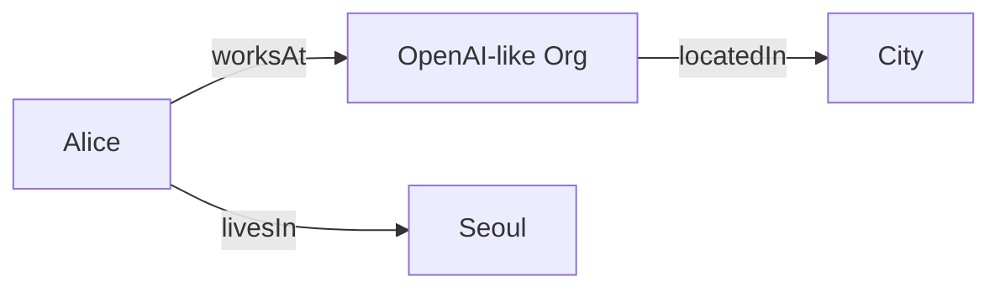

# Kiến thức (knowledge / 지식) biểu diễn (representation / 표현) trong Artificial Intelligence

> **Mạch đọc:** [README](./README.md) là bản đồ owner của **Knowledge representation trong AI**. Route đi từ data/information/knowledge → symbols/referents → ontologies/rules → logical/probabilistic representations → inference interface, để biểu diễn được đánh giá theo suy luận nó cho phép.

Một AI hệ thống (system / 시스템) không thể lập luận (reasoning / 추론) về điều mà nó không biểu diễn được. **kiến thức (knowledge / 지식) biểu diễn (representation / 표현)** nghiên cứu cách encode facts, entities, relations, rules, categories, events và bất định (uncertainty / 불확실성) thành structures mà machine có thể truy vấn (query / 쿼리) và infer.

Nếu Machine học tập (learning / 학습) hỏi “mẫu (pattern / 패턴) nào có thể học từ dữ liệu (data / 데이터)?”, kiến thức (knowledge / 지식) biểu diễn (representation / 표현) hỏi một câu khác nhưng complementary:

> Ta cần mô tả thế giới bằng những symbols/structures nào để facts và relationships có thể được thao tác một cách có nghĩa?

KR là foundation của expert các hệ thống (systems / 시스템들), lô-gic (logic / 논리) lập luận (reasoning / 추론), ontologies, kiến thức (knowledge / 지식) graphs, ngữ nghĩa (semantic / 의미적) web, quy tắc (rule / 규칙) engines và nhiều hybrid AI các hệ thống (systems / 시스템들). Trong hiện đại (modern / 현대적) LLM era, KR quay lại qua kiến thức (knowledge / 지식) Graphs, structured tools, schemas, retrieval siêu dữ liệu (metadata / 메타데이터) và neuro-symbolic approaches.

Xem trước: [Problem Representation](../00_foundations/03_problem_representation.md).

## Dữ liệu (data / 데이터), thông tin (information / 정보) và kiến thức (knowledge / 지식)

Ba từ này thường bị dùng lẫn.

```text
Data        → raw observations / recorded values
Information → data interpreted in context
Knowledge   → structured statements/relations that support reasoning/action
```

Ví dụ:

```text
"37.8"                       → data
"body temperature = 37.8°C"  → information
"fever threshold depends on context" → domain knowledge/rule
```

Ranh giới (boundary / 경계) không tuyệt đối, nhưng distinction giúp thấy KR không chỉ là lưu rows trong cơ sở dữ liệu (database / 데이터베이스). Mục tiêu là represent **ngữ nghĩa (semantics / 의미론) và relationships** đủ để suy luận (inference / 추론).

Dữ liệu ghi lại quan sát, thông tin thêm ngữ cảnh, còn knowledge gắn các mệnh đề với symbol và quan hệ có thể suy luận. Vì vậy bước đầu tiên là phân biệt cái được biểu diễn với đối tượng mà symbol quy chiếu tới.

## Symbol và referent

A symbol như `Seoul`, `Person123`, `ParentOf` là đơn vị từ (token / 토큰) trong hệ thống (system / 시스템). Nó **refers** tới thực thể (entity / 엔터티)/quan hệ (relation / 관계) theo interpretation.

Machine thao tác symbols theo rules; meaning đến từ ánh xạ (mapping / 매핑) giữa symbols và lĩnh vực (domain / 도메인).

Đây là **symbol grounding bài toán (problem / 문제)**: làm thế nào nội bộ (internal / 내부) symbols/representations connect với actual world/perception?

A cơ sở dữ liệu (database / 데이터베이스) ID `customer_42` không tự chứa meaning ngoài conventions và linked dữ liệu (data / 데이터).

Phân biệt symbol và referent giúp tránh nhầm việc khớp token với một sự thật về thế giới. Khi referent đã rõ, facts có thể diễn đạt các mệnh đề cùng điều kiện đúng–sai của chúng.

## Facts

Fact có thể represented như predicate:

\[
LivesIn(Alice, Seoul)
\]

hoặc triple:

```text
Alice --livesIn--> Seoul
```

Fact biểu diễn (representation / 표현) cần xác định:

- thực thể (entity / 엔터티) định danh (identity / 식별자);
- quan hệ (relation / 관계) kiểu (type / 타입);
- thời gian (time / 시간)/ngữ cảnh (context / 맥락);
- provenance/nguồn (source / 소스);
- certainty khi relevant.

`LivesIn(Alice, Seoul)` có thể đúng năm 2025 nhưng sai năm 2030. kiến thức (knowledge / 지식) without temporal phạm vi (scope / 범위) dễ become stale.

Facts riêng lẻ chưa mô tả được tương tác giữa các thực thể; relations nối các thực thể và tạo nền cho suy luận có cấu trúc. Khi các liên kết lặp lại, categories và hierarchy giúp gom chúng thành abstraction.

## Relations

Quan hệ (relation / 관계) có arity.

Unary predicate:

\[
Human(Alice)
\]

Nhị phân (binary / 이진):

\[
Parent(Alice,Bob)
\]

Ternary:

\[
Transferred(Alice,100,AccountB)
\]

Higher-arity quan hệ (relation / 관계) thường khó represent bằng simple đồ thị (graph / 그래프) edge; kiến thức (knowledge / 지식) graphs có thể use reification/sự kiện (event / 이벤트) nodes để attach amount/thời gian (time / 시간)/provenance.

Relations cho biết các đối tượng liên hệ thế nào, còn hierarchy tổ chức các mẫu lặp thành lớp và quan hệ kế thừa. Nhưng abstraction này chỉ an toàn khi phân biệt thuộc tính của lớp với khẳng định riêng của từng instance.

## Categories và hierarchy

Taxonomy:

```text
Animal
 └── Mammal
      └── Dog
```

If:

\[
Dog(x)\rightarrow Mammal(x)
\]

and:

\[
Mammal(x)\rightarrow Animal(x)
\]

then:

\[
Dog(x)\rightarrow Animal(x)
\]

Inheritance giúp avoid duplicate facts.

But real categories không luôn strict hierarchy: a person can be Employee, Student và Parent simultaneously. Ontology often forms đồ thị (graph / 그래프), not simple cây (tree / 트리).

Hierarchy cho ta lớp và quan hệ kế thừa, nhưng inference phải tách điều đúng ở cấp lớp khỏi điều đã khẳng định cho một instance. Để ghi rõ các cam kết và ràng buộc đó, ta cần ontology.

## Instance vs lớp (class / 클래스)

`Dog` is lớp (class / 클래스)/category.

`Fido` is instance.

```text
Fido rdf:type Dog
Dog  subClassOf Mammal
```

Confusing instance/lớp (class / 클래스) causes modeling errors.

For example `Vietnam` is instance of `Country`, not subclass of Country.

Ontology làm rõ lớp, quan hệ và constraint mang nghĩa miền; schema chủ yếu quy định hình dạng và kiểm tra dữ liệu. So sánh hai lớp này giúp biết đâu là cấu trúc lưu trữ và đâu là cam kết ngữ nghĩa.

## Ontology

**Ontology (온톨로지)** explicitly specifies concepts, relations, các ràng buộc (constraints / 제약조건들) và sometimes axioms of a lĩnh vực (domain / 도메인).

It answers questions like:

```text
What types of things exist?
How are types related?
What properties can entities have?
What constraints apply?
```

Healthcare ontology may define Disease, Symptom, Medication, AnatomicalStructure and relations.

Ontology is not merely taxonomy; it can encode richer ngữ nghĩa (semantics / 의미론).

Schema và ontology không thay thế nhau: schema kiểm soát shape, ontology mô tả meaning và các commitment. Khác biệt ấy quyết định cách hệ thống diễn giải dữ liệu bị thiếu, dẫn tới open-world hoặc closed-world assumption.

## Lược đồ (schema / 스키마) vs ontology

Cơ sở dữ liệu (database / 데이터베이스) lược đồ (schema / 스키마) defines structural các ràng buộc (constraints / 제약조건들) for stored dữ liệu (data / 데이터): tables, columns, types, keys.

Ontology aims at lĩnh vực (domain / 도메인) ngữ nghĩa (semantics / 의미론) and inferable relationships.

Overlap exists. hiện đại (modern / 현대적) dữ liệu (data / 데이터) các hệ thống (systems / 시스템들) may use schemas with ngữ nghĩa (semantic / 의미적) các ràng buộc (constraints / 제약조건들), and kiến thức (knowledge / 지식) graphs may have lightweight schemas.

Useful distinction:

```text
schema   → how data is structurally organized
ontology → what concepts/relations mean in domain
```

Open-world và closed-world đặt ra semantics khác nhau cho sự vắng mặt của một fact. Trước khi dùng negation, cần tách rõ một mệnh đề false với một mệnh đề chỉ chưa biết.

## Open-world vs closed-world các giả định (assumptions / 가정들)

**Closed World giả định (assumption / 가정) (CWA)**:

> If fact is not known true, treat it as false.

Relational databases often operationally behave this way in truy vấn (query / 쿼리) contexts.

**Open World giả định (assumption / 가정) (OWA)**:

> If fact is not known true, it may be unknown rather than false.

Ngữ nghĩa (semantic / 의미적) Web/kiến thức (knowledge / 지식) bases often need OWA because dữ liệu (data / 데이터) incomplete.

Example:

```text
Knowledge base does not contain HasChild(Alice, ...)
```

Under CWA → infer Alice has no child.

Under OWA → only know no child fact is recorded.

This difference changes suy luận (inference / 추론) fundamentally.

Nếu absence không đồng nghĩa false, negation phải mang trạng thái rõ ràng thay vì suy ra từ thiếu dữ liệu. Rules sau đó mới có thể tiêu thụ các trạng thái này và dẫn xuất consequence đáng tin.

## Negation: false vs unknown

Three states may matter:

```text
true
false
unknown
```

A SQL `NULL` is not identical to logical unknown in every ngữ nghĩa (semantic / 의미적) sense, but it illustrates why nhị phân (binary / 이진) true/false may be insufficient.

Medical kiến thức (knowledge / 지식) often needs “not tested” distinct from “kiểm thử (test / 테스트) negative”.

Rules biến facts và điều kiện thành inference; cách viết declarative nói hệ thống cần biết gì, còn procedural nói phải làm theo thứ tự nào. Lựa chọn này ảnh hưởng trực tiếp tới interface của bộ suy luận.

## Rules

Quy tắc (rule / 규칙) example:

\[
Human(x)\rightarrow Mortal(x)
\]

Facts:

\[
Human(Socrates)
\]

Suy luận (inference / 추론) yields:

\[
Mortal(Socrates)
\]

Quy tắc (rule / 규칙) các hệ thống (systems / 시스템들) separate declarative kiến thức (knowledge / 지식) from bộ máy suy luận (inference engine / 추론 엔진).

This allows changing facts/rules without rewriting procedural điều khiển (control / 제어) lô-gic (logic / 논리).

Declarative và procedural knowledge đặt trọng tâm khác nhau vào kết quả hay quy trình. Semantic networks đưa cách nhìn declarative ấy vào đồ thị node–edge để quan hệ có thể được truy vết.

## Declarative vs procedural kiến thức (knowledge / 지식)

**Declarative kiến thức (knowledge / 지식)** states what is true:

```text
Parent(Alice,Bob)
```

**Procedural kiến thức (knowledge / 지식)** states how to do something:

```text
function verify_parent_record(...)
```

AI các hệ thống (systems / 시스템들) often need both.

Planning hành động (action / 동작) các mô hình (models / 모델들) are procedural-ish chuyển tiếp (transition / 전이) kiến thức (knowledge / 지식) expressed declaratively via preconditions/effects.

Semantic network biểu diễn thực thể và relation dưới dạng graph; frames đóng gói tiếp theo các slot, constraint và default của một loại đối tượng điển hình.

## Ngữ nghĩa (semantic / 의미적) networks

Early KR used graph-like ngữ nghĩa (semantic / 의미적) networks where nodes entities/concepts and edges relations.

Hiện đại (modern / 현대적) kiến thức (knowledge / 지식) Graphs are descendants in spirit, though implementations/dữ liệu (data / 데이터) các mô hình (models / 모델들) differ.

Đồ thị (graph / 그래프) biểu diễn (representation / 표현) is intuitive for relations:


```mermaid
flowchart LR
    A[Alice] -->|worksAt| O[OpenAI-like Org]
    A -->|livesIn| S[Seoul]
    O -->|locatedIn| C[City]
```

Đồ thị (graph / 그래프) cấu trúc (structure / 구조) enables multi-hop truy vấn (query / 쿼리)/suy luận (inference / 추론).

Frames tổ chức các slot và default quanh một kiểu đối tượng; scripts mở rộng ý tưởng đó theo thời gian, mô tả các bước thường xảy ra trong một tình huống.

## Frames

Frame represents stereotyped thực thể (entity / 엔터티)/situation with slots.

```text
Frame: Person
  name
  birthDate
  nationality
  employer
```

Frames resemble objects/records but can include defaults/inheritance.

Object-oriented classes and schema-based representations share conceptual similarities, though goals differ.

Scripts mô tả chuỗi sự kiện và kỳ vọng theo tiến trình, còn logic-based representation tập trung vào mệnh đề, entailment và quy tắc hình thức. Đây là bước chuyển từ template diễn tiến sang inference có semantics rõ.

## Scripts

Scripts encode typical sự kiện (event / 이벤트) chuỗi (sequence / 시퀀스), e.g. restaurant:

```text
enter
sit
order
eat
pay
leave
```

They were used in early AI/NLP to represent dùng chung (common / 공통) sự kiện (event / 이벤트) structures.

Hiện đại (modern / 현대적) các mô hình (models / 모델들) learn sự kiện (event / 이벤트) patterns statistically, but tường minh (explicit / 명시적) workflows/scripts still useful in nghiệp vụ (business / 비즈니스) tiến trình (process / 프로세스) automation and tác nhân (agent / 에이전트) orchestration.

Logic-based representation cho entailment rõ nhưng khó biểu diễn noise và degree of belief. Probabilistic representation đưa uncertainty vào phân phối để suy luận thay vì buộc mọi mệnh đề đúng hoặc sai tuyệt đối.

## Logic-based biểu diễn (representation / 표현)

Propositional lô-gic (logic / 논리) represents atomic statements and Boolean combinations.

First-Order lô-gic (logic / 논리) adds variables, predicates and quantifiers.

Lô-gic (logic / 논리) gives precise ngữ nghĩa (semantics / 의미론) and proof lý thuyết (theory / 이론), enabling tính đúng đắn (correctness / 정확성) guarantees.

Limitations include brittleness under noisy/incomplete dữ liệu (data / 데이터) and computational độ phức tạp (complexity / 복잡도).

See [Propositional Logic](./01_propositional_logic.md) and [First-Order Logic](./02_first_order_logic.md).

Probabilistic representation biểu diễn belief bằng phân phối, còn distributed representation mã hóa concept trong pattern của nhiều chiều. Lựa chọn này đổi khả năng diễn giải lấy tính mềm dẻo và khả năng học.

## Probabilistic biểu diễn (representation / 표현)

Real kiến thức (knowledge / 지식) often uncertain:

```text
P(Disease | Symptoms)=0.7
```

Bayesian Networks represent conditional dependencies graphically.

Probabilistic lô-gic (logic / 논리) and graphical các mô hình (models / 모델들) combine relational/causal-like cấu trúc (structure / 구조) with bất định (uncertainty / 불확실성).

See [Probabilistic Reasoning](./04_probabilistic_reasoning.md).

Distributed và symbolic representation tối ưu các nhu cầu khác nhau: vector thuận lợi cho similarity, symbol thuận lợi cho quan hệ và proof. Knowledge graph là một cách giữ cấu trúc symbolic trong mạng thực thể–quan hệ.

## Phân tán (distributed / 분산) biểu diễn (representation / 표현)

Neural networks represent concepts as patterns across many dimensions rather than tường minh (explicit / 명시적) symbols.

Embedding:

\[
thực thể (entity / 엔터티)\rightarrow\mathbf{v}\in\mathbb{R}^d
\]

Advantages:

- similarity/generalization;
- robust statistical học tập (learning / 학습);
- scalable biểu diễn (representation / 표현).

Weakness:

- ngữ nghĩa (semantics / 의미론) not tường minh (explicit / 명시적);
- hard các ràng buộc (constraints / 제약조건들) difficult;
- chính xác (exact / 정확한) logical suy luận (inference / 추론) not guaranteed;
- interpretability limited.

Knowledge graph chỉ hữu ích khi các node thực sự trỏ tới đúng thực thể và edge có nghĩa ổn định. Vì vậy entity resolution phải hợp nhất các mention mà không làm mất ambiguity hay identity boundary.

## Symbolic vs phân tán (distributed / 분산) biểu diễn (representation / 표현)

Symbolic:

```text
Paris --capitalOf--> France
```

Phân tán (distributed / 분산):

```text
Paris → [0.12, -0.44, ...]
France → [...]
```

Symbolic biểu diễn (representation / 표현) excels chính xác (exact / 정확한) quan hệ (relation / 관계)/truy vấn (query / 쿼리). phân tán (distributed / 분산) biểu diễn (representation / 표현) excels similarity and học tập (learning / 학습) from dữ liệu (data / 데이터).

Hiện đại (modern / 현대적) AI often benefits from both.

Entity resolution tạo identity links nhưng bản thân match có thể sai hoặc phụ thuộc bằng chứng. Provenance cần ghi nguồn, thời điểm và lý do để kết quả có thể được kiểm tra và sửa.

## Kiến thức (knowledge / 지식) đồ thị (graph / 그래프)

A kiến thức (knowledge / 지식) đồ thị (graph / 그래프) represents entities and typed relations, often as triples:

\[
(subject, predicate, object)
\]

Example:

```text
(Seoul, capitalOf, SouthKorea)
```

But môi trường vận hành (production / 운영 환경) KG also needs lược đồ (schema / 스키마), IDs, provenance, temporal validity and thực thể (entity / 엔터티) resolution.

See [Knowledge Graphs](./06_knowledge_graphs.md).

Provenance cho biết một claim đến từ đâu và đáng tin ở mức nào; temporal knowledge bổ sung claim đó đúng trong khoảng thời gian nào. Không có trục thời gian, hệ thống dễ coi fact cũ là hiện tại.

## Thực thể (entity / 엔터티) resolution

Same real thực thể (entity / 엔터티) can appear under different names:

```text
"OpenAI"
"Open AI"
"OpenAI, Inc."
```

Thực thể (entity / 엔터티) resolution decides whether records refer same thực thể (entity / 엔터티).

Without it, KG fragments facts. Incorrect merging is equally dangerous.

This is liên kết (connection / 연결) KR ↔ kỹ thuật dữ liệu (data engineering / 데이터 엔지니어링) ↔ ML.

Temporal knowledge làm rõ fact thay đổi theo thời gian, nhưng dữ liệu vẫn thường thiếu. Default reasoning cho phép lấp khoảng trống bằng giả định có thể rút lại khi gặp exception.

## Provenance

Kiến thức (knowledge / 지식) should answer:

```text
Where did this fact come from?
When was it observed?
How trustworthy is source?
Was it inferred or directly asserted?
```

A bare fact without provenance is hard to kiểm tra (audit / 감사)/cập nhật (update / 업데이트).

RAG các hệ thống (systems / 시스템들) similarly need citation/nguồn (source / 소스) siêu dữ liệu (metadata / 메타데이터), showing old KR concerns reappear in hiện đại (modern / 현대적) AI.

Default reasoning hữu ích vì không cần liệt kê mọi ngoại lệ, nhưng kết luận có thể phải retract. Đây là điểm phân biệt monotonic inference, nơi thêm knowledge không làm mất conclusion cũ, với suy luận mặc định.

## Temporal kiến thức (knowledge / 지식)

Facts can thay đổi (change / 변경):

```text
CEO(company, Alice, validFrom=2025, validTo=2027)
```

Temporal KR distinguishes sự kiện (event / 이벤트) thời gian (time / 시간), giao dịch (transaction / 트랜잭션) thời gian (time / 시간) and validity intervals.

Without thời gian (time / 시간), historical facts can xung đột (conflict / 충돌) with hiện tại (current / 현재) facts.

Monotonicity là một cam kết mạnh về cách knowledge mở rộng; commonsense thường vi phạm nó vì thông tin mới có thể đảo một default. Vì vậy biểu diễn commonsense phải chấp nhận ngoại lệ và context.

## Default lập luận (reasoning / 추론)

Quy tắc (rule / 규칙):

```text
Bird(x) → normally Flies(x)
```

Exception:

```text
Penguin(x) → not Flies(x)
```

Classical monotonic lô-gic (logic / 논리) struggles with defaults/exceptions if modeled naively.

**Non-monotonic lập luận (reasoning / 추론)** allows conclusions to be withdrawn when new thông tin (information / 정보) arrives.

This is closer to commonsense lập luận (reasoning / 추론).

Commonsense knowledge chứa nhiều default ngầm và khó bao phủ hết trường hợp. Cần phân biệt knowledge base mang claim, rule và provenance với database chủ yếu lưu dữ liệu có schema và truy vấn xác định.

## Monotonicity

In monotonic lô-gic (logic / 논리), adding premises never invalidates previously derived conclusions.

Real-world kiến thức (knowledge / 지식) often non-monotonic:

```text
Assume meeting tomorrow at 10
new email says cancelled
→ previous conclusion withdrawn
```

Quy tắc (rule / 규칙) engines need giải quyết xung đột (conflict resolution / 충돌 해결)/default ngữ nghĩa (semantics / 의미론) to handle updates.

Monotonicity là cam kết về cách conclusion tồn tại khi knowledge tăng; commonsense thường phá vỡ cam kết ấy vì exception có thể rút lại default. Do đó biểu diễn commonsense phải giữ context và điều kiện áp dụng.

## Commonsense kiến thức (knowledge / 지식)

Humans rely on enormous background các giả định (assumptions / 가정들):

```text
objects persist
people cannot be in two distant places simultaneously
containers hold things
events have causes/effects
```

Explicitly encoding all commonsense is difficult. Projects like Cyc attempted large-scale symbolic commonsense KB.

LLMs absorb much commonsense statistically, but can violate hard consistency because kiến thức (knowledge / 지식) is not tường minh (explicit / 명시적) proof cơ sở dữ liệu (database / 데이터베이스).

Commonsense nhiều, ngầm và khó bao phủ hết nên cần một nơi lưu claim, rule, exception và provenance có thể cập nhật. Đó là lúc phân biệt knowledge base với database trở nên thiết yếu.

## Kiến thức (knowledge / 지식) cơ sở (base / 기반) vs cơ sở dữ liệu (database / 데이터베이스)

Cơ sở dữ liệu (database / 데이터베이스) primarily stores/retrieves tường minh (explicit / 명시적) records.

Kiến thức (knowledge / 지식) cơ sở (base / 기반) often supports suy luận (inference / 추론) from tường minh (explicit / 명시적) + quy tắc (rule / 규칙)/ontology kiến thức (knowledge / 지식).

Example:

```text
DB stores:
Alice type Doctor
Doctor subclass MedicalProfessional

KB reasoner can answer:
Alice type MedicalProfessional
```

Real products blur line: SQL views, các ràng buộc (constraints / 제약조건들) and recursive queries also perform derived computation.

Knowledge base có thể chứa rule và claim ngữ nghĩa, còn database thường ưu tiên record có schema và truy vấn xác định. Khi người dùng đặt câu hỏi, query answering phải tôn trọng entailment, unknown và provenance của claim.

## Truy vấn (query / 쿼리) answering

KR usefulness measured by questions it supports.

Examples:

```text
Who works at company X?
Which medications interact with drug Y?
What entities connect A to B within 3 hops?
Does policy rule permit action Z?
```

Biểu diễn (representation / 표현) should be designed from intended truy vấn (query / 쿼리)/suy luận (inference / 추론) tải công việc (workload / 워크로드), not aesthetic taxonomy alone.

Query answering suy luận mỗi lần truy vấn có thể tốn chi phí; knowledge compilation chuyển một phần reasoning thành cấu trúc hoặc artifact được chuẩn bị trước. Đổi lại, artifact cần được kiểm soát khi knowledge thay đổi.

## Kiến thức (knowledge / 지식) compilation

Some representations are expressive but expensive to reason over. **kiến thức (knowledge / 지식) compilation** transforms kiến thức (knowledge / 지식) into form allowing faster queries at chi phí (cost / 비용) of preprocessing/không gian (space / 공간).

This is analogous to cơ sở dữ liệu (database / 데이터베이스) indexing and mô hình (model / 모델) compilation: pay upfront to answer many queries faster.

Compilation có thể làm query nhanh hơn nhưng không xóa trade-off giữa expressiveness và tractability. Biểu diễn càng giàu thì không gian suy luận và chi phí kiểm chứng thường càng lớn.

## Expressiveness vs tractability

More expressive lô-gic (logic / 논리) can represent more relationships but suy luận (inference / 추론) may become undecidable/intractable.

KR thiết kế (design / 설계) balances:

```text
expressiveness
correctness guarantees
inference complexity
maintainability
```

Description Logics intentionally restrict First-Order lô-gic (logic / 논리) to retain decidable lập luận (reasoning / 추론); they underpin OWL ontology languages.

Khi representation đã được triển khai, schema evolution phải bảo toàn nghĩa hoặc cung cấp migration rõ ràng. Một schema mới hợp lệ về hình dạng vẫn có thể làm hỏng contract ngữ nghĩa cũ.

## Lược đồ (schema / 스키마) evolution

Kiến thức (knowledge / 지식) mô hình (model / 모델) changes as lĩnh vực (domain / 도메인) changes.

If quan hệ (relation / 관계) `employedBy` ngữ nghĩa (semantics / 의미론) thay đổi (change / 변경), old dữ liệu (data / 데이터)/inferences may break.

Versioning ontology/lược đồ (schema / 스키마) is Software/kỹ thuật dữ liệu (data engineering / 데이터 엔지니어링) bài toán (problem / 문제). kiến thức (knowledge / 지식) is not static sản phẩm tạo ra (artifact / 산출물).

Schema evolution giữ cho cấu trúc đọc được qua version, nhưng không đảm bảo claim còn đúng với thế giới. Knowledge freshness cần theo dõi thời điểm, nguồn và chính sách hết hạn.

## Kiến thức (knowledge / 지식) freshness

LLM parameter kiến thức (knowledge / 지식) frozen at huấn luyện (training / 학습) cutoff/cập nhật (update / 업데이트) cycle. bên ngoài (external / 외부) KB can be updated independently.

This motivates Retrieval-Augmented Generation:

```text
parameterized statistical knowledge
        +
retrieved external knowledge
```

RAG does not automatically become symbolic lập luận (reasoning / 추론), but it separates mutable factual nguồn (source / 소스) from mô hình (model / 모델) weights.

Freshness là điều kiện để knowledge hữu dụng trong hiện tại; KR trong RAG phải nối retrieval với entity, relation và provenance thay vì chỉ ghép các đoạn văn.

## KR trong RAG

Naive RAG chunks văn bản (text / 텍스트) and retrieves vectors.

Structured KR can enrich retrieval:

- thực thể (entity / 엔터티) siêu dữ liệu (metadata / 메타데이터);
- quan hệ (relation / 관계) filters;
- temporal các ràng buộc (constraints / 제약조건들);
- đồ thị (graph / 그래프) traversal;
- provenance;
- ontology-aware truy vấn (query / 쿼리) expansion.

GraphRAG-like approaches combine văn bản (text / 텍스트) chunks with thực thể (entity / 엔터티)/quan hệ (relation / 관계) đồ thị (graph / 그래프) structures in various architectures.

RAG cung cấp context được truy hồi, còn tool calling cho phép hệ thống thực hiện action hoặc lấy dữ liệu có contract. Cả hai cần boundary rõ giữa evidence, intent và side effect.

## KR trong công cụ (tool / 도구) calling

Công cụ (tool / 도구) lược đồ (schema / 스키마) defines:

```text
function name
parameters
types
allowed values
semantics
```

This is a lightweight formal biểu diễn (representation / 표현) of hành động (action / 동작) giao diện (interface / 인터페이스).

JSON lược đồ (schema / 스키마), OpenAPI and typed hàm (function / 함수) signatures constrain mô hình (model / 모델) đầu ra (output / 출력) and enable kiểm tra hợp lệ (validation / 검증).

Thus Kỹ nghệ phần mềm (software engineering / 소프트웨어 공학) schemas become part of AI kiến thức (knowledge / 지식)/hành động (action / 동작) biểu diễn (representation / 표현).

Tool calling làm lộ rằng representation không chỉ để đọc mà còn để điều phối hành động. Mental model cuối chương gom representation, inference interface và failure boundary thành một chuỗi kiểm tra.

## Mô hình tư duy (mental model / 사고 모델)

Phần này chốt mental model thành một chuỗi có thể dùng lại: bối cảnh → cơ chế → quan sát → giới hạn → quyết định. Hãy đọc sơ đồ như công cụ suy luận, không như một khẩu hiệu tách khỏi chapter.

```text
Knowledge Representation = choose a language for what the system can state and reason about

Entity      → what things exist?
Relation    → how are things connected?
Rule        → what follows from what?
Ontology    → what concepts/types constrain domain?
Provenance  → why should we believe a fact?
Time        → when is it valid?
Uncertainty → how sure are we?
Inference   → what new statements can be derived?
```

Mental model giúp nối lựa chọn biểu diễn với semantics, chi phí và rủi ro; từ đó có thể sửa các misconception như coi schema là ontology hoặc coi thiếu dữ liệu là false.

## Dùng chung (common / 공통) Misconceptions

### “kiến thức (knowledge / 지식) biểu diễn (representation / 표현) = cơ sở dữ liệu (database / 데이터베이스) thiết kế (design / 설계)”

They overlap, but KR emphasizes ngữ nghĩa (semantics / 의미론), suy luận (inference / 추론), ontology and lập luận (reasoning / 추론) beyond structural lưu trữ (storage / 저장소).

### “kiến thức (knowledge / 지식) đồ thị (graph / 그래프) automatically understands relationships”

Đồ thị (graph / 그래프) only stores encoded relations. chất lượng (quality / 품질) depends thực thể (entity / 엔터티) resolution, lược đồ (schema / 스키마), provenance and suy luận (inference / 추론)/truy vấn (query / 쿼리) lô-gic (logic / 논리).

### “LLM embeddings replace symbolic kiến thức (knowledge / 지식)”

Embeddings excel similarity/generalization; tường minh (explicit / 명시적) kiến thức (knowledge / 지식) excels chính xác (exact / 정확한) quan hệ (relation / 관계), cập nhật (update / 업데이트), provenance and các ràng buộc (constraints / 제약조건들). They solve different needs.

### “More expressive biểu diễn (representation / 표현) always better”

Expressiveness can make suy luận (inference / 추론) expensive or undecidable. Practical KR chooses enough ngữ nghĩa (semantics / 의미론) for required tasks.

Những phân biệt này nối knowledge representation với logic, probabilistic reasoning, knowledge graphs, RAG và agent tools. Chọn representation đúng nghĩa là chọn cả interface suy luận và giới hạn thất bại.

## Liên kết kiến thức (knowledge connection / 지식 연결)

Kiến thức (knowledge / 지식) biểu diễn (representation / 표현) links lô-gic (logic / 논리), Databases, Graphs, NLP and hiện đại (modern / 현대적) RAG/Agents. It is the ngữ nghĩa (semantic / 의미적) counterpart of [Problem Representation](../00_foundations/03_problem_representation.md): not only how to encode trạng thái (state / 상태) for computation, but how to encode claims about the world so they can be queried, verified and inferred.

Xem tiếp: [Propositional Logic](./01_propositional_logic.md) và [First-Order Logic](./02_first_order_logic.md).

> **Bàn giao:** Sau **Liên kết kiến thức (knowledge connection / 지식 연결)**, hãy giữ lại kết luận và ranh giới của mục này; quay về [README](./README.md) khi cần định vị owner hoặc chọn nhánh học tiếp theo.
