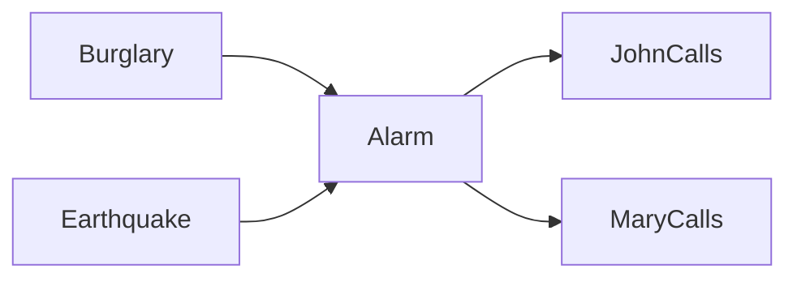

# Mạng Bayes trong Trí tuệ nhân tạo

**Mạng Bayes (Bayesian Network / 베이지안 네트워크)** là một đồ thị có hướng không chu trình (Directed Acyclic Graph - DAG), trong đó mỗi node là một biến ngẫu nhiên và mỗi cạnh biểu diễn quan hệ phụ thuộc trực tiếp trong phép phân rã của phân phối xác suất chung.

Ý tưởng quan trọng là thay vì viết một bảng xác suất chung khổng lồ cho mọi tổ hợp biến, ta khai thác cấu trúc cục bộ của bài toán để mô tả bằng nhiều phân phối có điều kiện nhỏ hơn.

Mạng Bayes kết hợp ba thành phần trong cùng một biểu diễn:

```text
cấu trúc đồ thị
+ xác suất
+ độc lập có điều kiện
```

Nhờ vậy, hệ thống có thể suy luận về nguyên nhân, bằng chứng, mức bất định và chi phí tính toán một cách có cấu trúc.

Xem trước: [Suy luận xác suất](./04_probabilistic_reasoning.md).

## Vì sao cần cấu trúc đồ thị?

Giả sử có `n` biến nhị phân. Một bảng phân phối chung đầy đủ cần gần:

\[
2^n-1
\]

tham số độc lập.

Với 30 biến nhị phân, số cấu hình đã xấp xỉ một tỷ.

Nhưng thế giới thực thường có cấu trúc cục bộ: thời tiết ảnh hưởng giao thông, bệnh ảnh hưởng triệu chứng, hỏng linh kiện ảnh hưởng cảnh báo. Không phải biến nào cũng phụ thuộc trực tiếp vào tất cả biến còn lại.

Mạng Bayes tận dụng chính cấu trúc đó để giảm số tham số và làm suy luận khả thi hơn.

## Cấu trúc DAG

Ví dụ:



Cách đọc theo xác suất:

- `Alarm` phụ thuộc trực tiếp vào `Burglary` và `Earthquake`;
- `JohnCalls` và `MaryCalls` phụ thuộc trực tiếp vào `Alarm`;
- khi đã biết `Alarm`, mô hình không cần thêm phụ thuộc trực tiếp từ `Burglary` hay `Earthquake` tới các cuộc gọi.

Cấu trúc đồ thị là một **giả định mô hình hóa**, không tự động là chân lý nhân quả.

## Phân rã phân phối chung

Với các biến `X1,...,Xn` theo thứ tự topo:

\[
P(X_1,...,X_n)=\prod_i P(X_i\mid Parents(X_i))
\]

Với ví dụ báo động:

\[
P(B,E,A,J,M)=
P(B)P(E)P(A\mid B,E)P(J\mid A)P(M\mid A)
\]

Nhờ vậy, thay vì biểu diễn trực tiếp mọi tổ hợp của năm biến nhị phân, ta chỉ cần nhiều bảng điều kiện nhỏ.

## Bảng xác suất có điều kiện

Với biến rời rạc, mỗi node có thể được mô tả bằng **bảng xác suất có điều kiện (Conditional Probability Table - CPT)**.

Ví dụ với `Alarm`:

| B | E | P(A=true \| B,E) |
|---|---|---:|
| T | T | 0.95 |
| T | F | 0.94 |
| F | T | 0.29 |
| F | F | 0.001 |

Các con số chỉ mang tính minh họa. Mỗi hàng phải xác định một phân phối xác suất hợp lệ.

## Tính chất Markov cục bộ

Mỗi biến độc lập có điều kiện với các node không phải hậu duệ của nó khi đã biết các node cha.

Ví dụ trong đồ thị trên:

\[
J\perp B\mid A
\]

Nghĩa là khi đã biết trạng thái của `Alarm`, biết thêm `Burglary` không cung cấp thêm thông tin trực tiếp cần thiết cho `JohnCalls` theo mô hình này.

Tuy nhiên nếu chưa biết `Alarm`, `Burglary` và `JohnCalls` vẫn có thể phụ thuộc vì trộm làm thay đổi xác suất chuông báo động, rồi chuông làm thay đổi xác suất John gọi điện.

## d-separation

**d-separation** là tiêu chuẩn đồ thị dùng để xác định các quan hệ độc lập có điều kiện được hàm ý bởi DAG.

Ba cấu trúc cơ bản cần ghi nhớ.

### Chuỗi

```text
X → Z → Y
```

Thông thường `X` và `Y` phụ thuộc. Khi điều kiện hóa theo `Z`, đường truyền bị chặn:

\[
X\perp Y\mid Z
\]

### Nhánh chung

```text
X ← Z → Y
```

`Z` là nguyên nhân chung. Khi biết `Z`, mối liên hệ giữa `X` và `Y` có thể bị chặn:

\[
X\perp Y\mid Z
\]

### Collider

```text
X → Z ← Y
```

Đường này mặc định bị chặn. Nếu điều kiện hóa theo `Z` hoặc hậu duệ của `Z`, đường có thể được mở và `X`, `Y` trở nên phụ thuộc.

Đây chính là cấu trúc của hiện tượng explaining away.

## Sai lệch do điều kiện hóa trên collider

Giả sử năng lực và may mắn đều ảnh hưởng khả năng được tuyển chọn:

```text
Ability → Selected ← Luck
```

Trong toàn bộ dân số, `Ability` và `Luck` có thể độc lập. Nhưng nếu chỉ xét nhóm đã được chọn, một người có năng lực thấp nhưng vẫn được chọn sẽ làm ta tăng niềm tin rằng người đó gặp nhiều may mắn.

Điều kiện hóa theo biến `Selected` đã tạo ra một mối liên hệ nhân tạo.

Hiện tượng này đặc biệt quan trọng khi phân tích dữ liệu bị chọn lọc hoặc trong suy luận nhân quả.

## Markov blanket

**Markov blanket** của một node gồm:

- các node cha;
- các node con;
- các node cha khác của các node con.

Khi đã biết toàn bộ Markov blanket, node đó độc lập với phần còn lại của mạng.

Khái niệm này hữu ích để hiểu suy luận cục bộ và đôi khi cả lựa chọn đặc trưng.

## Suy luận chính xác bằng liệt kê

Giả sử cần tính:

\[
P(B\mid J=true,M=true)
\]

Cách ngây thơ là cộng qua các biến ẩn:

\[
P(B,j,m) = \sum_e\sum_a P(B,e,a,j,m)
\]

sau đó chuẩn hóa theo `B`.

Cách này đúng nhưng lặp lại rất nhiều phép tính và không mở rộng tốt khi số biến tăng.

## Loại biến

**Variable Elimination** tổ chức lại phép tính để tái sử dụng các factor trung gian.

Thay vì liệt kê toàn bộ phép gán, ta lần lượt:

```text
lấy các factor có chứa biến ẩn
→ nhân chúng
→ cộng bỏ biến ẩn
→ tạo factor mới nhỏ hơn
→ lặp lại
```

Thứ tự loại biến có thể làm kích thước factor trung gian thay đổi rất lớn.

## Treewidth

Độ phức tạp của suy luận chính xác phụ thuộc mạnh vào **treewidth** của cấu trúc đồ thị sau các bước biến đổi liên quan tới loại biến.

Một đồ thị trông có vẻ thưa vẫn có thể sinh clique lớn trong quá trình loại biến.

Do đó chi phí suy luận không thể đánh giá chỉ bằng số lượng node; topology của đồ thị mới là yếu tố quyết định.

## Lan truyền niềm tin

Trên đồ thị dạng cây, **belief propagation** truyền message giữa các node hoặc factor để tính marginal chính xác một cách hiệu quả.

Một message có thể được hiểu là phần tóm tắt ảnh hưởng của một nhánh đồ thị tới phần còn lại.

Nếu đồ thị có vòng, có thể dùng **loopy belief propagation** như một phương pháp xấp xỉ, nhưng không có bảo đảm chung rằng nó sẽ hội tụ hoặc luôn cho kết quả chính xác.

## Suy luận bằng lấy mẫu

Các phương pháp như likelihood weighting, Gibbs sampling và Monte Carlo có thể xấp xỉ posterior.

Nếu bằng chứng quan sát có xác suất tiên nghiệm rất thấp, rejection sampling trở nên cực kỳ kém hiệu quả vì phần lớn mẫu bị loại bỏ.

Vì vậy thuật toán suy luận phải phù hợp với cấu trúc mô hình và loại bằng chứng.

## Học tham số

Nếu cấu trúc đồ thị đã biết và mọi biến được quan sát đầy đủ, các tham số CPT có thể ước lượng bằng tần suất hoặc MLE:

\[
\hat P(X=x\mid Parents=u)=
\frac{count(X=x,Parents=u)}{count(Parents=u)}
\]

Smoothing hoặc prior giúp tránh xác suất bằng 0 với những tổ hợp chưa từng xuất hiện trong dữ liệu.

## Dữ liệu thiếu và EM

Khi tồn tại biến ẩn hoặc dữ liệu thiếu, thuật toán **Expectation-Maximization (EM)** có thể dùng để ước lượng tham số.

Chu trình trực giác:

```text
E-step: ước lượng phân bố của biến ẩn theo tham số hiện tại
M-step: cập nhật tham số để tối đa hóa kỳ vọng likelihood của dữ liệu đầy đủ
lặp lại
```

Trong dạng chuẩn, EM không làm giảm likelihood qua mỗi vòng lặp, nhưng có thể hội tụ tại tối ưu cục bộ.

## Học cấu trúc đồ thị

Cấu trúc DAG cũng có thể được học từ dữ liệu thông qua tìm kiếm trên không gian đồ thị, dùng điểm số như BIC, BDe hoặc các kiểm định độc lập có điều kiện.

Số lượng DAG tăng cực nhanh theo số biến, vì vậy tìm kiếm chính xác thường rất khó.

Quan trọng hơn, học cấu trúc từ dữ liệu quan sát không tự động khôi phục được đồ thị nhân quả nếu không có thêm giả định.

## Mạng Bayes và đồ thị nhân quả

DAG của Mạng Bayes biểu diễn phép phân rã xác suất và các quan hệ độc lập có điều kiện.

**Đồ thị nhân quả (causal graph)** bổ sung ngữ nghĩa mạnh hơn: cạnh biểu diễn cơ chế nhân quả có thể dùng cho suy luận can thiệp.

Cùng một hình dạng DAG có thể chỉ mang nghĩa mô tả xác suất mà không mang nghĩa nhân quả.

Vì vậy không được kết luận “X gây ra Y” chỉ vì có cạnh `X→Y` trong một mạng dự đoán.

## Can thiệp

Trong mô hình nhân quả, can thiệp:

\[
P(Y\mid do(X=x))
\]

khác với quan sát:

\[
P(Y\mid X=x)
\]

vì can thiệp chủ động thay thế cơ chế sinh `X`, trong khi quan sát có thể bị nhiễu bởi biến gây nhiễu (confounder).

Mạng Bayes cung cấp nền tảng đồ thị hữu ích, nhưng suy luận nhân quả cần thêm giả định nhân quả ngoài xác suất thuần túy.

## Dynamic Bayesian Network

**Dynamic Bayesian Network (DBN)** lặp lại cấu trúc qua thời gian:

```text
X_t → X_{t+1}
↓       ↓
Y_t    Y_{t+1}
```

HMM và Kalman Filter có thể được xem là những mô hình động có cấu trúc đặc biệt.

DBN cho phép mô hình hóa nhiều biến trạng thái và quan sát thay đổi theo thời gian.

## Noisy-OR

Nếu nhiều nguyên nhân gần như độc lập đều có thể kích hoạt cùng một hiệu ứng, một CPT đầy đủ tăng theo hàm mũ theo số lượng node cha.

**Noisy-OR** giảm số tham số bằng cách giả định mỗi nguyên nhân có một xác suất riêng để gây hiệu ứng, rồi kết hợp chúng theo cấu trúc xác suất xác định.

Đây là ví dụ của việc tận dụng cấu trúc để giảm kích thước phân phối có điều kiện (Conditional Probability Distribution - CPD).

## Biến liên tục

Mạng Bayes không bị giới hạn ở CPT rời rạc. Các phân phối có điều kiện có thể là Gaussian hoặc hàm tham số hóa khác.

Ví dụ mô hình Gaussian tuyến tính:

\[
X_i = \beta_0 + \sum_j \beta_j Parent_j + \epsilon
\]

với nhiễu Gaussian.

Mạng lai giữa biến rời rạc và liên tục cần các thuật toán suy luận tương thích với kiểu phân phối đã chọn.

## Mạng Bayes trong chẩn đoán

Trong chẩn đoán, hướng sinh thường đi từ nguyên nhân tới biểu hiện:

```text
Disease → Symptom
```

Nhưng khi quan sát triệu chứng, suy luận lại đi theo chiều ngược để tính posterior của bệnh.

Điều này rất quan trọng: **hướng cạnh không giới hạn hướng truy vấn**. Cạnh biểu diễn cấu trúc phân rã, còn Bayes cho phép cập nhật niềm tin theo bằng chứng ở bất kỳ vị trí phù hợp nào.

## Explaining away trong chẩn đoán

Nếu hai bệnh cùng có thể gây sốt, quan sát sốt làm tăng xác suất của cả hai.

Nếu sau đó xét nghiệm xác nhận bệnh A, niềm tin vào bệnh B có thể giảm vì hiện tượng sốt đã có một lời giải thích mạnh.

Đây chính là explaining away trong ngữ cảnh y khoa.

## Decision Network

**Influence Diagram** mở rộng Mạng Bayes bằng ba loại node:

- node ngẫu nhiên (chance node);
- node quyết định (decision node);
- node utility.

Sau đó hệ thống chọn hành động tối đa hóa utility kỳ vọng.

Đây là cầu nối trực tiếp giữa suy luận xác suất và lý thuyết quyết định.

## Mạng Bayes và Neural Network không giống nhau

Tên gọi dễ gây nhầm:

```text
Bayesian Network → mô hình đồ thị xác suất
Neural Network   → hàm tham số hóa khả vi / đồ thị tính toán
```

Một neural network có thể tham số hóa các phân phối có điều kiện trong mô hình xác suất, nhưng hai khái niệm vẫn khác nhau về bản chất.

## Neural Network làm mô hình xác suất điều kiện

Thay vì CPT, có thể dùng neural network để biểu diễn:

\[
P(X_i\mid Parents_i;\theta)
\]

Cách này kết hợp cấu trúc phân rã của đồ thị với khả năng xấp xỉ hàm linh hoạt của neural network.

Các mô hình tự hồi quy (autoregressive) cũng có thể được nhìn như đồ thị có hướng trên chuỗi:

\[
P(x_{1:T})=\prod_tP(x_t\mid x_{<t})
\]

Transformer language model chính là một cơ chế neural để tham số hóa những phân phối có điều kiện này.

## Kết hợp Mạng Bayes và RAG

Trong hệ thống doanh nghiệp, đồ thị xác suất có thể dùng để suy luận cấu trúc phụ thuộc, còn RAG truy xuất bằng chứng văn bản.

Ví dụ xử lý sự cố:

```text
log quan sát được
   ↓ node bằng chứng
mạng xác suất
   ↓ posterior của nguyên nhân gốc
truy xuất tài liệu theo các giả thuyết hàng đầu
   ↓
LLM giải thích kèm nguồn
```

Đồ thị chịu trách nhiệm về cấu trúc và bất định; LLM chịu trách nhiệm giao tiếp ngôn ngữ và diễn giải.

## Mô hình tư duy

```text
Node          = biến ngẫu nhiên
Edge          = phụ thuộc trực tiếp trong phép phân rã
CPT / CPD     = phân phối có điều kiện cục bộ
DAG           = đồ thị có hướng không chu trình
Factorization = phân phối chung = tích các phân phối cục bộ
d-separation  = đọc độc lập có điều kiện từ đồ thị
Inference     = cập nhật / truy vấn xác suất khi có bằng chứng
```

## Các hiểu lầm thường gặp

### “Có cạnh nghĩa là có quan hệ nhân quả”

Không. Chỉ khi mô hình được xây với ngữ nghĩa và giả định nhân quả phù hợp thì cạnh mới có thể được diễn giải là nhân quả.

### “Không có cạnh nghĩa là hai biến độc lập”

Không nhất thiết. Độc lập phụ thuộc vào cấu trúc đường đi và điều kiện hóa, được xác định qua d-separation.

### “Điều kiện hóa luôn làm giảm phụ thuộc”

Không. Điều kiện hóa trên collider có thể tạo ra phụ thuộc mới.

### “Mạng Bayes là Neural Network dùng trọng số Bayesian”

Không. Đây là hai họ mô hình khác nhau.

## Liên kết kiến thức

Mạng Bayes biến suy luận xác suất thành một cấu trúc đồ thị: topology quyết định phép phân rã và ảnh hưởng trực tiếp tới độ phức tạp của suy luận. Các khái niệm này sẽ quay lại trong causal inference, HMM, probabilistic programming và mô hình sinh tự hồi quy.

Xem tiếp: [Knowledge Graph](./06_knowledge_graphs.md), nơi cạnh mặc định biểu diễn quan hệ ngữ nghĩa chứ không phải phụ thuộc xác suất.