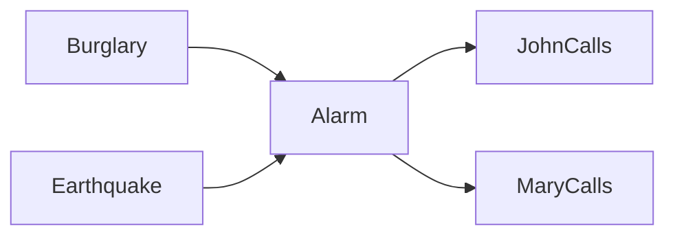

# Bayesian Networks trong Artificial Intelligence

**Bayesian Network (베이지안 네트워크 / mạng Bayes)** là một directed acyclic graph (DAG) trong đó mỗi node là random variable và mỗi edge biểu diễn dependency trực tiếp trong factorization của joint probability. Nó cho phép ta mô hình hóa một distribution rất lớn bằng các local conditional distributions thay vì viết full joint table.

Bayesian Network quan trọng vì nó kết hợp ba thứ trong một representation:

```text
graph structure
+ probability
+ conditional independence
```

Điều này giúp reasoning về causes/evidence, inference dưới uncertainty và complexity của computation.

Xem trước: [Probabilistic Reasoning](./04_probabilistic_reasoning.md).

## Tại sao cần graph?

Giả sử có `n` binary variables. Full joint distribution cần gần:

\[
2^n-1
\]

independent parameters.

Với 30 binary variables, con số entries đã khoảng một tỷ.

Nhưng real domains thường có local structure: weather ảnh hưởng traffic; disease ảnh hưởng symptoms; component failure ảnh hưởng alarms. Không phải mọi variable trực tiếp depend mọi variable khác.

Bayesian Network khai thác structure này.

## DAG structure

Ví dụ:



Interpretation probabilistic:

- Alarm depends directly on Burglary and Earthquake.
- JohnCalls and MaryCalls depend directly on Alarm.
- Given Alarm, calls do not need directly depend on Burglary/Earthquake in this model.

Graph is modeling assumption, not automatically causal truth.

## Joint factorization

For variables `X1,...,Xn` in topological order:

\[
P(X_1,...,X_n)=\prod_i P(X_i\mid Parents(X_i))
\]

For burglary network:

\[
P(B,E,A,J,M)=
P(B)P(E)P(A\mid B,E)P(J\mid A)P(M\mid A)
\]

Instead of full 32-cell table for five binary variables, local CPTs require fewer parameters.

## Conditional Probability Table

For discrete variable, each node can have CPT.

Example `Alarm`:

| B | E | P(A=true | B,E) |
|---|---|---:|
| T | T | 0.95 |
| T | F | 0.94 |
| F | T | 0.29 |
| F | F | 0.001 |

Numbers are illustrative modeling values.

CPT rows must define valid probability distributions.

## Local Markov property

Each variable is conditionally independent of its non-descendants given its parents.

This property justifies factorization.

Example `JohnCalls` independent of `Burglary` given `Alarm` in graph:

\[
J\perp B\mid A
\]

But without conditioning on Alarm, they can be dependent because burglary changes alarm probability which changes call probability.

## d-Separation

**d-separation** is graphical criterion for determining conditional independence implied by DAG.

Three primitive path structures matter.

### Chain

```text
X → Z → Y
```

X and Y are generally dependent, but conditioning on Z blocks path:

\[
X\perp Y\mid Z
\]

### Fork

```text
X ← Z → Y
```

Z is common cause. Conditioning on Z blocks association:

\[
X\perp Y\mid Z
\]

### Collider

```text
X → Z ← Y
```

Path is blocked by default. Conditioning on collider `Z` or descendant can **open** path and create dependency.

This is explaining-away structure.

## Collider bias

Suppose Ability and Luck both influence being Selected:

```text
Ability → Selected ← Luck
```

In overall population, Ability/Luck may independent. Among selected people, if someone has low ability, observing they were selected increases belief they had luck. Conditioning on selection introduces association.

This has major implications for dataset selection bias and causal analysis.

## Markov blanket

Markov blanket of node consists of:

- parents;
- children;
- other parents of its children.

Conditioned on Markov blanket, node independent of rest of network.

This can help feature selection/local inference intuition.

## Exact inference by enumeration

Query:

\[
P(B\mid J=true,M=true)
\]

Naive method sums over hidden variables:

\[
P(B,j,m) = \sum_e\sum_a P(B,e,a,j,m)
\]

then normalize across B.

Correct but repeats many calculations and scales poorly.

## Variable elimination

Variable Elimination reorders computation to reuse factors.

Instead of enumerate every full assignment, multiply local factors and sum hidden variables as soon as possible.

Conceptually:

```text
factors
 ↓ multiply factors involving hidden variable
 ↓ sum out hidden variable
new smaller factor
 ↓ repeat
```

Elimination order can radically change intermediate factor size.

## Treewidth

Inference complexity is strongly related to graph treewidth after moralization/elimination structure.

Sparse-looking graph may still create large cliques under elimination.

This explains why probabilistic inference is not simply “number of nodes”. Graph topology matters.

## Belief propagation

On tree-structured graphical models, messages pass between nodes/factors and yield exact marginals efficiently.

A message summarizes how one subtree influences another.

On graphs with loops, **loopy belief propagation** can be used approximately but convergence/correctness not guaranteed generally.

## Sampling inference

Likelihood weighting, Gibbs sampling and other Monte Carlo methods approximate posterior.

Evidence with very low prior probability can make rejection sampling extremely inefficient because most samples rejected.

Inference algorithm must match evidence/model structure.

## Learning parameters

If graph known and variables fully observed, CPT parameters can be estimated by counts/MLE or Bayesian estimates.

For discrete node:

\[
\hat P(X=x\mid Parents=u)=
\frac{count(X=x,Parents=u)}{count(Parents=u)}
\]

Smoothing/prior avoids zero probabilities for unseen combinations.

## Missing data và EM

When latent/missing variables exist, Expectation-Maximization (EM) can estimate parameters.

Conceptual loop:

```text
E-step: infer expected latent assignments under current parameters
M-step: update parameters maximizing expected complete-data likelihood
repeat
```

EM increases likelihood each iteration under standard formulation but can converge local optimum.

## Learning graph structure

Structure itself can be learned from data by search over DAGs using scores such as BIC/BDe-like criteria or constraint-based independence tests.

Number DAGs grows super-exponentially, so exact search hard.

Structure learning from observational data does not automatically recover causal graph without assumptions.

## Bayesian Network vs Causal DAG

A Bayesian Network DAG encodes probabilistic factorization/conditional independencies.

A **causal graph** adds stronger semantics: arrows represent causal mechanisms suitable for intervention reasoning.

Same DAG shape can be used descriptively without causal interpretation.

Do not infer “X causes Y” simply because edge `X→Y` appears in predictive network.

## Intervention

In causal model, intervention `do(X=x)` replaces mechanism generating X.

Observation:

\[
P(Y\mid X=x)
\]

Intervention:

\[
P(Y\mid do(X=x))
\]

can differ due confounding.

Bayesian Networks provide graphical foundation, but causal inference requires causal assumptions beyond probability alone.

## Dynamic Bayesian Network

DBN repeats structure across time:

```text
X_t → X_{t+1}
↓       ↓
Y_t    Y_{t+1}
```

HMM and Kalman Filter are special structured dynamic probabilistic models.

DBNs generalize temporal dependencies to multiple variables.

## Noisy-OR

When many independent-ish causes can trigger effect, full CPT grows exponential in parent count.

Noisy-OR parameterizes causal influence compactly.

If causes independently fail to trigger effect with probabilities, probability no cause succeeds is product; complement gives effect probability.

This is example of structured CPD reducing parameter count.

## Continuous variables

Bayesian Networks not limited to discrete CPTs. Conditional distributions can be Gaussian or parameterized functions.

Linear Gaussian BN:

\[
X_i = \beta_0 + \sum_j \beta_j Parent_j + \epsilon
\]

with Gaussian noise.

Hybrid discrete/continuous networks require compatible inference methods.

## Bayesian Networks và diagnosis

Diagnostic reasoning often goes from effects to causes:

```text
Disease → Symptom
observe Symptom
infer Disease posterior
```

Graph direction follows generative/causal-like mechanism; inference can flow opposite edge direction through Bayes.

This is crucial: edge direction does not limit query direction.

## Explaining away in diagnosis

Two diseases cause fever. Observing fever increases both beliefs. If test confirms disease A, belief disease B may decrease because fever already explained.

Independent causes become dependent after common effect observed.

## Decision Networks

Influence Diagram extends Bayesian Network with:

- chance nodes;
- decision nodes;
- utility nodes.

Then choose action maximizing expected utility.

This integrates probabilistic belief with decision theory.

## Bayesian Networks vs Neural Networks

Name similarity is misleading.

```text
Bayesian Network → probabilistic graphical model
Neural Network   → parameterized differentiable function/computation graph
```

A neural network can parameterize conditional probabilities inside a probabilistic model, but concepts are distinct.

## Neural conditional probability models

Instead of CPT, use neural network:

\[
P(X_i\mid Parents_i;\theta)
\]

This combines graph factorization with flexible function approximator.

Autoregressive neural models are conceptually directed graphical models over sequence:

\[
P(x_{1:T})=\prod_tP(x_t\mid x_{<t})
\]

Transformer LMs implement these conditionals with neural networks.

## Bayesian Network và RAG diagnosis

Enterprise AI can use graph to reason dependency while RAG retrieves textual evidence.

Example incident response:

```text
Observed logs
   ↓ evidence nodes
probabilistic graph
   ↓ posterior root causes
retrieve docs for top hypotheses
   ↓
LLM explains with sources
```

Graph encodes uncertainty/structure; LLM handles language interface/explanation.

## Mental Model

```text
Node      = random variable
Edge      = direct dependency in factorization
CPT/CPD   = local conditional distribution
DAG       = no directed cycles
Factorize = joint as product of local conditionals
d-separation = read conditional independencies from graph
Inference = update/query probabilities given evidence
```

## Common Misconceptions

### “Edge means causation”

Only if model is given causal semantics/assumptions. Ordinary BN edge means dependency/factorization structure.

### “No edge means variables independent”

Not necessarily marginally. Graph implies specific conditional independencies via d-separation.

### “Conditioning always removes dependency”

Conditioning on collider can create dependency.

### “Bayesian Network is neural network with Bayesian weights”

No. They are different model families.

## Knowledge Connection

Bayesian Networks make probabilistic reasoning structural: graph topology determines factorization and inference complexity. Concepts here reappear in causal inference, HMMs, probabilistic programming and autoregressive generative models.

Xem tiếp: [Knowledge Graphs](./06_knowledge_graphs.md), which represents semantic relations rather than probabilistic dependency by default.