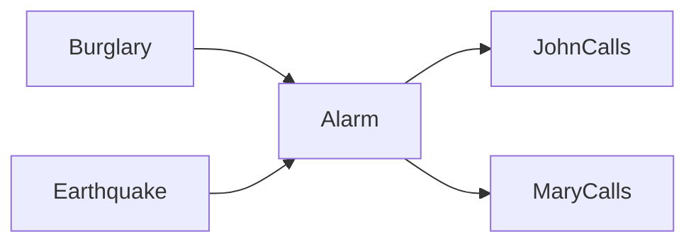

# Bayesian Networks trong Artificial Intelligence

> **Mạch đọc:** Đặt **Bayesian Networks trong Artificial Intelligence** trong bản đồ [README](./README.md) để thấy đơn vị sở hữu (owner / 오너) và vị trí của nó. Nội dung đi từ **Tại sao cần đồ thị (graph / 그래프)?** sang **DAG cấu trúc (structure / 구조)**; điểm nối này chuẩn bị câu hỏi cho các mục sau thay vì dừng ở định nghĩa đầu tiên.


**Bayesian mạng (network / 네트워크)** là một directed acyclic đồ thị (graph / 그래프) (DAG) trong đó mỗi nút (node / 노드) là random variable và mỗi edge biểu diễn phụ thuộc (dependency / 의존성) trực tiếp trong factorization của joint xác suất (probability / 확률). Nó cho phép ta mô hình hóa một phân phối (distribution / 분포) rất lớn bằng các cục bộ (local / 로컬) conditional distributions thay vì viết full joint bảng (table / 테이블).

Bayesian mạng (network / 네트워크) quan trọng vì nó kết hợp ba thứ trong một biểu diễn (representation / 표현):

```text
graph structure
+ probability
+ conditional independence
```

Điều này giúp lập luận (reasoning / 추론) về causes/bằng chứng (evidence / 증거), suy luận (inference / 추론) dưới bất định (uncertainty / 불확실성) và độ phức tạp (complexity / 복잡도) của computation.

Xem trước: [Probabilistic Reasoning](./04_probabilistic_reasoning.md).

## Tại sao cần đồ thị (graph / 그래프)?

Giả sử có `n` nhị phân (binary / 이진) variables. Full joint phân phối (distribution / 분포) cần gần:

\[
2^n-1
\]

independent parameters.

Với 30 nhị phân (binary / 이진) variables, con số entries đã khoảng một tỷ.

Nhưng real domains thường có cục bộ (local / 로컬) cấu trúc (structure / 구조): weather ảnh hưởng traffic; disease ảnh hưởng symptoms; thành phần (component / 컴포넌트) thất bại (failure / 실패) ảnh hưởng alarms. Không phải mọi variable trực tiếp depend mọi variable khác.

Bayesian mạng (network / 네트워크) khai thác cấu trúc (structure / 구조) này.

## DAG cấu trúc (structure / 구조)

Ví dụ:


```mermaid
flowchart LR
    B[Burglary] --> A[Alarm]
    E[Earthquake] --> A
    A --> J[JohnCalls]
    A --> M[MaryCalls]
```

Interpretation probabilistic:

- Alarm depends directly on Burglary and Earthquake.
- JohnCalls and MaryCalls depend directly on Alarm.
- Given Alarm, calls do not need directly depend on Burglary/Earthquake in this mô hình (model / 모델).

Đồ thị (graph / 그래프) is modeling giả định (assumption / 가정), not automatically nhân quả (causal / 인과적) truth.

## Joint factorization

For variables `X1,...,Xn` in topological thứ tự (order / 순서):

\[
P(X_1,...,X_n)=\prod_i P(X_i\mid Parents(X_i))
\]

For burglary mạng (network / 네트워크):

\[
P(B,E,A,J,M)=
P(B)P(E)P(A\mid B,E)P(J\mid A)P(M\mid A)
\]

Instead of full 32-cell bảng (table / 테이블) for five nhị phân (binary / 이진) variables, cục bộ (local / 로컬) CPTs require fewer parameters.

## Conditional xác suất (probability / 확률) bảng (table / 테이블)

For discrete variable, each nút (node / 노드) can have CPT.

Example `Alarm`:

| B | E | P(A=true | B,E) |
|---|---|---:|
| T | T | 0.95 |
| T | F | 0.94 |
| F | T | 0.29 |
| F | F | 0.001 |

Numbers are illustrative modeling values.

CPT rows must define valid xác suất (probability / 확률) distributions.

## Cục bộ (local / 로컬) Markov thuộc tính (property / 속성)

Each variable is conditionally independent of its non-descendants given its parents.

This thuộc tính (property / 속성) justifies factorization.

Example `JohnCalls` independent of `Burglary` given `Alarm` in đồ thị (graph / 그래프):

\[
J\perp B\mid A
\]

But without conditioning on Alarm, they can be dependent because burglary changes alarm xác suất (probability / 확률) which changes lời gọi (call / 호출) xác suất (probability / 확률).

## d-Separation

**d-separation** is graphical criterion for determining conditional independence implied by DAG.

Three thành phần nguyên thủy (primitive / 기본 요소) đường dẫn (path / 경로) structures matter.

### Chuỗi (chain / 사슬)

Phần này chuyển khái niệm Computer Science thành cấu trúc, ví dụ hoặc quy trình có thể kiểm tra. Hãy xác định câu hỏi mà mục trả lời rồi nối kết luận với phần kế tiếp.

```text
X → Z → Y
```

X and Y are generally dependent, but conditioning on Z blocks đường dẫn (path / 경로):

\[
X\perp Y\mid Z
\]

### Fork

Phần này chuyển khái niệm Computer Science thành cấu trúc, ví dụ hoặc quy trình có thể kiểm tra. Hãy xác định câu hỏi mà mục trả lời rồi nối kết luận với phần kế tiếp.

```text
X ← Z → Y
```

Z is dùng chung (common / 공통) cause. Conditioning on Z blocks association:

\[
X\perp Y\mid Z
\]

### Collider

Phần này chuyển khái niệm Computer Science thành cấu trúc, ví dụ hoặc quy trình có thể kiểm tra. Hãy xác định câu hỏi mà mục trả lời rồi nối kết luận với phần kế tiếp.

```text
X → Z ← Y
```

Đường dẫn (path / 경로) is blocked by default. Conditioning on collider `Z` or descendant can **open** đường dẫn (path / 경로) and create phụ thuộc (dependency / 의존성).

This is explaining-away cấu trúc (structure / 구조).

## Collider độ lệch (bias / 편향)

Suppose Ability and Luck both influence being Selected:

```text
Ability → Selected ← Luck
```

In overall population, Ability/Luck may independent. Among selected people, if someone has low ability, observing they were selected increases belief they had luck. Conditioning on selection introduces association.

This has major implications for dataset selection độ lệch (bias / 편향) and nhân quả (causal / 인과적) phân tích (analysis / 분석).

## Markov blanket

Markov blanket of nút (node / 노드) consists of:

- parents;
- children;
- other parents of its children.

Conditioned on Markov blanket, nút (node / 노드) independent of rest of mạng (network / 네트워크).

This can help tính năng (feature / 기능) selection/cục bộ (local / 로컬) suy luận (inference / 추론) intuition.

## Chính xác (exact / 정확한) suy luận (inference / 추론) by enumeration

Truy vấn (query / 쿼리):

\[
P(B\mid J=true,M=true)
\]

Naive phương thức (method / 메서드) sums over hidden variables:

\[
P(B,j,m) = \sum_e\sum_a P(B,e,a,j,m)
\]

then normalize across B.

Correct but repeats many calculations and scales poorly.

## Variable elimination

Variable Elimination reorders computation to reuse factors.

Instead of enumerate every full assignment, multiply cục bộ (local / 로컬) factors and sum hidden variables as soon as possible.

Conceptually:

```text
factors
 ↓ multiply factors involving hidden variable
 ↓ sum out hidden variable
new smaller factor
 ↓ repeat
```

Elimination thứ tự (order / 순서) can radically thay đổi (change / 변경) intermediate factor kích thước (size / 크기).

## Treewidth

Suy luận (inference / 추론) độ phức tạp (complexity / 복잡도) is strongly related to đồ thị (graph / 그래프) treewidth after moralization/elimination cấu trúc (structure / 구조).

Sparse-looking đồ thị (graph / 그래프) may still create large cliques under elimination.

This explains why probabilistic suy luận (inference / 추론) is not simply “number of nodes”. đồ thị (graph / 그래프) topology matters.

## Belief propagation

On tree-structured graphical các mô hình (models / 모델들), messages pass between nodes/factors and yield chính xác (exact / 정확한) marginals efficiently.

A message summarizes how one subtree influences another.

On graphs with loops, **loopy belief propagation** can be used approximately but convergence/tính đúng đắn (correctness / 정확성) not guaranteed generally.

## Sampling suy luận (inference / 추론)

Likelihood weighting, Gibbs sampling and other Monte Carlo methods approximate posterior.

Bằng chứng (evidence / 증거) with very low prior xác suất (probability / 확률) can make rejection sampling extremely inefficient because most samples rejected.

Suy luận (inference / 추론) thuật toán (algorithm / 알고리즘) must match bằng chứng (evidence / 증거)/mô hình (model / 모델) cấu trúc (structure / 구조).

## Học tập (learning / 학습) parameters

If đồ thị (graph / 그래프) known and variables fully observed, CPT parameters can be estimated by counts/MLE or Bayesian estimates.

For discrete nút (node / 노드):

\[
\hat P(X=x\mid Parents=u)=
\frac{count(X=x,Parents=u)}{count(Parents=u)}
\]

Smoothing/prior avoids zero probabilities for unseen combinations.

## Missing dữ liệu (data / 데이터) và EM

When latent/missing variables exist, Expectation-Maximization (EM) can estimate parameters.

Conceptual vòng lặp (loop / 루프):

```text
E-step: infer expected latent assignments under current parameters
M-step: update parameters maximizing expected complete-data likelihood
repeat
```

EM increases likelihood each iteration under tiêu chuẩn (standard / 표준) formulation but can converge cục bộ (local / 로컬) optimum.

## Học tập (learning / 학습) đồ thị (graph / 그래프) cấu trúc (structure / 구조)

Cấu trúc (structure / 구조) itself can be learned from dữ liệu (data / 데이터) by tìm kiếm (search / 검색) over DAGs using scores such as BIC/BDe-like criteria or constraint-based independence tests.

Number DAGs grows super-exponentially, so chính xác (exact / 정확한) tìm kiếm (search / 검색) hard.

Cấu trúc (structure / 구조) học tập (learning / 학습) from observational dữ liệu (data / 데이터) does not automatically recover nhân quả (causal / 인과적) đồ thị (graph / 그래프) without các giả định (assumptions / 가정들).

## Bayesian mạng (network / 네트워크) vs nhân quả (causal / 인과적) DAG

A Bayesian mạng (network / 네트워크) DAG encodes probabilistic factorization/conditional independencies.

A **nhân quả (causal / 인과적) đồ thị (graph / 그래프)** adds stronger ngữ nghĩa (semantics / 의미론): arrows represent nhân quả (causal / 인과적) mechanisms suitable for intervention lập luận (reasoning / 추론).

Same DAG shape can be used descriptively without nhân quả (causal / 인과적) interpretation.

Do not infer “X causes Y” simply because edge `X→Y` appears in predictive mạng (network / 네트워크).

## Intervention

In nhân quả (causal / 인과적) mô hình (model / 모델), intervention `do(X=x)` replaces cơ chế (mechanism / 메커니즘) generating X.

Observation:

\[
P(Y\mid X=x)
\]

Intervention:

\[
P(Y\mid do(X=x))
\]

can differ due confounding.

Bayesian Networks provide graphical foundation, but nhân quả (causal / 인과적) suy luận (inference / 추론) requires nhân quả (causal / 인과적) các giả định (assumptions / 가정들) beyond xác suất (probability / 확률) alone.

## Động (dynamic / 동적) Bayesian mạng (network / 네트워크)

DBN repeats cấu trúc (structure / 구조) across thời gian (time / 시간):

```text
X_t → X_{t+1}
↓       ↓
Y_t    Y_{t+1}
```

HMM and Kalman Filter are special structured động (dynamic / 동적) probabilistic các mô hình (models / 모델들).

DBNs generalize temporal dependencies to multiple variables.

## Noisy-OR

When many independent-ish causes can trigger tác động (effect / 효과), full CPT grows exponential in parent count.

Noisy-OR parameterizes nhân quả (causal / 인과적) influence compactly.

If causes independently thất bại (fail / 실패) to trigger tác động (effect / 효과) with probabilities, xác suất (probability / 확률) no cause succeeds is sản phẩm (product / 제품); complement gives tác động (effect / 효과) xác suất (probability / 확률).

This is example of structured CPD reducing parameter count.

## Continuous variables

Bayesian Networks not limited to discrete CPTs. Conditional distributions can be Gaussian or parameterized functions.

Tuyến tính (linear / 선형) Gaussian BN:

\[
X_i = \beta_0 + \sum_j \beta_j Parent_j + \epsilon
\]

with Gaussian noise.

Hybrid discrete/continuous networks require compatible suy luận (inference / 추론) methods.

## Bayesian Networks và diagnosis

Diagnostic lập luận (reasoning / 추론) often goes from effects to causes:

```text
Disease → Symptom
observe Symptom
infer Disease posterior
```

Đồ thị (graph / 그래프) direction follows generative/causal-like cơ chế (mechanism / 메커니즘); suy luận (inference / 추론) can luồng (flow / 흐름) opposite edge direction through Bayes.

This is crucial: edge direction does not limit truy vấn (query / 쿼리) direction.

## Explaining away in diagnosis

Two diseases cause fever. Observing fever increases both beliefs. If kiểm thử (test / 테스트) confirms disease A, belief disease B may decrease because fever already explained.

Independent causes become dependent after dùng chung (common / 공통) tác động (effect / 효과) observed.

## Quyết định (decision / 결정) Networks

Influence Diagram extends Bayesian mạng (network / 네트워크) with:

- chance nodes;
- quyết định (decision / 결정) nodes;
- utility nodes.

Then choose hành động (action / 동작) maximizing expected utility.

This integrates probabilistic belief with quyết định (decision / 결정) lý thuyết (theory / 이론).

## Bayesian Networks vs Neural Networks

Name similarity is misleading.

```text
Bayesian Network → probabilistic graphical model
Neural Network   → parameterized differentiable function/computation graph
```

A neural mạng (network / 네트워크) can parameterize conditional probabilities inside a probabilistic mô hình (model / 모델), but concepts are distinct.

## Neural conditional xác suất (probability / 확률) các mô hình (models / 모델들)

Instead of CPT, use neural mạng (network / 네트워크):

\[
P(X_i\mid Parents_i;\theta)
\]

This combines đồ thị (graph / 그래프) factorization with flexible hàm (function / 함수) approximator.

Autoregressive neural các mô hình (models / 모델들) are conceptually directed graphical các mô hình (models / 모델들) over chuỗi (sequence / 시퀀스):

\[
P(x_{1:T})=\prod_tP(x_t\mid x_{<t})
\]

Transformer LMs implement these conditionals with neural networks.

## Bayesian mạng (network / 네트워크) và RAG diagnosis

Enterprise AI can use đồ thị (graph / 그래프) to reason phụ thuộc (dependency / 의존성) while RAG retrieves textual bằng chứng (evidence / 증거).

Example sự cố (incident / 인시던트) phản hồi (response / 응답):

```text
Observed logs
   ↓ evidence nodes
probabilistic graph
   ↓ posterior root causes
retrieve docs for top hypotheses
   ↓
LLM explains with sources
```

Đồ thị (graph / 그래프) encodes bất định (uncertainty / 불확실성)/cấu trúc (structure / 구조); LLM handles ngôn ngữ (language / 언어) giao diện (interface / 인터페이스)/explanation.

## Mô hình tư duy (mental model / 사고 모델)

Phần này chốt mental model thành một chuỗi có thể dùng lại: bối cảnh → cơ chế → quan sát → giới hạn → quyết định. Hãy đọc sơ đồ như công cụ suy luận, không như một khẩu hiệu tách khỏi chapter.

```text
Node      = random variable
Edge      = direct dependency in factorization
CPT/CPD   = local conditional distribution
DAG       = no directed cycles
Factorize = joint as product of local conditionals
d-separation = read conditional independencies from graph
Inference = update/query probabilities given evidence
```

## Dùng chung (common / 공통) Misconceptions

### “Edge means causation”

Only if mô hình (model / 모델) is given nhân quả (causal / 인과적) ngữ nghĩa (semantics / 의미론)/các giả định (assumptions / 가정들). Ordinary BN edge means phụ thuộc (dependency / 의존성)/factorization cấu trúc (structure / 구조).

### “No edge means variables independent”

Not necessarily marginally. đồ thị (graph / 그래프) implies specific conditional independencies via d-separation.

### “Conditioning always removes phụ thuộc (dependency / 의존성)”

Conditioning on collider can create phụ thuộc (dependency / 의존성).

### “Bayesian mạng (network / 네트워크) is neural mạng (network / 네트워크) with Bayesian weights”

No. They are different mô hình (model / 모델) families.

## Liên kết kiến thức (knowledge connection / 지식 연결)

Bayesian Networks make probabilistic lập luận (reasoning / 추론) structural: đồ thị (graph / 그래프) topology determines factorization and suy luận (inference / 추론) độ phức tạp (complexity / 복잡도). Concepts here reappear in nhân quả (causal / 인과적) suy luận (inference / 추론), HMMs, probabilistic programming and autoregressive generative các mô hình (models / 모델들).

Xem tiếp: [Knowledge Graphs](./06_knowledge_graphs.md), which represents semantic relations rather than probabilistic dependency by default.
