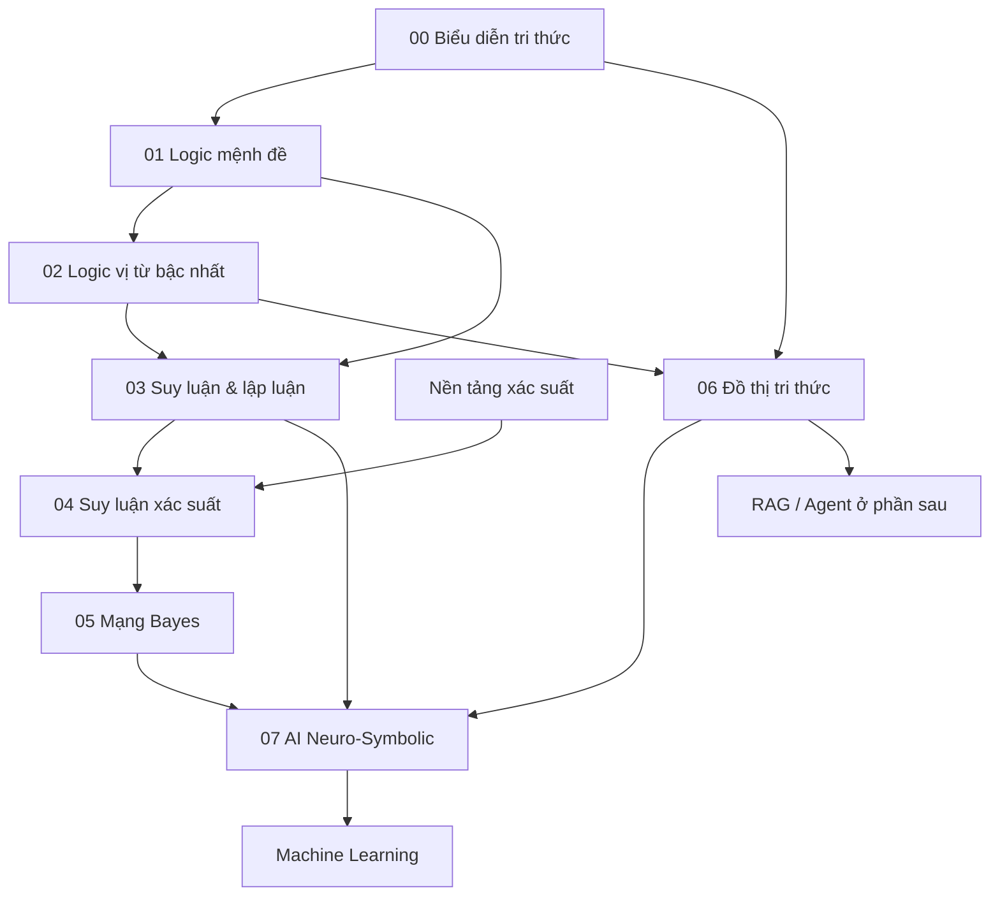

# Biểu diễn tri thức và suy luận

Folder này xây lớp **tri thức + suy luận** nằm giữa giải quyết vấn đề cổ điển và AI dựa trên học máy. Mục tiêu là hiểu cách một hệ thống biểu diễn sự kiện, quan hệ và quy tắc; suy luận bằng logic hoặc xác suất; tổ chức tri thức bằng đồ thị; và kết hợp cơ chế ký hiệu với mô hình neural.

## Các chương

1. [Biểu diễn tri thức](./00_knowledge_representation.md) — thực thể, quan hệ, ontology, giả định thế giới mở/đóng, provenance, tri thức theo thời gian và biểu diễn ký hiệu so với biểu diễn phân tán.
2. [Logic mệnh đề](./01_propositional_logic.md) — cú pháp/ngữ nghĩa, entailment, proof, CNF, resolution, Horn rule, SAT/CDCL và liên hệ với SMT.
3. [Logic vị từ bậc nhất](./02_first_order_logic.md) — predicate, quantifier, unification, resolution, Datalog, Description Logic, vấn đề thời gian/frame và semantic parsing hình thức.
4. [Suy luận và lập luận](./03_inference_and_reasoning.md) — deduction, induction, abduction, forward/backward chaining, suy luận phi đơn điệu, suy luận nhân quả/phản thực và verification.
5. [Suy luận xác suất](./04_probabilistic_reasoning.md) — cập nhật Bayes, biến ẩn, factorization, suy luận chính xác/xấp xỉ, HMM, Kalman Filter và bất định trong AI hiện đại.
6. [Mạng Bayes](./05_bayesian_networks.md) — DAG factorization, độc lập có điều kiện, d-separation, variable elimination, học cấu trúc/tham số và giới hạn khi diễn giải nhân quả.
7. [Đồ thị tri thức](./06_knowledge_graphs.md) — thực thể/quan hệ, ontology, provenance, thời gian, graph query, embedding/GNN, KG-RAG và chất lượng dữ liệu production.
8. [AI ký hiệu và AI Neuro-Symbolic](./07_symbolic_neurosymbolic_ai.md) — điểm mạnh/giới hạn của symbolic và neural AI, cùng kiến trúc proposer → verifier → executor.

## Sơ đồ phụ thuộc



## Chân lý hình thức và chân lý ngoài thế giới thực

Một nguyên tắc xuyên suốt folder này là:

> **Một bộ máy suy luận có thể hoàn toàn đúng so với biểu diễn đã cho, nhưng chính biểu diễn đó vẫn có thể sai hoặc thiếu so với thực tế.**

Bộ chứng minh logic chỉ chứng minh định lý từ các tiền đề. Solver chỉ xác nhận các ràng buộc đã được mã hóa. Knowledge Graph chỉ trả lại những sự kiện đã lưu hoặc những hệ quả mà ontology cho phép suy ra. Không cơ chế nào tự động bảo đảm tri thức đầu vào phản ánh đúng thế giới thật.

Vì vậy một hệ AI đáng tin cậy phải phân biệt rõ:

```text
độ đúng của biểu diễn
độ đúng của suy luận
chất lượng nguồn / provenance
mức bất định
kiểm chứng ngoài thế giới thực
```

## Suy luận ký hiệu và suy luận xác suất

```text
Logic
→ đúng / sai dưới ngữ nghĩa hình thức
→ entailment / proof chính xác

Probability
→ phân phối trên nhiều khả năng
→ cập nhật niềm tin khi có bằng chứng
```

Hệ thống thực tế thường cần cả hai. Quy tắc phân quyền cứng nên được xử lý xác định; điểm rủi ro gian lận lại phù hợp hơn với xác suất.

## Liên hệ với AI hiện đại

Lớp kiến thức này vẫn rất quan trọng vì nhiều khái niệm quay lại trực tiếp trong Generative AI:

```text
Knowledge Graph      → retrieval có cấu trúc / GraphRAG
Ontology / schema    → chuẩn hóa thực thể / hợp đồng tool
SAT / SMT / CP solver→ lập kế hoạch / xếp lịch có kiểm chứng
Formal proof         → verification cho theorem/coding agent
Probabilistic belief → quyết định có nhận thức bất định
Neural heuristic     → hướng dẫn symbolic search
LLM                  → giao diện ngôn ngữ tự nhiên / proposer
```

Một kiến trúc sẽ xuất hiện nhiều lần ở các phần sau là:

```text
mô hình học được đề xuất
        ↓
biểu diễn có cấu trúc
        ↓
công cụ xác định / hình thức kiểm tra hoặc thực thi
        ↓
kết quả thật trở thành trạng thái mới
```

Đây là nền tảng để hiểu RAG và Agent như **hệ AI hợp thành (composed AI system)**, chứ không phải một mô hình duy nhất làm mọi thứ.