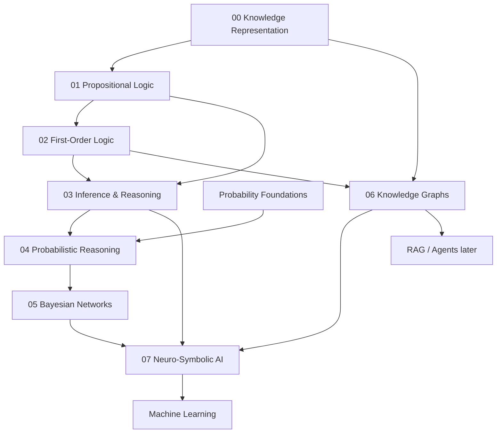

# Knowledge Representation and Reasoning

Folder này xây lớp **knowledge + inference** nằm giữa problem solving cổ điển và learning-based AI. Mục tiêu là hiểu cách một system biểu diễn facts/relations/rules, suy luận bằng logic hoặc probability, tổ chức tri thức bằng graph, và kết hợp symbolic mechanisms với neural models.

## Chapters

1. [Knowledge Representation](./00_knowledge_representation.md) — entities, relations, ontology, open/closed world, provenance, temporal knowledge, symbolic vs distributed representation.
2. [Propositional Logic](./01_propositional_logic.md) — syntax/semantics, entailment, proof, CNF, resolution, Horn rules, SAT/CDCL và SMT connection.
3. [First-Order Logic](./02_first_order_logic.md) — predicates, quantifiers, unification, resolution, Datalog/Description Logics, temporal/frame problem và formal semantic parsing.
4. [Inference and Reasoning](./03_inference_and_reasoning.md) — deduction, induction, abduction, forward/backward chaining, non-monotonic reasoning, causal/counterfactual reasoning và verification.
5. [Probabilistic Reasoning](./04_probabilistic_reasoning.md) — Bayesian update, latent variables, factorization, exact/approximate inference, HMM/Kalman và uncertainty in modern AI.
6. [Bayesian Networks](./05_bayesian_networks.md) — DAG factorization, conditional independence, d-separation, variable elimination, learning và causal caveats.
7. [Knowledge Graphs](./06_knowledge_graphs.md) — entities/relations, ontology, provenance/time, graph queries, embeddings/GNNs, KG-RAG và production data quality.
8. [Symbolic and Neuro-Symbolic AI](./07_symbolic_neurosymbolic_ai.md) — strengths/limits của symbolic vs neural AI và architectures proposer → verifier → executor.

## Dependency map



## Formal truth và real-world truth

Một principle xuyên suốt folder:

> **Một inference engine có thể hoàn toàn đúng relative to representation nhưng representation vẫn có thể sai hoặc thiếu so với real world.**

Logic prover chứng minh theorem từ premises; solver xác nhận constraints; KG query trả facts stored. Không mechanism nào tự đảm bảo input knowledge phản ánh đúng reality.

Vì vậy reliable AI cần phân biệt:

```text
representation correctness
inference correctness
source/provenance quality
uncertainty
real-world validation
```

## Symbolic và probabilistic reasoning

```text
Logic
→ true/false under formal semantics
→ exact entailment/proof

Probability
→ distribution over possibilities
→ update beliefs under uncertainty
```

Real systems thường cần cả hai. Hard access-control rule nên deterministic; fraud risk có thể probabilistic.

## Connection với Modern AI

Layer này được giữ lại vì concepts của nó quay lại trực tiếp trong Generative AI:

```text
Knowledge Graph      → structured retrieval / GraphRAG
Ontology/schema      → entity normalization / tool contracts
SAT/SMT/CP solver    → verified planning / scheduling
Formal proof         → theorem/coding agent verification
Probabilistic belief → uncertainty-aware decisions
Neural heuristic     → guide symbolic search
LLM                  → natural-language interface / proposer
```

Một kiến trúc recurring trong library sau này là:

```text
learned model proposes
        ↓
structured representation
        ↓
deterministic / formal tool verifies or executes
        ↓
actual result becomes new state
```

Đây là nền để hiểu RAG và Agent systems như **composed AI systems**, không phải một model duy nhất làm mọi thứ.