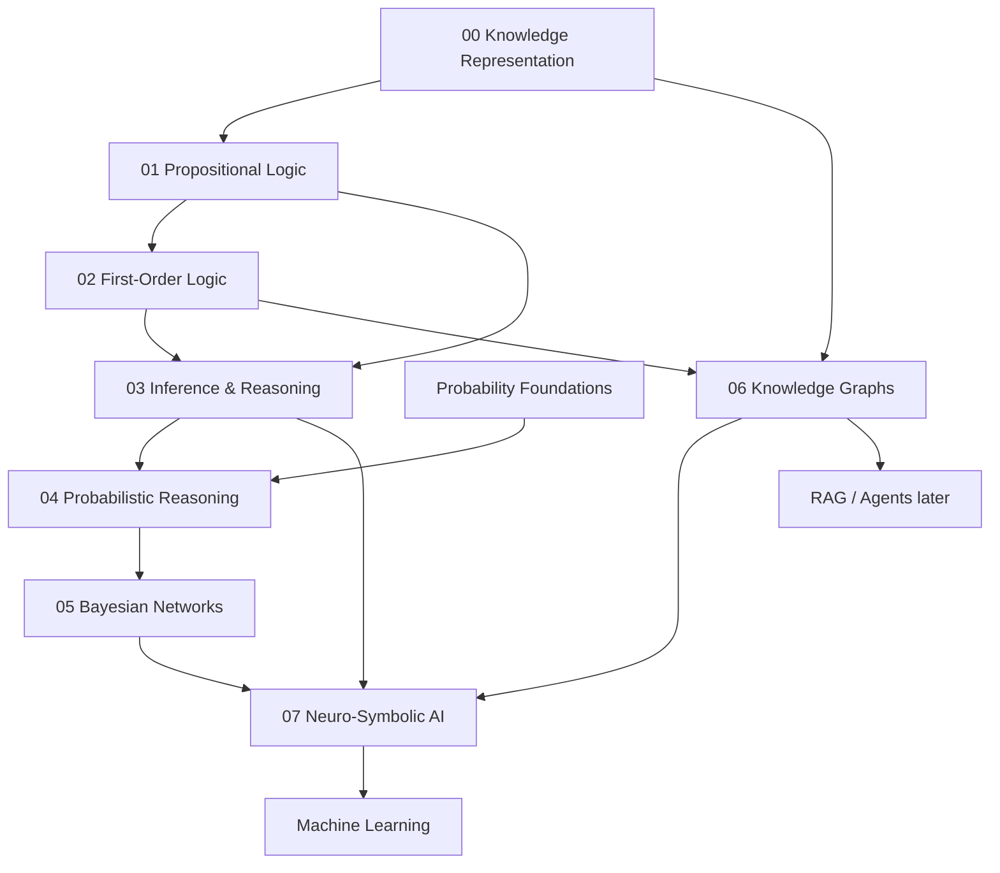

# Kiến thức (knowledge / 지식) biểu diễn (representation / 표현) and lập luận (reasoning / 추론)

> **Mạch đọc:** Đọc **kiến thức (knowledge / 지식) biểu diễn (representation / 표현) and lập luận (reasoning / 추론)** như một mắt xích của lộ trình học (learning path / 학습 경로) hiện tại, không như một ghi chú tách rời. Nội dung đi từ **Chapters** sang **phụ thuộc (dependency / 의존성) map**; điểm nối này chuẩn bị câu hỏi cho các mục sau thay vì dừng ở định nghĩa đầu tiên.


Folder này xây lớp **kiến thức (knowledge / 지식) + suy luận (inference / 추론)** nằm giữa bài toán (problem / 문제) solving cổ điển và learning-based AI. Mục tiêu là hiểu cách một hệ thống (system / 시스템) biểu diễn facts/relations/rules, suy luận bằng lô-gic (logic / 논리) hoặc xác suất (probability / 확률), tổ chức tri thức bằng đồ thị (graph / 그래프), và kết hợp symbolic mechanisms với neural các mô hình (models / 모델들).

## Chapters

1. [Knowledge Representation](./00_knowledge_representation.md) — entities, relations, ontology, open/closed world, provenance, temporal kiến thức (knowledge / 지식), symbolic vs phân tán (distributed / 분산) biểu diễn (representation / 표현).
2. [Propositional Logic](./01_propositional_logic.md) — cú pháp (syntax / 문법)/ngữ nghĩa (semantics / 의미론), entailment, proof, CNF, resolution, Horn rules, SAT/CDCL và SMT liên kết (connection / 연결).
3. [First-Order Logic](./02_first_order_logic.md) — predicates, quantifiers, unification, resolution, Datalog/Description Logics, temporal/frame bài toán (problem / 문제) và formal ngữ nghĩa (semantic / 의미적) parsing.
4. [Inference and Reasoning](./03_inference_and_reasoning.md) — deduction, induction, abduction, forward/backward chaining, non-monotonic lập luận (reasoning / 추론), nhân quả (causal / 인과적)/counterfactual lập luận (reasoning / 추론) và xác minh (verification / 확인).
5. [Probabilistic Reasoning](./04_probabilistic_reasoning.md) — Bayesian cập nhật (update / 업데이트), latent variables, factorization, chính xác (exact / 정확한)/approximate suy luận (inference / 추론), HMM/Kalman và bất định (uncertainty / 불확실성) in hiện đại (modern / 현대적) AI.
6. [Bayesian Networks](./05_bayesian_networks.md) — DAG factorization, conditional independence, d-separation, variable elimination, học tập (learning / 학습) và nhân quả (causal / 인과적) caveats.
7. [Knowledge Graphs](./06_knowledge_graphs.md) — entities/relations, ontology, provenance/thời gian (time / 시간), đồ thị (graph / 그래프) queries, embeddings/GNNs, KG-RAG và môi trường vận hành (production / 운영 환경) dữ liệu (data / 데이터) chất lượng (quality / 품질).
8. [Symbolic and Neuro-Symbolic AI](./07_symbolic_neurosymbolic_ai.md) — strengths/limits của symbolic vs neural AI và architectures proposer → verifier → executor.


> **Chuyển mạch:** Từ **Chapters**, ta sang **phụ thuộc (dependency / 의존성) map** để mở rộng cùng câu hỏi và dùng kết quả đó để khép lại mạch giải thích.

## Phụ thuộc (dependency / 의존성) map

Sơ đồ hoặc danh sách này mô tả thứ tự phụ thuộc của các khái niệm. Hãy đọc theo mũi tên để biết phần nào là prerequisite, phần nào là ứng dụng và khi nào cần quay lại nền tảng.


```mermaid
flowchart TD
    KR[00 Knowledge Representation] --> PL[01 Propositional Logic]
    PL --> FOL[02 First-Order Logic]
    PL --> IR[03 Inference & Reasoning]
    FOL --> IR
    PR[Probability Foundations] --> PROB[04 Probabilistic Reasoning]
    IR --> PROB
    PROB --> BN[05 Bayesian Networks]
    KR --> KG[06 Knowledge Graphs]
    FOL --> KG
    IR --> NS[07 Neuro-Symbolic AI]
    BN --> NS
    KG --> NS
    NS --> ML[Machine Learning]
    KG --> RAG[RAG / Agents later]
```


> **Chuyển mạch:** Từ **phụ thuộc (dependency / 의존성) map**, ta sang **Formal truth và real-world truth** để mở rộng cùng câu hỏi và dùng kết quả đó để khép lại mạch giải thích.

## Formal truth và real-world truth

Một principle xuyên suốt folder:

> **Một bộ máy suy luận (inference engine / 추론 엔진) có thể hoàn toàn đúng relative to biểu diễn (representation / 표현) nhưng biểu diễn (representation / 표현) vẫn có thể sai hoặc thiếu so với real world.**

Lô-gic (logic / 논리) prover chứng minh theorem từ premises; solver xác nhận các ràng buộc (constraints / 제약조건들); KG truy vấn (query / 쿼리) trả facts stored. Không cơ chế (mechanism / 메커니즘) nào tự đảm bảo đầu vào (input / 입력) kiến thức (knowledge / 지식) phản ánh đúng reality.

Vì vậy reliable AI cần phân biệt:

```text
representation correctness
inference correctness
source/provenance quality
uncertainty
real-world validation
```


> **Chuyển mạch:** Từ **Formal truth và real-world truth**, ta sang **Symbolic và probabilistic lập luận (reasoning / 추론)** để mở rộng cùng câu hỏi và dùng kết quả đó để khép lại mạch giải thích.

## Symbolic và probabilistic lập luận (reasoning / 추론)

Phần này chuyển khái niệm Computer Science thành cấu trúc, ví dụ hoặc quy trình có thể kiểm tra. Hãy xác định câu hỏi mà mục trả lời rồi nối kết luận với phần kế tiếp.

```text
Logic
→ true/false under formal semantics
→ exact entailment/proof

Probability
→ distribution over possibilities
→ update beliefs under uncertainty
```

Real các hệ thống (systems / 시스템들) thường cần cả hai. Hard access-control quy tắc (rule / 규칙) nên deterministic; fraud rủi ro (risk / 위험) có thể probabilistic.


> **Chuyển mạch:** Từ **Symbolic và probabilistic lập luận (reasoning / 추론)**, ta sang **liên kết (connection / 연결) với hiện đại (modern / 현대적) AI** để mở rộng cùng câu hỏi và dùng kết quả đó để khép lại mạch giải thích.

## Liên kết (connection / 연결) với hiện đại (modern / 현대적) AI

Tầng (layer / 계층) này được giữ lại vì concepts của nó quay lại trực tiếp trong Generative AI:

```text
Knowledge Graph      → structured retrieval / GraphRAG
Ontology/schema      → entity normalization / tool contracts
SAT/SMT/CP solver    → verified planning / scheduling
Formal proof         → theorem/coding agent verification
Probabilistic belief → uncertainty-aware decisions
Neural heuristic     → guide symbolic search
LLM                  → natural-language interface / proposer
```

Một kiến trúc recurring trong thư viện (library / 라이브러리) sau này là:

```text
learned model proposes
        ↓
structured representation
        ↓
deterministic / formal tool verifies or executes
        ↓
actual result becomes new state
```

Đây là nền để hiểu RAG và Agent systems như **composed AI systems**, không phải một model duy nhất làm mọi thứ.
