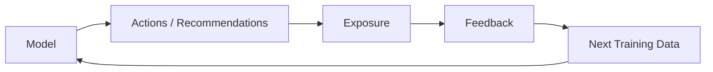

# Data, Features và Labels trong Machine Learning

Machine Learning học từ data, nhưng “data” không phải một material trung tính. Dataset là kết quả của measurement, logging, sampling, labeling và policy. Nếu những process này sai, model có thể tối ưu rất tốt một representation méo của reality.

Vì vậy trước khi chọn algorithm, cần hiểu **mỗi row/example đại diện điều gì, feature có available tại prediction time không, label được tạo như thế nào, population nào bị bỏ sót và data có dependency theo user/time/group hay không**.

## Unit of observation

Trước tiên xác định một example là gì.

Fraud detection:

```text
one row = one transaction?
one account-day?
one user-session?
```

Churn:

```text
one customer snapshot at reference date
```

Nếu unit không rõ, feature/label time boundaries rất dễ leak.

## Feature

Feature (특성 / 특징량) là measurable representation used by model.

Examples:

```text
age
transaction_amount
number_of_logins_last_7_days
embedding(document)
image pixels
```

Feature is not necessarily causal or human-interpretable. Deep models learn internal features automatically.

## Target / Label

Label (레이블 / 정답) là desired outcome used in supervised training.

Examples:

```text
fraud within 30 days
customer churned
house sale price
next token
```

Label definition must include time horizon and event semantics.

“Churn” can mean no login 30 days, contract cancellation, or no payment 90 days. Different definitions create different tasks.

## Prediction time / cutoff

For each sample define timestamp `t0` when prediction would be made.

Valid features must be available by `t0`.

Label may use future window after `t0`:

```text
features: history <= t0
label: event in (t0, t0+30d]
```

This simple timeline prevents many leakage bugs.

## Feature leakage

A feature leaks if it contains information unavailable legitimately at prediction time.

Example predicting loan default using `collection_status` recorded after default.

Model metric becomes artificially high because it sees consequence of target.

Leakage often survives code review because column looks innocuous; semantic timestamp lineage matters.

## Preprocessing leakage

Even label-free transformation can leak test distribution.

Wrong:

```text
fit scaler on all data
then split train/test
```

Correct:

```text
split
fit scaler on train only
apply same scaler to validation/test
```

Same rule for imputation, feature selection, PCA, target encoding and any fitted preprocessing.

Use pipeline abstraction to ensure transformations fit only training folds.

## Label leakage via aggregates

Suppose feature “customer lifetime spend” is computed using data after prediction date. Even if label column absent, future information leaks.

Every aggregate needs temporal cutoff:

```sql
SUM(amount)
WHERE transaction_time < prediction_time
```

Production feature stores often encode point-in-time correctness specifically for this reason.

## Proxy features

Feature may indirectly reveal target.

Hospital ward code may proxy disease severity. ZIP code may proxy socioeconomic/racial structure.

A proxy can be technically legitimate predictor but create fairness, privacy or robustness concerns.

Feature review must consider semantics, not just correlation.

## Numerical features

Continuous:

```text
age, price, temperature
```

Discrete counts:

```text
number_of_logins
```

Scaling matters for distance/gradient-based algorithms but not usually tree split ordering in same way.

Standardization:

\[
z=\frac{x-\mu}{\sigma}
\]

fit `μ,σ` on training data only.

## Categorical features

Nominal categories have no inherent order:

```text
country, browser, product_category
```

One-hot encoding avoids fake numeric order.

High-cardinality categories create huge sparse vectors; alternatives include hashing, learned embeddings or carefully regularized target/statistical encoding.

## Ordinal features

Categories have order:

```text
low < medium < high
```

Encoding numeric order may be appropriate, but distance between levels need not equal.

Model assumptions determine whether ordinal integer representation is safe.

## One-hot encoding

Category with K values becomes vector:

```text
red   → [1,0,0]
green → [0,1,0]
blue  → [0,0,1]
```

No artificial ordering, but dimensionality increases.

Unknown category at inference requires explicit handling.

## Target encoding

Replace category with statistic of target:

\[
TE(c)=E[Y\mid category=c]
\]

Very powerful but extremely leakage-prone. Must compute out-of-fold/training-only statistics and smooth rare categories.

A category appearing once with positive label should not receive perfect 1.0 signal blindly.

## Missing data

Missingness can mean different things:

```text
not measured
not applicable
sensor failed
user chose not to answer
value genuinely zero? no
```

Replacing every missing value with 0 destroys semantics.

Strategies:

- explicit missing category;
- median/mean imputation;
- model-native missing handling;
- missing indicator;
- domain-specific imputation.

## MCAR, MAR, MNAR intuition

Missing Completely At Random: missing unrelated to values.

Missing At Random: missingness explainable by observed variables.

Missing Not At Random: missingness depends on unobserved/missing value itself.

These assumptions affect statistical validity. Real data often MNAR-like.

## Outliers

Outlier can be:

- data error;
- rare valid event;
- fraud/anomaly we actually care about.

Blind clipping/removal may erase target signal.

Investigate source and task semantics first.

Robust transformations/losses may handle heavy tails better.

## Log transformation

Positive skewed feature like transaction amount may be transformed:

\[
x'=\log(1+x)
\]

This compresses large values and can make multiplicative relations more linear.

Transformation encodes assumption; preserve interpretation/inverse transform where needed.

## Interaction features

Linear model cannot naturally express interaction unless feature included:

\[
y=\beta_1x_1+\beta_2x_2+\beta_3x_1x_2
\]

Trees/neural networks can learn interactions automatically to differing degrees.

Feature engineering is partly choosing basis where task becomes simpler.

## Text representation

Traditional:

- bag-of-words;
- TF-IDF;
- n-grams.

Modern:

- token IDs;
- learned embeddings;
- contextual transformer representations.

Text preprocessing such as lowercasing/stemming can remove useful information depending language/model.

## Image representation

Pixels are tensors. Common processing:

- resize/crop;
- normalize channels;
- augmentation.

Augmentation must preserve label semantics.

Medical/remote-sensing images need domain-specific care around orientation, resolution and metadata.

## Time-series features

A row at time `t` may use lags:

\[
x_{t-1},x_{t-7}
\]

rolling statistics:

\[
mean(x_{t-6:t})
\]

Never include future values.

Random train/test split often invalid because future leaks into past distribution.

## Grouped data

Multiple rows from same user/patient/device are correlated.

If one user's rows appear in both train and test, model may memorize identity-specific patterns.

Use group-aware split when deployment target is unseen entities.

Evaluation boundary should match actual use case.

## Duplicate data

Near-duplicate images/documents in train/test inflate metrics.

Web-scale datasets have substantial duplicates. Deduplication reduces memorization leakage and contamination.

Exact hashes catch exact duplicates; perceptual/minhash/embedding methods can catch near duplicates.

## Dataset contamination

Benchmark/test examples may appear in training corpus.

Then benchmark performance no longer clean measure of generalization.

Foundation model evaluation must consider contamination detection and temporal/source separation.

## Label noise

Labels can be wrong due to annotator disagreement, ambiguous definition or delayed outcome.

If 10% labels random wrong, training objective contains irreducible conflict.

Strategies:

- relabel high-impact examples;
- consensus/multiple annotators;
- robust losses;
- confidence labels;
- model disagreement review.

## Inter-Annotator Agreement

For subjective tasks, disagreement is information, not simply noise.

Metrics like Cohen's kappa or Krippendorff's alpha quantify agreement under specific settings.

Low agreement may mean task definition inherently ambiguous; forcing one “gold label” hides uncertainty.

## Weak supervision

Labels generated by heuristics/rules/external models rather than manual ground truth.

Example:

```text
email containing known malicious URL → weak spam label
```

Weak supervision scales but introduces systematic label noise. Multiple labeling functions can be combined probabilistically.

## Positive-Unlabeled data

Sometimes positive labels reliable but negatives absent; unlabeled set mixes positives and negatives.

Example known fraud cases vs all uninvestigated transactions.

Treating all unlabeled as negative biases model. PU-learning methods model this sampling process.

## Class imbalance

Rare class example:

```text
fraud = 0.1%
```

Accuracy becomes misleading.

Training options include:

- class weighting;
- resampling;
- focal-like losses;
- anomaly framing.

But evaluation should preserve real prevalence unless intentionally testing scenario.

## Resampling caveats

Oversampling positive class changes training distribution. Probability output may become miscalibrated relative to real base rate.

Decision threshold/calibration may need correction.

Never duplicate samples across train/test due to oversampling before split.

## Feature selection

Reasons to select features:

- reduce noise/overfitting;
- latency/cost;
- interpretability;
- missingness/privacy;
- high-dimensional classical model constraints.

Methods:

- filter statistics;
- wrapper methods;
- embedded methods (L1/tree importance).

Selection must occur inside training folds to avoid leakage.

## Feature importance is not feature validity

A feature can be highly important because it leaks target or encodes undesirable proxy.

Importance answers model dependence, not whether feature should be used.

Governance review still necessary.

## Feature store

Production feature store helps reuse feature definitions and maintain consistency between training/serving.

Key challenge: **training-serving skew**.

If offline SQL computes feature differently from online service, model sees different distribution after deployment.

Shared transformations/point-in-time retrieval reduce skew.

## Data versioning

To reproduce model, record:

```text
data snapshot/version
schema
label definition
feature code
preprocessing parameters
split IDs
```

Model artifact without data lineage is not reproducible.

## Data quality dimensions

Useful dimensions:

- completeness;
- validity;
- consistency;
- uniqueness;
- freshness;
- accuracy;
- representativeness.

“Clean data” is not binary.

## Sampling bias

Dataset sample may not represent deployment population.

Example survey users who respond differ from non-responders.

Large sample size does not fix systematic sampling bias.

Need understand collection mechanism and sometimes weighting/recruitment changes.

## Survivorship bias

Only successful entities remain in records.

Predicting startup success using only surviving companies creates distorted distribution.

Always ask which failed/absent cases disappeared from dataset.

## Feedback loops

Model deployment changes future data.

Recommender chooses what users see, then learns from clicks on shown content.



Logged data is policy-dependent, not neutral.

## Privacy

Features may contain PII or sensitive inferred information.

Need:

- minimization;
- access control;
- retention policy;
- encryption;
- consent/legal basis where applicable.

Embedding sensitive text does not automatically anonymize it.

## Data documentation

Dataset card/data sheet can record:

```text
source
collection period
population
labeling process
known limitations
license
sensitive attributes
recommended uses
```

Documentation improves future evaluation and governance.

## Mental Model

```text
Example       = unit model learns/predicts about
Feature       = information available at prediction time
Label         = operational definition of target
Cutoff time   = boundary preventing future leakage
Sampling      = why these examples entered dataset
Preprocessing = learned transformation fit on training only
Data lineage  = where every value came from
```

## Common Misconceptions

### “More features always improve model”

Irrelevant/leaky/noisy features can hurt generalization, latency and governance.

### “Missing value = 0”

Missingness has semantics; zero may be valid value.

### “Random split is always correct”

Time/group/entity dependencies often require specialized split.

### “Label is ground truth”

Labels are measurements/definitions and can be noisy, subjective or policy-dependent.

## Knowledge Connection

Data design determines what statistical learning can discover. Model sophistication cannot recover information absent from features or correct a fundamentally wrong label definition.

Xem tiếp: [Training, Validation and Testing](./03_training_validation_and_testing.md).