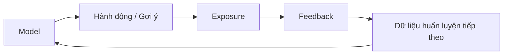

# Dữ liệu, đặc trưng và nhãn trong Machine Learning

Machine Learning học từ dữ liệu, nhưng “dữ liệu” không phải một vật liệu trung tính. Một dataset là kết quả của quá trình đo lường, ghi log, lấy mẫu, gán nhãn và áp dụng chính sách. Nếu những quá trình này sai hoặc lệch, mô hình có thể tối ưu rất tốt trên một phiên bản méo mó của thực tế.

Vì vậy trước khi chọn thuật toán, cần hiểu rõ **mỗi dòng dữ liệu đại diện điều gì, đặc trưng có thật sự tồn tại tại thời điểm dự đoán hay không, nhãn được tạo như thế nào, nhóm đối tượng nào bị bỏ sót và dữ liệu có phụ thuộc theo người dùng, thời gian hoặc nhóm hay không**.

## Đơn vị quan sát

Trước hết phải xác định một mẫu dữ liệu (example) đại diện cho điều gì.

Trong phát hiện gian lận:

```text
một dòng = một giao dịch?
một tài khoản trong một ngày?
một phiên sử dụng?
```

Trong dự đoán churn:

```text
một dòng = trạng thái của một khách hàng tại ngày tham chiếu
```

Nếu đơn vị quan sát (unit of observation) không rõ, ranh giới thời gian của feature và label rất dễ bị sai và gây leakage.

## Đặc trưng

**Đặc trưng (feature / 특성)** là phần thông tin được đo hoặc biểu diễn để mô hình sử dụng.

Ví dụ:

```text
age
transaction_amount
number_of_logins_last_7_days
embedding(document)
image pixels
```

Feature không nhất thiết phải mang ý nghĩa nhân quả hoặc con người dễ hiểu. Trong Deep Learning, nhiều feature trung gian được mô hình tự học.

## Nhãn và mục tiêu

**Nhãn (label / 레이블)** là đầu ra mục tiêu dùng trong supervised learning.

Ví dụ:

```text
có gian lận trong 30 ngày tới
khách hàng đã churn
giá bán căn nhà
token tiếp theo
```

Định nghĩa label phải bao gồm cả ý nghĩa sự kiện và khoảng thời gian.

Ví dụ “churn” có thể được định nghĩa là không đăng nhập 30 ngày, hủy hợp đồng hoặc không thanh toán 90 ngày. Mỗi định nghĩa tạo ra một bài toán khác nhau.

## Thời điểm dự đoán và mốc cắt dữ liệu

Mỗi mẫu nên có một thời điểm `t0` đại diện cho lúc dự đoán thật sự được đưa ra.

Mọi feature hợp lệ phải có sẵn trước hoặc tại `t0`.

Label có thể được xác định trong một cửa sổ tương lai:

```text
feature: lịch sử <= t0
label: sự kiện trong (t0, t0+30 ngày]
```

Chỉ cần vẽ rõ timeline này đã có thể ngăn rất nhiều lỗi leakage.

## Rò rỉ đặc trưng

Một feature bị **rò rỉ (feature leakage)** nếu nó chứa thông tin mà tại thời điểm dự đoán thực tế hệ thống chưa thể biết hợp lệ.

Ví dụ dự đoán khoản vay có vỡ nợ hay không nhưng lại dùng cột `collection_status` chỉ được ghi sau khi quá trình thu hồi nợ bắt đầu.

Metric có thể tăng rất cao vì mô hình đang nhìn thấy hậu quả của chính target.

Leakage thường không dễ phát hiện bằng code review vì tên cột có thể trông bình thường. Cần hiểu lineage và timestamp mang ý nghĩa nghiệp vụ.

## Leakage trong tiền xử lý

Ngay cả một phép biến đổi không trực tiếp dùng label vẫn có thể làm test set rò rỉ vào training.

Cách sai:

```text
fit scaler trên toàn bộ dữ liệu
sau đó mới chia train/test
```

Cách đúng:

```text
chia dữ liệu trước
fit scaler chỉ trên train
áp dụng scaler đó lên validation/test
```

Nguyên tắc tương tự áp dụng cho imputation, feature selection, PCA, target encoding và mọi bước tiền xử lý cần “fit”.

Pipeline abstraction giúp bảo đảm các phép biến đổi chỉ được học trên training fold.

## Leakage qua feature tổng hợp

Giả sử feature “tổng chi tiêu suốt vòng đời khách hàng” được tính bằng cả dữ liệu phát sinh sau ngày dự đoán. Dù không trực tiếp chứa label, nó vẫn nhìn thấy tương lai.

Mọi phép tổng hợp theo thời gian cần có mốc cắt:

```sql
SUM(amount)
WHERE transaction_time < prediction_time
```

Đây là lý do feature store trong production thường nhấn mạnh tính đúng theo thời điểm (point-in-time correctness).

## Feature đại diện gián tiếp

Một feature có thể vô tình làm đại diện (proxy) cho biến khác.

Ví dụ mã khoa bệnh viện có thể là proxy cho mức độ nặng của bệnh. ZIP code có thể gián tiếp phản ánh cấu trúc kinh tế-xã hội hoặc nhóm dân cư.

Proxy có thể rất hữu ích về mặt dự đoán nhưng tạo rủi ro về fairness, privacy hoặc robustness.

Vì vậy cần review ý nghĩa của feature, không chỉ xem correlation.

## Đặc trưng số

Đặc trưng liên tục có thể là tuổi, giá hoặc nhiệt độ.

Đặc trưng đếm rời rạc có thể là số lần đăng nhập.

Scale ảnh hưởng mạnh tới thuật toán dựa trên khoảng cách hoặc gradient, nhưng thường không ảnh hưởng decision tree theo cùng cách.

Chuẩn hóa chuẩn (standardization):

\[
z=\frac{x-\mu}{\sigma}
\]

Trong đó `μ` và `σ` phải được fit chỉ từ training data.

## Đặc trưng phân loại

Các category không có thứ tự tự nhiên:

```text
country, browser, product_category
```

One-hot encoding tránh tạo một thứ tự số giả.

Với category có cardinality rất lớn, one-hot tạo vector thưa cực lớn. Các phương án khác gồm hashing, embedding học được hoặc target encoding có regularization chặt.

## Đặc trưng thứ bậc

Một số category có thứ tự:

```text
low < medium < high
```

Có thể mã hóa bằng số, nhưng khoảng cách giữa các mức không nhất thiết bằng nhau.

Cách mã hóa có hợp lý hay không phụ thuộc giả định của mô hình phía sau.

## One-hot encoding

Category có `K` giá trị được chuyển thành vector:

```text
red   → [1,0,0]
green → [0,1,0]
blue  → [0,0,1]
```

Cách này không tạo thứ tự giả nhưng làm tăng số chiều.

Category chưa từng thấy trong training cũng phải có chiến lược xử lý rõ khi inference.

## Target encoding

Target encoding thay mỗi category bằng một thống kê của target:

\[
TE(c)=E[Y\mid category=c]
\]

Cách này rất mạnh nhưng cực kỳ dễ leakage.

Thống kê cần được tính theo kiểu out-of-fold hoặc training-only và phải smoothing cho category hiếm.

Một category chỉ xuất hiện một lần với nhãn dương không nên được gán tín hiệu hoàn hảo `1.0` một cách mù quáng.

## Dữ liệu thiếu

Giá trị thiếu có thể mang nhiều ý nghĩa:

```text
chưa đo
không áp dụng
cảm biến lỗi
người dùng không muốn trả lời
không đồng nghĩa với số 0
```

Thay tất cả missing value bằng `0` có thể phá hỏng ngữ nghĩa.

Các chiến lược gồm category “missing” riêng, median/mean imputation, mô hình xử lý missing trực tiếp, thêm cờ missing hoặc dùng cách bù theo tri thức miền.

## MCAR, MAR và MNAR

**Missing Completely At Random (MCAR)**: việc thiếu dữ liệu không liên quan tới giá trị.

**Missing At Random (MAR)**: khả năng bị thiếu có thể được giải thích bằng các biến đã quan sát.

**Missing Not At Random (MNAR)**: việc bị thiếu phụ thuộc vào chính giá trị chưa quan sát hoặc yếu tố chưa biết.

Những giả định này ảnh hưởng trực tiếp tính hợp lệ của phân tích thống kê. Dữ liệu thực tế thường có nhiều tình huống gần MNAR.

## Ngoại lệ dữ liệu

Một outlier có thể là lỗi dữ liệu, sự kiện hiếm nhưng hợp lệ, hoặc chính fraud/anomaly mà ta muốn phát hiện.

Xóa hoặc clipping outlier một cách tự động có thể loại bỏ tín hiệu quan trọng nhất của bài toán.

Cần điều tra nguồn gốc và ý nghĩa nghiệp vụ trước.

Với heavy tail, có thể dùng phép biến đổi hoặc loss bền vững hơn.

## Biến đổi log

Với feature dương có phân phối lệch mạnh như transaction amount, có thể dùng:

\[
x'=\log(1+x)
\]

Phép biến đổi này nén các giá trị rất lớn và đôi khi làm quan hệ dạng nhân trở nên gần tuyến tính hơn.

Tuy nhiên đây cũng là một giả định mô hình hóa và phải giữ khả năng diễn giải hoặc inverse transform nếu cần.

## Feature tương tác

Mô hình tuyến tính không tự biểu diễn interaction nếu không thêm thành phần:

\[
y=\beta_1x_1+\beta_2x_2+\beta_3x_1x_2
\]

Decision tree và neural network có thể học interaction tự động ở những mức độ khác nhau.

Feature engineering một phần chính là chọn một cơ sở biểu diễn khiến bài toán trở nên đơn giản hơn.

## Biểu diễn văn bản

Các cách truyền thống gồm bag-of-words, TF-IDF và n-gram.

Cách hiện đại gồm token ID, embedding học được và contextual representation từ Transformer.

Các bước như lowercasing hay stemming có thể làm mất thông tin tùy ngôn ngữ và mô hình, vì vậy không nên dùng như công thức mặc định.

## Biểu diễn hình ảnh

Ảnh được biểu diễn bằng tensor pixel.

Các bước thường gặp gồm resize, crop, chuẩn hóa channel và augmentation.

Augmentation phải giữ đúng ngữ nghĩa của label.

Ảnh y khoa hoặc viễn thám cần đặc biệt chú ý hướng ảnh, độ phân giải và metadata.

## Feature chuỗi thời gian

Một dòng tại thời điểm `t` có thể dùng độ trễ:

\[
x_{t-1},x_{t-7}
\]

hoặc rolling statistics:

\[
mean(x_{t-6:t})
\]

Không được dùng giá trị tương lai.

Random split thường không phù hợp với time series vì dễ làm thông tin tương lai rò về quá khứ.

## Dữ liệu theo nhóm

Nhiều dòng từ cùng một người dùng, bệnh nhân hoặc thiết bị thường tương quan.

Nếu dữ liệu của một người xuất hiện cả trong train và test, mô hình có thể ghi nhớ pattern theo danh tính thay vì generalize.

Nếu mục tiêu triển khai là người dùng hoàn toàn mới, cần group-aware split.

Ranh giới evaluation phải giống cách hệ thống thực tế được sử dụng.

## Dữ liệu trùng lặp

Ảnh hoặc tài liệu gần trùng nhau giữa train và test làm metric bị thổi phồng.

Dataset web-scale thường chứa rất nhiều duplicate.

Hash phát hiện bản sao chính xác; perceptual hash, MinHash hoặc embedding có thể dùng để phát hiện near-duplicate.

## Dataset contamination

Ví dụ benchmark hoặc test data xuất hiện trong training corpus sẽ làm benchmark không còn đo generalization sạch.

Với foundation model, contamination detection và phân tách theo thời gian hoặc nguồn dữ liệu rất quan trọng.

## Nhiễu nhãn

Label có thể sai vì annotator không đồng ý, định nghĩa mơ hồ hoặc outcome đến trễ.

Nếu 10% nhãn bị sai ngẫu nhiên, hàm mục tiêu huấn luyện chứa mâu thuẫn không thể loại bỏ hoàn toàn.

Các biện pháp gồm relabel mẫu quan trọng, dùng nhiều annotator, robust loss, confidence label hoặc review những mẫu mà mô hình và nhãn không đồng thuận.

## Mức đồng thuận giữa annotator

Với task chủ quan, disagreement không chỉ là “noise”; nó có thể phản ánh bản chất mơ hồ của bài toán.

Các metric như Cohen's kappa hoặc Krippendorff's alpha đo mức đồng thuận trong những thiết lập nhất định.

Nếu agreement thấp, việc ép mọi dữ liệu thành một “gold label” duy nhất có thể che mất bất định thực tế.

## Weak supervision

Trong **weak supervision**, label được tạo bởi heuristic, rule hoặc mô hình bên ngoài thay vì được con người gán trực tiếp.

Ví dụ:

```text
email chứa URL độc hại đã biết → weak spam label
```

Cách này mở rộng quy mô nhanh nhưng tạo label noise có hệ thống.

Nhiều labeling function có thể được kết hợp bằng mô hình thống kê thay vì coi mọi rule là đúng tuyệt đối.

## Positive–Unlabeled Learning

Có những bài toán chỉ biết chắc positive, còn tập unlabeled chứa cả positive lẫn negative.

Ví dụ các case fraud đã được xác nhận so với toàn bộ giao dịch chưa điều tra.

Nếu coi tất cả unlabeled là negative, mô hình sẽ bị lệch. Các phương pháp PU-learning cố mô hình hóa cơ chế lấy mẫu này.

## Mất cân bằng lớp

Ví dụ fraud chỉ chiếm:

```text
0.1%
```

thì accuracy trở nên rất dễ gây hiểu nhầm.

Có thể dùng class weighting, resampling, focal-like loss hoặc anomaly framing trong training.

Tuy nhiên evaluation thường nên giữ prevalence thật của production nếu mục tiêu là đo hiệu quả thực tế.

## Lưu ý khi resampling

Oversampling positive làm thay đổi phân phối training.

Do đó xác suất đầu ra có thể không còn calibration đúng với base rate thực tế và cần hiệu chỉnh lại threshold hoặc calibration.

Cũng không được oversample trước khi chia train/test vì có thể làm bản sao của cùng một mẫu xuất hiện ở cả hai phía.

## Lựa chọn đặc trưng

Có thể giảm feature để giảm noise/overfitting, giảm latency và cost, tăng interpretability, hạn chế dữ liệu riêng tư hoặc xử lý dữ liệu quá nhiều chiều.

Các nhóm phương pháp gồm filter statistics, wrapper method và embedded method như L1 hoặc tree importance.

Feature selection cũng phải diễn ra bên trong training fold để tránh leakage.

## Feature importance không đồng nghĩa feature hợp lệ

Một feature có thể rất “quan trọng” vì nó đang leakage hoặc đóng vai trò proxy không mong muốn.

Feature importance chỉ nói mô hình phụ thuộc vào feature đó tới mức nào, không trả lời liệu ta có nên sử dụng nó hay không.

Vẫn cần review nghiệp vụ và governance.

## Feature store

Feature store giúp tái sử dụng cùng định nghĩa feature giữa training và serving.

Một vấn đề quan trọng là **độ lệch giữa training và serving (training-serving skew)**.

Nếu offline SQL và online service tính cùng feature theo hai cách khác nhau, distribution tại production sẽ không còn giống training.

Dùng transformation chung và point-in-time retrieval giúp giảm rủi ro này.

## Version dữ liệu

Để tái lập một mô hình cần lưu:

```text
data snapshot / version
schema
định nghĩa label
code tạo feature
tham số preprocessing
ID của các split
```

Chỉ lưu model artifact mà không có data lineage thì chưa đủ để reproducibility.

## Các chiều chất lượng dữ liệu

Chất lượng dữ liệu không phải trạng thái “sạch/bẩn” nhị phân. Các chiều thường gồm completeness, validity, consistency, uniqueness, freshness, accuracy và representativeness.

Một dataset có thể rất đầy đủ nhưng hoàn toàn không đại diện cho population triển khai.

## Sai lệch lấy mẫu

Dataset có thể không đại diện cho population thật.

Ví dụ người chịu trả lời khảo sát có thể khác đáng kể người không trả lời.

Tăng sample size không tự sửa được sampling bias có hệ thống.

Cần hiểu cơ chế thu thập và đôi khi phải dùng weighting hoặc thay đổi cách tuyển mẫu.

## Survivorship bias

Nếu chỉ những entity thành công còn tồn tại trong dữ liệu, distribution sẽ bị méo.

Ví dụ dự đoán thành công startup nhưng dataset chỉ chứa công ty còn hoạt động sẽ bỏ mất phần lớn thất bại.

Luôn hỏi những trường hợp nào đã biến mất trước khi dữ liệu được ghi nhận.

## Vòng phản hồi

Triển khai mô hình làm thay đổi dữ liệu tương lai.

Recommender quyết định người dùng thấy nội dung nào, rồi lại học từ click trên chính nội dung đã chọn.



Dữ liệu log vì vậy phụ thuộc vào policy hiện tại, không phải quan sát trung lập của toàn bộ thế giới.

## Quyền riêng tư

Feature có thể chứa thông tin nhận dạng cá nhân hoặc thông tin nhạy cảm được suy ra.

Cần quan tâm tới tối thiểu hóa dữ liệu, access control, retention policy, encryption và consent hoặc cơ sở pháp lý khi áp dụng.

Chuyển văn bản nhạy cảm thành embedding không tự động làm dữ liệu trở nên vô danh.

## Tài liệu hóa dataset

Dataset card hoặc data sheet có thể ghi:

```text
nguồn dữ liệu
thời gian thu thập
population
quy trình gán nhãn
giới hạn đã biết
license
thuộc tính nhạy cảm
mục đích sử dụng khuyến nghị
```

Tài liệu hóa giúp các nhóm sau này hiểu rõ giới hạn của dữ liệu và tránh dùng sai mục đích.

## Mô hình tư duy

```text
Example       = đơn vị mà mô hình học hoặc dự đoán
Feature       = thông tin hợp lệ tại thời điểm dự đoán
Label         = định nghĩa vận hành của mục tiêu
Cutoff time   = ranh giới ngăn thông tin tương lai bị rò rỉ
Sampling      = lý do những mẫu này xuất hiện trong dataset
Preprocessing = phép biến đổi chỉ được fit trên training data
Data lineage  = nguồn gốc của từng giá trị
```

## Các hiểu lầm thường gặp

### “Càng nhiều feature càng tốt”

Không. Feature không liên quan, bị leakage hoặc nhiều noise có thể làm generalization, latency và governance tệ hơn.

### “Missing value nghĩa là 0”

Không. Missing có ngữ nghĩa riêng; 0 có thể là một giá trị hoàn toàn hợp lệ.

### “Random split luôn đúng”

Không. Dữ liệu theo thời gian, người dùng hoặc nhóm thường cần split chuyên biệt.

### “Label chính là ground truth”

Không hoàn toàn. Label là kết quả đo lường và định nghĩa, có thể noisy, chủ quan hoặc phụ thuộc policy.

## Liên kết kiến thức

Thiết kế dữ liệu quyết định Machine Learning có thể học được điều gì. Mô hình phức tạp không thể phục hồi thông tin chưa từng có trong feature và cũng không thể tự sửa một định nghĩa label sai về bản chất.

Xem tiếp: [Huấn luyện, validation và testing](./03_training_validation_and_testing.md).