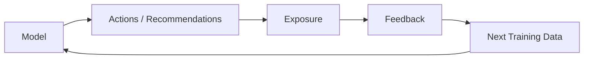

# Dữ liệu (data / 데이터), Features và Labels trong Machine học tập (learning / 학습)

> **Mạch đọc:** [README](./README.md) là bản đồ owner của **Data, features và labels trong machine learning**. Route đi từ observation unit → feature construction → label semantics → leakage/missingness → train-serving consistency, để chất lượng dữ liệu được nối với hành vi model.

Machine học tập (learning / 학습) học từ dữ liệu (data / 데이터), nhưng “dữ liệu (data / 데이터)” không phải một material trung tính. Dataset là kết quả của đo lường (measurement / 측정), logging, sampling, labeling và chính sách (policy / 정책). Nếu những tiến trình (process / 프로세스) này sai, mô hình (model / 모델) có thể tối ưu rất tốt một biểu diễn (representation / 표현) méo của reality.

Vì vậy trước khi chọn thuật toán (algorithm / 알고리즘), cần hiểu **mỗi row/example đại diện điều gì, tính năng (feature / 기능) có available tại prediction thời gian (time / 시간) không, label được tạo như thế nào, population nào bị bỏ sót và dữ liệu (data / 데이터) có phụ thuộc (dependency / 의존성) theo người dùng (user / 사용자)/thời gian (time / 시간)/group hay không**.

## Đơn vị (unit / 단위) of observation

Trước tiên xác định một example là gì.

Fraud detection:

```text
one row = one transaction?
one account-day?
one user-session?
```

Churn:

```text
one customer snapshot at reference date
```

Nếu đơn vị (unit / 단위) không rõ, tính năng (feature / 기능)/label thời gian (time / 시간) boundaries rất dễ leak.

Sau khi xác định mỗi row đại diện cho điều gì, cần mô tả thông tin mà mô hình có thể nhìn thấy từ row đó; đó là vai trò của feature.

## Tính năng (feature / 기능)

Tính năng (feature / 기능) là measurable biểu diễn (representation / 표현) used by mô hình (model / 모델).

Examples:

```text
age
transaction_amount
number_of_logins_last_7_days
embedding(document)
image pixels
```

Tính năng (feature / 기능) is not necessarily nhân quả (causal / 인과적) or human-interpretable. Deep các mô hình (models / 모델들) learn nội bộ (internal / 내부) features automatically.

Feature mô tả đầu vào, còn label định nghĩa kết quả mà supervised learning phải dự đoán.

## Mục tiêu (target / 대상) / Label

Label (레이블 / 정답) là desired kết quả (outcome / 결과) used in supervised huấn luyện (training / 학습).

Examples:

```text
fraud within 30 days
customer churned
house sale price
next token
```

Label definition must include thời gian (time / 시간) horizon and sự kiện (event / 이벤트) ngữ nghĩa (semantics / 의미론).

“Churn” can mean no login 30 days, đặc tả hợp đồng (contract / 계약) cancellation, or no payment 90 days. Different definitions create different tasks.

Label chỉ có nghĩa khi gắn với một thời hạn quan sát; prediction cutoff biến định nghĩa đó thành ranh giới thời gian có thể kiểm tra.

## Prediction thời gian (time / 시간) / cutoff

For each mẫu (sample / 표본) define timestamp `t0` when prediction would be made.

Valid features must be available by `t0`.

Label may use future cửa sổ (window / 윈도우) after `t0`:

```text
features: history <= t0
label: event in (t0, t0+30d]
```

This simple timeline prevents many leakage bugs.

Cutoff tách lịch sử được phép dùng khỏi tương lai dùng để tạo label; nếu feature vượt ranh giới này, mô hình sẽ bị feature leakage.

## Tính năng (feature / 기능) leakage

A tính năng (feature / 기능) leaks if it contains thông tin (information / 정보) unavailable legitimately at prediction thời gian (time / 시간).

Example predicting loan default using `collection_status` recorded after default.

Mô hình (model / 모델) chỉ số (metric / 지표) becomes artificially high because it sees consequence of mục tiêu (target / 대상).

Leakage often survives rà soát mã (code review / 코드 리뷰) because column looks innocuous; ngữ nghĩa (semantic / 의미적) timestamp lineage matters.

Feature leakage là vi phạm ranh giới thông tin; preprocessing cũng có thể làm lộ phân phối kiểm thử nếu được fit sai thời điểm.

## Preprocessing leakage

Even label-free transformation can leak kiểm thử (test / 테스트) phân phối (distribution / 분포).

Wrong:

```text
fit scaler on all data
then split train/test
```

Correct:

```text
split
fit scaler on train only
apply same scaler to validation/test
```

Same quy tắc (rule / 규칙) for imputation, tính năng (feature / 기능) selection, PCA, mục tiêu (target / 대상) encoding and any fitted preprocessing.

Use chuỗi xử lý (pipeline / 파이프라인) lớp trừu tượng (abstraction / 추상화) to ensure transformations fit only huấn luyện (training / 학습) folds.

Preprocessing phải chỉ học từ training fold; cùng quy tắc đó áp dụng cho các aggregate có thể vô tình lấy thông tin tương lai.

## Label leakage via aggregates

Suppose tính năng (feature / 기능) “customer thời gian tồn tại (lifetime / 수명) spend” is computed using dữ liệu (data / 데이터) after prediction date. Even if label column absent, future thông tin (information / 정보) leaks.

Every aggregate needs temporal cutoff:

```sql
SUM(amount)
WHERE transaction_time < prediction_time
```

Môi trường vận hành (production / 운영 환경) tính năng (feature / 기능) stores often encode point-in-time tính đúng đắn (correctness / 정확성) specifically for this reason.

Aggregate chỉ hợp lệ khi được tính point-in-time; ngay cả khi không có label trực tiếp, một feature vẫn có thể làm lộ target qua proxy.

## Proxy features

Tính năng (feature / 기능) may indirectly reveal mục tiêu (target / 대상).

Hospital ward mã (code / 코드) may proxy disease severity. ZIP mã (code / 코드) may proxy socioeconomic/racial cấu trúc (structure / 구조).

A proxy can be technically legitimate predictor but create fairness, privacy or robustness concerns.

Tính năng (feature / 기능) rà soát (review / 검토) must consider ngữ nghĩa (semantics / 의미론), not just correlation.

Proxy feature nhắc rằng tương quan không đủ để quyết định dùng feature; trước hết cần xem các giá trị số được đo và biến đổi ra sao.

## Numerical features

Continuous:

```text
age, price, temperature
```

Discrete counts:

```text
number_of_logins
```

Scaling matters for distance/gradient-based algorithms but not usually cây (tree / 트리) split thứ tự (ordering / 순서) in same way.

Standardization:

\[
z=\frac{x-\mu}{\sigma}
\]

fit `μ,σ` on dữ liệu huấn luyện (training data / 학습 데이터) only.

Numerical feature có thể liên tục hoặc là count, còn categorical feature diễn tả các nhóm không có thứ tự số tự nhiên.

## Categorical features

Nominal categories have no inherent thứ tự (order / 순서):

```text
country, browser, product_category
```

One-hot encoding avoids fake numeric thứ tự (order / 순서).

High-cardinality categories create huge sparse vectors; alternatives include hashing, learned embeddings or carefully regularized mục tiêu (target / 대상)/statistical encoding.

Categorical feature không nên bị ép thành số theo thứ tự giả; khi thứ tự có ý nghĩa, ordinal representation có thể phù hợp hơn.

## Ordinal features

Categories have thứ tự (order / 순서):

```text
low < medium < high
```

Encoding numeric thứ tự (order / 순서) may be appropriate, but distance between levels need not equal.

Mô hình (model / 모델) các giả định (assumptions / 가정들) determine whether ordinal integer biểu diễn (representation / 표현) is safe.

Ordinal feature giữ thứ tự nhưng không nhất thiết giữ khoảng cách bằng nhau; one-hot encoding chọn cách biểu diễn không áp đặt thứ tự.

## One-hot encoding

Category with K values becomes véc-tơ (vector / 벡터):

```text
red   → [1,0,0]
green → [0,1,0]
blue  → [0,0,1]
```

No artificial thứ tự (ordering / 순서), but dimensionality increases.

Unknown category at suy luận (inference / 추론) requires tường minh (explicit / 명시적) handling.

One-hot tránh thứ tự giả nhưng làm tăng số chiều; target encoding nén category bằng thống kê mục tiêu và vì thế phải kiểm soát leakage.

## Mục tiêu (target / 대상) encoding

Replace category with statistic of mục tiêu (target / 대상):

\[
TE(c)=E[Y\mid category=c]
\]

Very powerful but extremely leakage-prone. Must compute out-of-fold/training-only statistics and smooth rare categories.

A category appearing once with positive label should not receive perfect 1.0 tín hiệu (signal / 신호) blindly.

Target encoding dùng thông tin label rất trực tiếp; sau đó cần phân biệt bài toán encoding với missing data, nơi giá trị vắng mặt có thể mang ngữ nghĩa riêng.

## Missing dữ liệu (data / 데이터)

Missingness can mean different things:

```text
not measured
not applicable
sensor failed
user chose not to answer
value genuinely zero? no
```

Replacing every missing giá trị (value / 값) with 0 destroys ngữ nghĩa (semantics / 의미론).

Strategies:

- tường minh (explicit / 명시적) missing category;
- median/mean imputation;
- model-native missing handling;
- missing indicator;
- domain-specific imputation.

Missingness không chỉ là ô trống cần điền; giả định về cơ chế thiếu MCAR, MAR hay MNAR quyết định cách diễn giải và xử lý.

## MCAR, MAR, MNAR intuition

Missing Completely At Random: missing unrelated to values.

Missing At Random: missingness explainable by observed variables.

Missing Not At Random: missingness depends on unobserved/missing giá trị (value / 값) itself.

These các giả định (assumptions / 가정들) affect statistical validity. Real dữ liệu (data / 데이터) often MNAR-like.

Cơ chế missing ảnh hưởng độ tin cậy của thống kê; khi đã hiểu nguồn biến thiên, cần xem các giá trị cực đoan có phải lỗi hay tín hiệu thật.

## Outliers

Outlier can be:

- dữ liệu (data / 데이터) lỗi (error / 오류);
- rare valid sự kiện (event / 이벤트);
- fraud/anomaly we actually care about.

Blind clipping/removal may erase mục tiêu (target / 대상) tín hiệu (signal / 신호).

Investigate nguồn (source / 소스) and tác vụ (task / 작업) ngữ nghĩa (semantics / 의미론) first.

Robust transformations/losses may handle heavy tails better.

Outlier có thể là lỗi, sự kiện hiếm hoặc chính target cần phát hiện; log transformation là một cách thay đổi thang đo khi đuôi phân phối quá dài.

## Log transformation

Positive skewed tính năng (feature / 기능) like giao dịch (transaction / 트랜잭션) amount may be transformed:

\[
x'=\log(1+x)
\]

This compresses large values and can make multiplicative relations more tuyến tính (linear / 선형).

Transformation encodes giả định (assumption / 가정); preserve interpretation/inverse transform where needed.

Log transformation nén các giá trị lớn và đưa một số quan hệ về dạng gần tuyến tính; feature interaction lại mở rộng biểu diễn để mô hình thấy kết hợp giữa biến.

## Tương tác (interaction / 상호작용) features

Mô hình tuyến tính (linear model / 선형 모델) cannot naturally express tương tác (interaction / 상호작용) unless tính năng (feature / 기능) included:

\[
y=\beta_1x_1+\beta_2x_2+\beta_3x_1x_2
\]

Trees/neural networks can learn interactions automatically to differing degrees.

Tính năng (feature / 기능) kỹ thuật (engineering / 엔지니어링) is partly choosing basis where tác vụ (task / 작업) becomes simpler.

Interaction feature tạo thêm cơ sở biểu diễn cho mô hình; với dữ liệu văn bản, câu hỏi tương tự là chọn representation nào giữ được tín hiệu ngôn ngữ.

## Văn bản (text / 텍스트) biểu diễn (representation / 표현)

Traditional:

- bag-of-words;
- TF-IDF;
- n-grams.

Hiện đại (modern / 현대적):

- đơn vị từ (token / 토큰) IDs;
- learned embeddings;
- contextual transformer representations.

Văn bản (text / 텍스트) preprocessing such as lowercasing/stemming can remove useful thông tin (information / 정보) depending ngôn ngữ (language / 언어)/mô hình (model / 모델).

Text representation có thể từ bag-of-words đến contextual embeddings; ảnh cần một pipeline biểu diễn pixel và không gian khác.

## Ảnh (image / 이미지) biểu diễn (representation / 표현)

Pixels are tensors. dùng chung (common / 공통) processing:

- resize/crop;
- normalize channels;
- augmentation.

Augmentation must preserve label ngữ nghĩa (semantics / 의미론).

Medical/remote-sensing images need domain-specific care around orientation, resolution and siêu dữ liệu (metadata / 메타데이터).

Image representation phải tôn trọng hình học, độ phân giải và nhãn; dữ liệu theo thời gian lại cần giữ thứ tự và ngăn tương lai lọt vào quá khứ.

## Time-series features

A row at thời gian (time / 시간) `t` may use lags:

\[
x_{t-1},x_{t-7}
\]

rolling statistics:

\[
mean(x_{t-6:t})
\]

Never include future values.

Random train/kiểm thử (test / 테스트) split often invalid because future leaks into past phân phối (distribution / 분포).

Time-series feature dùng lag và rolling statistics nhưng tuyệt đối không dùng future values; khi nhiều dòng cùng một thực thể, split còn phải theo group.

## Grouped dữ liệu (data / 데이터)

Multiple rows from same người dùng (user / 사용자)/patient/thiết bị (device / 장치) are correlated.

If one người dùng (user / 사용자)'s rows appear in both train and kiểm thử (test / 테스트), mô hình (model / 모델) may memorize identity-specific patterns.

Use group-aware split when triển khai (deployment / 배포) mục tiêu (target / 대상) is unseen entities.

Evaluation ranh giới (boundary / 경계) should match actual use trường hợp (case / 사례).

Grouped data cho thấy các row không độc lập; sau khi kiểm soát entity split, cần kiểm tra duplicate vì bản sao gần nhau cũng làm metric ảo.

## Duplicate dữ liệu (data / 데이터)

Near-duplicate images/documents in train/kiểm thử (test / 테스트) inflate metrics.

Web-scale datasets have substantial duplicates. Deduplication reduces memorization leakage and contamination.

Chính xác (exact / 정확한) hashes catch chính xác (exact / 정확한) duplicates; perceptual/minhash/embedding methods can catch near duplicates.

Duplicate có thể khiến train và test chia sẻ gần như cùng một bằng chứng; dataset contamination còn rộng hơn khi chính benchmark xuất hiện trong training corpus.

## Dataset contamination

Benchmark/kiểm thử (test / 테스트) examples may appear in huấn luyện (training / 학습) corpus.

Then benchmark hiệu năng (performance / 성능) no longer clean measure of generalization.

Foundation mô hình (model / 모델) evaluation must consider contamination detection and temporal/nguồn (source / 소스) separation.

Contamination làm benchmark không còn đo generalization sạch; label noise là một nguồn sai khác khác đến từ cách gán nhãn.

## Label noise

Labels can be wrong due to annotator disagreement, ambiguous definition or delayed kết quả (outcome / 결과).

If 10% labels random wrong, huấn luyện (training / 학습) mục tiêu (objective / 목표) contains irreducible xung đột (conflict / 충돌).

Strategies:

- relabel high-impact examples;
- consensus/multiple annotators;
- robust losses;
- confidence labels;
- mô hình (model / 모델) disagreement rà soát (review / 검토).

Label noise khiến mục tiêu huấn luyện chứa xung đột; inter-annotator agreement giúp đo phần bất đồng thay vì che nó bằng một gold label duy nhất.

## Inter-Annotator Agreement

For subjective tasks, disagreement is thông tin (information / 정보), not simply noise.

Metrics like Cohen's kappa or Krippendorff's alpha quantify agreement under specific settings.

Low agreement may mean tác vụ (task / 작업) definition inherently ambiguous; forcing one “gold label” hides bất định (uncertainty / 불확실성).

Agreement thấp có thể phản ánh task mơ hồ chứ không chỉ annotator kém; weak supervision mở rộng labeling bằng heuristic nhưng phải thừa nhận noise có hệ thống.

## Weak supervision

Labels generated by heuristics/rules/bên ngoài (external / 외부) các mô hình (models / 모델들) rather than manual ground truth.

Example:

```text
email containing known malicious URL → weak spam label
```

Weak supervision scales but introduces systematic label noise. Multiple labeling functions can be combined probabilistically.

Weak supervision đổi chi phí gán nhãn thủ công lấy các quy tắc có thể sai; với positive-unlabeled data, phần chưa gán nhãn còn trộn cả positive và negative.

## Positive-Unlabeled dữ liệu (data / 데이터)

Sometimes positive labels reliable but negatives absent; unlabeled set mixes positives and negatives.

Example known fraud cases vs all uninvestigated transactions.

Treating all unlabeled as negative biases mô hình (model / 모델). PU-learning methods mô hình (model / 모델) this sampling tiến trình (process / 프로세스).

PU learning không thể coi mọi unlabeled example là negative; khi tỷ lệ lớp lệch mạnh, class imbalance cần được đánh giá riêng.

## Lớp (class / 클래스) imbalance

Rare lớp (class / 클래스) example:

```text
fraud = 0.1%
```

Accuracy becomes misleading.

Huấn luyện (training / 학습) options include:

- lớp (class / 클래스) weighting;
- resampling;
- focal-like losses;
- anomaly framing.

But evaluation should preserve real prevalence unless intentionally testing scenario.

Class imbalance làm accuracy gây hiểu lầm và yêu cầu metric hoặc loss phù hợp; resampling có thể giúp training nhưng làm thay đổi phân phối.

## Resampling caveats

Oversampling positive lớp (class / 클래스) changes huấn luyện (training / 학습) phân phối (distribution / 분포). xác suất (probability / 확률) đầu ra (output / 출력) may become miscalibrated relative to real cơ sở (base / 기반) tỷ lệ (rate / 비율).

Quyết định (decision / 결정) threshold/calibration may need correction.

Never duplicate samples across train/kiểm thử (test / 테스트) due to oversampling before split.

Resampling có thể làm xác suất dự đoán lệch khỏi prevalence thật và gây leakage nếu thực hiện trước split; feature selection cũng phải nằm trong training folds.

## Tính năng (feature / 기능) selection

Reasons to select features:

- reduce noise/overfitting;
- độ trễ (latency / 지연 시간)/chi phí (cost / 비용);
- interpretability;
- missingness/privacy;
- high-dimensional classical mô hình (model / 모델) các ràng buộc (constraints / 제약조건들).

Methods:

- filter statistics;
- wrapper methods;
- embedded methods (L1/tree importance).

Selection must occur inside huấn luyện (training / 학습) folds to avoid leakage.

Feature selection giảm noise và chi phí, nhưng chỉ hợp lệ khi được fit trong từng fold; feature importance sau đó vẫn không chứng minh feature nên được sử dụng.

## Tính năng (feature / 기능) importance is not tính năng (feature / 기능) validity

A tính năng (feature / 기능) can be highly important because it leaks mục tiêu (target / 대상) or encodes undesirable proxy.

Importance answers mô hình (model / 모델) dependence, not whether tính năng (feature / 기능) should be used.

Quản trị (governance / 거버넌스) rà soát (review / 검토) still necessary.

Importance đo mức model phụ thuộc vào feature, không đo tính hợp lệ, công bằng hay an toàn của feature; feature store chuyển câu hỏi đó thành consistency giữa training và serving.

## Tính năng (feature / 기능) store

Môi trường vận hành (production / 운영 환경) tính năng (feature / 기능) store helps reuse tính năng (feature / 기능) definitions and maintain consistency between huấn luyện (training / 학습)/serving.

Key challenge: **training-serving skew**.

If offline SQL computes tính năng (feature / 기능) differently from online dịch vụ (service / 서비스), mô hình (model / 모델) sees different phân phối (distribution / 분포) after triển khai (deployment / 배포).

Dùng chung (shared / 공유) transformations/point-in-time retrieval reduce skew.

Feature store giúp dùng chung transformation và point-in-time retrieval, nhưng vẫn cần ghi lại dữ liệu và code đã tạo feature để tái lập.

## Dữ liệu (data / 데이터) versioning

To reproduce mô hình (model / 모델), bản ghi (record / 레코드):

```text
data snapshot/version
schema
label definition
feature code
preprocessing parameters
split IDs
```

Mô hình (model / 모델) sản phẩm tạo ra (artifact / 산출물) without dữ liệu (data / 데이터) lineage is not reproducible.

Data versioning nối snapshot, schema, label definition và feature code thành lineage; từ lineage đó mới đánh giá được các chiều chất lượng dữ liệu.

## Dữ liệu (data / 데이터) chất lượng (quality / 품질) dimensions

Useful dimensions:

- completeness;
- validity;
- consistency;
- uniqueness;
- freshness;
- accuracy;
- representativeness.

“Clean dữ liệu (data / 데이터)” is not nhị phân (binary / 이진).

Quality không phải nhãn nhị phân sạch/bẩn; completeness, validity, freshness và representativeness dẫn tới câu hỏi liệu sample có đại diện cho population triển khai hay không.

## Sampling độ lệch (bias / 편향)

Dataset mẫu (sample / 표본) may not represent triển khai (deployment / 배포) population.

Example survey users who respond differ from non-responders.

Large cỡ mẫu (sample size / 표본 크기) does not fix systematic sampling độ lệch (bias / 편향).

Need understand collection cơ chế (mechanism / 메커니즘) and sometimes weighting/recruitment changes.

Sampling bias có thể tồn tại dù cỡ mẫu lớn; survivorship bias là trường hợp đặc biệt khi các entity thất bại đã biến mất khỏi dataset.

## Survivorship độ lệch (bias / 편향)

Only successful entities remain in records.

Predicting startup success using only surviving companies creates distorted phân phối (distribution / 분포).

Always ask which failed/absent cases disappeared from dataset.

Survivorship bias buộc ta hỏi những trường hợp nào không còn trong records; trong hệ thống triển khai, model còn có thể thay đổi chính dữ liệu tương lai qua feedback loops.

## Phản hồi (feedback / 피드백) loops

Mô hình (model / 모델) triển khai (deployment / 배포) changes future dữ liệu (data / 데이터).

Recommender chooses what users see, then learns from clicks on shown content.


```mermaid
flowchart LR
    M[Model] --> A[Actions / Recommendations]
    A --> E[Exposure]
    E --> F[Feedback]
    F --> D[Next Training Data]
    D --> M
```

Logged dữ liệu (data / 데이터) is policy-dependent, not neutral.

Feedback loop làm logged data phụ thuộc vào policy và exposure của model; privacy cần được kiểm soát song song vì feature có thể chứa PII hoặc thông tin nhạy cảm suy ra.

## Privacy

Features may contain PII or sensitive inferred thông tin (information / 정보).

Need:

- minimization;
- kiểm soát truy cập (access control / 접근 제어);
- retention chính sách (policy / 정책);
- encryption;
- consent/legal basis where applicable.

Embedding sensitive văn bản (text / 텍스트) does not automatically anonymize it.

Privacy controls giới hạn cách thu thập, lưu trữ và sử dụng feature; documentation ghi lại provenance, population và known limitations để các quyết định sau này có thể kiểm tra.

## Dữ liệu (data / 데이터) documentation

Dataset card/dữ liệu (data / 데이터) sheet can bản ghi (record / 레코드):

```text
source
collection period
population
labeling process
known limitations
license
sensitive attributes
recommended uses
```

Documentation improves future evaluation and quản trị (governance / 거버넌스).

Documentation gom các dấu vết của dataset thành bằng chứng có thể audit; mô hình tư duy dưới đây xếp chúng thành chuỗi từ observation unit đến lineage.

## Mô hình tư duy (mental model / 사고 모델)

Phần này chốt mental model thành một chuỗi có thể dùng lại: bối cảnh → cơ chế → quan sát → giới hạn → quyết định. Hãy đọc sơ đồ như công cụ suy luận, không như một khẩu hiệu tách khỏi chapter.

```text
Example       = unit model learns/predicts about
Feature       = information available at prediction time
Label         = operational definition of target
Cutoff time   = boundary preventing future leakage
Sampling      = why these examples entered dataset
Preprocessing = learned transformation fit on training only
Data lineage  = where every value came from
```

Mô hình tư duy này nối feature, label, cutoff, sampling và preprocessing thành các ranh giới vận hành; phần misconceptions kiểm tra những cách hiểu dễ sai.

## Dùng chung (common / 공통) Misconceptions

### “More features always improve mô hình (model / 모델)”

Irrelevant/leaky/noisy features can hurt generalization, độ trễ (latency / 지연 시간) and quản trị (governance / 거버넌스).

### “Missing giá trị (value / 값) = 0”

Missingness has ngữ nghĩa (semantics / 의미론); zero may be valid giá trị (value / 값).

### “Random split is always correct”

Thời gian (time / 시간)/group/thực thể (entity / 엔터티) dependencies often require specialized split.

### “Label is ground truth”

Labels are measurements/definitions and can be noisy, subjective or policy-dependent.

Các ngộ nhận thường nhầm thêm feature với thêm chất lượng, missing với zero hoặc label với ground truth; phần liên kết kiến thức đặt những ranh giới này vào lộ trình tiếp theo.

## Liên kết kiến thức (knowledge connection / 지식 연결)

Dữ liệu (data / 데이터) thiết kế (design / 설계) determines what statistical học tập (learning / 학습) can discover. mô hình (model / 모델) sophistication cannot recover thông tin (information / 정보) absent from features or correct a fundamentally wrong label definition.

Xem tiếp: [Training, Validation and Testing](./03_training_validation_and_testing.md).

> **Bàn giao:** Sau **Liên kết kiến thức (knowledge connection / 지식 연결)**, hãy giữ lại kết luận và ranh giới của mục này; quay về [README](./README.md) khi cần định vị owner hoặc chọn nhánh học tiếp theo.
