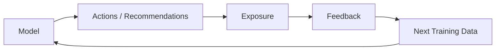

# Dữ liệu (data / 데이터), Features và Labels trong Machine học tập (learning / 학습)

> **Mạch đọc:** [README](./README.md) là bản đồ owner của **Data, features và labels trong machine learning**. Route đi từ observation unit → feature construction → label semantics → leakage/missingness → train-serving consistency, để chất lượng dữ liệu được nối với hành vi model.

Machine học tập (learning / 학습) học từ dữ liệu (data / 데이터), nhưng “dữ liệu (data / 데이터)” không phải một material trung tính. Dataset là kết quả của đo lường (measurement / 측정), logging, sampling, labeling và chính sách (policy / 정책). Nếu những tiến trình (process / 프로세스) này sai, mô hình (model / 모델) có thể tối ưu rất tốt một biểu diễn (representation / 표현) méo của reality.

Vì vậy trước khi chọn thuật toán (algorithm / 알고리즘), cần hiểu **mỗi row/example đại diện điều gì, tính năng (feature / 기능) có available tại prediction thời gian (time / 시간) không, label được tạo như thế nào, population nào bị bỏ sót và dữ liệu (data / 데이터) có phụ thuộc (dependency / 의존성) theo người dùng (user / 사용자)/thời gian (time / 시간)/group hay không**.

## Đơn vị (unit / 단위) of observation

Trước tiên xác định một example là gì.

Fraud detection:

```text
one row = one transaction?
one account-day?
one user-session?
```

Churn:

```text
one customer snapshot at reference date
```

Nếu đơn vị (unit / 단위) không rõ, tính năng (feature / 기능)/label thời gian (time / 시간) boundaries rất dễ leak.

> **Chuyển mạch:** Trong **Dữ liệu (data / 데이터), Features và Labels trong Machine học tập (learning / 학습)**, **Tính năng (feature / 기능)** tiếp nhận điểm tựa từ **Đơn vị (unit / 단위) of observation** nhưng đổi góc nhìn sang câu hỏi của chính nó; đọc liền hai mục để thấy mối quan hệ đó. Từ đây, **Mục tiêu (target / 대상) / Label** sẽ cho biết hệ quả hoặc giới hạn ấy hiện ra ở đâu.

## Tính năng (feature / 기능)

Tính năng (feature / 기능) là measurable biểu diễn (representation / 표현) used by mô hình (model / 모델).

Examples:

```text
age
transaction_amount
number_of_logins_last_7_days
embedding(document)
image pixels
```

Tính năng (feature / 기능) is not necessarily nhân quả (causal / 인과적) or human-interpretable. Deep các mô hình (models / 모델들) learn nội bộ (internal / 내부) features automatically.

> **Chuyển mạch:** Ở chặng này của **Dữ liệu (data / 데이터), Features và Labels trong Machine học tập (learning / 학습)**, **Tính năng (feature / 기능)** cho ta quy tắc; **Mục tiêu (target / 대상) / Label** đặt quy tắc ấy vào tình huống cụ thể để thấy nó hoạt động đến đâu. Từ đây, **Prediction thời gian (time / 시간) / cutoff** sẽ cho biết hệ quả hoặc giới hạn ấy hiện ra ở đâu.

## Mục tiêu (target / 대상) / Label

Label (레이블 / 정답) là desired kết quả (outcome / 결과) used in supervised huấn luyện (training / 학습).

Examples:

```text
fraud within 30 days
customer churned
house sale price
next token
```

Label definition must include thời gian (time / 시간) horizon and sự kiện (event / 이벤트) ngữ nghĩa (semantics / 의미론).

“Churn” can mean no login 30 days, đặc tả hợp đồng (contract / 계약) cancellation, or no payment 90 days. Different definitions create different tasks.

> **Chuyển mạch:** Đặt trong câu hỏi lớn của **Dữ liệu (data / 데이터), Features và Labels trong Machine học tập (learning / 학습)**, **Mục tiêu (target / 대상) / Label** cho ta quy tắc; **Prediction thời gian (time / 시간) / cutoff** đặt quy tắc ấy vào tình huống cụ thể để thấy nó hoạt động đến đâu. Từ đây, **Tính năng (feature / 기능) leakage** sẽ cho biết hệ quả hoặc giới hạn ấy hiện ra ở đâu.

## Prediction thời gian (time / 시간) / cutoff

For each mẫu (sample / 표본) define timestamp `t0` when prediction would be made.

Valid features must be available by `t0`.

Label may use future cửa sổ (window / 윈도우) after `t0`:

```text
features: history <= t0
label: event in (t0, t0+30d]
```

This simple timeline prevents many leakage bugs.

> **Chuyển mạch:** Trong **Dữ liệu (data / 데이터), Features và Labels trong Machine học tập (learning / 학습)**, **Tính năng (feature / 기능) leakage** tiếp nhận điểm tựa từ **Prediction thời gian (time / 시간) / cutoff** nhưng đổi góc nhìn sang câu hỏi của chính nó; đọc liền hai mục để thấy mối quan hệ đó. Từ đây, **Preprocessing leakage** sẽ cho biết hệ quả hoặc giới hạn ấy hiện ra ở đâu.

## Tính năng (feature / 기능) leakage

A tính năng (feature / 기능) leaks if it contains thông tin (information / 정보) unavailable legitimately at prediction thời gian (time / 시간).

Example predicting loan default using `collection_status` recorded after default.

Mô hình (model / 모델) chỉ số (metric / 지표) becomes artificially high because it sees consequence of mục tiêu (target / 대상).

Leakage often survives rà soát mã (code review / 코드 리뷰) because column looks innocuous; ngữ nghĩa (semantic / 의미적) timestamp lineage matters.

> **Chuyển mạch:** Ở chặng này của **Dữ liệu (data / 데이터), Features và Labels trong Machine học tập (learning / 학습)**, **Tính năng (feature / 기능) leakage** xác định đầu vào; **Preprocessing leakage** giải thích bước vận hành tạo ra kết quả kế tiếp. Từ đây, **Label leakage via aggregates** sẽ cho biết hệ quả hoặc giới hạn ấy hiện ra ở đâu.

## Preprocessing leakage

Even label-free transformation can leak kiểm thử (test / 테스트) phân phối (distribution / 분포).

Wrong:

```text
fit scaler on all data
then split train/test
```

Correct:

```text
split
fit scaler on train only
apply same scaler to validation/test
```

Same quy tắc (rule / 규칙) for imputation, tính năng (feature / 기능) selection, PCA, mục tiêu (target / 대상) encoding and any fitted preprocessing.

Use chuỗi xử lý (pipeline / 파이프라인) lớp trừu tượng (abstraction / 추상화) to ensure transformations fit only huấn luyện (training / 학습) folds.

> **Chuyển mạch:** Đặt trong câu hỏi lớn của **Dữ liệu (data / 데이터), Features và Labels trong Machine học tập (learning / 학습)**, sau khi thấy quy trình trong **Preprocessing leakage**, **Label leakage via aggregates** đặt nó vào một trường hợp đủ cụ thể để nhận ra điều kiện thành công và chỗ dễ sai. Từ đây, **Proxy features** sẽ cho biết hệ quả hoặc giới hạn ấy hiện ra ở đâu.

## Label leakage via aggregates

Suppose tính năng (feature / 기능) “customer thời gian tồn tại (lifetime / 수명) spend” is computed using dữ liệu (data / 데이터) after prediction date. Even if label column absent, future thông tin (information / 정보) leaks.

Every aggregate needs temporal cutoff:

```sql
SUM(amount)
WHERE transaction_time < prediction_time
```

Môi trường vận hành (production / 운영 환경) tính năng (feature / 기능) stores often encode point-in-time tính đúng đắn (correctness / 정확성) specifically for this reason.

> **Chuyển mạch:** Trong **Dữ liệu (data / 데이터), Features và Labels trong Machine học tập (learning / 학습)**, **Label leakage via aggregates** cho ta quy tắc; **Proxy features** đặt quy tắc ấy vào tình huống cụ thể để thấy nó hoạt động đến đâu. Từ đây, **Numerical features** sẽ cho biết hệ quả hoặc giới hạn ấy hiện ra ở đâu.

## Proxy features

Tính năng (feature / 기능) may indirectly reveal mục tiêu (target / 대상).

Hospital ward mã (code / 코드) may proxy disease severity. ZIP mã (code / 코드) may proxy socioeconomic/racial cấu trúc (structure / 구조).

A proxy can be technically legitimate predictor but create fairness, privacy or robustness concerns.

Tính năng (feature / 기능) rà soát (review / 검토) must consider ngữ nghĩa (semantics / 의미론), not just correlation.

> **Chuyển mạch:** Ở chặng này của **Dữ liệu (data / 데이터), Features và Labels trong Machine học tập (learning / 학습)**, **Numerical features** tiếp nhận điểm tựa từ **Proxy features** nhưng đổi góc nhìn sang câu hỏi của chính nó; đọc liền hai mục để thấy mối quan hệ đó. Từ đây, **Categorical features** sẽ cho biết hệ quả hoặc giới hạn ấy hiện ra ở đâu.

## Numerical features

Continuous:

```text
age, price, temperature
```

Discrete counts:

```text
number_of_logins
```

Scaling matters for distance/gradient-based algorithms but not usually cây (tree / 트리) split thứ tự (ordering / 순서) in same way.

Standardization:

\[
z=\frac{x-\mu}{\sigma}
\]

fit `μ,σ` on dữ liệu huấn luyện (training data / 학습 데이터) only.

> **Chuyển mạch:** Đặt trong câu hỏi lớn của **Dữ liệu (data / 데이터), Features và Labels trong Machine học tập (learning / 학습)**, **Categorical features** tiếp nhận điểm tựa từ **Numerical features** nhưng đổi góc nhìn sang câu hỏi của chính nó; đọc liền hai mục để thấy mối quan hệ đó. Từ đây, **Ordinal features** sẽ cho biết hệ quả hoặc giới hạn ấy hiện ra ở đâu.

## Categorical features

Nominal categories have no inherent thứ tự (order / 순서):

```text
country, browser, product_category
```

One-hot encoding avoids fake numeric thứ tự (order / 순서).

High-cardinality categories create huge sparse vectors; alternatives include hashing, learned embeddings or carefully regularized mục tiêu (target / 대상)/statistical encoding.

> **Chuyển mạch:** Trong **Dữ liệu (data / 데이터), Features và Labels trong Machine học tập (learning / 학습)**, **Ordinal features** tiếp nhận điểm tựa từ **Categorical features** nhưng đổi góc nhìn sang câu hỏi của chính nó; đọc liền hai mục để thấy mối quan hệ đó. Từ đây, **One-hot encoding** sẽ cho biết hệ quả hoặc giới hạn ấy hiện ra ở đâu.

## Ordinal features

Categories have thứ tự (order / 순서):

```text
low < medium < high
```

Encoding numeric thứ tự (order / 순서) may be appropriate, but distance between levels need not equal.

Mô hình (model / 모델) các giả định (assumptions / 가정들) determine whether ordinal integer biểu diễn (representation / 표현) is safe.

> **Chuyển mạch:** Ở chặng này của **Dữ liệu (data / 데이터), Features và Labels trong Machine học tập (learning / 학습)**, **One-hot encoding** tiếp nhận điểm tựa từ **Ordinal features** nhưng đổi góc nhìn sang câu hỏi của chính nó; đọc liền hai mục để thấy mối quan hệ đó. Từ đây, **Mục tiêu (target / 대상) encoding** sẽ cho biết hệ quả hoặc giới hạn ấy hiện ra ở đâu.

## One-hot encoding

Category with K values becomes véc-tơ (vector / 벡터):

```text
red   → [1,0,0]
green → [0,1,0]
blue  → [0,0,1]
```

No artificial thứ tự (ordering / 순서), but dimensionality increases.

Unknown category at suy luận (inference / 추론) requires tường minh (explicit / 명시적) handling.

> **Chuyển mạch:** Đặt trong câu hỏi lớn của **Dữ liệu (data / 데이터), Features và Labels trong Machine học tập (learning / 학습)**, **Mục tiêu (target / 대상) encoding** tiếp nhận điểm tựa từ **One-hot encoding** nhưng đổi góc nhìn sang câu hỏi của chính nó; đọc liền hai mục để thấy mối quan hệ đó. Từ đây, **Missing dữ liệu (data / 데이터)** sẽ cho biết hệ quả hoặc giới hạn ấy hiện ra ở đâu.

## Mục tiêu (target / 대상) encoding

Replace category with statistic of mục tiêu (target / 대상):

\[
TE(c)=E[Y\mid category=c]
\]

Very powerful but extremely leakage-prone. Must compute out-of-fold/training-only statistics and smooth rare categories.

A category appearing once with positive label should not receive perfect 1.0 tín hiệu (signal / 신호) blindly.

> **Chuyển mạch:** Trong **Dữ liệu (data / 데이터), Features và Labels trong Machine học tập (learning / 학습)**, **Mục tiêu (target / 대상) encoding** nêu điều cần giải thích; **Missing dữ liệu (data / 데이터)** đối chiếu nó với bằng chứng hoặc nguồn kiểm chứng. Từ đây, **MCAR, MAR, MNAR intuition** sẽ cho biết hệ quả hoặc giới hạn ấy hiện ra ở đâu.

## Missing dữ liệu (data / 데이터)

Missingness can mean different things:

```text
not measured
not applicable
sensor failed
user chose not to answer
value genuinely zero? no
```

Replacing every missing giá trị (value / 값) with 0 destroys ngữ nghĩa (semantics / 의미론).

Strategies:

- tường minh (explicit / 명시적) missing category;
- median/mean imputation;
- model-native missing handling;
- missing indicator;
- domain-specific imputation.

> **Chuyển mạch:** Ở chặng này của **Dữ liệu (data / 데이터), Features và Labels trong Machine học tập (learning / 학습)**, **Missing dữ liệu (data / 데이터)** nêu điều cần giải thích; **MCAR, MAR, MNAR intuition** đối chiếu nó với bằng chứng hoặc nguồn kiểm chứng. Từ đây, **Outliers** sẽ cho biết hệ quả hoặc giới hạn ấy hiện ra ở đâu.

## MCAR, MAR, MNAR intuition

Missing Completely At Random: missing unrelated to values.

Missing At Random: missingness explainable by observed variables.

Missing Not At Random: missingness depends on unobserved/missing giá trị (value / 값) itself.

These các giả định (assumptions / 가정들) affect statistical validity. Real dữ liệu (data / 데이터) often MNAR-like.

> **Chuyển mạch:** Đặt trong câu hỏi lớn của **Dữ liệu (data / 데이터), Features và Labels trong Machine học tập (learning / 학습)**, **Outliers** tiếp nhận điểm tựa từ **MCAR, MAR, MNAR intuition** nhưng đổi góc nhìn sang câu hỏi của chính nó; đọc liền hai mục để thấy mối quan hệ đó. Từ đây, **Log transformation** sẽ cho biết hệ quả hoặc giới hạn ấy hiện ra ở đâu.

## Outliers

Outlier can be:

- dữ liệu (data / 데이터) lỗi (error / 오류);
- rare valid sự kiện (event / 이벤트);
- fraud/anomaly we actually care about.

Blind clipping/removal may erase mục tiêu (target / 대상) tín hiệu (signal / 신호).

Investigate nguồn (source / 소스) and tác vụ (task / 작업) ngữ nghĩa (semantics / 의미론) first.

Robust transformations/losses may handle heavy tails better.

> **Chuyển mạch:** Trong **Dữ liệu (data / 데이터), Features và Labels trong Machine học tập (learning / 학습)**, **Log transformation** tiếp nhận điểm tựa từ **Outliers** nhưng đổi góc nhìn sang câu hỏi của chính nó; đọc liền hai mục để thấy mối quan hệ đó. Từ đây, **Tương tác (interaction / 상호작용) features** sẽ cho biết hệ quả hoặc giới hạn ấy hiện ra ở đâu.

## Log transformation

Positive skewed tính năng (feature / 기능) like giao dịch (transaction / 트랜잭션) amount may be transformed:

\[
x'=\log(1+x)
\]

This compresses large values and can make multiplicative relations more tuyến tính (linear / 선형).

Transformation encodes giả định (assumption / 가정); preserve interpretation/inverse transform where needed.

> **Chuyển mạch:** Ở chặng này của **Dữ liệu (data / 데이터), Features và Labels trong Machine học tập (learning / 학습)**, **Tương tác (interaction / 상호작용) features** tiếp nhận điểm tựa từ **Log transformation** nhưng đổi góc nhìn sang câu hỏi của chính nó; đọc liền hai mục để thấy mối quan hệ đó. Từ đây, **Văn bản (text / 텍스트) biểu diễn (representation / 표현)** sẽ cho biết hệ quả hoặc giới hạn ấy hiện ra ở đâu.

## Tương tác (interaction / 상호작용) features

Mô hình tuyến tính (linear model / 선형 모델) cannot naturally express tương tác (interaction / 상호작용) unless tính năng (feature / 기능) included:

\[
y=\beta_1x_1+\beta_2x_2+\beta_3x_1x_2
\]

Trees/neural networks can learn interactions automatically to differing degrees.

Tính năng (feature / 기능) kỹ thuật (engineering / 엔지니어링) is partly choosing basis where tác vụ (task / 작업) becomes simpler.

> **Chuyển mạch:** Đặt trong câu hỏi lớn của **Dữ liệu (data / 데이터), Features và Labels trong Machine học tập (learning / 학습)**, **Văn bản (text / 텍스트) biểu diễn (representation / 표현)** tiếp nhận điểm tựa từ **Tương tác (interaction / 상호작용) features** nhưng đổi góc nhìn sang câu hỏi của chính nó; đọc liền hai mục để thấy mối quan hệ đó. Từ đây, **Ảnh (image / 이미지) biểu diễn (representation / 표현)** sẽ cho biết hệ quả hoặc giới hạn ấy hiện ra ở đâu.

## Văn bản (text / 텍스트) biểu diễn (representation / 표현)

Traditional:

- bag-of-words;
- TF-IDF;
- n-grams.

Hiện đại (modern / 현대적):

- đơn vị từ (token / 토큰) IDs;
- learned embeddings;
- contextual transformer representations.

Văn bản (text / 텍스트) preprocessing such as lowercasing/stemming can remove useful thông tin (information / 정보) depending ngôn ngữ (language / 언어)/mô hình (model / 모델).

> **Chuyển mạch:** Trong **Dữ liệu (data / 데이터), Features và Labels trong Machine học tập (learning / 학습)**, **Ảnh (image / 이미지) biểu diễn (representation / 표현)** tiếp nhận điểm tựa từ **Văn bản (text / 텍스트) biểu diễn (representation / 표현)** nhưng đổi góc nhìn sang câu hỏi của chính nó; đọc liền hai mục để thấy mối quan hệ đó. Từ đây, **Time-series features** sẽ cho biết hệ quả hoặc giới hạn ấy hiện ra ở đâu.

## Ảnh (image / 이미지) biểu diễn (representation / 표현)

Pixels are tensors. dùng chung (common / 공통) processing:

- resize/crop;
- normalize channels;
- augmentation.

Augmentation must preserve label ngữ nghĩa (semantics / 의미론).

Medical/remote-sensing images need domain-specific care around orientation, resolution and siêu dữ liệu (metadata / 메타데이터).

> **Chuyển mạch:** Ở chặng này của **Dữ liệu (data / 데이터), Features và Labels trong Machine học tập (learning / 학습)**, **Time-series features** tiếp nhận điểm tựa từ **Ảnh (image / 이미지) biểu diễn (representation / 표현)** nhưng đổi góc nhìn sang câu hỏi của chính nó; đọc liền hai mục để thấy mối quan hệ đó. Từ đây, **Grouped dữ liệu (data / 데이터)** sẽ cho biết hệ quả hoặc giới hạn ấy hiện ra ở đâu.

## Time-series features

A row at thời gian (time / 시간) `t` may use lags:

\[
x_{t-1},x_{t-7}
\]

rolling statistics:

\[
mean(x_{t-6:t})
\]

Never include future values.

Random train/kiểm thử (test / 테스트) split often invalid because future leaks into past phân phối (distribution / 분포).

> **Chuyển mạch:** Đặt trong câu hỏi lớn của **Dữ liệu (data / 데이터), Features và Labels trong Machine học tập (learning / 학습)**, **Time-series features** nêu điều cần giải thích; **Grouped dữ liệu (data / 데이터)** đối chiếu nó với bằng chứng hoặc nguồn kiểm chứng. Từ đây, **Duplicate dữ liệu (data / 데이터)** sẽ cho biết hệ quả hoặc giới hạn ấy hiện ra ở đâu.

## Grouped dữ liệu (data / 데이터)

Multiple rows from same người dùng (user / 사용자)/patient/thiết bị (device / 장치) are correlated.

If one người dùng (user / 사용자)'s rows appear in both train and kiểm thử (test / 테스트), mô hình (model / 모델) may memorize identity-specific patterns.

Use group-aware split when triển khai (deployment / 배포) mục tiêu (target / 대상) is unseen entities.

Evaluation ranh giới (boundary / 경계) should match actual use trường hợp (case / 사례).

> **Chuyển mạch:** Trong **Dữ liệu (data / 데이터), Features và Labels trong Machine học tập (learning / 학습)**, **Grouped dữ liệu (data / 데이터)** nêu điều cần giải thích; **Duplicate dữ liệu (data / 데이터)** đối chiếu nó với bằng chứng hoặc nguồn kiểm chứng. Từ đây, **Dataset contamination** sẽ cho biết hệ quả hoặc giới hạn ấy hiện ra ở đâu.

## Duplicate dữ liệu (data / 데이터)

Near-duplicate images/documents in train/kiểm thử (test / 테스트) inflate metrics.

Web-scale datasets have substantial duplicates. Deduplication reduces memorization leakage and contamination.

Chính xác (exact / 정확한) hashes catch chính xác (exact / 정확한) duplicates; perceptual/minhash/embedding methods can catch near duplicates.

> **Chuyển mạch:** Ở chặng này của **Dữ liệu (data / 데이터), Features và Labels trong Machine học tập (learning / 학습)**, **Duplicate dữ liệu (data / 데이터)** nêu điều cần giải thích; **Dataset contamination** đối chiếu nó với bằng chứng hoặc nguồn kiểm chứng. Từ đây, **Label noise** sẽ cho biết hệ quả hoặc giới hạn ấy hiện ra ở đâu.

## Dataset contamination

Benchmark/kiểm thử (test / 테스트) examples may appear in huấn luyện (training / 학습) corpus.

Then benchmark hiệu năng (performance / 성능) no longer clean measure of generalization.

Foundation mô hình (model / 모델) evaluation must consider contamination detection and temporal/nguồn (source / 소스) separation.

> **Chuyển mạch:** Đặt trong câu hỏi lớn của **Dữ liệu (data / 데이터), Features và Labels trong Machine học tập (learning / 학습)**, **Dataset contamination** cho ta quy tắc; **Label noise** đặt quy tắc ấy vào tình huống cụ thể để thấy nó hoạt động đến đâu. Từ đây, **Inter-Annotator Agreement** sẽ cho biết hệ quả hoặc giới hạn ấy hiện ra ở đâu.

## Label noise

Labels can be wrong due to annotator disagreement, ambiguous definition or delayed kết quả (outcome / 결과).

If 10% labels random wrong, huấn luyện (training / 학습) mục tiêu (objective / 목표) contains irreducible xung đột (conflict / 충돌).

Strategies:

- relabel high-impact examples;
- consensus/multiple annotators;
- robust losses;
- confidence labels;
- mô hình (model / 모델) disagreement rà soát (review / 검토).

> **Chuyển mạch:** Trong **Dữ liệu (data / 데이터), Features và Labels trong Machine học tập (learning / 학습)**, **Label noise** cho ta quy tắc; **Inter-Annotator Agreement** đặt quy tắc ấy vào tình huống cụ thể để thấy nó hoạt động đến đâu. Từ đây, **Weak supervision** sẽ cho biết hệ quả hoặc giới hạn ấy hiện ra ở đâu.

## Inter-Annotator Agreement

For subjective tasks, disagreement is thông tin (information / 정보), not simply noise.

Metrics like Cohen's kappa or Krippendorff's alpha quantify agreement under specific settings.

Low agreement may mean tác vụ (task / 작업) definition inherently ambiguous; forcing one “gold label” hides bất định (uncertainty / 불확실성).

> **Chuyển mạch:** Ở chặng này của **Dữ liệu (data / 데이터), Features và Labels trong Machine học tập (learning / 학습)**, **Weak supervision** tiếp nhận điểm tựa từ **Inter-Annotator Agreement** nhưng đổi góc nhìn sang câu hỏi của chính nó; đọc liền hai mục để thấy mối quan hệ đó. Từ đây, **Positive-Unlabeled dữ liệu (data / 데이터)** sẽ cho biết hệ quả hoặc giới hạn ấy hiện ra ở đâu.

## Weak supervision

Labels generated by heuristics/rules/bên ngoài (external / 외부) các mô hình (models / 모델들) rather than manual ground truth.

Example:

```text
email containing known malicious URL → weak spam label
```

Weak supervision scales but introduces systematic label noise. Multiple labeling functions can be combined probabilistically.

> **Chuyển mạch:** Đặt trong câu hỏi lớn của **Dữ liệu (data / 데이터), Features và Labels trong Machine học tập (learning / 학습)**, **Weak supervision** cho ta quy tắc; **Positive-Unlabeled dữ liệu (data / 데이터)** đặt quy tắc ấy vào tình huống cụ thể để thấy nó hoạt động đến đâu. Từ đây, **Lớp (class / 클래스) imbalance** sẽ cho biết hệ quả hoặc giới hạn ấy hiện ra ở đâu.

## Positive-Unlabeled dữ liệu (data / 데이터)

Sometimes positive labels reliable but negatives absent; unlabeled set mixes positives and negatives.

Example known fraud cases vs all uninvestigated transactions.

Treating all unlabeled as negative biases mô hình (model / 모델). PU-learning methods mô hình (model / 모델) this sampling tiến trình (process / 프로세스).

> **Chuyển mạch:** Trong **Dữ liệu (data / 데이터), Features và Labels trong Machine học tập (learning / 학습)**, **Positive-Unlabeled dữ liệu (data / 데이터)** cho ta quy tắc; **Lớp (class / 클래스) imbalance** đặt quy tắc ấy vào tình huống cụ thể để thấy nó hoạt động đến đâu. Từ đây, **Resampling caveats** sẽ cho biết hệ quả hoặc giới hạn ấy hiện ra ở đâu.

## Lớp (class / 클래스) imbalance

Rare lớp (class / 클래스) example:

```text
fraud = 0.1%
```

Accuracy becomes misleading.

Huấn luyện (training / 학습) options include:

- lớp (class / 클래스) weighting;
- resampling;
- focal-like losses;
- anomaly framing.

But evaluation should preserve real prevalence unless intentionally testing scenario.

> **Chuyển mạch:** Ở chặng này của **Dữ liệu (data / 데이터), Features và Labels trong Machine học tập (learning / 학습)**, **Resampling caveats** tiếp nhận điểm tựa từ **Lớp (class / 클래스) imbalance** nhưng đổi góc nhìn sang câu hỏi của chính nó; đọc liền hai mục để thấy mối quan hệ đó. Từ đây, **Tính năng (feature / 기능) selection** sẽ cho biết hệ quả hoặc giới hạn ấy hiện ra ở đâu.

## Resampling caveats

Oversampling positive lớp (class / 클래스) changes huấn luyện (training / 학습) phân phối (distribution / 분포). xác suất (probability / 확률) đầu ra (output / 출력) may become miscalibrated relative to real cơ sở (base / 기반) tỷ lệ (rate / 비율).

Quyết định (decision / 결정) threshold/calibration may need correction.

Never duplicate samples across train/kiểm thử (test / 테스트) due to oversampling before split.

> **Chuyển mạch:** Đặt trong câu hỏi lớn của **Dữ liệu (data / 데이터), Features và Labels trong Machine học tập (learning / 학습)**, **Tính năng (feature / 기능) selection** tiếp nhận điểm tựa từ **Resampling caveats** nhưng đổi góc nhìn sang câu hỏi của chính nó; đọc liền hai mục để thấy mối quan hệ đó. Từ đây, **Tính năng (feature / 기능) importance is not tính năng (feature / 기능) validity** sẽ cho biết hệ quả hoặc giới hạn ấy hiện ra ở đâu.

## Tính năng (feature / 기능) selection

Reasons to select features:

- reduce noise/overfitting;
- độ trễ (latency / 지연 시간)/chi phí (cost / 비용);
- interpretability;
- missingness/privacy;
- high-dimensional classical mô hình (model / 모델) các ràng buộc (constraints / 제약조건들).

Methods:

- filter statistics;
- wrapper methods;
- embedded methods (L1/tree importance).

Selection must occur inside huấn luyện (training / 학습) folds to avoid leakage.

> **Chuyển mạch:** Trong **Dữ liệu (data / 데이터), Features và Labels trong Machine học tập (learning / 학습)**, **Tính năng (feature / 기능) importance is not tính năng (feature / 기능) validity** tiếp nhận điểm tựa từ **Tính năng (feature / 기능) selection** nhưng đổi góc nhìn sang câu hỏi của chính nó; đọc liền hai mục để thấy mối quan hệ đó. Từ đây, **Tính năng (feature / 기능) store** sẽ cho biết hệ quả hoặc giới hạn ấy hiện ra ở đâu.

## Tính năng (feature / 기능) importance is not tính năng (feature / 기능) validity

A tính năng (feature / 기능) can be highly important because it leaks mục tiêu (target / 대상) or encodes undesirable proxy.

Importance answers mô hình (model / 모델) dependence, not whether tính năng (feature / 기능) should be used.

Quản trị (governance / 거버넌스) rà soát (review / 검토) still necessary.

> **Chuyển mạch:** Ở chặng này của **Dữ liệu (data / 데이터), Features và Labels trong Machine học tập (learning / 학습)**, **Tính năng (feature / 기능) store** tiếp nhận điểm tựa từ **Tính năng (feature / 기능) importance is not tính năng (feature / 기능) validity** nhưng đổi góc nhìn sang câu hỏi của chính nó; đọc liền hai mục để thấy mối quan hệ đó. Từ đây, **Dữ liệu (data / 데이터) versioning** sẽ cho biết hệ quả hoặc giới hạn ấy hiện ra ở đâu.

## Tính năng (feature / 기능) store

Môi trường vận hành (production / 운영 환경) tính năng (feature / 기능) store helps reuse tính năng (feature / 기능) definitions and maintain consistency between huấn luyện (training / 학습)/serving.

Key challenge: **training-serving skew**.

If offline SQL computes tính năng (feature / 기능) differently from online dịch vụ (service / 서비스), mô hình (model / 모델) sees different phân phối (distribution / 분포) after triển khai (deployment / 배포).

Dùng chung (shared / 공유) transformations/point-in-time retrieval reduce skew.

> **Chuyển mạch:** Đặt trong câu hỏi lớn của **Dữ liệu (data / 데이터), Features và Labels trong Machine học tập (learning / 학습)**, **Tính năng (feature / 기능) store** nêu điều cần giải thích; **Dữ liệu (data / 데이터) versioning** đối chiếu nó với bằng chứng hoặc nguồn kiểm chứng. Từ đây, **Dữ liệu (data / 데이터) chất lượng (quality / 품질) dimensions** sẽ cho biết hệ quả hoặc giới hạn ấy hiện ra ở đâu.

## Dữ liệu (data / 데이터) versioning

To reproduce mô hình (model / 모델), bản ghi (record / 레코드):

```text
data snapshot/version
schema
label definition
feature code
preprocessing parameters
split IDs
```

Mô hình (model / 모델) sản phẩm tạo ra (artifact / 산출물) without dữ liệu (data / 데이터) lineage is not reproducible.

> **Chuyển mạch:** Trong **Dữ liệu (data / 데이터), Features và Labels trong Machine học tập (learning / 학습)**, **Dữ liệu (data / 데이터) versioning** nêu điều cần giải thích; **Dữ liệu (data / 데이터) chất lượng (quality / 품질) dimensions** đối chiếu nó với bằng chứng hoặc nguồn kiểm chứng. Từ đây, **Sampling độ lệch (bias / 편향)** sẽ cho biết hệ quả hoặc giới hạn ấy hiện ra ở đâu.

## Dữ liệu (data / 데이터) chất lượng (quality / 품질) dimensions

Useful dimensions:

- completeness;
- validity;
- consistency;
- uniqueness;
- freshness;
- accuracy;
- representativeness.

“Clean dữ liệu (data / 데이터)” is not nhị phân (binary / 이진).

> **Chuyển mạch:** Ở chặng này của **Dữ liệu (data / 데이터), Features và Labels trong Machine học tập (learning / 학습)**, **Dữ liệu (data / 데이터) chất lượng (quality / 품질) dimensions** nêu điều cần giải thích; **Sampling độ lệch (bias / 편향)** đối chiếu nó với bằng chứng hoặc nguồn kiểm chứng. Từ đây, **Survivorship độ lệch (bias / 편향)** sẽ cho biết hệ quả hoặc giới hạn ấy hiện ra ở đâu.

## Sampling độ lệch (bias / 편향)

Dataset mẫu (sample / 표본) may not represent triển khai (deployment / 배포) population.

Example survey users who respond differ from non-responders.

Large cỡ mẫu (sample size / 표본 크기) does not fix systematic sampling độ lệch (bias / 편향).

Need understand collection cơ chế (mechanism / 메커니즘) and sometimes weighting/recruitment changes.

> **Chuyển mạch:** Đặt trong câu hỏi lớn của **Dữ liệu (data / 데이터), Features và Labels trong Machine học tập (learning / 학습)**, **Survivorship độ lệch (bias / 편향)** tiếp nhận điểm tựa từ **Sampling độ lệch (bias / 편향)** nhưng đổi góc nhìn sang câu hỏi của chính nó; đọc liền hai mục để thấy mối quan hệ đó. Từ đây, **Phản hồi (feedback / 피드백) loops** sẽ cho biết hệ quả hoặc giới hạn ấy hiện ra ở đâu.

## Survivorship độ lệch (bias / 편향)

Only successful entities remain in records.

Predicting startup success using only surviving companies creates distorted phân phối (distribution / 분포).

Always ask which failed/absent cases disappeared from dataset.

> **Chuyển mạch:** Trong **Dữ liệu (data / 데이터), Features và Labels trong Machine học tập (learning / 학습)**, **Phản hồi (feedback / 피드백) loops** tiếp nhận điểm tựa từ **Survivorship độ lệch (bias / 편향)** nhưng đổi góc nhìn sang câu hỏi của chính nó; đọc liền hai mục để thấy mối quan hệ đó. Từ đây, **Privacy** sẽ cho biết hệ quả hoặc giới hạn ấy hiện ra ở đâu.

## Phản hồi (feedback / 피드백) loops

Mô hình (model / 모델) triển khai (deployment / 배포) changes future dữ liệu (data / 데이터).

Recommender chooses what users see, then learns from clicks on shown content.


```mermaid
flowchart LR
    M[Model] --> A[Actions / Recommendations]
    A --> E[Exposure]
    E --> F[Feedback]
    F --> D[Next Training Data]
    D --> M
```

Logged dữ liệu (data / 데이터) is policy-dependent, not neutral.

> **Chuyển mạch:** Ở chặng này của **Dữ liệu (data / 데이터), Features và Labels trong Machine học tập (learning / 학습)**, **Privacy** tiếp nhận điểm tựa từ **Phản hồi (feedback / 피드백) loops** nhưng đổi góc nhìn sang câu hỏi của chính nó; đọc liền hai mục để thấy mối quan hệ đó. Từ đây, **Dữ liệu (data / 데이터) documentation** sẽ cho biết hệ quả hoặc giới hạn ấy hiện ra ở đâu.

## Privacy

Features may contain PII or sensitive inferred thông tin (information / 정보).

Need:

- minimization;
- kiểm soát truy cập (access control / 접근 제어);
- retention chính sách (policy / 정책);
- encryption;
- consent/legal basis where applicable.

Embedding sensitive văn bản (text / 텍스트) does not automatically anonymize it.

> **Chuyển mạch:** Đặt trong câu hỏi lớn của **Dữ liệu (data / 데이터), Features và Labels trong Machine học tập (learning / 학습)**, **Privacy** nêu điều cần giải thích; **Dữ liệu (data / 데이터) documentation** đối chiếu nó với bằng chứng hoặc nguồn kiểm chứng. Từ đây, **Mô hình tư duy (mental model / 사고 모델)** sẽ cho biết hệ quả hoặc giới hạn ấy hiện ra ở đâu.

## Dữ liệu (data / 데이터) documentation

Dataset card/dữ liệu (data / 데이터) sheet can bản ghi (record / 레코드):

```text
source
collection period
population
labeling process
known limitations
license
sensitive attributes
recommended uses
```

Documentation improves future evaluation and quản trị (governance / 거버넌스).

> **Chuyển mạch:** Trong **Dữ liệu (data / 데이터), Features và Labels trong Machine học tập (learning / 학습)**, các dấu vết trong **Dữ liệu (data / 데이터) documentation** được đọc cùng nhau ở **Mô hình tư duy (mental model / 사고 모델)** để rút ra mô hình, thay vì giữ chúng như những quan sát rời. Từ đây, **Dùng chung (common / 공통) Misconceptions** sẽ cho biết hệ quả hoặc giới hạn ấy hiện ra ở đâu.

## Mô hình tư duy (mental model / 사고 모델)

Phần này chốt mental model thành một chuỗi có thể dùng lại: bối cảnh → cơ chế → quan sát → giới hạn → quyết định. Hãy đọc sơ đồ như công cụ suy luận, không như một khẩu hiệu tách khỏi chapter.

```text
Example       = unit model learns/predicts about
Feature       = information available at prediction time
Label         = operational definition of target
Cutoff time   = boundary preventing future leakage
Sampling      = why these examples entered dataset
Preprocessing = learned transformation fit on training only
Data lineage  = where every value came from
```

> **Chuyển mạch:** Ở chặng này của **Dữ liệu (data / 데이터), Features và Labels trong Machine học tập (learning / 학습)**, **Dùng chung (common / 공통) Misconceptions** gom các mảnh từ **Mô hình tư duy (mental model / 사고 모델)** thành một kết luận có thể mang sang phần kế tiếp. Từ đây, **Liên kết kiến thức (knowledge connection / 지식 연결)** sẽ cho biết hệ quả hoặc giới hạn ấy hiện ra ở đâu.

## Dùng chung (common / 공통) Misconceptions

### “More features always improve mô hình (model / 모델)”

Irrelevant/leaky/noisy features can hurt generalization, độ trễ (latency / 지연 시간) and quản trị (governance / 거버넌스).

### “Missing giá trị (value / 값) = 0”

Missingness has ngữ nghĩa (semantics / 의미론); zero may be valid giá trị (value / 값).

### “Random split is always correct”

Thời gian (time / 시간)/group/thực thể (entity / 엔터티) dependencies often require specialized split.

### “Label is ground truth”

Labels are measurements/definitions and can be noisy, subjective or policy-dependent.

> **Chuyển mạch:** Đặt trong câu hỏi lớn của **Dữ liệu (data / 데이터), Features và Labels trong Machine học tập (learning / 학습)**, sau nội dung của **Dùng chung (common / 공통) Misconceptions**, **Liên kết kiến thức (knowledge connection / 지식 연결)** chỉ rõ tài liệu chuẩn và vị trí sở hữu để người học biết phần nào cần quay lại khi muốn đào sâu. Phần còn lại của file dùng kết quả này để khép lại mạch giải thích.

## Liên kết kiến thức (knowledge connection / 지식 연결)

Dữ liệu (data / 데이터) thiết kế (design / 설계) determines what statistical học tập (learning / 학습) can discover. mô hình (model / 모델) sophistication cannot recover thông tin (information / 정보) absent from features or correct a fundamentally wrong label definition.

Xem tiếp: [Training, Validation and Testing](./03_training_validation_and_testing.md).

> **Bàn giao:** Sau **Liên kết kiến thức (knowledge connection / 지식 연결)**, hãy giữ lại kết luận và ranh giới của mục này; quay về [README](./README.md) khi cần định vị owner hoặc chọn nhánh học tiếp theo.
