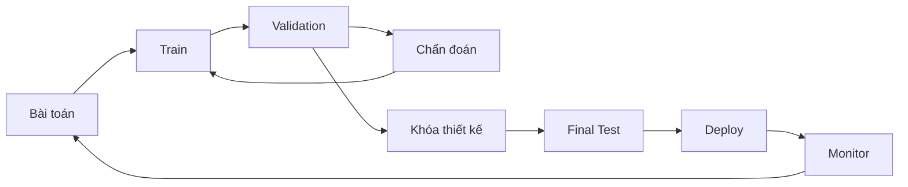

# Huấn luyện, validation và testing trong Machine Learning

Một mô hình có thể khớp dữ liệu huấn luyện rất tốt nhưng điều đó không có nghĩa nó sẽ hoạt động tốt trên dữ liệu tương lai. Vì vậy Machine Learning cần tách dữ liệu theo **vai trò thống kê**, không chỉ theo folder: tập huấn luyện dùng để học tham số; tập validation dùng để lựa chọn mô hình, siêu tham số hoặc threshold; tập test dùng để ước lượng hiệu quả sau khi toàn bộ lựa chọn đã được khóa.

Nếu liên tục nhìn kết quả test rồi điều chỉnh mô hình, test set không còn độc lập. Về bản chất, nó đã trở thành một phần của quá trình huấn luyện mở rộng.

## Ba vai trò cơ bản

### Tập huấn luyện

Tập huấn luyện (training set) dùng để fit tham số mô hình:

\[
\theta^*=\arg\min_\theta \hat R_{train}(\theta)
\]

Các bước tiền xử lý có tham số học được như scaler, PCA hay imputer cũng phải được fit chỉ bằng training data.

### Tập validation

Tập validation dùng để lựa chọn:

- họ mô hình;
- siêu tham số;
- tập feature;
- mức regularization;
- checkpoint cho early stopping;
- threshold ra quyết định.

Vì validation data ảnh hưởng trực tiếp các lựa chọn phát triển, metric trên tập này sẽ dần có thiên lệch lựa chọn (selection bias) nếu tuning quá nhiều.

### Tập test

Tập test là dữ liệu giữ lại (held-out data) để ước lượng khả năng khái quát hóa sau khi toàn bộ lựa chọn mô hình đã hoàn tất.

Test set nên mô phỏng population, thời gian và ranh giới triển khai thật càng sát càng tốt.

## Khi nào random split phù hợp?

Nếu các mẫu gần độc lập và cùng phân phối (i.i.d.) từ một phân phối mục tiêu ổn định, random split thường tạo được train, validation và test có đặc tính gần nhau.

Ví dụ các phép đo hoa độc lập từ cùng một population có thể dùng random stratified split.

Tuy nhiên rất nhiều dataset thực tế vi phạm tính độc lập hoặc tính ổn định theo thời gian.

## Chia theo thời gian

Trong forecasting hoặc dự đoán production, hệ thống học từ quá khứ rồi dự đoán tương lai.

Evaluation đúng nên phản ánh chính chiều thời gian đó:

```text
Train: Jan–Jun
Validation: Jul
Test: Aug
```

Nếu trộn dữ liệu tháng 8 vào training để dự đoán những record giống tháng 6, thông tin của tương lai đã ảnh hưởng quá trình phát triển mô hình.

Ngay cả khi không có feature tương lai trực tiếp, distribution tương lai vẫn có thể bị rò vào training.

## Chia theo nhóm

Nếu một thực thể có nhiều dòng dữ liệu, ví dụ nhiều lần khám của cùng bệnh nhân, nhiều giao dịch của cùng user hoặc nhiều event của cùng device, random row split có thể làm cùng một entity xuất hiện ở cả train và test.

Nếu deployment yêu cầu generalize sang entity hoàn toàn mới, cần group-aware split như GroupKFold hoặc GroupShuffle.

Nếu deployment lại dự đoán event tương lai cho chính các entity đã biết, time split bên trong mỗi entity có thể hợp lý hơn.

Ranh giới evaluation phải mô phỏng đúng câu hỏi sản phẩm.

## Stratification

Trong classification mất cân bằng, random split có thể tạo tỷ lệ positive rất khác nhau giữa các tập, đặc biệt khi dataset nhỏ.

Stratified split giúp giữ tỷ lệ lớp gần giống nhau.

Tuy nhiên stratification không tự giải quyết leakage theo group hoặc time. Khi cần phải kết hợp nhiều ràng buộc cùng lúc.

## Overfitting validation set

Giả sử thử 1.000 cấu hình rồi chọn cấu hình có validation score cao nhất. Dù mỗi estimate đều có nhiễu, giá trị lớn nhất có xu hướng được hưởng lợi từ may mắn.

Tuning lặp lại quá nhiều sẽ overfit validation set.

Biện pháp gồm nested cross-validation, giữ một final holdout riêng, giảm số bậc tự do khi search, báo cáo nhiều seed và uncertainty, hoặc đánh giá thêm trên nguồn dữ liệu bên ngoài.

## Cross-validation

K-fold cross-validation chia dữ liệu thành `K` phần. Ở mỗi vòng:

```text
train trên K-1 fold
validation trên fold còn lại
```

sau đó tổng hợp metric.

Cách này hữu ích khi dữ liệu ít vì mỗi mẫu được dùng cho validation một lần và training nhiều lần.

## Cross-validation không tự động loại bỏ leakage

Mỗi fold phải tự fit preprocessing riêng.

Sai:

```text
PCA trên toàn bộ data → chạy CV
```

Đúng:

```text
với mỗi fold:
  fit PCA chỉ trên fold-training
  transform fold-validation
```

Pipeline abstraction giúp tự động giữ đúng ranh giới này.

## Nested cross-validation

Nested CV dùng vòng ngoài để ước lượng generalization và vòng trong để chọn hyperparameter.

```text
outer train
  ↓ inner CV → chọn hyperparameter
fit lại trên toàn bộ outer train
  ↓
evaluate outer holdout
```

Cách này giảm optimistic bias do tuning, đặc biệt với dataset nhỏ, nhưng chi phí tính toán cao hơn nhiều.

## Leave-One-Out

Leave-One-Out Cross-Validation (LOOCV) dùng mỗi lần đúng một mẫu làm validation.

Ưu điểm là gần như toàn bộ dữ liệu được dùng để train trong mỗi fold.

Nhược điểm là tốn chi phí, estimate có thể có variance cao trong một số trường hợp và hoàn toàn không phù hợp nếu dữ liệu có dependency theo group hoặc time.

Nhiều fold hơn không có nghĩa luôn tốt hơn.

## Cross-validation lặp lại

Có thể lặp K-fold với nhiều cách chia khác nhau để đo mức nhạy của score với partition.

Cách này hữu ích khi dataset nhỏ và metric thay đổi đáng kể theo split.

Nên báo cáo phân phối score thay vì chỉ một giá trị trung bình.

## Cross-validation theo thời gian

Rolling hoặc expanding window có thể dùng:

```text
Train [1..t1] → Validate [t1+1..t2]
Train [1..t2] → Validate [t2+1..t3]
```

hoặc giữ cửa sổ training cố định rồi trượt theo thời gian.

Cách này kiểm tra độ bền qua nhiều giai đoạn và tránh leakage từ tương lai về quá khứ.

## Backtesting

Trong tài chính, forecasting hoặc recommender, evaluation thường mô phỏng nhiều thời điểm triển khai trong lịch sử.

Ở mỗi thời điểm:

```text
chỉ dùng dữ liệu đã tồn tại lúc đó
train hoặc update mô hình
predict cửa sổ tương lai
đợi outcome rồi đánh giá
```

Tính đúng theo thời điểm của feature là điều bắt buộc.

## Test contamination

Test data có thể rò vào training thông qua duplicate, benchmark công khai bị thu thập vào corpus, tiền xử lý fit trên toàn bộ data, tuning thủ công theo leaderboard hoặc lặp submission quá nhiều.

Khi contamination xảy ra, test score không còn đo hoàn toàn generalization độc lập mà trộn cả memorization và selection.

Foundation model đặc biệt dễ gặp vấn đề này vì training corpus ở quy mô web.

## External validation

Đánh giá trên site, thời điểm hoặc nguồn khác giúp kiểm tra domain shift mạnh hơn random split nội bộ.

Ví dụ mô hình y tế train ở bệnh viện A rồi test tại bệnh viện B.

Chỉ một mức sụt nhỏ cũng có thể phát hiện feature phụ thuộc site hoặc shortcut mà internal split không lộ ra.

## Dev set và validation set

Trong nhiều tài liệu, `dev set` và `validation set` gần như được dùng thay nhau.

Một số nhóm dùng:

```text
train
validation / dev
test
```

Nhóm khác thêm calibration set hoặc shadow set.

Tên gọi ít quan trọng hơn việc quy định rõ vai trò và ai được phép nhìn kết quả ở giai đoạn nào.

## Calibration set

Các phương pháp hiệu chỉnh hậu nghiệm như temperature scaling hoặc Platt scaling cần dữ liệu không dùng để fit tham số chính của mô hình.

Có thể dùng validation set hoặc tách riêng calibration set.

Nếu calibration trực tiếp trên test set, metric calibration sau đó sẽ bị lạc quan quá mức.

## Tuning threshold

Mô hình có thể trả score hoặc probability, còn threshold được chọn trên validation theo mục tiêu sản phẩm.

Ví dụ:

```text
precision ≥ 95%
trong điều kiện đó tối đa hóa recall
```

Sau khi threshold bị khóa, mới đánh giá final performance trên test.

Không được chọn threshold sau khi đã nhìn test labels.

## Early stopping

Trong huấn luyện lặp:

```text
training loss thường giảm
validation metric được theo dõi
khi validation không còn cải thiện thì dừng
```

Vì validation ảnh hưởng thời điểm dừng và checkpoint được chọn, cần test riêng để ước lượng không thiên lệch hơn.

Patience giúp tránh dừng chỉ vì một dao động nhiễu ngắn hạn.

## Learning curve

Learning curve biểu diễn hiệu quả theo lượng dữ liệu huấn luyện.

Một số pattern thường gặp:

```text
training rất tốt, validation kém, gap lớn
→ variance cao; thêm dữ liệu có thể giúp

training kém, validation cũng kém
→ underfitting / vấn đề biểu diễn / mô hình / tối ưu

cả hai tiếp tục cải thiện khi tăng dữ liệu
→ thêm dữ liệu có khả năng hữu ích
```

Đây là công cụ chẩn đoán chứ không phải định luật tuyệt đối.

## Training curve

Theo dõi loss hoặc metric theo epoch hoặc optimization step giúp phát hiện divergence, thời điểm overfitting bắt đầu, plateau, learning rate không ổn định hoặc lỗi data pipeline.

Cần nhìn cả training và validation curve thay vì một đường đơn lẻ.

## Tìm kiếm hyperparameter

Grid search thử mọi tổ hợp trong một lưới nhưng chi phí tăng rất nhanh theo số chiều.

Random search lấy mẫu ngẫu nhiên cấu hình và thường hiệu quả hơn khi chỉ một số hyperparameter thực sự quan trọng.

Bayesian optimization xây mô hình của response surface để chọn vùng hứa hẹn tiếp theo.

Các hệ neural lớn còn có thể dùng population-based, evolutionary hoặc những chiến lược search khác.

## Ngân sách tuning là một phần của so sánh

So sánh Algorithm A được tuning cực kỹ với Algorithm B chỉ dùng default là không công bằng.

Khi so mô hình cần xét cả compute budget và số lần search.

Leaderboard đôi khi phản ánh tài nguyên engineering và tuning nhiều không kém bản thân thuật toán.

## Nhiều random seed

Huấn luyện stochastic thay đổi theo initialization và thứ tự dữ liệu.

Khi khả thi nên báo cáo:

\[
mean\pm std
\]

hoặc confidence interval qua nhiều run.

Không nên để một seed may mắn đại diện toàn bộ chất lượng phương pháp.

Với foundation model rất lớn, chạy lại toàn bộ nhiều lần có thể bất khả thi; khi đó cần ghi rõ giới hạn và dùng ablation quy mô nhỏ cẩn thận.

## Bất định thống kê của metric

Metric trên test set chỉ là estimate từ một sample hữu hạn.

Với accuracy và giả định nhị thức gần đúng:

\[
SE\approx\sqrt{\frac{p(1-p)}{n}}
\]

Với metric phức tạp hoặc so sánh hai mô hình trên cùng tập dữ liệu, bootstrap thường hữu ích.

Chênh lệch 0,1% có thể hoàn toàn không đáng kể nếu uncertainty lớn hơn mức đó.

## So sánh theo cặp

Khi hai mô hình được đánh giá trên cùng các example, nên tận dụng cấu trúc theo cặp thay vì coi hai score độc lập.

Paired bootstrap hoặc kiểm định kiểu McNemar có thể mạnh hơn vì dùng correlation giữa các dự đoán.

Câu hỏi không chỉ là “A có score lớn hơn B không?” mà là “chênh lệch có ổn định vượt qua sampling noise không?”.

## Đánh giá theo lát cắt

Metric tổng thể có thể che giấu lỗi trên các nhóm quan trọng.

Có thể đánh giá theo:

```text
quốc gia / thiết bị / ngôn ngữ
lớp hiếm
người dùng mới
văn bản dài
ảnh thiếu sáng
giao dịch giá trị cao
```

Slice nên được chọn từ rủi ro của domain, không phải chỉ đào ngẫu nhiên tới khi tìm thấy một subgroup có score bất thường.

## Hiệu quả của nhóm tệ nhất

Average score có thể tăng trong khi một subgroup bị giảm mạnh.

Trong bài toán safety hoặc fairness, worst-group metric có thể cần được theo dõi riêng.

Tuy nhiên nhóm nhỏ có uncertainty lớn hơn, vì vậy luôn cần báo cáo số lượng mẫu và khoảng tin cậy.

## Offline và online evaluation

Offline test đo hiệu quả trên dữ liệu lịch sử.

A/B test online đo tác động thật khi hệ thống mới làm thay đổi hành vi người dùng hoặc môi trường.

Ví dụ recommender có offline ranking metric tốt hơn nhưng làm feed ít đa dạng và giảm hài lòng dài hạn.

Offline phù hợp cho development nhanh; online phù hợp để đo causal product impact khi có thể thử nghiệm an toàn.

## Shadow deployment

Trong shadow deployment, mô hình mới nhận live input nhưng không điều khiển quyết định thật.

Nó giúp phát hiện lỗi schema hoặc feature, đo latency, so sánh prediction distribution và thu thập label sau này.

Tuy nhiên nó không đo được feedback loop do hành động của mô hình mới vì mô hình chưa thật sự can thiệp.

## Canary deployment

Canary deployment đưa mô hình mới tới một tỷ lệ traffic nhỏ rồi mở rộng dần nếu metric ổn định.

Cần xác định trước điều kiện rollback và guardrail metric.

## Theo dõi distribution shift

Sau khi deployment nên theo dõi distribution của feature, prediction distribution, tỷ lệ missing, latency và eventual label/performance.

Feature drift không tự động đồng nghĩa performance drift, nhưng là tín hiệu cần điều tra.

Ngược lại concept drift có thể xảy ra dù marginal distribution của feature nhìn khá ổn định.

## Split có khả năng tái lập

Nên lưu trực tiếp danh sách example ID hoặc split manifest, không chỉ random seed.

Khi dataset thay đổi, cùng seed vẫn có thể tạo partition khác.

Cần version ít nhất:

```text
dataset snapshot
split definition
preprocessing
code commit
model config
```

## Giao thức benchmark

Một benchmark tốt phải nói rõ dataset version, split, metric, preprocessing rule, external data được phép dùng và đôi khi cả compute constraint.

Nếu protocol không rõ, score giữa các nghiên cứu hoặc mô hình không thực sự so sánh được.

## Bảo vệ test set

Với benchmark quan trọng, có thể giữ label hoặc example test ở chế độ private để giảm manual overfitting.

Tuy nhiên nếu cho submit qua API quá nhiều lần, score vẫn làm rò thông tin dần dần.

Có thể cần giới hạn lượt submit hoặc xoay vòng test set.

## Vòng lặp phát triển dựa trên evaluation



Test set không phải vòng feedback hằng ngày của nhóm phát triển; validation mới là nơi dùng cho iteration.

## Mô hình tư duy

```text
Train      = học tham số
Validation = đưa ra lựa chọn phát triển
Test       = ước lượng sau khi thiết kế đã khóa
CV         = lặp nhiều partition khi dữ liệu hạn chế
External   = thử thách giả định domain
Online     = đo tác động thật của intervention
Monitoring = kiểm tra deployment distribution tiếp tục phù hợp
```

## Các hiểu lầm thường gặp

### “80/20 là quy tắc chuẩn cho mọi dataset”

Không. Tỷ lệ split phụ thuộc kích thước dữ liệu, group, time và task. Vai trò thống kê quan trọng hơn con số phần trăm cố định.

### “Có cross-validation thì không cần test set”

Nếu CV được dùng rất nhiều để chọn mô hình, một holdout độc lập cuối cùng vẫn rất hữu ích.

### “Test score là hiệu quả thật”

Không. Nó là một estimate trên một sample và một protocol cụ thể.

### “Có random seed thì chắc chắn reproducible”

Không. Version dữ liệu, software, hardware và kernel nondeterministic cũng ảnh hưởng.

## Liên kết kiến thức

Evaluation protocol là một phần của tính hợp lệ khoa học của Machine Learning. Một thuật toán rất phức tạp nhưng test contaminated cho ta ít thông tin hơn một baseline đơn giản được đánh giá đúng cách.

Xem tiếp: [Hàm mất mát, hàm mục tiêu và rủi ro](./04_loss_objective_and_risk.md).