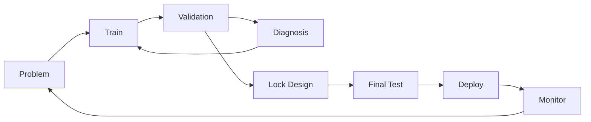

# Training, Validation và Testing trong Machine Learning

Một model có thể fit training data rất tốt nhưng không có nghĩa nó sẽ hoạt động tốt trên future data. Vì vậy Machine Learning cần tách data theo **vai trò statistical**, không chỉ theo folder: training dùng để học parameters; validation dùng để lựa chọn model/hyperparameters/threshold; test dùng để estimate performance sau selection.

Nếu repeatedly nhìn test result rồi điều chỉnh model, test set không còn độc lập. Nó đã trở thành một phần của training process theo nghĩa rộng.

## Ba vai trò cơ bản

### Training set

Dùng để fit model parameters:

\[
\theta^*=\arg\min_\theta \hat R_{train}(\theta)
\]

Preprocessing có learned parameters như scaler/PCA/imputer cũng phải fit trên training data.

### Validation set

Dùng để chọn:

- model family;
- hyperparameters;
- feature set;
- regularization;
- early stopping checkpoint;
- decision threshold.

Validation data ảnh hưởng decisions nên performance trên nó có selection bias after extensive tuning.

### Test set

Held-out data reserved để estimate final generalization after model choices.

Test should mimic intended deployment distribution/boundary as closely as practical.

## Why random split works sometimes

If examples approximately i.i.d. from same stationary target distribution, random split creates train/validation/test with similar distributions.

Example independent flower measurements from same population can often use random stratified split.

But many real datasets violate independence/time stationarity.

## Time-based split

Forecasting or production prediction normally trains on past and predicts future.

Correct evaluation should reflect direction:

```text
Train: Jan–Jun
Validation: Jul
Test: Aug
```

Randomly mixing August into training lets future patterns influence model predicting June-like rows.

Even without explicit future feature, distribution knowledge can leak.

## Group-based split

If multiple rows per entity:

```text
patient visits
user transactions
device events
```

random row split puts same entity both sides.

If deployment must generalize to unseen entities, use GroupKFold/GroupShuffle-like split by entity.

If deployment predicts future events for existing entities, time-within-entity split may be more appropriate.

Evaluation boundary must match product question.

## Stratification

For imbalanced classification, random split may give very different positive rates, especially small dataset.

Stratified split preserves class proportions approximately.

But stratification alone does not fix group/time leakage.

Need combine constraints when necessary.

## Validation overfitting

Suppose try 1000 configurations and choose best validation score. Even if each estimate noisy, maximum tends to benefit from luck.

Repeated tuning overfits validation set.

Mitigations:

- nested cross-validation;
- separate final holdout;
- reduce search degrees of freedom;
- report uncertainty/multiple seeds;
- evaluate on new external data.

## Cross-validation

K-fold CV splits data into K folds. For each fold:

```text
train on K-1 folds
validate on remaining fold
```

Aggregate scores.

Useful when data limited, because each example used for validation once and training multiple times.

## Cross-validation is not automatically leakage-free

Every fold must fit preprocessing independently.

Wrong:

```text
PCA on all data → CV model
```

Correct:

```text
for each fold:
  fit PCA on fold-training only
  transform fold-validation
```

Pipeline abstractions automate this boundary.

## Nested cross-validation

Outer CV estimates generalization.

Inner CV selects hyperparameters.

```text
outer train
  ↓ inner CV → choose hyperparameters
fit on full outer train
  ↓
evaluate outer holdout
```

This reduces optimistic bias from tuning, especially small datasets.

Computational cost is much higher.

## Leave-One-Out

LOOCV uses one example validation each run.

Advantages:

- nearly all data used for training each fold.

Disadvantages:

- expensive;
- high variance of estimate in some settings;
- not appropriate with grouped/time dependencies.

More folds are not automatically better.

## Repeated cross-validation

Repeat K-fold with different partitions to estimate split variability.

Useful when dataset small and model score sensitive to partition.

Report distribution, not only mean.

## Temporal cross-validation

Rolling/expanding window:

```text
Train [1..t1] → Validate [t1+1..t2]
Train [1..t2] → Validate [t2+1..t3]
```

or fixed rolling window.

This measures robustness across time and supports hyperparameter choice without future-to-past leakage.

## Backtesting

In finance, demand forecasting and recommendation, evaluation often simulates historical deployment points.

At each timestamp:

```text
use only data known then
train/update model
predict future window
measure outcome later
```

True point-in-time feature availability is essential.

## Test contamination

Test example can leak into training via:

- duplicates;
- public benchmark copied into corpus;
- feature preprocessing;
- manual prompt/model tuning;
- repeated leaderboard feedback.

Contamination means measured test score partly memorization/selection rather than independent generalization.

Foundation-model benchmarks are especially vulnerable because training corpora web-scale.

## External validation

Evaluate on another site/time/source.

Example medical model trained Hospital A and tested Hospital B.

External validation probes domain shift and shortcut reliance more strongly than random internal split.

A small performance drop can reveal hidden site-specific features.

## Development set vs validation set terminology

Literature uses `dev set` and `validation set` mostly interchangeably.

Some teams use:

```text
train
validation/dev
test
```

Others additionally have calibration or shadow sets.

Names less important than strict role/access policy.

## Calibration set

Post-hoc calibration methods such as temperature scaling or Platt scaling need data not used to fit base model parameters.

Could use validation split or dedicated calibration split.

If calibrate on test set, final calibration metric optimistic.

## Threshold tuning

Probability model may output scores. Decision threshold tuned on validation based on cost/precision/recall constraints.

Example choose threshold such that:

```text
precision ≥ 95%
maximize recall
```

Then report locked-threshold performance on test.

Do not choose threshold after seeing test labels.

## Early stopping

During iterative training:

```text
train loss generally falls
validation metric monitored
stop when validation stops improving
```

Because validation influences stopping/checkpoint selection, final unbiased estimate needs separate test.

Patience avoids stopping on one noisy fluctuation.

## Learning curves

Plot performance vs training set size.

Patterns:

```text
train good, validation poor, gap large
→ high variance / more data may help

train poor, validation poor
→ underfit / representation/model/optimization issue

both improve with more data
→ data scale useful
```

Learning curves are diagnostic, not strict theorem.

## Training curves

Plot loss/metric vs optimization steps/epochs.

Useful signals:

- divergence;
- overfitting onset;
- plateau;
- unstable learning rate;
- data pipeline issue.

Need compare training and validation, not one curve alone.

## Hyperparameter search

Grid search enumerates combinations. Cost grows exponentially with dimensions.

Random search samples configurations and is often more efficient when only some hyperparameters matter.

Bayesian optimization models response surface to choose promising configurations.

Modern neural training may use population-based/evolutionary/search methods.

## Search budget is part of comparison

Comparing Algorithm A tuned heavily vs Algorithm B with defaults is unfair.

Model comparison should account compute/tuning budget.

Leaderboard results may reflect engineering/search resources as much as algorithm core.

## Multiple random seeds

Stochastic training varies due initialization/data order.

Report:

\[
mean\pm std
\]

or confidence intervals across runs when feasible.

One lucky seed should not define method quality.

For expensive foundation models, multiple full runs may be impossible; then document limitation and use smaller-scale ablations carefully.

## Statistical uncertainty of metrics

Test metric is estimate from finite sample.

Accuracy standard error under rough binomial assumption:

\[
SE\approx\sqrt{\frac{p(1-p)}{n}}
\]

For complex metrics or paired model comparison, bootstrap can estimate uncertainty.

A 0.1% score difference may be meaningless if uncertainty larger.

## Paired comparison

When two models evaluated on same examples, compare per-example outcomes jointly.

Paired bootstrap/McNemar-like tests exploit correlation and often more powerful than treating scores independent.

Question is not just “A score > B score” but whether difference stable beyond sampling noise.

## Evaluation subsets

Overall metric can hide failure on important slices.

Evaluate by:

```text
country/device/language
rare classes
new users
long documents
low-light images
high-value transactions
```

Choose slices based domain risks, not arbitrary demographic fishing.

## Worst-group performance

Average can improve while a subgroup worsens.

For safety/fairness-critical use, track worst-group or constraint metrics.

But small groups have wider statistical uncertainty; report counts/confidence.

## Offline vs online evaluation

Offline test predicts performance under historical data.

Online A/B test measures system impact when model changes user/environment behavior.

A recommender with better offline ranking metric may reduce long-term satisfaction.

Use offline for development; online for causal product impact where appropriate.

## Shadow deployment

New model receives live inputs but does not affect decisions; compare predictions/latency/distribution silently.

Benefits:

- detect schema/feature issues;
- measure live latency;
- compare score distribution;
- collect labels later.

It cannot measure behavioral feedback caused by new actions because model not controlling them.

## Canary deployment

Serve small percentage real traffic, monitor, then expand.

Useful for operational risk.

Need rollback conditions and guardrail metrics.

## Dataset shift monitoring

After deployment monitor:

- feature distribution;
- prediction distribution;
- missing rates;
- latency;
- eventual labels/performance.

Feature drift does not automatically mean performance drift, but signals need investigation.

Concept drift may happen even if feature marginals stable.

## Reproducible split

Persist example IDs or split manifest, not just random seed.

Data changes can make same seed produce different partition.

Version:

```text
dataset snapshot
split definition
preprocessing
code commit
model config
```

## Benchmark protocol

Good benchmark specifies:

```text
dataset version
split
metric
preprocessing rules
allowed external data
compute constraints if relevant
```

Without protocol, scores not comparable.

## Test set security

For high-stakes benchmark, keep labels/private examples hidden to reduce manual overfitting.

But repeated API submissions still leak information through scores. Limit submissions or rotate test sets.

## Evaluation-driven development loop



The test is not the everyday feedback loop; validation is.

## Mental Model

```text
Train      = learn parameters
Validation = make development choices
Test       = estimate after choices are locked
CV         = repeat train/validation partitions when data limited
External   = challenge domain assumptions
Online     = measure intervention/product effect
Monitoring = verify deployment distribution remains acceptable
```

## Common Misconceptions

### “80/20 split is standard rule”

Split ratios depend dataset size, grouping, time and task. Statistical role matters more than percentages.

### “Cross-validation means no need test set”

If CV used heavily for model selection, a final independent holdout can still be valuable.

### “Test score is true performance”

It is an estimate on a specific sample/protocol.

### “Random seed makes result reproducible”

Data versions, software/hardware and nondeterministic kernels also matter.

## Knowledge Connection

Evaluation protocol is part of scientific validity of Machine Learning. A sophisticated algorithm with contaminated split teaches less than a simple baseline evaluated correctly.

Xem tiếp: [Loss, Objective and Risk](./04_loss_objective_and_risk.md).