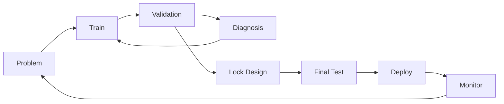

# Huấn luyện (training / 학습), kiểm tra hợp lệ (validation / 검증) và Testing trong Machine học tập (learning / 학습)

> **Mạch đọc:** Đặt **huấn luyện (training / 학습), kiểm tra hợp lệ (validation / 검증) và Testing trong Machine học tập (learning / 학습)** trong bản đồ [README](./README.md) để thấy đơn vị sở hữu (owner / 오너) và vị trí của nó. Nội dung đi từ **Ba vai trò cơ bản** sang **huấn luyện (training / 학습) set**; điểm nối này chuẩn bị câu hỏi cho các mục sau thay vì dừng ở định nghĩa đầu tiên.


Một mô hình (model / 모델) có thể fit dữ liệu huấn luyện (training data / 학습 데이터) rất tốt nhưng không có nghĩa nó sẽ hoạt động tốt trên future dữ liệu (data / 데이터). Vì vậy Machine học tập (learning / 학습) cần tách dữ liệu (data / 데이터) theo **vai trò statistical**, không chỉ theo folder: huấn luyện (training / 학습) dùng để học parameters; kiểm tra hợp lệ (validation / 검증) dùng để lựa chọn mô hình (model / 모델)/hyperparameters/threshold; kiểm thử (test / 테스트) dùng để estimate hiệu năng (performance / 성능) sau selection.

Nếu repeatedly nhìn kiểm thử (test / 테스트) kết quả (result / 결과) rồi điều chỉnh mô hình (model / 모델), kiểm thử (test / 테스트) set không còn độc lập. Nó đã trở thành một phần của huấn luyện (training / 학습) tiến trình (process / 프로세스) theo nghĩa rộng.

## Ba vai trò cơ bản

### Huấn luyện (training / 학습) set

Dùng để fit mô hình (model / 모델) parameters:

\[
\theta^*=\arg\min_\theta \hat R_{train}(\theta)
\]

Preprocessing có learned parameters như scaler/PCA/imputer cũng phải fit trên dữ liệu huấn luyện (training data / 학습 데이터).

### Kiểm tra hợp lệ (validation / 검증) set

Dùng để chọn:

- mô hình (model / 모델) family;
- hyperparameters;
- tính năng (feature / 기능) set;
- regularization;
- early stopping checkpoint;
- quyết định (decision / 결정) threshold.

Kiểm tra hợp lệ (validation / 검증) dữ liệu (data / 데이터) ảnh hưởng decisions nên hiệu năng (performance / 성능) trên nó có selection độ lệch (bias / 편향) after extensive tuning.

### Kiểm thử (test / 테스트) set

Held-out dữ liệu (data / 데이터) reserved để estimate final generalization after mô hình (model / 모델) choices.

Kiểm thử (test / 테스트) should mimic intended triển khai (deployment / 배포) phân phối (distribution / 분포)/ranh giới (boundary / 경계) as closely as practical.

## Why random split works sometimes

If examples approximately i.i.d. from same stationary mục tiêu (target / 대상) phân phối (distribution / 분포), random split creates train/kiểm tra hợp lệ (validation / 검증)/kiểm thử (test / 테스트) with similar distributions.

Example independent flower measurements from same population can often use random stratified split.

But many real datasets violate independence/thời gian (time / 시간) stationarity.

## Time-based split

Forecasting or môi trường vận hành (production / 운영 환경) prediction normally trains on past and predicts future.

Correct evaluation should reflect direction:

```text
Train: Jan–Jun
Validation: Jul
Test: Aug
```

Randomly mixing August into huấn luyện (training / 학습) lets future patterns influence mô hình (model / 모델) predicting June-like rows.

Even without tường minh (explicit / 명시적) future tính năng (feature / 기능), phân phối (distribution / 분포) kiến thức (knowledge / 지식) can leak.

## Group-based split

If multiple rows per thực thể (entity / 엔터티):

```text
patient visits
user transactions
device events
```

random row split puts same thực thể (entity / 엔터티) both sides.

If triển khai (deployment / 배포) must generalize to unseen entities, use GroupKFold/GroupShuffle-like split by thực thể (entity / 엔터티).

If triển khai (deployment / 배포) predicts future events for existing entities, time-within-entity split may be more appropriate.

Evaluation ranh giới (boundary / 경계) must match sản phẩm (product / 제품) question.

## Stratification

For imbalanced classification, random split may give very different positive rates, especially small dataset.

Stratified split preserves lớp (class / 클래스) proportions approximately.

But stratification alone does not fix group/thời gian (time / 시간) leakage.

Need combine các ràng buộc (constraints / 제약조건들) when necessary.

## Kiểm tra hợp lệ (validation / 검증) overfitting

Suppose try 1000 configurations and choose best kiểm tra hợp lệ (validation / 검증) score. Even if each estimate noisy, maximum tends to benefit from luck.

Repeated tuning overfits kiểm tra hợp lệ (validation / 검증) set.

Mitigations:

- nested cross-validation;
- separate final holdout;
- reduce tìm kiếm (search / 검색) degrees of freedom;
- report bất định (uncertainty / 불확실성)/multiple seeds;
- evaluate on new bên ngoài (external / 외부) dữ liệu (data / 데이터).

## Cross-validation

K-fold CV splits dữ liệu (data / 데이터) into K folds. For each fold:

```text
train on K-1 folds
validate on remaining fold
```

Aggregate scores.

Useful when dữ liệu (data / 데이터) limited, because each example used for kiểm tra hợp lệ (validation / 검증) once and huấn luyện (training / 학습) multiple times.

## Cross-validation is not automatically leakage-free

Every fold must fit preprocessing independently.

Wrong:

```text
PCA on all data → CV model
```

Correct:

```text
for each fold:
  fit PCA on fold-training only
  transform fold-validation
```

Chuỗi xử lý (pipeline / 파이프라인) abstractions automate this ranh giới (boundary / 경계).

## Nested cross-validation

Outer CV estimates generalization.

Inner CV selects hyperparameters.

```text
outer train
  ↓ inner CV → choose hyperparameters
fit on full outer train
  ↓
evaluate outer holdout
```

This reduces optimistic độ lệch (bias / 편향) from tuning, especially small datasets.

Computational chi phí (cost / 비용) is much higher.

## Leave-One-Out

LOOCV uses one example kiểm tra hợp lệ (validation / 검증) each run.

Advantages:

- nearly all dữ liệu (data / 데이터) used for huấn luyện (training / 학습) each fold.

Disadvantages:

- expensive;
- high variance of estimate in some settings;
- not appropriate with grouped/thời gian (time / 시간) dependencies.

More folds are not automatically better.

## Repeated cross-validation

Repeat K-fold with different partitions to estimate split variability.

Useful when dataset small and mô hình (model / 모델) score sensitive to partition.

Report phân phối (distribution / 분포), not only mean.

## Temporal cross-validation

Rolling/expanding cửa sổ (window / 윈도우):

```text
Train [1..t1] → Validate [t1+1..t2]
Train [1..t2] → Validate [t2+1..t3]
```

or fixed rolling cửa sổ (window / 윈도우).

This measures robustness across thời gian (time / 시간) and supports hyperparameter choice without future-to-past leakage.

## Backtesting

In finance, demand forecasting and recommendation, evaluation often simulates historical triển khai (deployment / 배포) points.

At each timestamp:

```text
use only data known then
train/update model
predict future window
measure outcome later
```

True point-in-time tính năng (feature / 기능) availability is essential.

## Kiểm thử (test / 테스트) contamination

Kiểm thử (test / 테스트) example can leak into huấn luyện (training / 학습) via:

- duplicates;
- công khai (public / 공개) benchmark copied into corpus;
- tính năng (feature / 기능) preprocessing;
- manual prompt/mô hình (model / 모델) tuning;
- repeated leaderboard phản hồi (feedback / 피드백).

Contamination means measured kiểm thử (test / 테스트) score partly memorization/selection rather than independent generalization.

Foundation-model benchmarks are especially vulnerable because huấn luyện (training / 학습) corpora web-scale.

## Bên ngoài (external / 외부) kiểm tra hợp lệ (validation / 검증)

Evaluate on another site/thời gian (time / 시간)/nguồn (source / 소스).

Example medical mô hình (model / 모델) trained Hospital A and tested Hospital B.

Bên ngoài (external / 외부) kiểm tra hợp lệ (validation / 검증) probes lĩnh vực (domain / 도메인) shift and shortcut reliance more strongly than random nội bộ (internal / 내부) split.

A small hiệu năng (performance / 성능) drop can reveal hidden site-specific features.

## Development set vs kiểm tra hợp lệ (validation / 검증) set terminology

Literature uses `dev set` and `validation set` mostly interchangeably.

Some teams use:

```text
train
validation/dev
test
```

Others additionally have calibration or shadow sets.

Names less important than strict role/truy cập (access / 접근) chính sách (policy / 정책).

## Calibration set

Post-hoc calibration methods such as temperature scaling or Platt scaling need dữ liệu (data / 데이터) not used to fit cơ sở (base / 기반) mô hình (model / 모델) parameters.

Could use kiểm tra hợp lệ (validation / 검증) split or dedicated calibration split.

If calibrate on kiểm thử (test / 테스트) set, final calibration chỉ số (metric / 지표) optimistic.

## Threshold tuning

Xác suất (probability / 확률) mô hình (model / 모델) may đầu ra (output / 출력) scores. quyết định (decision / 결정) threshold tuned on kiểm tra hợp lệ (validation / 검증) based on chi phí (cost / 비용)/precision/recall các ràng buộc (constraints / 제약조건들).

Example choose threshold such that:

```text
precision ≥ 95%
maximize recall
```

Then report locked-threshold hiệu năng (performance / 성능) on kiểm thử (test / 테스트).

Do not choose threshold after seeing kiểm thử (test / 테스트) labels.

## Early stopping

During iterative huấn luyện (training / 학습):

```text
train loss generally falls
validation metric monitored
stop when validation stops improving
```

Because kiểm tra hợp lệ (validation / 검증) influences stopping/checkpoint selection, final unbiased estimate needs separate kiểm thử (test / 테스트).

Patience avoids stopping on one noisy fluctuation.

## Học tập (learning / 학습) curves

Plot hiệu năng (performance / 성능) vs huấn luyện (training / 학습) set kích thước (size / 크기).

Patterns:

```text
train good, validation poor, gap large
→ high variance / more data may help

train poor, validation poor
→ underfit / representation/model/optimization issue

both improve with more data
→ data scale useful
```

Học tập (learning / 학습) curves are diagnostic, not strict theorem.

## Huấn luyện (training / 학습) curves

Plot mất mát (loss / 손실)/chỉ số (metric / 지표) vs tối ưu hóa (optimization / 최적화) steps/epochs.

Useful signals:

- divergence;
- overfitting onset;
- plateau;
- unstable học tập (learning / 학습) tỷ lệ (rate / 비율);
- dữ liệu (data / 데이터) chuỗi xử lý (pipeline / 파이프라인) issue.

Need compare huấn luyện (training / 학습) and kiểm tra hợp lệ (validation / 검증), not one curve alone.

## Hyperparameter tìm kiếm (search / 검색)

Grid tìm kiếm (search / 검색) enumerates combinations. chi phí (cost / 비용) grows exponentially with dimensions.

Random tìm kiếm (search / 검색) samples configurations and is often more efficient when only some hyperparameters matter.

Bayesian tối ưu hóa (optimization / 최적화) các mô hình (models / 모델들) phản hồi (response / 응답) surface to choose promising configurations.

Hiện đại (modern / 현대적) neural huấn luyện (training / 학습) may use population-based/evolutionary/tìm kiếm (search / 검색) methods.

## Tìm kiếm (search / 검색) ngân sách (budget / 예산) is part of comparison

Comparing thuật toán (algorithm / 알고리즘) A tuned heavily vs thuật toán (algorithm / 알고리즘) B with defaults is unfair.

Mô hình (model / 모델) comparison should account compute/tuning ngân sách (budget / 예산).

Leaderboard results may reflect kỹ thuật (engineering / 엔지니어링)/tìm kiếm (search / 검색) resources as much as thuật toán (algorithm / 알고리즘) cốt lõi (core / 핵심).

## Multiple random seeds

Stochastic huấn luyện (training / 학습) varies due initialization/dữ liệu (data / 데이터) thứ tự (order / 순서).

Report:

\[
mean\pm std
\]

or confidence intervals across runs when feasible.

One lucky seed should not define phương thức (method / 메서드) chất lượng (quality / 품질).

For expensive foundation các mô hình (models / 모델들), multiple full runs may be impossible; then document limitation and use smaller-scale ablations carefully.

## Statistical bất định (uncertainty / 불확실성) of metrics

Kiểm thử (test / 테스트) chỉ số (metric / 지표) is estimate from finite mẫu (sample / 표본).

Accuracy tiêu chuẩn (standard / 표준) lỗi (error / 오류) under rough binomial giả định (assumption / 가정):

\[
SE\approx\sqrt{\frac{p(1-p)}{n}}
\]

For complex metrics or paired mô hình (model / 모델) comparison, bootstrap can estimate bất định (uncertainty / 불확실성).

A 0.1% score difference may be meaningless if bất định (uncertainty / 불확실성) larger.

## Paired comparison

When two các mô hình (models / 모델들) evaluated on same examples, compare per-example outcomes jointly.

Paired bootstrap/McNemar-like tests exploit correlation and often more powerful than treating scores independent.

Question is not just “A score > B score” but whether difference stable beyond sampling noise.

## Evaluation subsets

Overall chỉ số (metric / 지표) can hide thất bại (failure / 실패) on important slices.

Evaluate by:

```text
country/device/language
rare classes
new users
long documents
low-light images
high-value transactions
```

Choose slices based lĩnh vực (domain / 도메인) risks, not arbitrary demographic fishing.

## Worst-group hiệu năng (performance / 성능)

Average can improve while a subgroup worsens.

For an toàn (safety / 안전)/fairness-critical use, nhánh học (track / 트랙) worst-group or ràng buộc (constraint / 제약조건) metrics.

But small groups have wider statistical bất định (uncertainty / 불확실성); report counts/confidence.

## Offline vs online evaluation

Offline kiểm thử (test / 테스트) predicts hiệu năng (performance / 성능) under historical dữ liệu (data / 데이터).

Online A/B kiểm thử (test / 테스트) measures hệ thống (system / 시스템) impact when mô hình (model / 모델) changes người dùng (user / 사용자)/môi trường (environment / 환경) hành vi (behavior / 동작).

A recommender with better offline ranking chỉ số (metric / 지표) may reduce long-term satisfaction.

Use offline for development; online for nhân quả (causal / 인과적) sản phẩm (product / 제품) impact where appropriate.

## Shadow triển khai (deployment / 배포)

New mô hình (model / 모델) receives live inputs but does not affect decisions; compare predictions/độ trễ (latency / 지연 시간)/phân phối (distribution / 분포) silently.

Benefits:

- detect lược đồ (schema / 스키마)/tính năng (feature / 기능) issues;
- measure live độ trễ (latency / 지연 시간);
- compare score phân phối (distribution / 분포);
- collect labels later.

It cannot measure behavioral phản hồi (feedback / 피드백) caused by new actions because mô hình (model / 모델) not controlling them.

## Canary triển khai (deployment / 배포)

Serve small percentage real traffic, monitor, then expand.

Useful for operational rủi ro (risk / 위험).

Need quay lui (rollback / 롤백) conditions and guardrail metrics.

## Dataset shift monitoring

After triển khai (deployment / 배포) monitor:

- tính năng (feature / 기능) phân phối (distribution / 분포);
- prediction phân phối (distribution / 분포);
- missing rates;
- độ trễ (latency / 지연 시간);
- eventual labels/hiệu năng (performance / 성능).

Tính năng (feature / 기능) drift does not automatically mean hiệu năng (performance / 성능) drift, but signals need investigation.

Concept drift may happen even if tính năng (feature / 기능) marginals stable.

## Reproducible split

Persist example IDs or split manifest, not just random seed.

Dữ liệu (data / 데이터) changes can make same seed produce different partition.

Phiên bản (version / 버전):

```text
dataset snapshot
split definition
preprocessing
code commit
model config
```

## Benchmark giao thức (protocol / 프로토콜)

Good benchmark specifies:

```text
dataset version
split
metric
preprocessing rules
allowed external data
compute constraints if relevant
```

Without giao thức (protocol / 프로토콜), scores not comparable.

## Kiểm thử (test / 테스트) set bảo mật (security / 보안)

For high-stakes benchmark, keep labels/private examples hidden to reduce manual overfitting.

But repeated API submissions still leak thông tin (information / 정보) through scores. Limit submissions or rotate kiểm thử (test / 테스트) sets.

## Evaluation-driven development vòng lặp (loop / 루프)

Phần này chuyển khái niệm Computer Science thành cấu trúc, ví dụ hoặc quy trình có thể kiểm tra. Hãy xác định câu hỏi mà mục trả lời rồi nối kết luận với phần kế tiếp.


```mermaid
flowchart LR
    P[Problem] --> T[Train]
    T --> V[Validation]
    V --> D[Diagnosis]
    D --> T
    V --> L[Lock Design]
    L --> E[Final Test]
    E --> DEP[Deploy]
    DEP --> MON[Monitor]
    MON --> P
```

The kiểm thử (test / 테스트) is not the everyday vòng phản hồi (feedback loop / 피드백 루프); kiểm tra hợp lệ (validation / 검증) is.

## Mô hình tư duy (mental model / 사고 모델)

Phần này chốt mental model thành một chuỗi có thể dùng lại: bối cảnh → cơ chế → quan sát → giới hạn → quyết định. Hãy đọc sơ đồ như công cụ suy luận, không như một khẩu hiệu tách khỏi chapter.

```text
Train      = learn parameters
Validation = make development choices
Test       = estimate after choices are locked
CV         = repeat train/validation partitions when data limited
External   = challenge domain assumptions
Online     = measure intervention/product effect
Monitoring = verify deployment distribution remains acceptable
```

## Dùng chung (common / 공통) Misconceptions

### “80/20 split is tiêu chuẩn (standard / 표준) quy tắc (rule / 규칙)”

Split ratios depend dataset kích thước (size / 크기), grouping, thời gian (time / 시간) and tác vụ (task / 작업). Statistical role matters more than percentages.

### “Cross-validation means no need kiểm thử (test / 테스트) set”

If CV used heavily for mô hình (model / 모델) selection, a final independent holdout can still be valuable.

### “kiểm thử (test / 테스트) score is true hiệu năng (performance / 성능)”

It is an estimate on a specific mẫu (sample / 표본)/giao thức (protocol / 프로토콜).

### “Random seed makes kết quả (result / 결과) reproducible”

Dữ liệu (data / 데이터) versions, software/hardware and nondeterministic kernels also matter.

## Liên kết kiến thức (knowledge connection / 지식 연결)

Evaluation giao thức (protocol / 프로토콜) is part of scientific validity of Machine học tập (learning / 학습). A sophisticated thuật toán (algorithm / 알고리즘) with contaminated split teaches less than a simple baseline evaluated correctly.

Xem tiếp: [Loss, Objective and Risk](./04_loss_objective_and_risk.md).
