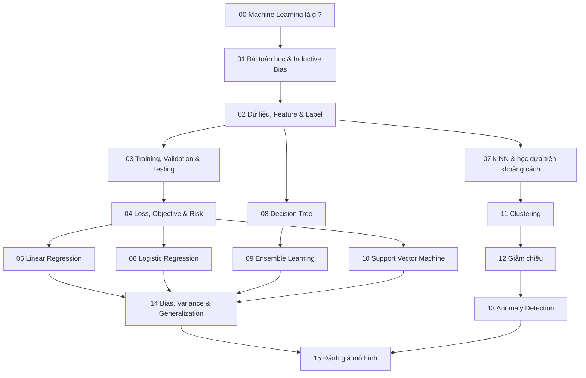

# Machine Learning Knowledge Layer

Folder này xây nền tảng Machine Learning (ML / 기계학습 / học máy) từ cách định nghĩa bài toán học cho tới đánh giá mô hình. Mục tiêu không phải liệt kê thuật toán, mà hiểu mỗi thuật toán đang đưa **thiên lệch quy nạp (inductive bias)** nào vào bài toán, tối ưu hàm mục tiêu nào, cần loại biểu diễn nào và thường thất bại ra sao khi các giả định bị phá vỡ.

## Sơ đồ phụ thuộc



Đây là thứ tự phụ thuộc được khuyến nghị, không phải syllabus cứng. Nếu đang làm bài toán không giám sát, có thể đọc Clustering trước SVM. Tuy nhiên các chương `00–04` nên được đọc trước phần lớn thuật toán vì chúng thiết lập ngôn ngữ chung về target, distribution, split, loss và risk.

## Các chương

### Nền tảng của quá trình học

**[00 — Machine Learning là gì?](./00_what_is_machine_learning.md)** đặt ML vào toàn cảnh AI, phân biệt học có giám sát, không giám sát, tự giám sát, bán giám sát, Reinforcement Learning, online/batch learning và mô hình sinh/phân biệt.

**[01 — Bài toán học và thiên lệch quy nạp](./01_learning_problem_and_inductive_bias.md)** giải thích vì sao dữ liệu hữu hạn không thể tự xác định duy nhất một quy luật, và tại sao architecture, regularization, optimization và representation đều là các giả định giúp mô hình generalize.

**[02 — Dữ liệu, Feature và Label](./02_data_features_and_labels.md)** đi từ sampling, ý nghĩa feature/label tới tính đúng theo thời điểm, leakage, target encoding, label noise, feedback loop và training-serving skew.

**[03 — Training, Validation và Testing](./03_training_validation_and_testing.md)** giải thích vì sao dữ liệu phải được chia theo đúng ranh giới deployment; random split không đủ với dữ liệu phụ thuộc thời gian, group hoặc entity.

**[04 — Hàm mất mát, hàm mục tiêu và rủi ro](./04_loss_objective_and_risk.md)** nối loss ở từng sample với empirical risk, population risk, regularization, surrogate objective và objective misspecification.

### Các họ mô hình có giám sát

**[05 — Linear Regression](./05_linear_regression.md)** dùng least squares để nối hình học ma trận, giả định nhiễu Gaussian, regularization, đa cộng tuyến và phân tích phần dư.

**[06 — Logistic Regression](./06_logistic_regression.md)** đi từ log-odds tới sigmoid/softmax, Maximum Likelihood, cross-entropy, calibration và threshold quyết định.

**[07 — k-NN và học dựa trên khoảng cách](./07_knn_and_distance_based_learning.md)** làm rõ metric khoảng cách chính là inductive bias về “mức độ giống nhau”, đồng thời nối nearest-neighbor learning với vector retrieval và RAG.

**[08 — Decision Tree](./08_decision_trees.md)** giải thích cách chia không gian đệ quy, Gini/entropy, greedy split, pruning, tính không ổn định và giới hạn về interpretability.

**[09 — Ensemble Learning](./09_ensemble_learning.md)** nối bagging/Random Forest với giảm variance, boosting với gradient descent trong không gian hàm và stacking với thiết kế out-of-fold.

**[10 — Support Vector Machine](./10_support_vector_machines.md)** tập trung vào maximum margin, support vector, hinge loss, soft margin và kernel trick.

### Học không giám sát và khám phá cấu trúc

**[11 — Clustering](./11_clustering.md)** so sánh k-Means, Gaussian Mixture, hierarchical clustering, DBSCAN/HDBSCAN và nhấn mạnh rằng cluster phụ thuộc representation cùng metric.

**[12 — Giảm chiều](./12_dimensionality_reduction.md)** nối PCA/SVD, t-SNE, UMAP, autoencoder và hình học của representation.

**[13 — Anomaly Detection](./13_anomaly_detection.md)** giải thích density, Isolation Forest, One-Class SVM, LOF, reconstruction-based detection, anomaly chuỗi thời gian và cách chọn threshold theo năng lực vận hành.

### Khả năng khái quát hóa và đánh giá

**[14 — Bias, Variance và khả năng khái quát hóa](./14_bias_variance_and_generalization.md)** đi từ phân rã cổ điển tới regularization, learning curve, distribution shift, shortcut learning và hiện tượng overparameterization hiện đại.

**[15 — Đánh giá mô hình](./15_model_evaluation.md)** tổng hợp confusion matrix, ROC/PR, calibration, metric hồi quy/xếp hạng, confidence interval, subgroup evaluation, online/offline evaluation và quyết định theo chi phí.

## Mô hình tư duy của toàn bộ layer

```text
Bài toán và môi trường deployment
        ↓
Sampling / dữ liệu / label
        ↓
Representation
        ↓
Không gian giả thuyết + inductive bias
        ↓
Loss / objective
        ↓
Optimization / fitting
        ↓
Validation và lựa chọn mô hình
        ↓
Bằng chứng về generalization
        ↓
Chính sách quyết định
        ↓
Feedback production / distribution shift
```

Một thuật toán chỉ là một khối trong toàn bộ dòng xử lý này. Nếu target sai, leakage tồn tại hoặc metric không phản ánh deployment, đổi Random Forest thành neural network không giải quyết được nguyên nhân gốc.

## Chuyển tiếp sang Neural Network

Sau folder này, [Neural Networks](../05_neural_networks/) không bắt đầu như một thế giới hoàn toàn mới. Neural network tiếp tục sử dụng cùng abstraction:

\[
f_\theta(x),\quad L(f_\theta(x),y),\quad \theta\leftarrow\theta-\eta\nabla_\theta L
\]

Điểm mới là representation và phép hợp thành hàm được học qua nhiều layer. Linear/Logistic Regression trở thành các building block; Optimization và Calculus trở thành nền của backpropagation và training dynamics; generalization và evaluation vẫn giữ nguyên vai trò.