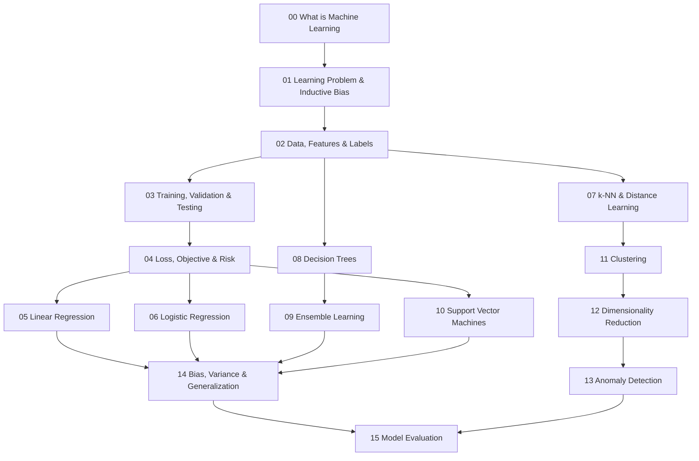

# Machine Learning Knowledge Layer

Folder này xây Machine Learning (ML / 기계학습 / học máy) từ learning problem tới model evaluation. Mục tiêu không phải liệt kê algorithms, mà hiểu mỗi algorithm đang đưa **inductive bias** nào vào bài toán, nó tối ưu objective gì, representation nào làm nó hoạt động tốt và failure mode nào xuất hiện khi assumptions bị phá vỡ.

## Dependency map



Đây là dependency khuyến nghị, không phải syllabus cứng. Ví dụ có thể đọc Clustering trước SVM nếu đang làm unsupervised problem. Tuy nhiên `00–04` nên đọc trước phần lớn algorithms vì chúng thiết lập vocabulary về target, distribution, split, loss và risk.

## Các chapter

### Foundations của learning

**[00 — Machine Learning là gì?](./00_what_is_machine_learning.md)** đặt ML vào toàn bộ AI landscape, phân biệt supervised, unsupervised, self-supervised, semi-supervised, reinforcement, online/batch và generative/discriminative learning.

**[01 — Learning Problem & Inductive Bias](./01_learning_problem_and_inductive_bias.md)** giải thích vì sao finite data không thể tự xác định duy nhất một rule và tại sao architecture, regularization, optimization, feature representation đều là assumptions giúp learner generalize.

**[02 — Data, Features & Labels](./02_data_features_and_labels.md)** đi từ sampling, feature/label semantics tới point-in-time correctness, leakage, target encoding, class noise, feedback loops và training-serving skew.

**[03 — Training, Validation & Testing](./03_training_validation_and_testing.md)** giải thích vì sao data phải được chia theo đúng deployment boundary; random split không đủ cho time/group/entity-dependent datasets.

**[04 — Loss, Objective & Risk](./04_loss_objective_and_risk.md)** nối sample loss với empirical risk, population risk, regularization, surrogate objectives và objective misspecification.

### Supervised model families

**[05 — Linear Regression](./05_linear_regression.md)** dùng least squares để nối matrix geometry, Gaussian-noise assumption, regularization, multicollinearity và residual analysis.

**[06 — Logistic Regression](./06_logistic_regression.md)** đi từ log-odds tới sigmoid/softmax, maximum likelihood, cross-entropy, calibration và decision threshold.

**[07 — k-NN & Distance-Based Learning](./07_knn_and_distance_based_learning.md)** làm rõ distance metric chính là inductive bias về “similarity”, đồng thời nối nearest-neighbor learning với vector retrieval/RAG.

**[08 — Decision Trees](./08_decision_trees.md)** giải thích recursive partition, Gini/entropy, greedy split, pruning, instability và interpretability limits.

**[09 — Ensemble Learning](./09_ensemble_learning.md)** nối bagging/Random Forest với variance reduction, boosting với functional gradient descent, và stacking với out-of-fold design.

**[10 — Support Vector Machines](./10_support_vector_machines.md)** tập trung vào maximum margin, support vectors, hinge loss, soft margin và kernel trick.

### Unsupervised / structure discovery

**[11 — Clustering](./11_clustering.md)** so sánh k-Means, Gaussian Mixture, hierarchical clustering, DBSCAN/HDBSCAN và nhấn mạnh cluster phụ thuộc representation + metric.

**[12 — Dimensionality Reduction](./12_dimensionality_reduction.md)** nối PCA/SVD, t-SNE, UMAP, autoencoder và representation geometry.

**[13 — Anomaly Detection](./13_anomaly_detection.md)** giải thích density, Isolation Forest, One-Class SVM, LOF, reconstruction-based detection, time-series anomalies và threshold theo operational capacity.

### Generalization & evaluation

**[14 — Bias, Variance & Generalization](./14_bias_variance_and_generalization.md)** đi từ classical decomposition tới regularization, learning curves, distribution shift, shortcut learning và modern overparameterization.

**[15 — Model Evaluation](./15_model_evaluation.md)** tổng hợp confusion matrix, ROC/PR, calibration, regression/ranking metrics, confidence intervals, subgroup evaluation, online/offline evaluation và cost-sensitive decision making.

## Mental model của toàn layer

```text
Problem & deployment environment
        ↓
Sampling / data / labels
        ↓
Representation
        ↓
Hypothesis space + inductive bias
        ↓
Loss / objective
        ↓
Optimization / fitting
        ↓
Validation and model selection
        ↓
Generalization evidence
        ↓
Decision policy
        ↓
Production feedback / shift
```

Một algorithm chỉ là một block trong flow này. Nếu data target sai, leakage tồn tại hoặc metric không phản ánh deployment, đổi Random Forest thành neural network không giải quyết root cause.

## Chuyển tiếp sang Neural Networks

Sau folder này, [Neural Networks](../05_neural_networks/) sẽ không bắt đầu như một thế giới hoàn toàn mới. Neural network tiếp tục đúng abstraction đã có:

\[
f_\theta(x),\quad L(f_\theta(x),y),\quad \theta\leftarrow\theta-\eta\nabla_\theta L
\]

Điểm mới là representation và function composition được học qua nhiều layers. Linear/Logistic Regression trở thành building block; Optimization/Calculus trở thành backpropagation/training dynamics; generalization/evaluation vẫn giữ nguyên vai trò.