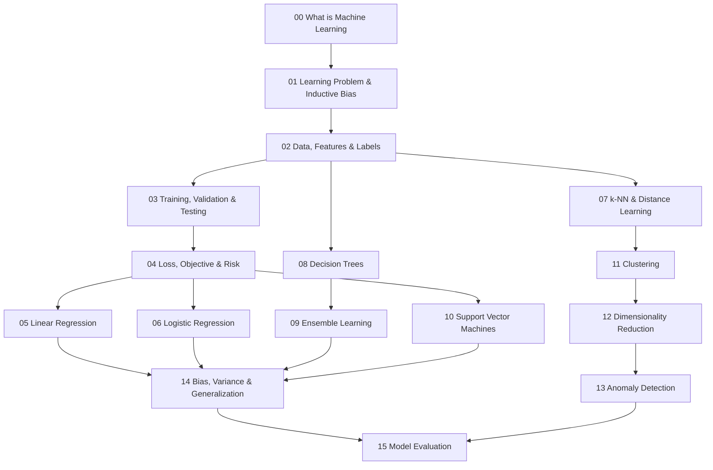

# Machine học tập (learning / 학습) kiến thức (knowledge / 지식) tầng (layer / 계층)

> **Mạch đọc:** [README](./README.md) là bản đồ owner của **Machine học tập (learning / 학습) kiến thức (knowledge / 지식) tầng (layer / 계층)**; nhìn vào vị trí đó trước để biết file này đang phục vụ nhánh kiến thức nào. **Phụ thuộc (dependency / 의존성) map** mở đối tượng chính của file và câu hỏi cần theo dõi; sau đó sang **Các chapter** để mở rộng đối tượng sang phạm vi kế cận. Cách đi này giữ lại điểm tựa của section đầu và cho biết kết luận sẽ được dùng ở đâu, thay vì dừng ở định nghĩa đầu tiên.

Folder này xây Machine học tập (learning / 학습) từ học tập (learning / 학습) bài toán (problem / 문제) tới mô hình (model / 모델) evaluation. Mục tiêu không phải liệt kê algorithms, mà hiểu mỗi thuật toán (algorithm / 알고리즘) đang đưa **inductive độ lệch (bias / 편향)** nào vào bài toán, nó tối ưu mục tiêu (objective / 목표) gì, biểu diễn (representation / 표현) nào làm nó hoạt động tốt và dạng thất bại (failure mode / 실패 모드) nào xuất hiện khi các giả định (assumptions / 가정들) bị phá vỡ.

## Phụ thuộc (dependency / 의존성) map

Sơ đồ hoặc danh sách này mô tả thứ tự phụ thuộc của các khái niệm. Hãy đọc theo mũi tên để biết phần nào là prerequisite, phần nào là ứng dụng và khi nào cần quay lại nền tảng.


```mermaid
flowchart TD
    A[00 What is Machine Learning] --> B[01 Learning Problem & Inductive Bias]
    B --> C[02 Data, Features & Labels]
    C --> D[03 Training, Validation & Testing]
    D --> E[04 Loss, Objective & Risk]

    E --> LR[05 Linear Regression]
    E --> LOG[06 Logistic Regression]
    C --> KNN[07 k-NN & Distance Learning]
    C --> TREE[08 Decision Trees]
    TREE --> ENS[09 Ensemble Learning]
    E --> SVM[10 Support Vector Machines]

    KNN --> CL[11 Clustering]
    CL --> DR[12 Dimensionality Reduction]
    DR --> AD[13 Anomaly Detection]

    LR --> BV[14 Bias, Variance & Generalization]
    LOG --> BV
    ENS --> BV
    SVM --> BV
    BV --> EV[15 Model Evaluation]
    AD --> EV
```

Đây là phụ thuộc (dependency / 의존성) khuyến nghị, không phải syllabus cứng. Ví dụ có thể đọc Clustering trước SVM nếu đang làm unsupervised bài toán (problem / 문제). Tuy nhiên `00–04` nên đọc trước phần lớn algorithms vì chúng thiết lập vocabulary về mục tiêu (target / 대상), phân phối (distribution / 분포), split, mất mát (loss / 손실) và rủi ro (risk / 위험).

> **Chuyển mạch:** Trong **Machine học tập (learning / 학습) kiến thức (knowledge / 지식) tầng (layer / 계층)**, **Các chapter** tiếp nhận điểm tựa từ **Phụ thuộc (dependency / 의존성) map** nhưng đổi góc nhìn sang câu hỏi của chính nó; đọc liền hai mục để thấy mối quan hệ đó. Từ đây, **Mô hình tư duy (mental model / 사고 모델) của toàn tầng (layer / 계층)** sẽ cho biết hệ quả hoặc giới hạn ấy hiện ra ở đâu.

## Các chapter

### Foundations của học tập (learning / 학습)

**[00 — Machine Learning là gì?](./00_what_is_machine_learning.md)** đặt ML vào toàn bộ AI landscape, phân biệt supervised, unsupervised, self-supervised, semi-supervised, reinforcement, online/batch và generative/discriminative học tập (learning / 학습).

**[01 — Learning Problem & Inductive Bias](./01_learning_problem_and_inductive_bias.md)** giải thích vì sao finite dữ liệu (data / 데이터) không thể tự xác định duy nhất một quy tắc (rule / 규칙) và tại sao kiến trúc (architecture / 아키텍처), regularization, tối ưu hóa (optimization / 최적화), tính năng (feature / 기능) biểu diễn (representation / 표현) đều là các giả định (assumptions / 가정들) giúp learner generalize.

**[02 — Data, Features & Labels](./02_data_features_and_labels.md)** đi từ sampling, tính năng (feature / 기능)/label ngữ nghĩa (semantics / 의미론) tới point-in-time tính đúng đắn (correctness / 정확성), leakage, mục tiêu (target / 대상) encoding, lớp (class / 클래스) noise, phản hồi (feedback / 피드백) loops và training-serving skew.

**[03 — Training, Validation & Testing](./03_training_validation_and_testing.md)** giải thích vì sao dữ liệu (data / 데이터) phải được chia theo đúng triển khai (deployment / 배포) ranh giới (boundary / 경계); random split không đủ cho thời gian (time / 시간)/group/entity-dependent datasets.

**[04 — Loss, Objective & Risk](./04_loss_objective_and_risk.md)** nối mẫu (sample / 표본) mất mát (loss / 손실) với empirical rủi ro (risk / 위험), population rủi ro (risk / 위험), regularization, surrogate objectives và mục tiêu (objective / 목표) misspecification.

### Supervised mô hình (model / 모델) families

**[05 — Linear Regression](./05_linear_regression.md)** dùng least squares để nối ma trận (matrix / 행렬) hình học (geometry / 기하학), Gaussian-noise giả định (assumption / 가정), regularization, multicollinearity và residual phân tích (analysis / 분석).

**[06 — Logistic Regression](./06_logistic_regression.md)** đi từ log-odds tới sigmoid/softmax, maximum likelihood, cross-entropy, calibration và quyết định (decision / 결정) threshold.

**[07 — k-NN & Distance-Based Learning](./07_knn_and_distance_based_learning.md)** làm rõ distance chỉ số (metric / 지표) chính là inductive độ lệch (bias / 편향) về “similarity”, đồng thời nối nearest-neighbor học tập (learning / 학습) với véc-tơ (vector / 벡터) retrieval/RAG.

**[08 — Decision Trees](./08_decision_trees.md)** giải thích recursive partition, Gini/entropy, greedy split, pruning, instability và interpretability limits.

**[09 — Ensemble Learning](./09_ensemble_learning.md)** nối bagging/Random Forest với variance reduction, boosting với functional độ dốc (gradient / 기울기) descent, và stacking với out-of-fold thiết kế (design / 설계).

**[10 — Support Vector Machines](./10_support_vector_machines.md)** tập trung vào maximum margin, hỗ trợ (support / 지원) vectors, hinge mất mát (loss / 손실), soft margin và kernel trick.

### Unsupervised / cấu trúc (structure / 구조) discovery

**[11 — Clustering](./11_clustering.md)** so sánh k-Means, Gaussian Mixture, hierarchical clustering, DBSCAN/HDBSCAN và nhấn mạnh cluster phụ thuộc biểu diễn (representation / 표현) + chỉ số (metric / 지표).

**[12 — Dimensionality Reduction](./12_dimensionality_reduction.md)** nối PCA/SVD, t-SNE, UMAP, autoencoder và biểu diễn (representation / 표현) hình học (geometry / 기하학).

**[13 — Anomaly Detection](./13_anomaly_detection.md)** giải thích density, Isolation Forest, One-Class SVM, LOF, reconstruction-based detection, time-series anomalies và threshold theo operational sức chứa (capacity / 용량).

### Generalization & evaluation

**[14 — Bias, Variance & Generalization](./14_bias_variance_and_generalization.md)** đi từ classical decomposition tới regularization, học tập (learning / 학습) curves, phân phối (distribution / 분포) shift, shortcut học tập (learning / 학습) và hiện đại (modern / 현대적) overparameterization.

**[15 — Model Evaluation](./15_model_evaluation.md)** tổng hợp confusion ma trận (matrix / 행렬), ROC/PR, calibration, regression/ranking metrics, confidence intervals, subgroup evaluation, online/offline evaluation và cost-sensitive quyết định (decision / 결정) making.

> **Chuyển mạch:** Ở chặng này của **Machine học tập (learning / 학습) kiến thức (knowledge / 지식) tầng (layer / 계층)**, **Mô hình tư duy (mental model / 사고 모델) của toàn tầng (layer / 계층)** gom các mảnh từ **Các chapter** thành một kết luận có thể mang sang phần kế tiếp. Từ đây, **Chuyển tiếp sang Neural Networks** sẽ cho biết hệ quả hoặc giới hạn ấy hiện ra ở đâu.

## Mô hình tư duy (mental model / 사고 모델) của toàn tầng (layer / 계층)

Phần này chốt mental model thành một chuỗi có thể dùng lại: bối cảnh → cơ chế → quan sát → giới hạn → quyết định. Hãy đọc sơ đồ như công cụ suy luận, không như một khẩu hiệu tách khỏi chapter.

```text
Problem & deployment environment
        ↓
Sampling / data / labels
        ↓
Representation
        ↓
Hypothesis space + inductive bias
        ↓
Loss / objective
        ↓
Optimization / fitting
        ↓
Validation and model selection
        ↓
Generalization evidence
        ↓
Decision policy
        ↓
Production feedback / shift
```

Một thuật toán (algorithm / 알고리즘) chỉ là một khối (block / 블록) trong luồng (flow / 흐름) này. Nếu dữ liệu (data / 데이터) mục tiêu (target / 대상) sai, leakage tồn tại hoặc chỉ số (metric / 지표) không phản ánh triển khai (deployment / 배포), đổi Random Forest thành neural mạng (network / 네트워크) không giải quyết nguyên nhân gốc (root cause / 근본 원인).

> **Chuyển mạch:** Đặt trong câu hỏi lớn của **Machine học tập (learning / 학습) kiến thức (knowledge / 지식) tầng (layer / 계층)**, **Chuyển tiếp sang Neural Networks** gom các mảnh từ **Mô hình tư duy (mental model / 사고 모델) của toàn tầng (layer / 계층)** thành một kết luận có thể mang sang phần kế tiếp. Phần còn lại của file dùng kết quả này để khép lại mạch giải thích.

## Chuyển tiếp sang Neural Networks

Sau folder này, [Neural Networks](../05_neural_networks/) sẽ không bắt đầu như một thế giới hoàn toàn mới. Neural mạng (network / 네트워크) tiếp tục đúng lớp trừu tượng (abstraction / 추상화) đã có:

\[
f_\theta(x),\quad L(f_\theta(x),y),\quad \theta\leftarrow\theta-\eta\nabla_\theta L
\]

Điểm mới là representation và function composition được học qua nhiều layers. Linear/Logistic Regression trở thành building block; Optimization/Calculus trở thành backpropagation/training dynamics; generalization/evaluation vẫn giữ nguyên vai trò.

> **Bàn giao:** Sau **Chuyển tiếp sang Neural Networks**, hãy giữ lại kết luận và ranh giới của mục này; quay về [README](./README.md) khi cần định vị owner hoặc chọn nhánh học tiếp theo.
