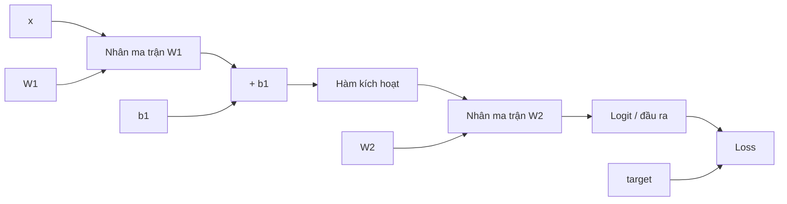

# Lan truyền tiến và đồ thị tính toán

**Lan truyền tiến (Forward Propagation / 순전파)** là quá trình đưa đầu vào đi qua đồ thị tính toán để tạo prediction và loss. Nghe có vẻ đơn giản như “chạy mô hình”, nhưng hiểu forward pass ở mức shape tensor, giá trị trung gian và dependency trong graph là điều kiện cần để hiểu backpropagation, chi phí bộ nhớ và cách debug Neural Network.

## Forward pass của một MLP

Với đầu vào `x`:

\[
z^{(1)}=W^{(1)}x+b^{(1)}
\]

\[
h^{(1)}=\phi(z^{(1)})
\]

\[
z^{(2)}=W^{(2)}h^{(1)}+b^{(2)}
\]

\[
\hat y=g(z^{(2)})
\]

\[
L=Loss(\hat y,y)
\]

Lan truyền tiến chỉ thực thi các phép toán theo đúng thứ tự phụ thuộc của chúng.

## Đồ thị tính toán

Quá trình tính có thể được biểu diễn như một DAG:



Mỗi node là một phép toán; các cạnh mang tensor.

Backward pass sau này duyệt graph theo chiều ngược để tích lũy đạo hàm.

## Shape tensor giống như hệ kiểu của Deep Learning

Giả sử batch đầu vào:

\[
X\in\mathbb R^{B\times d_{in}}
\]

Trọng số:

\[
W\in\mathbb R^{d_{out}\times d_{in}}
\]

Nếu framework dùng quy ước:

\[
Z=XW^T+b
\]

thì:

\[
Z\in\mathbb R^{B\times d_{out}}
\]

Shape mismatch là một trong các lỗi implementation phổ biến nhất.

Thói quen ghi rõ shape giúp reasoning về kiến trúc tốt hơn.

Trong Transformer thường gặp:

```text
B = batch size
T = sequence length
D = hidden dimension
H = số attention head
```

Hidden tensor có thể có dạng:

\[
X\in\mathbb R^{B\times T\times D}
\]

Khả năng reasoning theo shape dần trở thành một kỹ năng hệ thống, không chỉ kỹ năng toán học.

## Broadcasting

Bias `b∈R^{d_out}` thường được broadcast qua batch dimension:

\[
Z_{ij}=(XW^T)_{ij}+b_j
\]

Broadcasting rất tiện, nhưng cũng có thể tạo lỗi âm thầm nếu các dimension vô tình khớp theo cách không mong muốn.

Vì vậy cần luôn hiểu rõ ý nghĩa của từng axis thay vì chỉ thấy code chạy được.

## Xử lý theo batch

Thay vì lặp qua từng sample, các phép toán ma trận và tensor xử lý cả batch song song.

Accelerator đạt throughput cao nhờ dense linear algebra có cường độ tính toán lớn.

Batch size ảnh hưởng tới variance của gradient, bộ nhớ, mức sử dụng phần cứng, hành vi của normalization và dynamics của training.

Vì vậy forward propagation không chỉ là một ánh xạ toán học; nó còn là một bài toán thực thi hệ thống.

## Logit và xác suất

Classification head thường tạo **logit**, tức score chưa qua sigmoid hoặc softmax.

Loss của framework thường nhận trực tiếp logit để dùng công thức ổn định số.

Ví dụ multiclass cross-entropy thường kết hợp log-softmax và negative log-likelihood trong một implementation ổn định.

Chỉ khi inference hoặc downstream logic thật sự cần probability ta mới chuyển logit thành xác suất.

## Training Mode và Evaluation Mode

Một số layer có hành vi khác nhau giữa training và evaluation.

**Dropout** tạo mask ngẫu nhiên trong training nhưng được tắt ở inference.

**Batch Normalization** dùng thống kê của batch trong training và running statistics khi evaluation.

Nếu quên chuyển sang `model.eval()` hoặc cơ chế tương đương, kết quả inference có thể sai hoặc mang tính ngẫu nhiên ngoài ý muốn.

LayerNorm không phụ thuộc batch statistics theo cùng cách.

## Activation trung gian và bộ nhớ

Backpropagation cần nhiều giá trị trung gian từ forward pass để tính gradient. Vì vậy training thường tốn bộ nhớ hơn inference rất nhiều.

Bộ nhớ training có thể gồm:

```text
tham số
+ gradient
+ trạng thái optimizer
+ activation trung gian
```

Với sequence dài hoặc batch lớn, activation có thể chiếm phần bộ nhớ rất đáng kể.

**Gradient checkpointing / activation recomputation** tiết kiệm memory bằng cách không lưu toàn bộ activation; trong backward pass hệ thống tính lại một phần forward khi cần.

Đây là sự đánh đổi compute lấy memory.

## Đồ thị tĩnh và đồ thị động

Các framework lịch sử từng khác nhau ở cách xây computation graph:

- **static graph**: định nghĩa graph trước rồi mới chạy;
- **dynamic/eager graph**: phép toán được thực thi ngay và autograd ghi lại graph động.

Hệ thống hiện đại thường kết hợp trải nghiệm eager cho developer với tracing hoặc compilation để tối ưu kernel.

Dù implementation khác nhau, đồ thị tính toán vẫn là mô hình tư duy chung.

## Forward pass trong residual network

Residual block:

\[
y=x+F(x)
\]

có một đường tắt (skip path) truyền `x` trực tiếp tới output.

Đây không chỉ là trang trí kiến trúc. Trong backward pass, gradient cũng có một đường đi trực tiếp qua identity, giúp mạng sâu dễ train hơn.

Transformer stack phụ thuộc rất mạnh vào residual connection.

## Tính xác định và tính ngẫu nhiên

Forward pass có thể mang tính stochastic nếu dropout, sampling hoặc noise layer đang hoạt động.

Ngoài ra một số GPU kernel có thể nondeterministic tùy backend.

Khi nói về reproducibility cần phân biệt ba tầng:

- hàm mô hình xác định ở evaluation mode;
- tính ngẫu nhiên có chủ đích trong training;
- nondeterminism ở mức phần cứng hoặc kernel.

Random seed không phải lúc nào cũng bảo đảm kết quả bitwise-identical giữa các hardware hoặc phiên bản library khác nhau.

## Forward với Mixed Precision

FP16 hoặc BF16 giúp giảm memory bandwidth, giảm dung lượng bộ nhớ và tăng throughput accelerator.

Tuy nhiên một số phép toán vẫn cần accumulation ở precision cao hơn hoặc kernel ổn định số hơn.

**Automatic Mixed Precision (AMP)** tự chọn dtype phù hợp cho từng nhóm operation.

Các khái niệm từ Tính toán số quay lại trực tiếp ở đây.

## Quan sát activation để debug

Có thể inspect các thống kê như:

- mean/std của activation;
- min/max;
- NaN/Inf;
- tỷ lệ giá trị bằng 0;
- shape tensor.

Nếu activation bùng nổ hoặc biến mất dần theo layer, nguyên nhân có thể đến từ initialization, normalization, learning rate hoặc scale đầu vào.

## Tối ưu đồ thị inference

Khi deployment, forward graph có thể được tối ưu bằng operator fusion, constant folding, quantization, kernel selection, compilation, batching và KV cache với autoregressive Transformer.

Hàm toán học có thể gần như không đổi nhưng cách thực thi hệ thống thay đổi rất lớn về latency và cost.

## Mô hình tư duy

> Forward pass là quá trình thực thi một computation graph có tham số. Shape tensor mô tả “kiểu” của dữ liệu, activation là trạng thái trung gian, còn output/loss là điểm cuối để backward pass phân phối tín hiệu trách nhiệm ngược về các tham số.

## Các hiểu lầm thường gặp

### “Forward propagation chỉ là matrix multiplication”

Không. Mô hình hiện đại còn có attention, normalization, gating, convolution, routing, recurrence và nhiều cơ chế khác.

### “Nên tính probability trước rồi mới tính loss”

Về khái niệm có thể hiểu như vậy, nhưng implementation thường truyền logit trực tiếp vào fused loss để ổn định số.

### “Forward khi train và inference giống hệt nhau”

Không. Dropout, BatchNorm, sampling, cache và quantization có thể làm hành vi khác nhau.

### “Bộ nhớ chủ yếu bị chiếm bởi parameters”

Không trong training. Gradient, optimizer state và activation cũng có thể cực kỳ lớn.

## Liên kết kiến thức

Forward graph chuẩn bị trực tiếp cho [Backpropagation](./04_backpropagation.md) và [Training Dynamics](./09_deep_learning_training_dynamics.md).