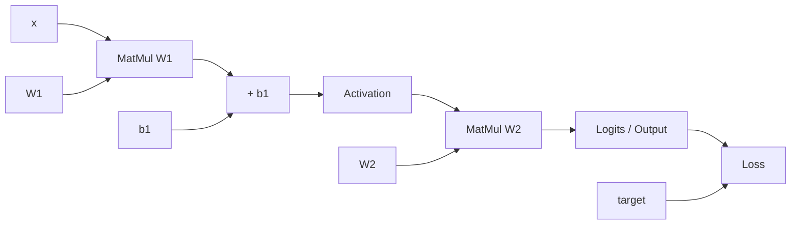

# Forward Propagation và Computational Graph

Forward Propagation (순전파 / lan truyền xuôi) là quá trình đưa input qua computation graph để tạo prediction và loss. Nghe có vẻ trivial — “chạy model” — nhưng hiểu forward pass ở mức tensor shapes, intermediate values và graph dependencies là prerequisite để hiểu backpropagation, memory cost và debugging neural networks.

## Forward pass của một MLP

Với input `x`:

\[
z^{(1)}=W^{(1)}x+b^{(1)}
\]

\[
h^{(1)}=\phi(z^{(1)})
\]

\[
z^{(2)}=W^{(2)}h^{(1)}+b^{(2)}
\]

\[
\hat y=g(z^{(2)})
\]

\[
L=Loss(\hat y,y)
\]

Forward propagation chỉ evaluate các operations theo dependency order.

## Computational Graph

Ta có thể biểu diễn computation như DAG:



Mỗi node là operation; edges mang tensors.

Backward pass sau này traverse graph ngược để accumulate derivatives.

## Tensor Shapes là type system của Deep Learning

Giả sử batch:

\[
X\in\mathbb R^{B\times d_{in}}
\]

Weight:

\[
W\in\mathbb R^{d_{out}\times d_{in}}
\]

Nếu framework convention dùng:

\[
Z=XW^T+b
\]

thì:

\[
Z\in\mathbb R^{B\times d_{out}}
\]

Shape mismatch là một trong những lỗi implementation phổ biến nhất. Học cách annotate shape giúp reasoning architecture tốt hơn.

Ví dụ Transformer thường annotate:

```text
B = batch size
T = sequence length
D = hidden dimension
H = attention heads
```

Hidden tensor:

\[
X\in\mathbb R^{B\times T\times D}
\]

Shape reasoning trở thành essential system skill.

## Broadcasting

Bias `b∈R^{d_out}` được broadcast qua batch dimension:

\[
Z_{ij}=(XW^T)_{ij}+b_j
\]

Broadcasting convenient nhưng có thể tạo silent bug nếu shape accidental align sai. Explicit mental model rất quan trọng.

## Batch processing

Thay vì loop từng sample, matrix/tensor operations xử lý batch song song. Hardware accelerator đạt throughput cao vì dense linear algebra có arithmetic intensity tốt.

Batch size ảnh hưởng:

- gradient estimate variance;
- memory usage;
- hardware utilization;
- normalization behavior;
- training dynamics.

Forward propagation vì vậy không chỉ mathematical mapping mà còn systems computation.

## Logits và probabilities

Classification head thường output logits `z`, chưa qua softmax/sigmoid.

Framework loss thường nhận logits trực tiếp để numerical stability.

Ví dụ multiclass cross-entropy thực hiện log-softmax + negative log likelihood trong stable fused formulation.

Inference mới có thể convert logits thành probabilities khi cần.

## Training Mode vs Evaluation Mode

Một số layers behavior khác giữa train/eval.

**Dropout** random mask trong training nhưng disabled/rescaled behavior ở inference.

**Batch Normalization** dùng batch statistics trong training và running statistics trong evaluation.

Nếu quên `model.eval()` hoặc equivalent, inference result có thể sai/stochastic.

LayerNorm thường không phụ thuộc batch statistics theo cùng cách.

## Intermediate Activations và Memory

Backprop cần nhiều intermediate values từ forward pass để compute gradients. Vì vậy training memory lớn hơn inference.

Roughly memory gồm:

```text
parameters
+ gradients
+ optimizer states
+ activations
```

Activation memory có thể dominate với long sequence/large batch.

**Gradient checkpointing / activation recomputation** tiết kiệm memory bằng cách không lưu mọi activation; backward recompute một phần forward. Trade compute for memory.

## Static vs Dynamic Graph

Frameworks lịch sử khác nhau:

- static graph: define graph trước rồi execute;
- eager/dynamic: operations execute ngay và autograd records graph dynamically.

Modern systems thường combine eager developer experience với graph compilation/tracing để optimize kernels.

Conceptually computational graph vẫn là mental model chung.

## Forward pass trong residual network

Residual block:

\[
y=x+F(x)
\]

Graph có skip path. Đây không chỉ architectural decoration; backward có gradient path qua identity, giúp deep network train easier.

Transformer stack phụ thuộc heavily vào residual connections.

## Determinism

Forward pass có thể stochastic nếu dropout/sampling/noise layers active. GPU kernels cũng có thể nondeterministic tùy operation/backend.

Reproducibility cần distinguish:

- deterministic model function ở eval;
- stochastic training;
- hardware-level nondeterminism.

Random seed không luôn đảm bảo bitwise-identical result across hardware/library versions.

## Mixed Precision Forward

FP16/BF16 giảm memory/bandwidth và tăng accelerator throughput. Nhưng một số operations cần higher precision accumulation hoặc stable kernel.

Automatic Mixed Precision chọn dtypes per operation. Numerical computation concepts từ previous folder quay lại trực tiếp.

## Forward Hook / Activation Inspection

Debugging có thể inspect:

- activation mean/std;
- min/max;
- NaN/Inf;
- percentage zeros;
- tensor shapes.

Nếu activations explode/vanish qua layers, root cause có thể là initialization, normalization, learning rate hoặc bad input scale.

## Inference Graph Optimization

Deployment có thể optimize forward graph bằng:

- operator fusion;
- constant folding;
- quantization;
- kernel selection;
- compilation;
- batching;
- KV cache cho autoregressive Transformer.

Mathematical function gần tương đương nhưng system execution khác rất nhiều về latency/cost.

## Mental Model

> Forward pass là execution của một parameterized computation graph. Tensor shapes mô tả “kiểu” của data; activations là intermediate state; output/loss là endpoint mà backward sẽ dùng để gửi credit/blame ngược graph.

## Common Misconceptions

### “Forward propagation chỉ là matrix multiplication”

Modern models còn attention, normalization, gating, convolution, routing, recurrence và control mechanisms.

### “Probability nên được tính trước loss”

Về concept có thể, nhưng implementation thường truyền logits vào fused loss để stability.

### “Train và inference forward giống hệt nhau”

Dropout, BatchNorm, sampling, cache và quantization có thể khác.

### “Memory chủ yếu là parameters”

Training còn gradients, optimizer states và activations; activations có thể rất lớn.

## Knowledge Connection

Forward graph chuẩn bị trực tiếp cho [Backpropagation](./04_backpropagation.md) và [Training Dynamics](./09_deep_learning_training_dynamics.md).