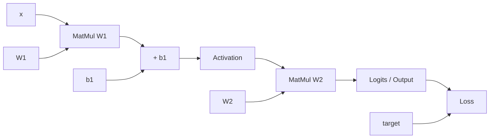

# Forward Propagation và Computational đồ thị (graph / 그래프)

> **Mạch đọc:** Đặt **Forward Propagation và Computational đồ thị (graph / 그래프)** trong bản đồ [README](./README.md) để thấy đơn vị sở hữu (owner / 오너) và vị trí của nó. Nội dung đi từ **Forward pass của một MLP** sang **Computational đồ thị (graph / 그래프)**; điểm nối này chuẩn bị câu hỏi cho các mục sau thay vì dừng ở định nghĩa đầu tiên.


Forward Propagation (순전파 / lan truyền xuôi) là quá trình đưa đầu vào (input / 입력) qua computation đồ thị (graph / 그래프) để tạo prediction và mất mát (loss / 손실). Nghe có vẻ trivial — “chạy mô hình (model / 모델)” — nhưng hiểu forward pass ở mức tensor shapes, intermediate values và đồ thị (graph / 그래프) dependencies là prerequisite để hiểu backpropagation, bộ nhớ (memory / 메모리) chi phí (cost / 비용) và debugging neural networks.

## Forward pass của một MLP

Với đầu vào (input / 입력) `x`:

\[
z^{(1)}=W^{(1)}x+b^{(1)}
\]

\[
h^{(1)}=\phi(z^{(1)})
\]

\[
z^{(2)}=W^{(2)}h^{(1)}+b^{(2)}
\]

\[
\hat y=g(z^{(2)})
\]

\[
L=mất mát (loss / 손실)(\hat y,y)
\]

Forward propagation chỉ evaluate các operations theo phụ thuộc (dependency / 의존성) thứ tự (order / 순서).

## Computational đồ thị (graph / 그래프)

Ta có thể biểu diễn computation như DAG:


```mermaid
flowchart LR
    X[x] --> M1[MatMul W1]
    W1[W1] --> M1
    M1 --> A1[+ b1]
    B1[b1] --> A1
    A1 --> ACT[Activation]
    ACT --> M2[MatMul W2]
    W2[W2] --> M2
    M2 --> OUT[Logits / Output]
    OUT --> LOSS[Loss]
    Y[target] --> LOSS
```

Mỗi nút (node / 노드) là thao tác (operation / 연산); edges mang tensors.

Backward pass sau này traverse đồ thị (graph / 그래프) ngược để accumulate derivatives.

## Tensor Shapes là hệ kiểu (type system / 타입 시스템) của Deep học tập (learning / 학습)

Giả sử batch:

\[
X\in\mathbb R^{B\times d_{in}}
\]

Weight:

\[
W\in\mathbb R^{d_{out}\times d_{in}}
\]

Nếu khung phần mềm (framework / 프레임워크) convention dùng:

\[
Z=XW^T+b
\]

thì:

\[
Z\in\mathbb R^{B\times d_{out}}
\]

Shape mismatch là một trong những lỗi hiện thực (implementation / 구현) phổ biến nhất. Học cách annotate shape giúp lập luận (reasoning / 추론) kiến trúc (architecture / 아키텍처) tốt hơn.

Ví dụ Transformer thường annotate:

```text
B = batch size
T = sequence length
D = hidden dimension
H = attention heads
```

Hidden tensor:

\[
X\in\mathbb R^{B\times T\times D}
\]

Shape lập luận (reasoning / 추론) trở thành essential hệ thống (system / 시스템) skill.

## Broadcasting

Độ lệch (bias / 편향) `b∈R^{d_out}` được broadcast qua batch dimension:

\[
Z_{ij}=(XW^T)_{ij}+b_j
\]

Broadcasting convenient nhưng có thể tạo silent bug nếu shape accidental align sai. tường minh (explicit / 명시적) mô hình tư duy (mental model / 사고 모델) rất quan trọng.

## Batch processing

Thay vì vòng lặp (loop / 루프) từng mẫu (sample / 표본), ma trận (matrix / 행렬)/tensor operations xử lý batch song song. Hardware accelerator đạt thông lượng (throughput / 처리량) cao vì dense tuyến tính (linear / 선형) algebra có arithmetic intensity tốt.

Batch kích thước (size / 크기) ảnh hưởng:

- độ dốc (gradient / 기울기) estimate variance;
- bộ nhớ (memory / 메모리) usage;
- hardware utilization;
- normalization hành vi (behavior / 동작);
- huấn luyện (training / 학습) dynamics.

Forward propagation vì vậy không chỉ mathematical ánh xạ (mapping / 매핑) mà còn các hệ thống (systems / 시스템들) computation.

## Logits và probabilities

Classification head thường đầu ra (output / 출력) logits `z`, chưa qua softmax/sigmoid.

Khung phần mềm (framework / 프레임워크) mất mát (loss / 손실) thường nhận logits trực tiếp để numerical stability.

Ví dụ multiclass cross-entropy thực hiện log-softmax + negative log likelihood trong stable fused formulation.

Suy luận (inference / 추론) mới có thể convert logits thành probabilities khi cần.

## Huấn luyện (training / 학습) chế độ (mode / 모드) vs Evaluation chế độ (mode / 모드)

Một số layers hành vi (behavior / 동작) khác giữa train/eval.

**Dropout** random mask trong huấn luyện (training / 학습) nhưng disabled/rescaled hành vi (behavior / 동작) ở suy luận (inference / 추론).

**Batch Normalization** dùng batch statistics trong huấn luyện (training / 학습) và running statistics trong evaluation.

Nếu quên `model.eval()` hoặc equivalent, suy luận (inference / 추론) kết quả (result / 결과) có thể sai/stochastic.

LayerNorm thường không phụ thuộc batch statistics theo cùng cách.

## Intermediate Activations và bộ nhớ (memory / 메모리)

Backprop cần nhiều intermediate values từ forward pass để compute gradients. Vì vậy huấn luyện (training / 학습) bộ nhớ (memory / 메모리) lớn hơn suy luận (inference / 추론).

Roughly bộ nhớ (memory / 메모리) gồm:

```text
parameters
+ gradients
+ optimizer states
+ activations
```

Activation bộ nhớ (memory / 메모리) có thể dominate với long chuỗi (sequence / 시퀀스)/large batch.

**độ dốc (gradient / 기울기) checkpointing / activation recomputation** tiết kiệm bộ nhớ (memory / 메모리) bằng cách không lưu mọi activation; backward recompute một phần forward. Trade compute for bộ nhớ (memory / 메모리).

## Static vs động (dynamic / 동적) đồ thị (graph / 그래프)

Frameworks lịch sử khác nhau:

- static đồ thị (graph / 그래프): define đồ thị (graph / 그래프) trước rồi execute;
- eager/động (dynamic / 동적): operations execute ngay và autograd records đồ thị (graph / 그래프) dynamically.

Hiện đại (modern / 현대적) các hệ thống (systems / 시스템들) thường combine eager nhà phát triển (developer / 개발자) experience với đồ thị (graph / 그래프) compilation/tracing để optimize kernels.

Conceptually computational đồ thị (graph / 그래프) vẫn là mô hình tư duy (mental model / 사고 모델) chung.

## Forward pass trong residual mạng (network / 네트워크)

Residual khối (block / 블록):

\[
y=x+F(x)
\]

Đồ thị (graph / 그래프) có skip đường dẫn (path / 경로). Đây không chỉ architectural decoration; backward có độ dốc (gradient / 기울기) đường dẫn (path / 경로) qua định danh (identity / 식별자), giúp deep mạng (network / 네트워크) train easier.

Transformer ngăn xếp (stack / 스택) phụ thuộc heavily vào residual connections.

## Determinism

Forward pass có thể stochastic nếu dropout/sampling/noise layers active. GPU kernels cũng có thể nondeterministic tùy thao tác (operation / 연산)/backend.

Reproducibility cần distinguish:

- deterministic mô hình (model / 모델) hàm (function / 함수) ở eval;
- stochastic huấn luyện (training / 학습);
- hardware-level nondeterminism.

Random seed không luôn đảm bảo bitwise-identical kết quả (result / 결과) across hardware/thư viện (library / 라이브러리) versions.

## Mixed Precision Forward

FP16/BF16 giảm bộ nhớ (memory / 메모리)/bandwidth và tăng accelerator thông lượng (throughput / 처리량). Nhưng một số operations cần higher precision accumulation hoặc stable kernel.

Automatic Mixed Precision chọn dtypes per thao tác (operation / 연산). Numerical computation concepts từ previous folder quay lại trực tiếp.

## Forward Hook / Activation Inspection

Debugging có thể inspect:

- activation mean/std;
- min/max;
- NaN/Inf;
- percentage zeros;
- tensor shapes.

Nếu activations explode/vanish qua layers, nguyên nhân gốc (root cause / 근본 원인) có thể là initialization, normalization, học tập (learning / 학습) tỷ lệ (rate / 비율) hoặc bad đầu vào (input / 입력) quy mô (scale / 규모).

## Suy luận (inference / 추론) đồ thị (graph / 그래프) tối ưu hóa (optimization / 최적화)

Triển khai (deployment / 배포) có thể optimize forward đồ thị (graph / 그래프) bằng:

- operator fusion;
- constant folding;
- quantization;
- kernel selection;
- compilation;
- batching;
- KV bộ nhớ đệm (cache / 캐시) cho autoregressive Transformer.

Mathematical hàm (function / 함수) gần tương đương nhưng hệ thống (system / 시스템) thực thi (execution / 실행) khác rất nhiều về độ trễ (latency / 지연 시간)/chi phí (cost / 비용).

## Mô hình tư duy (mental model / 사고 모델)

> Forward pass là thực thi (execution / 실행) của một parameterized computation đồ thị (graph / 그래프). Tensor shapes mô tả “kiểu” của dữ liệu (data / 데이터); activations là intermediate trạng thái (state / 상태); đầu ra (output / 출력)/mất mát (loss / 손실) là endpoint mà backward sẽ dùng để gửi credit/blame ngược đồ thị (graph / 그래프).

## Dùng chung (common / 공통) Misconceptions

### “Forward propagation chỉ là phép nhân ma trận (matrix multiplication / 행렬 곱셈)”

Hiện đại (modern / 현대적) các mô hình (models / 모델들) còn attention, normalization, gating, convolution, routing, recurrence và điều khiển (control / 제어) mechanisms.

### “xác suất (probability / 확률) nên được tính trước mất mát (loss / 손실)”

Về concept có thể, nhưng hiện thực (implementation / 구현) thường truyền logits vào fused mất mát (loss / 손실) để stability.

### “Train và suy luận (inference / 추론) forward giống hệt nhau”

Dropout, BatchNorm, sampling, bộ nhớ đệm (cache / 캐시) và quantization có thể khác.

### “bộ nhớ (memory / 메모리) chủ yếu là parameters”

Huấn luyện (training / 학습) còn gradients, optimizer states và activations; activations có thể rất lớn.

## Liên kết kiến thức (knowledge connection / 지식 연결)

Forward đồ thị (graph / 그래프) chuẩn bị trực tiếp cho [Backpropagation](./04_backpropagation.md) và [Training Dynamics](./09_deep_learning_training_dynamics.md).

> **Bàn giao:** Sau **liên kết kiến thức (knowledge connection / 지식 연결)**, hãy chốt bất biến (invariant / 불변식) và giới hạn của mục này trước khi nối sang kiến thức kế tiếp. Có thể đọc tiếp [00 from linear models to neural networks](./00_from_linear_models_to_neural_networks.md) để đối chiếu ranh giới (boundary / 경계) gần nhất.
