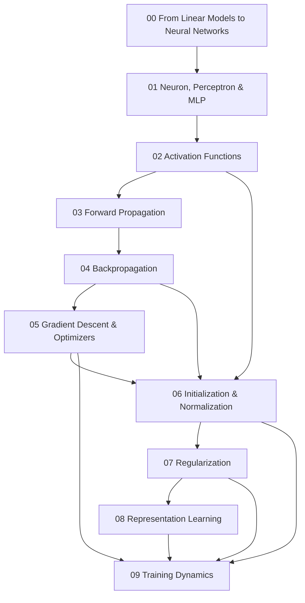

# Neural Networks Knowledge Layer

Folder này giải thích Neural Networks (신경망 / mạng nơ-ron) như một **parameterized differentiable computation system**, không như một collection framework APIs. Nó nối trực tiếp Machine Learning, Linear Algebra, Calculus và Optimization với Deep Learning architectures phía sau.

## Dependency map



## Chapters

**[00 — From Linear Models to Neural Networks](./00_from_linear_models_to_neural_networks.md)** giải thích vì sao stack linear layers không có nonlinearity vẫn collapse thành một linear transformation, XOR và representation learning motivation.

**[01 — Neuron, Perceptron & MLP](./01_neuron_perceptron_and_mlp.md)** đi từ weighted sum + activation tới multilayer representation, tensor shape, parameter count và output-head semantics.

**[02 — Activation Functions](./02_activation_functions.md)** giải thích sigmoid/tanh/ReLU/GELU/SiLU/SwiGLU qua expressivity, saturation, gradient flow và architecture context.

**[03 — Forward Propagation](./03_forward_propagation.md)** xem model như computational graph, bao gồm batching, broadcasting, train/eval behavior, activation memory, checkpointing và mixed precision.

**[04 — Backpropagation](./04_backpropagation.md)** derivation chain rule/reverse-mode AD, vector-Jacobian products, gradient accumulation, vanishing/exploding gradient và residual gradient paths.

**[05 — Gradient Descent & Optimizers](./05_gradient_descent_and_optimizers.md)** nối SGD, momentum, Adam/AdamW, schedules, warmup, batch size, clipping và optimizer-state memory.

**[06 — Initialization & Normalization](./06_initialization_and_normalization.md)** giải thích Xavier/He, BatchNorm, LayerNorm, RMSNorm, Pre-Norm/Post-Norm và signal statistics.

**[07 — Regularization](./07_regularization.md)** cover weight decay, dropout, early stopping, augmentation, label smoothing, architecture bias, pretraining và LoRA như constrained adaptation.

**[08 — Representation Learning](./08_representation_learning.md)** đi từ embedding geometry, contrastive learning, metric learning, autoencoder, transfer, collapse, invariance/equivariance tới representation drift trong production.

**[09 — Training Dynamics](./09_deep_learning_training_dynamics.md)** tổng hợp learning curves, update/gradient/activation diagnostics, curriculum/data mixture, catastrophic forgetting, checkpointing, distributed batch và systematic debugging.

## Mental model của toàn layer

```text
Input representation
      ↓
Parameterized computation graph
      ↓ forward
Prediction / loss
      ↓ backward
Gradients
      ↓ optimizer + schedule
Updated parameters
      ↓ repeated experience
Learned internal representation
```

Architecture quyết định graph và inductive bias. Loss quyết định signal. Backprop tính credit/blame. Optimizer quyết định update trajectory. Data distribution quyết định experience. Generalization vẫn phải được chứng minh bằng evaluation ngoài training set.

## Chuyển tiếp sang Deep Learning Architectures

`06_deep_learning_architectures/` sẽ trả lời câu hỏi: nếu MLP general-purpose như vậy, vì sao cần CNN, RNN, attention, Transformer, Autoencoder, VAE, GAN và Diffusion?

Câu trả lời là **structure và inductive bias**. Image có local spatial structure; sequence có temporal/order dependency; generative modeling cần probabilistic/data-generation objectives khác nhau. Các architecture mới không bỏ core neural-network mechanics ở folder này; chúng tổ chức computation graph theo những assumptions hiệu quả hơn.