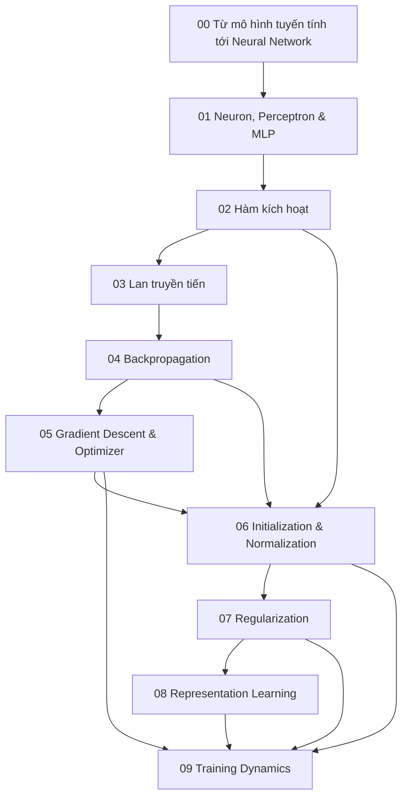

# Neural Networks Knowledge Layer

Folder này giải thích Neural Network (신경망 / mạng nơ-ron) như một **hệ tính toán khả vi có tham số (parameterized differentiable computation system)**, không phải như một tập API của framework. Nó nối trực tiếp Machine Learning, Đại số tuyến tính, Giải tích và Tối ưu hóa với các kiến trúc Deep Learning ở phần sau.

## Sơ đồ phụ thuộc



## Các chương

**[00 — Từ mô hình tuyến tính tới Neural Network](./00_from_linear_models_to_neural_networks.md)** giải thích vì sao nhiều linear layer không có tính phi tuyến vẫn rút gọn thành một linear transformation duy nhất, từ đó dẫn tới XOR và động lực của representation learning.

**[01 — Neuron, Perceptron và MLP](./01_neuron_perceptron_and_mlp.md)** đi từ tổng có trọng số + activation tới biểu diễn nhiều layer, shape tensor, số lượng tham số và ý nghĩa của output head.

**[02 — Hàm kích hoạt](./02_activation_functions.md)** giải thích sigmoid, tanh, ReLU, GELU, SiLU và SwiGLU qua khả năng biểu diễn, saturation, gradient flow và ngữ cảnh kiến trúc.

**[03 — Lan truyền tiến](./03_forward_propagation.md)** xem mô hình như một computation graph, bao gồm batching, broadcasting, khác biệt train/eval, activation memory, checkpointing và mixed precision.

**[04 — Backpropagation](./04_backpropagation.md)** giải thích Chain Rule, reverse-mode automatic differentiation, vector-Jacobian product, gradient accumulation, vanishing/exploding gradient và residual gradient path.

**[05 — Gradient Descent và Optimizer](./05_gradient_descent_and_optimizers.md)** nối SGD, momentum, Adam/AdamW, learning-rate schedule, warmup, batch size, clipping và bộ nhớ của optimizer state.

**[06 — Initialization và Normalization](./06_initialization_and_normalization.md)** giải thích Xavier/He, BatchNorm, LayerNorm, RMSNorm, Pre-Norm/Post-Norm và cách giữ thống kê tín hiệu ổn định.

**[07 — Regularization](./07_regularization.md)** bao gồm weight decay, dropout, early stopping, augmentation, label smoothing, inductive bias từ architecture, pretraining và LoRA như một dạng adaptation bị ràng buộc.

**[08 — Representation Learning](./08_representation_learning.md)** đi từ embedding geometry, contrastive learning, metric learning, autoencoder, transfer, representation collapse, invariance/equivariance tới representation drift trong production.

**[09 — Training Dynamics](./09_deep_learning_training_dynamics.md)** tổng hợp learning curve, diagnostic từ update/gradient/activation, curriculum, data mixture, catastrophic forgetting, checkpointing, distributed batch và quy trình debug có hệ thống.

## Mô hình tư duy của toàn layer

```text
Biểu diễn đầu vào
      ↓
Computation graph có tham số
      ↓ forward
Prediction / loss
      ↓ backward
Gradient
      ↓ optimizer + schedule
Tham số được cập nhật
      ↓ lặp qua kinh nghiệm
Biểu diễn bên trong được học
```

Architecture quyết định graph và inductive bias. Loss quyết định tín hiệu học. Backpropagation tính tín hiệu trách nhiệm cho từng tham số. Optimizer quyết định quỹ đạo cập nhật. Data distribution quyết định loại kinh nghiệm mô hình được tiếp xúc. Khả năng khái quát hóa vẫn phải được chứng minh bằng evaluation ngoài training set.

## Chuyển tiếp sang Deep Learning Architectures

`06_deep_learning_architectures/` sẽ trả lời câu hỏi: nếu MLP có khả năng biểu diễn rộng như vậy, vì sao vẫn cần CNN, RNN, Attention, Transformer, Autoencoder, VAE, GAN và Diffusion?

Câu trả lời nằm ở **cấu trúc và thiên lệch quy nạp (structure and inductive bias)**. Ảnh có cấu trúc không gian cục bộ; chuỗi có phụ thuộc thứ tự; generative modeling cần những objective và cơ chế sinh dữ liệu khác nhau. Các kiến trúc mới không loại bỏ những cơ chế Neural Network nền tảng ở folder này; chúng tổ chức computation graph theo các giả định phù hợp hơn với từng loại dữ liệu và bài toán.