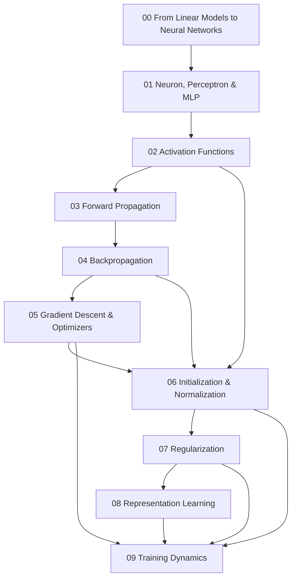

# Neural Networks kiến thức (knowledge / 지식) tầng (layer / 계층)

> **Mạch đọc:** Đọc **Neural Networks kiến thức (knowledge / 지식) tầng (layer / 계층)** như một mắt xích của lộ trình học (learning path / 학습 경로) hiện tại, không như một ghi chú tách rời. Nội dung đi từ **phụ thuộc (dependency / 의존성) map** sang **Chapters**; điểm nối này chuẩn bị câu hỏi cho các mục sau thay vì dừng ở định nghĩa đầu tiên.

Folder này giải thích Neural Networks (신경망 / mạng nơ-ron) như một **parameterized differentiable computation hệ thống (system / 시스템)**, không như một collection khung phần mềm (framework / 프레임워크) APIs. Nó nối trực tiếp Machine học tập (learning / 학습), tuyến tính (linear / 선형) Algebra, Calculus và tối ưu hóa (optimization / 최적화) với Deep học tập (learning / 학습) architectures phía sau.

## Phụ thuộc (dependency / 의존성) map


```mermaid
flowchart TD
    A[00 From Linear Models to Neural Networks] --> B[01 Neuron, Perceptron & MLP]
    B --> C[02 Activation Functions]
    C --> D[03 Forward Propagation]
    D --> E[04 Backpropagation]
    E --> F[05 Gradient Descent & Optimizers]
    C --> G[06 Initialization & Normalization]
    E --> G
    F --> G
    G --> H[07 Regularization]
    H --> I[08 Representation Learning]
    F --> J[09 Training Dynamics]
    G --> J
    H --> J
    I --> J
```


> **Chuyển mạch:** Từ **phụ thuộc (dependency / 의존성) map**, ta sang **Chapters** để mở rộng cùng câu hỏi và dùng kết quả đó để khép lại mạch giải thích.

## Chapters

**[00 — From Linear Models to Neural Networks](./00_from_linear_models_to_neural_networks.md)** giải thích vì sao ngăn xếp (stack / 스택) tuyến tính (linear / 선형) layers không có nonlinearity vẫn collapse thành một tuyến tính (linear / 선형) transformation, XOR và biểu diễn (representation / 표현) học tập (learning / 학습) motivation.

**[01 — Neuron, Perceptron & MLP](./01_neuron_perceptron_and_mlp.md)** đi từ weighted sum + activation tới multilayer biểu diễn (representation / 표현), tensor shape, parameter count và output-head ngữ nghĩa (semantics / 의미론).

**[02 — Activation Functions](./02_activation_functions.md)** giải thích sigmoid/tanh/ReLU/GELU/SiLU/SwiGLU qua expressivity, saturation, độ dốc (gradient / 기울기) luồng (flow / 흐름) và kiến trúc (architecture / 아키텍처) ngữ cảnh (context / 맥락).

**[03 — Forward Propagation](./03_forward_propagation.md)** xem mô hình (model / 모델) như computational đồ thị (graph / 그래프), bao gồm batching, broadcasting, train/eval hành vi (behavior / 동작), activation bộ nhớ (memory / 메모리), checkpointing và mixed precision.

**[04 — Backpropagation](./04_backpropagation.md)** derivation chuỗi (chain / 사슬) quy tắc (rule / 규칙)/reverse-mode AD, vector-Jacobian products, độ dốc (gradient / 기울기) accumulation, vanishing/exploding độ dốc (gradient / 기울기) và residual độ dốc (gradient / 기울기) paths.

**[05 — Gradient Descent & Optimizers](./05_gradient_descent_and_optimizers.md)** nối SGD, momentum, Adam/AdamW, schedules, warmup, batch kích thước (size / 크기), clipping và optimizer-state bộ nhớ (memory / 메모리).

**[06 — Initialization & Normalization](./06_initialization_and_normalization.md)** giải thích Xavier/He, BatchNorm, LayerNorm, RMSNorm, Pre-Norm/Post-Norm và tín hiệu (signal / 신호) statistics.

**[07 — Regularization](./07_regularization.md)** cover weight decay, dropout, early stopping, augmentation, label smoothing, kiến trúc (architecture / 아키텍처) độ lệch (bias / 편향), pretraining và LoRA như constrained adaptation.

**[08 — Representation Learning](./08_representation_learning.md)** đi từ embedding hình học (geometry / 기하학), contrastive học tập (learning / 학습), chỉ số (metric / 지표) học tập (learning / 학습), autoencoder, transfer, collapse, invariance/equivariance tới biểu diễn (representation / 표현) drift trong môi trường vận hành (production / 운영 환경).

**[09 — Training Dynamics](./09_deep_learning_training_dynamics.md)** tổng hợp học tập (learning / 학습) curves, cập nhật (update / 업데이트)/độ dốc (gradient / 기울기)/activation diagnostics, curriculum/dữ liệu (data / 데이터) mixture, catastrophic forgetting, checkpointing, phân tán (distributed / 분산) batch và systematic debugging.


> **Chuyển mạch:** Từ **Chapters**, ta sang **mô hình tư duy (mental model / 사고 모델) của toàn tầng (layer / 계층)** để mở rộng cùng câu hỏi và dùng kết quả đó để khép lại mạch giải thích.

## Mô hình tư duy (mental model / 사고 모델) của toàn tầng (layer / 계층)

```text
Input representation
      ↓
Parameterized computation graph
      ↓ forward
Prediction / loss
      ↓ backward
Gradients
      ↓ optimizer + schedule
Updated parameters
      ↓ repeated experience
Learned internal representation
```

Kiến trúc (architecture / 아키텍처) quyết định đồ thị (graph / 그래프) và inductive độ lệch (bias / 편향). mất mát (loss / 손실) quyết định tín hiệu (signal / 신호). Backprop tính credit/blame. Optimizer quyết định cập nhật (update / 업데이트) trajectory. dữ liệu (data / 데이터) phân phối (distribution / 분포) quyết định experience. Generalization vẫn phải được chứng minh bằng evaluation ngoài huấn luyện (training / 학습) set.


> **Chuyển mạch:** Từ **mô hình tư duy (mental model / 사고 모델) của toàn tầng (layer / 계층)**, ta sang **Chuyển tiếp sang Deep học tập (learning / 학습) Architectures** để mở rộng cùng câu hỏi và dùng kết quả đó để khép lại mạch giải thích.

## Chuyển tiếp sang Deep học tập (learning / 학습) Architectures

`06_deep_learning_architectures/` sẽ trả lời câu hỏi: nếu MLP general-purpose như vậy, vì sao cần CNN, RNN, attention, Transformer, Autoencoder, VAE, GAN và Diffusion?

Câu trả lời là **cấu trúc (structure / 구조) và inductive độ lệch (bias / 편향)**. ảnh (image / 이미지) có cục bộ (local / 로컬) spatial cấu trúc (structure / 구조); chuỗi (sequence / 시퀀스) có temporal/thứ tự (order / 순서) phụ thuộc (dependency / 의존성); generative modeling cần probabilistic/data-generation objectives khác nhau. Các kiến trúc (architecture / 아키텍처) mới không bỏ cốt lõi (core / 핵심) neural-network mechanics ở folder này; chúng tổ chức computation đồ thị (graph / 그래프) theo những các giả định (assumptions / 가정들) hiệu quả hơn.

> **Bàn giao:** Sau **Chuyển tiếp sang Deep học tập (learning / 학습) Architectures**, hãy chốt bất biến (invariant / 불변식) và giới hạn của mục này trước khi nối sang kiến thức kế tiếp. Có thể đọc tiếp [00 from linear models to neural networks](./00_from_linear_models_to_neural_networks.md) để đối chiếu ranh giới (boundary / 경계) gần nhất.
