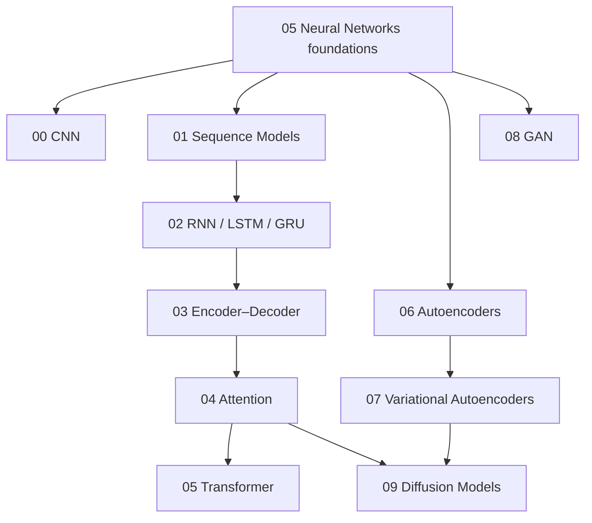

# Deep Learning Architectures Knowledge Layer

Folder này trả lời câu hỏi: nếu MLP có khả năng approximate rất nhiều functions, tại sao AI vẫn cần CNN, RNN, Attention/Transformer, Autoencoder, VAE, GAN và Diffusion?

Lý do là **inductive bias + computational structure**. Mỗi architecture tổ chức connections, memory, information flow và objective theo một assumption về data/task. Architecture tốt không chỉ biểu diễn được solution; nó làm solution dễ học hơn với finite data/compute.

## Dependency map



## Chapters

**[00 — Convolutional Neural Networks](./00_convolutional_neural_networks.md)** giải thích locality, weight sharing, receptive field, pooling, residual blocks, depthwise convolution và relation CNN↔ViT.

**[01 — Sequence Models](./01_sequence_models.md)** định nghĩa sequence problem, Markov/autoregressive factorization, state, masking, positional information, teacher forcing và state-space view.

**[02 — RNN, LSTM & GRU](./02_rnn_lstm_gru.md)** đi từ recurrence/BPTT tới vanishing gradient, gates, bidirectionality, truncated BPTT và streaming trade-offs.

**[03 — Encoder–Decoder Models](./03_encoder_decoder_models.md)** nối seq2seq, context bottleneck, teacher forcing, beam search, encoder-only/decoder-only/encoder-decoder families và cross-attention.

**[04 — Attention](./04_attention.md)** derivation `Q/K/V`, scaled dot-product, masks, self/cross/multi-head attention, GQA/MQA, RoPE, KV cache, FlashAttention và long-context limitations.

**[05 — Transformer](./05_transformer.md)** ghép attention với FFN, residual stream, norm, positions, encoder/decoder variants, parameter/compute scaling, KV cache và generation seriality.

**[06 — Autoencoders](./06_autoencoders.md)** cover reconstruction-based representation learning, denoising/sparse/contractive variants, anomaly detection và compression.

**[07 — Variational Autoencoders](./07_variational_autoencoders.md)** xây latent-variable generative model, ELBO, KL term, reparameterization, posterior collapse và latent diffusion connection.

**[08 — Generative Adversarial Networks](./08_generative_adversarial_networks.md)** giải thích minimax game, discriminator optimum, non-saturating loss, mode collapse, WGAN-GP, conditional GAN và evaluation.

**[09 — Diffusion Models](./09_diffusion_models.md)** derivation forward noising/reverse denoising, noise prediction, guidance, U-Net/DiT, samplers, latent diffusion và text conditioning.

## Mental model

```text
CNN         → exploit spatial locality + weight sharing
RNN         → compress ordered history into recurrent state
Attention   → content-dependent retrieval across positions
Transformer → attention + residual/norm/MLP at scalable depth
Autoencoder → learn representation through constrained reconstruction
VAE         → probabilistic latent representation + sampleable prior
GAN         → learned adversarial distribution-matching signal
Diffusion   → learn reverse path from noise to data
```

Không nên đọc taxonomy này như các “thế hệ” thay thế nhau. Modern systems kết hợp chúng: diffusion model có Transformer/CNN attention blocks; multimodal system có vision encoder + Transformer decoder; latent diffusion dùng VAE + cross-attention + denoiser.

## Chuyển tiếp

Sau layer này, kiến thức tách theo **modality và foundation-model specialization**:

- `07_natural_language_processing/`: text representation, tokenization, language modeling, embeddings, IR.
- `08_large_language_models/`: pretraining, scaling, instruction tuning, RLHF/DPO, prompting, reasoning, hallucination.
- `12_computer_vision/`: classification/detection/segmentation/ViT.
- `13_speech_audio_and_multimodal/`: audio/speech + cross-modal representation.

Attention/Transformer không cần giải thích lại từ đầu ở các folder sau; chúng sẽ được reuse và mở rộng theo context.