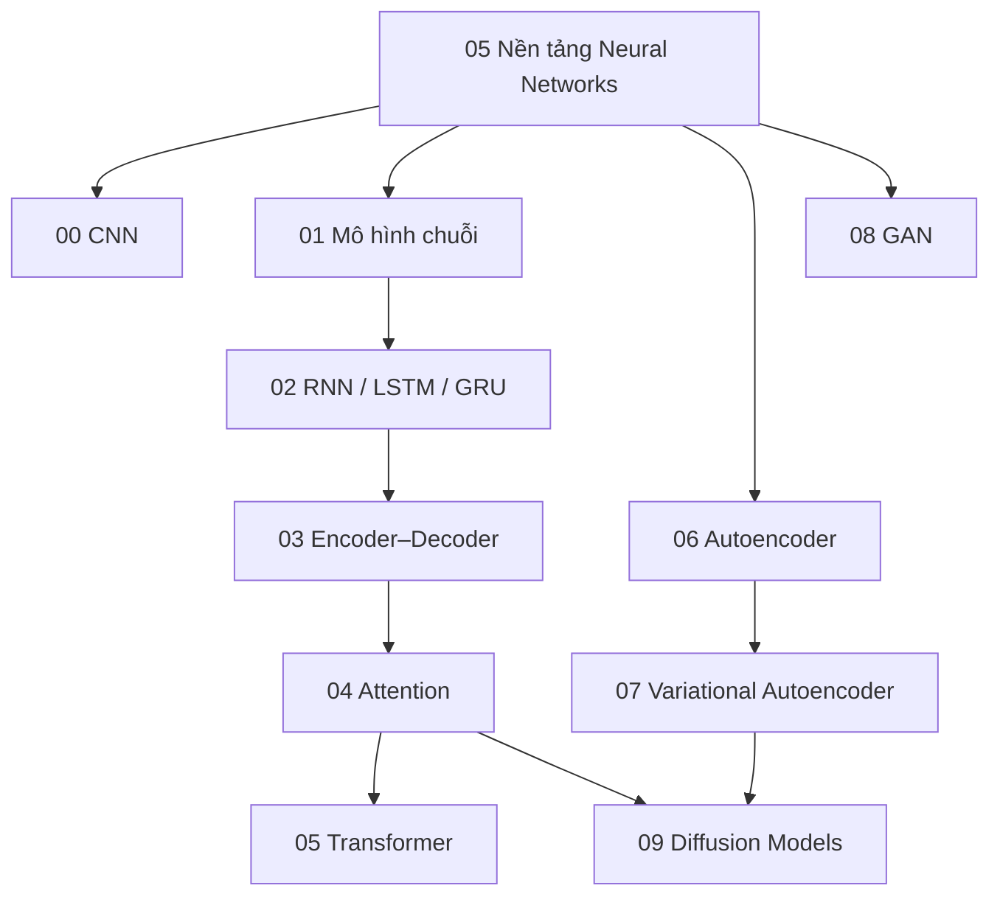

# Knowledge Layer về các kiến trúc Deep Learning

Folder này trả lời câu hỏi: nếu MLP có khả năng xấp xỉ rất nhiều hàm, tại sao AI vẫn cần CNN, RNN, Attention/Transformer, Autoencoder, VAE, GAN và Diffusion?

Lý do nằm ở **thiên lệch quy nạp (inductive bias) + cấu trúc tính toán (computational structure)**. Mỗi kiến trúc tổ chức kết nối, bộ nhớ, luồng thông tin và hàm mục tiêu dựa trên một số giả định về dữ liệu và bài toán. Kiến trúc tốt không chỉ có khả năng biểu diễn nghiệm; nó còn làm nghiệm đó dễ học hơn với lượng dữ liệu và tài nguyên tính toán hữu hạn.

## Bản đồ phụ thuộc



## Các chapter

**[00 — Convolutional Neural Networks](./00_convolutional_neural_networks.md)** giải thích tính cục bộ (locality), chia sẻ trọng số (weight sharing), trường tiếp nhận (receptive field), pooling, residual block, depthwise convolution và mối quan hệ CNN ↔ ViT.

**[01 — Sequence Models](./01_sequence_models.md)** định nghĩa bài toán chuỗi, phân rã Markov/tự hồi quy, trạng thái, masking, thông tin vị trí, teacher forcing và cách nhìn theo không gian trạng thái.

**[02 — RNN, LSTM & GRU](./02_rnn_lstm_gru.md)** đi từ recurrence và BPTT tới gradient tiêu biến, các cổng, xử lý hai chiều, truncated BPTT và đánh đổi khi xử lý streaming.

**[03 — Encoder–Decoder Models](./03_encoder_decoder_models.md)** nối seq2seq, nút thắt ngữ cảnh, teacher forcing, Beam Search, ba họ encoder-only / decoder-only / encoder–decoder và cross-attention.

**[04 — Attention](./04_attention.md)** giải thích Q/K/V, scaled dot-product, mask, self/cross/multi-head attention, GQA/MQA, RoPE, KV cache, FlashAttention và các giới hạn của context dài.

**[05 — Transformer](./05_transformer.md)** kết hợp attention với FFN, residual stream, normalization, vị trí, các biến thể encoder/decoder, số tham số, chi phí tính toán, KV cache và tính tuần tự khi sinh.

**[06 — Autoencoder](./06_autoencoders.md)** trình bày học biểu diễn dựa trên tái tạo, các biến thể denoising/sparse/contractive, phát hiện bất thường và nén.

**[07 — Variational Autoencoder](./07_variational_autoencoders.md)** xây mô hình sinh có biến tiềm ẩn với ELBO, KL, reparameterization, posterior collapse và mối liên hệ với latent diffusion.

**[08 — Generative Adversarial Networks](./08_generative_adversarial_networks.md)** giải thích trò chơi minimax, discriminator tối ưu, non-saturating loss, mode collapse, WGAN-GP, conditional GAN và đánh giá mô hình sinh.

**[09 — Diffusion Models](./09_diffusion_models.md)** đi từ quá trình thêm nhiễu thuận tới quá trình khử nhiễu đảo ngược, dự đoán noise, guidance, U-Net/DiT, sampler, latent diffusion và điều kiện hóa văn bản.

## Mô hình tư duy

```text
CNN         → khai thác tính cục bộ không gian + chia sẻ trọng số
RNN         → nén lịch sử có thứ tự vào trạng thái hồi quy
Attention   → truy xuất phụ thuộc nội dung giữa các vị trí
Transformer → attention + residual/norm/MLP ở độ sâu có thể mở rộng
Autoencoder → học biểu diễn qua tái tạo bị ràng buộc
VAE         → biểu diễn latent xác suất + prior có thể lấy mẫu
GAN         → học phân bố qua tín hiệu đối kháng được học
Diffusion   → học đường đảo ngược từ nhiễu về dữ liệu
```

Không nên đọc các kiến trúc này như những “thế hệ” đơn giản thay thế nhau. Hệ thống hiện đại thường kết hợp chúng: diffusion có thể dùng Transformer hoặc CNN cùng attention; hệ thống đa phương thức có vision encoder + Transformer decoder; latent diffusion kết hợp VAE + cross-attention + denoiser.

## Chuyển tiếp sang các domain chuyên biệt

Sau layer này, kiến thức được tách theo loại dữ liệu và chuyên môn hóa của mô hình nền tảng:

- `07_natural_language_processing/`: biểu diễn văn bản, tokenization, language modeling, embedding và truy xuất thông tin.
- `08_large_language_models/`: pretraining, scaling, instruction tuning, RLHF/DPO, prompting, reasoning và hallucination.
- `12_computer_vision/`: classification, detection, segmentation và ViT.
- `13_speech_audio_and_multimodal/`: âm thanh, tiếng nói và biểu diễn đa phương thức.

Attention và Transformer không cần được giải thích lại từ đầu ở các folder sau; chúng sẽ được tái sử dụng và mở rộng theo ngữ cảnh của từng domain.