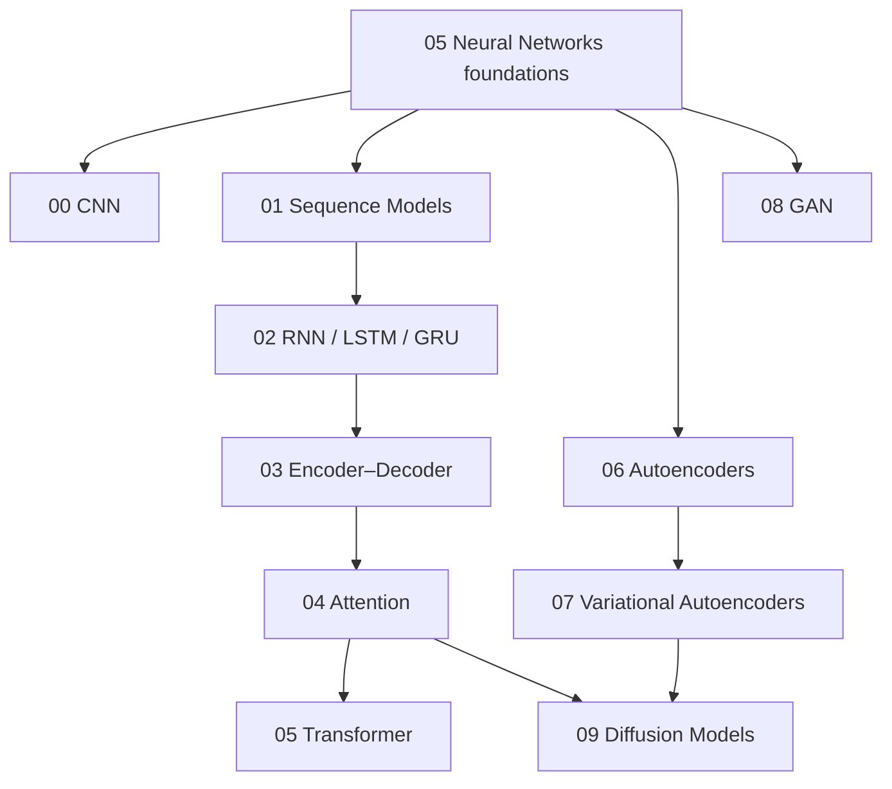

# Deep học tập (learning / 학습) Architectures kiến thức (knowledge / 지식) tầng (layer / 계층)

> **Mạch đọc:** [README](./README.md) là bản đồ owner của **Deep học tập (learning / 학습) Architectures kiến thức (knowledge / 지식) tầng (layer / 계층)**; nhìn vào vị trí đó trước để biết file này đang phục vụ nhánh kiến thức nào. **Phụ thuộc (dependency / 의존성) map** mở đối tượng chính của file và câu hỏi cần theo dõi; sau đó sang **Chapters** để mở rộng đối tượng sang phạm vi kế cận. Mạch này dùng README làm bản đồ owner của deep learning architectures, rồi nối CNN, sequence, attention và scaling.

Folder này trả lời câu hỏi: nếu MLP có khả năng approximate rất nhiều functions, tại sao AI vẫn cần CNN, RNN, Attention/Transformer, Autoencoder, VAE, GAN và Diffusion?

Lý do là **inductive độ lệch (bias / 편향) + computational cấu trúc (structure / 구조)**. Mỗi kiến trúc (architecture / 아키텍처) tổ chức connections, bộ nhớ (memory / 메모리), thông tin (information / 정보) luồng (flow / 흐름) và mục tiêu (objective / 목표) theo một giả định (assumption / 가정) về dữ liệu (data / 데이터)/tác vụ (task / 작업). kiến trúc (architecture / 아키텍처) tốt không chỉ biểu diễn được solution; nó làm solution dễ học hơn với finite dữ liệu (data / 데이터)/compute.

## Phụ thuộc (dependency / 의존성) map

Sơ đồ hoặc danh sách này mô tả thứ tự phụ thuộc của các khái niệm. Hãy đọc theo mũi tên để biết phần nào là prerequisite, phần nào là ứng dụng và khi nào cần quay lại nền tảng.


```mermaid
flowchart TD
    NN[05 Neural Networks foundations] --> CNN[00 CNN]
    NN --> SEQ[01 Sequence Models]
    SEQ --> RNN[02 RNN / LSTM / GRU]
    RNN --> ED[03 Encoder–Decoder]
    ED --> ATT[04 Attention]
    ATT --> TR[05 Transformer]

    NN --> AE[06 Autoencoders]
    AE --> VAE[07 Variational Autoencoders]
    NN --> GAN[08 GAN]
    VAE --> DIF[09 Diffusion Models]
    ATT --> DIF
```

> **Chuyển mạch:** **Dependency map** xác định prerequisite từ neural-network mechanics đến architecture; **Mental model** dùng các prerequisite đó để so sánh inductive bias, capacity và cost.

## Chapters

**[00 — Convolutional Neural Networks](./00_convolutional_neural_networks.md)** giải thích locality, weight sharing, receptive trường dữ liệu (field / 필드), pooling, residual blocks, depthwise convolution và quan hệ (relation / 관계) CNN↔ViT.

**[01 — Sequence Models](./01_sequence_models.md)** định nghĩa chuỗi (sequence / 시퀀스) bài toán (problem / 문제), Markov/autoregressive factorization, trạng thái (state / 상태), masking, positional thông tin (information / 정보), teacher forcing và state-space view.

**[02 — RNN, LSTM & GRU](./02_rnn_lstm_gru.md)** đi từ recurrence/BPTT tới vanishing độ dốc (gradient / 기울기), gates, bidirectionality, truncated BPTT và streaming trade-offs.

**[03 — Encoder–Decoder Models](./03_encoder_decoder_models.md)** nối seq2seq, ngữ cảnh (context / 맥락) bottleneck, teacher forcing, beam tìm kiếm (search / 검색), encoder-only/decoder-only/encoder-decoder families và cross-attention.

**[04 — Attention](./04_attention.md)** derivation `Q/K/V`, scaled dot-product, masks, self/cross/multi-head attention, GQA/MQA, RoPE, KV bộ nhớ đệm (cache / 캐시), FlashAttention và long-context limitations.

**[05 — Transformer](./05_transformer.md)** ghép attention với FFN, residual stream, norm, positions, encoder/decoder variants, parameter/compute scaling, KV bộ nhớ đệm (cache / 캐시) và generation seriality.

**[06 — Autoencoders](./06_autoencoders.md)** cover reconstruction-based biểu diễn (representation / 표현) học tập (learning / 학습), denoising/sparse/contractive variants, anomaly detection và compression.

**[07 — Variational Autoencoders](./07_variational_autoencoders.md)** xây latent-variable generative mô hình (model / 모델), ELBO, KL term, reparameterization, posterior collapse và latent diffusion liên kết (connection / 연결).

**[08 — Generative Adversarial Networks](./08_generative_adversarial_networks.md)** giải thích minimax game, discriminator optimum, non-saturating mất mát (loss / 손실), chế độ (mode / 모드) collapse, WGAN-GP, conditional GAN và evaluation.

**[09 — Diffusion Models](./09_diffusion_models.md)** derivation forward noising/reverse denoising, noise prediction, guidance, U-Net/DiT, samplers, latent diffusion và văn bản (text / 텍스트) conditioning.

> **Chuyển mạch:** Ở chặng này của **Deep học tập (learning / 학습) Architectures kiến thức (knowledge / 지식) tầng (layer / 계층)**, **Mô hình tư duy (mental model / 사고 모델)** gom các mảnh từ **Chapters** thành một kết luận có thể mang sang phần kế tiếp. Từ đây, **Chuyển tiếp** sẽ cho biết hệ quả hoặc giới hạn ấy hiện ra ở đâu.

## Mô hình tư duy (mental model / 사고 모델)

Phần này chốt mental model thành một chuỗi có thể dùng lại: bối cảnh → cơ chế → quan sát → giới hạn → quyết định. Hãy đọc sơ đồ như công cụ suy luận, không như một khẩu hiệu tách khỏi chapter.

```text
CNN         → exploit spatial locality + weight sharing
RNN         → compress ordered history into recurrent state
Attention   → content-dependent retrieval across positions
Transformer → attention + residual/norm/MLP at scalable depth
Autoencoder → learn representation through constrained reconstruction
VAE         → probabilistic latent representation + sampleable prior
GAN         → learned adversarial distribution-matching signal
Diffusion   → learn reverse path from noise to data
```

Không nên đọc taxonomy này như các “thế hệ” thay thế nhau. hiện đại (modern / 현대적) các hệ thống (systems / 시스템들) kết hợp chúng: diffusion mô hình (model / 모델) có Transformer/CNN attention blocks; multimodal hệ thống (system / 시스템) có vision encoder + Transformer decoder; latent diffusion dùng VAE + cross-attention + denoiser.

> **Chuyển mạch:** **Mental model** khép architecture bằng trade-off giữa biểu diễn, trainability và deployment; phần kế tiếp có thể dùng trade-off đó để đọc systems và MLOps đúng owner.

## Chuyển tiếp

Sau tầng (layer / 계층) này, kiến thức tách theo **modality và foundation-model specialization**:

- `07_natural_language_processing/`: văn bản (text / 텍스트) biểu diễn (representation / 표현), tokenization, ngôn ngữ (language / 언어) modeling, embeddings, IR.
- `08_large_language_models/`: pretraining, scaling, instruction tuning, RLHF/DPO, prompting, lập luận (reasoning / 추론), hallucination.
- `12_computer_vision/`: classification/detection/segmentation/ViT.
- `13_speech_audio_and_multimodal/`: audio/speech + cross-modal biểu diễn (representation / 표현).

Attention/Transformer không cần giải thích lại từ đầu ở các folder sau; chúng sẽ được reuse và mở rộng theo context.

> **Bàn giao:** Sau **Chuyển tiếp**, hãy giữ lại kết luận và ranh giới của mục này; quay về [README](./README.md) khi cần định vị owner hoặc chọn nhánh học tiếp theo.
