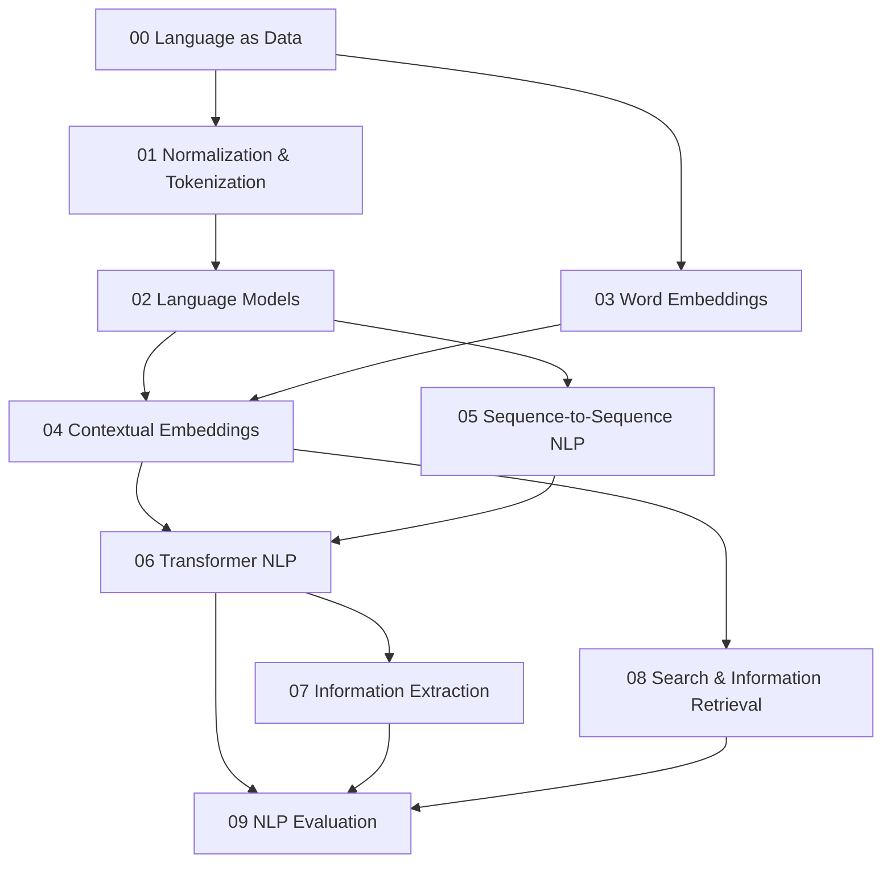

# Natural Language Processing Knowledge Layer

Folder này xây NLP (Natural Language Processing / 자연어 처리 / xử lý ngôn ngữ tự nhiên) từ representation của text tới search/evaluation. Nó không bắt đầu bằng LLM; mục tiêu là hiểu language data, tokenization, language modeling, embeddings và information retrieval trước khi sang `08_large_language_models/`.

## Dependency map



## Chapters

**[00 — Language as Data](./00_language_as_data.md)** đi từ linguistic structure, corpus/distribution, ambiguity, morphology, BoW/TF-IDF tới discrete→continuous representation.

**[01 — Text Normalization & Tokenization](./01_text_normalization_and_tokenization.md)** cover Unicode, case/whitespace, word/character/byte/subword tokenization, BPE/WordPiece/Unigram/SentencePiece, multilingual efficiency và security/versioning.

**[02 — Language Models](./02_language_models.md)** xây chain-rule factorization, n-gram/smoothing, neural/autoregressive/masked LMs, perplexity, sampling và “language probability ≠ truth”.

**[03 — Word Embeddings](./03_word_embeddings.md)** giải thích distributional hypothesis, Word2Vec/CBOW/Skip-Gram/negative sampling, GloVe, PMI, fastText và static embedding limitations.

**[04 — Contextual Embeddings](./04_contextual_embeddings.md)** nối ELMo/BERT, token/sentence representations, bi-encoder/cross-encoder, contrastive retrieval, multilingual embeddings và embedding version drift.

**[05 — Sequence-to-Sequence NLP](./05_sequence_to_sequence_nlp.md)** tập trung translation/summarization, conditional language modeling, beam search, copy/constrained decoding, denoising text-to-text pretraining và faithfulness.

**[06 — Transformer NLP](./06_transformer_nlp.md)** phân biệt encoder-only/decoder-only/encoder-decoder bằng information flow + pretraining objective, rồi fine-tuning/PEFT/domain/multilingual adaptation.

**[07 — Information Extraction](./07_information_extraction.md)** đưa text thành entities, relations, events, slots và knowledge graph facts có provenance; cover generative structured extraction + validation.

**[08 — Search & Information Retrieval](./08_search_and_information_retrieval.md)** đi từ inverted index/TF-IDF/BM25 tới dense ANN, hybrid retrieval, reranking, chunking, filters và RAG retrieval metrics.

**[09 — NLP Evaluation](./09_nlp_evaluation.md)** cover classification/NER metrics, BLEU/ROUGE/chrF/BERTScore/learned metrics, human/LLM judges, multilingual evaluation, contamination và error taxonomy.

## Mental model

```text
Human language
→ normalization/tokenization
→ symbols/tokens
→ sparse/dense/contextual representation
→ language/search/extraction model
→ structured or generated output
→ task-specific evaluation
```

NLP system quality không chỉ nằm ở neural architecture. Corpus, tokenizer, retrieval, output schema, decoding và metric đều có thể là bottleneck.

## Chuyển tiếp sang Large Language Models

`08_large_language_models/` sẽ không giải thích Transformer/tokenization từ đầu nữa. Nó tập trung vào điều xảy ra khi causal/sequence language modeling được **scale** về data/parameters/compute và sau đó post-train cho instruction following:

```text
Transformer LM
→ large-scale pretraining
→ foundation model
→ supervised/instruction fine-tuning
→ preference alignment (RLHF/DPO...)
→ in-context learning / prompting
→ reasoning behavior
→ hallucination / grounding / evaluation
```

Nhờ NLP layer này, các từ `token`, `embedding`, `perplexity`, `autoregressive`, `retrieval`, `reranking` đã có mechanism rõ trước khi bước vào LLM.