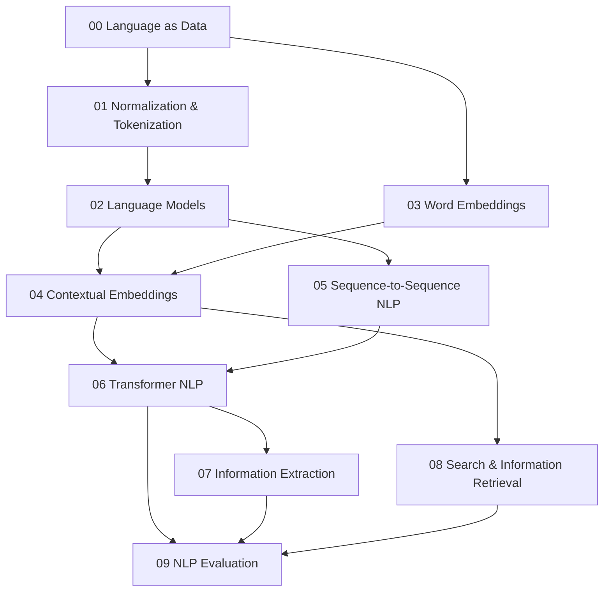

# Natural ngôn ngữ (language / 언어) Processing kiến thức (knowledge / 지식) tầng (layer / 계층)

> **Mạch đọc:** Đọc **Natural ngôn ngữ (language / 언어) Processing kiến thức (knowledge / 지식) tầng (layer / 계층)** như một mắt xích của lộ trình học (learning path / 학습 경로) hiện tại, không như một ghi chú tách rời. Nội dung đi từ **phụ thuộc (dependency / 의존성) map** sang **Chapters**; điểm nối này chuẩn bị câu hỏi cho các mục sau thay vì dừng ở định nghĩa đầu tiên.

Folder này xây NLP (Natural Language Processing / 자연어 처리 / xử lý ngôn ngữ tự nhiên) từ biểu diễn (representation / 표현) của văn bản (text / 텍스트) tới tìm kiếm (search / 검색)/evaluation. Nó không bắt đầu bằng LLM; mục tiêu là hiểu ngôn ngữ (language / 언어) dữ liệu (data / 데이터), tokenization, ngôn ngữ (language / 언어) modeling, embeddings và thông tin (information / 정보) retrieval trước khi sang `08_large_language_models/`.

## Phụ thuộc (dependency / 의존성) map


```mermaid
flowchart TD
    A[00 Language as Data] --> B[01 Normalization & Tokenization]
    B --> C[02 Language Models]
    A --> D[03 Word Embeddings]
    C --> E[04 Contextual Embeddings]
    D --> E
    C --> F[05 Sequence-to-Sequence NLP]
    E --> G[06 Transformer NLP]
    F --> G
    G --> H[07 Information Extraction]
    E --> I[08 Search & Information Retrieval]
    G --> J[09 NLP Evaluation]
    H --> J
    I --> J
```


> **Chuyển mạch:** Từ **phụ thuộc (dependency / 의존성) map**, ta sang **Chapters** để mở rộng cùng câu hỏi và dùng kết quả đó để khép lại mạch giải thích.

## Chapters

**[00 — Language as Data](./00_language_as_data.md)** đi từ linguistic cấu trúc (structure / 구조), corpus/phân phối (distribution / 분포), ambiguity, morphology, BoW/TF-IDF tới discrete→continuous biểu diễn (representation / 표현).

**[01 — Text Normalization & Tokenization](./01_text_normalization_and_tokenization.md)** cover Unicode, trường hợp (case / 사례)/whitespace, word/character/byte/subword tokenization, BPE/WordPiece/Unigram/SentencePiece, multilingual efficiency và bảo mật (security / 보안)/versioning.

**[02 — Language Models](./02_language_models.md)** xây chain-rule factorization, n-gram/smoothing, neural/autoregressive/masked LMs, perplexity, sampling và “ngôn ngữ (language / 언어) xác suất (probability / 확률) ≠ truth”.

**[03 — Word Embeddings](./03_word_embeddings.md)** giải thích distributional hypothesis, Word2Vec/CBOW/Skip-Gram/negative sampling, GloVe, PMI, fastText và static embedding limitations.

**[04 — Contextual Embeddings](./04_contextual_embeddings.md)** nối ELMo/BERT, đơn vị từ (token / 토큰)/sentence representations, bi-encoder/cross-encoder, contrastive retrieval, multilingual embeddings và embedding phiên bản (version / 버전) drift.

**[05 — Sequence-to-Sequence NLP](./05_sequence_to_sequence_nlp.md)** tập trung translation/summarization, conditional ngôn ngữ (language / 언어) modeling, beam tìm kiếm (search / 검색), bản sao (copy / 복사)/constrained decoding, denoising text-to-text pretraining và faithfulness.

**[06 — Transformer NLP](./06_transformer_nlp.md)** phân biệt encoder-only/decoder-only/encoder-decoder bằng thông tin (information / 정보) luồng (flow / 흐름) + pretraining mục tiêu (objective / 목표), rồi fine-tuning/PEFT/lĩnh vực (domain / 도메인)/multilingual adaptation.

**[07 — Information Extraction](./07_information_extraction.md)** đưa văn bản (text / 텍스트) thành entities, relations, events, slots và kiến thức (knowledge / 지식) đồ thị (graph / 그래프) facts có provenance; cover generative structured extraction + kiểm tra hợp lệ (validation / 검증).

**[08 — Search & Information Retrieval](./08_search_and_information_retrieval.md)** đi từ inverted chỉ mục (index / 인덱스)/TF-IDF/BM25 tới dense ANN, hybrid retrieval, reranking, chunking, filters và RAG retrieval metrics.

**[09 — NLP Evaluation](./09_nlp_evaluation.md)** cover classification/NER metrics, BLEU/ROUGE/chrF/BERTScore/learned metrics, human/LLM judges, multilingual evaluation, contamination và lỗi (error / 오류) taxonomy.


> **Chuyển mạch:** Từ **Chapters**, ta sang **mô hình tư duy (mental model / 사고 모델)** để mở rộng cùng câu hỏi và dùng kết quả đó để khép lại mạch giải thích.

## Mô hình tư duy (mental model / 사고 모델)

```text
Human language
→ normalization/tokenization
→ symbols/tokens
→ sparse/dense/contextual representation
→ language/search/extraction model
→ structured or generated output
→ task-specific evaluation
```

NLP hệ thống (system / 시스템) chất lượng (quality / 품질) không chỉ nằm ở neural kiến trúc (architecture / 아키텍처). Corpus, tokenizer, retrieval, đầu ra (output / 출력) lược đồ (schema / 스키마), decoding và chỉ số (metric / 지표) đều có thể là bottleneck.


> **Chuyển mạch:** Từ **mô hình tư duy (mental model / 사고 모델)**, ta sang **Chuyển tiếp sang Large ngôn ngữ (language / 언어) các mô hình (models / 모델들)** để mở rộng cùng câu hỏi và dùng kết quả đó để khép lại mạch giải thích.

## Chuyển tiếp sang Large ngôn ngữ (language / 언어) các mô hình (models / 모델들)

`08_large_language_models/` sẽ không giải thích Transformer/tokenization từ đầu nữa. Nó tập trung vào điều xảy ra khi nhân quả (causal / 인과적)/chuỗi (sequence / 시퀀스) ngôn ngữ (language / 언어) modeling được **quy mô (scale / 규모)** về dữ liệu (data / 데이터)/parameters/compute và sau đó post-train cho instruction following:

```text
Transformer LM
→ large-scale pretraining
→ foundation model
→ supervised/instruction fine-tuning
→ preference alignment (RLHF/DPO...)
→ in-context learning / prompting
→ reasoning behavior
→ hallucination / grounding / evaluation
```

Nhờ NLP tầng (layer / 계층) này, các từ `token`, `embedding`, `perplexity`, `autoregressive`, `retrieval`, `reranking` đã có cơ chế (mechanism / 메커니즘) rõ trước khi bước vào LLM.

> **Bàn giao:** Sau **Chuyển tiếp sang Large ngôn ngữ (language / 언어) các mô hình (models / 모델들)**, hãy chốt bất biến (invariant / 불변식) và giới hạn của mục này trước khi nối sang kiến thức kế tiếp. Có thể đọc tiếp [00 language as data](./00_language_as_data.md) để đối chiếu ranh giới (boundary / 경계) gần nhất.
