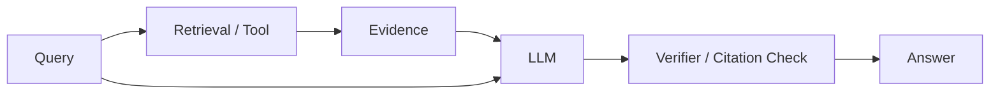

# Hallucination và grounding trong mô hình ngôn ngữ lớn

**Hallucination (환각 / thông tin bịa hoặc không được hỗ trợ)** là failure mode khi mô hình tạo đầu ra trôi chảy, có vẻ hợp lý nhưng không được hỗ trợ bởi fact, bằng chứng hoặc source context cần thiết. Đây không phải một lỗi nằm ngoài thiết kế; mô hình ngôn ngữ tự hồi quy được tối ưu để sinh chuỗi token có xác suất cao, chứ không được bảo đảm về sự thật.

## Vì sao hallucination xảy ra?

LLM học:

\[
P(next\ token\mid context)
\]

Objective này thưởng phần tiếp tục phù hợp với phân bố huấn luyện. Nếu context thiếu một fact cụ thể, mô hình vẫn phải phân phối xác suất trên vocabulary và sinh token tiếp theo.

Vì vậy khi bị hỏi một chi tiết mà nó không chắc, mô hình có thể tạo pattern “trông giống câu trả lời đúng” thay vì trả về trạng thái rỗng hoặc tự động từ chối.

## Độ trôi chảy và tính đúng là hai trục khác nhau

Một câu có thể hoàn hảo về ngữ pháp nhưng sai factual. Đây là lý do hallucination dễ thuyết phục người đọc: phong cách tự tin không phản ánh **độ chắc chắn tri thức (epistemic confidence)**.

Đánh giá production nên tách ít nhất:

```text
độ trôi chảy
độ đúng factual
mức được nguồn hỗ trợ
tính hữu ích cho tác vụ
```

## Tri thức trong tham số

Fact được học trong trọng số đôi khi được gọi là **tri thức tham số (parametric knowledge)**. Nó có ba giới hạn lớn: độ mới theo thời gian, provenance và độ tin cậy khi cần truy xuất chính xác.

Nếu người dùng hỏi “policy mới nhất của công ty”, trọng số mô hình không nên được coi là nguồn chính thức.

## Grounding

**Grounding (근거 기반 생성 / neo câu trả lời vào bằng chứng)** nghĩa là đầu ra được điều kiện hóa và ràng buộc bởi bằng chứng nằm ngoài tham số mô hình, chẳng hạn:

- tài liệu được retrieval;
- hàng dữ liệu trong database;
- kết quả API;
- output từ tool;
- trạng thái đã được xác minh.

RAG là một kiến trúc grounding quan trọng.

## Faithfulness và correctness

Cần tách hai khái niệm:

**Correctness**: câu trả lời có đúng với thế giới hay không?

**Faithfulness / groundedness**: câu trả lời có được nguồn đã cung cấp hỗ trợ hay không?

Một câu trả lời có thể vô tình đúng nhưng không bám nguồn. Ngược lại source có thể lỗi thời, khiến câu trả lời faithful với source nhưng sai so với hiện tại.

Do đó chất lượng nguồn cũng phải được đánh giá.

## Retrieval không tự động loại bỏ hallucination

RAG có thể thất bại vì:

```text
retriever không lấy đúng tài liệu
chunk được lấy thiếu context
mô hình bỏ qua bằng chứng
mô hình kết hợp nhiều nguồn sai
các nguồn mâu thuẫn
nguồn đã lỗi thời
```

RAG chuyển một phần bài toán từ “mô hình có nhớ fact không?” sang “retrieval và việc sử dụng evidence có đúng không?”, nhưng không loại bỏ bất định.

## Hallucination về citation

Mô hình có thể tạo citation trông hợp lệ nhưng source không tồn tại hoặc không hỗ trợ claim. Nếu ứng dụng cần citation, nên để retrieval trả về `source_id` và metadata có cấu trúc thay vì cho mô hình tự bịa nguồn.

Pipeline tốt:

```text
retrieval trả source_id + text
→ mô hình trích dẫn source_id
→ renderer ánh xạ source_id sang metadata đáng tin
```

## Abstention

Hệ thống đáng tin cần biết khi nào không đủ bằng chứng. **Từ chối khẳng định (abstention)** là hành vi không đưa ra kết luận chắc chắn khi evidence hoặc confidence thấp.

Tuy nhiên calibration cho abstention không đơn giản. Prompt kiểu “nếu không biết hãy nói không biết” chỉ giúp một phần.

Abstention tốt thường cần kết hợp:

- ngưỡng retrieval score;
- kiểm tra độ bao phủ của source;
- tín hiệu confidence;
- verifier;
- policy rule.

## Nguồn mâu thuẫn

Nếu source A chứa policy cũ và source B chứa policy mới, mô hình cần xem xét timestamp và authority chứ không chỉ nối hai đoạn text.

Metadata như ngày xuất bản, version, owner và trạng thái tài liệu phải được coi là dữ liệu quan trọng cấp đầu tiên.

## Hallucination theo thời gian

LLM có thể trả lời sự kiện hiện tại dựa trên prior đã cũ. Query có từ “hôm nay”, “mới nhất” hoặc tương tự nên kích hoạt retrieval/search mới nếu hệ thống hỗ trợ.

Fact nhạy thời gian là ví dụ điển hình cho việc công cụ ngoài quan trọng hơn việc chỉ tăng model scale.

## Hallucination về số

LLM có thể sao chép số sai hoặc tính toán sai. Với kết quả tài chính hoặc kỹ thuật, phép tính nên được chuyển sang calculator/code và giá trị nguồn cần truy ngược được.

## Hallucination về thực thể

Mô hình có thể trộn thuộc tính của nhiều entity có tên giống nhau. Entity resolution và ID có cấu trúc giúp giảm lỗi này.

Knowledge Graph hoặc database thường phù hợp hơn plain text khi identity chính xác là yêu cầu cốt lõi.

## Hallucination và temperature

Temperature thấp có thể giảm tính ngẫu nhiên nhưng không bảo đảm sự thật. Mô hình có thể luôn chọn cùng một continuation sai nhưng có xác suất cao.

**Deterministic decoding không đồng nghĩa factual decoding.**

## Phát hiện hallucination

Có thể dùng verifier model, kiểm tra entailment với tài liệu retrieval, rule validation hoặc consistency check. Tuy nhiên detector cũng có false positive và false negative.

Workflow rủi ro cao cần validation từ nguồn có thẩm quyền ngoài LLM.

## Kiến trúc grounded generation



Ý tưởng quan trọng: mô hình không phải **source of record**.

## Độ mới của tri thức

Dữ liệu thay đổi thường xuyên nên nằm ngoài trọng số nếu có thể:

```text
giá
trạng thái tài khoản
tồn kho
policy hiện hành
lịch
thông tin mới
```

Trọng số phù hợp với pattern ngôn ngữ và tri thức tổng quát; database/API phù hợp với sự thật động.

## Mô hình tư duy

> Hallucination dễ xuất hiện khi **áp lực phải sinh câu trả lời lớn hơn mức ràng buộc bởi bằng chứng**.

Grounding đưa evidence thành một phần computation, nhưng độ tin cậy cuối cùng vẫn là thuộc tính của cả hệ thống.

## Những hiểu lầm thường gặp

### “Mô hình càng lớn sẽ hết hallucination”

Scale có thể giảm một số lỗi nhưng objective vẫn không bảo đảm sự thật.

### “RAG = không còn hallucination”

Không. Retrieval và sử dụng evidence đều có failure mode riêng.

### “Temperature 0 nghĩa câu trả lời factual”

Nó chỉ làm sampling ít ngẫu nhiên hơn.

## Liên kết kiến thức

Hallucination nối [Pretraining](./04_pretraining.md), [Probability](../01_mathematical_foundations/02_probability_for_ai.md), Information Retrieval và RAG.

Xem tiếp: [LLM Evaluation](./14_llm_evaluation.md).