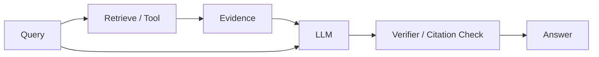

# Hallucination và Grounding trong Large Language Models

**Hallucination (환각 / thông tin bịa hoặc không được hỗ trợ)** là failure mode khi model tạo output fluent, plausible nhưng không được support bởi facts, evidence hoặc source context cần thiết. Đây không phải bug lạ ngoài design; autoregressive language model được optimize để sinh token sequence probable, không phải để guarantee truth.

## Vì sao hallucination xảy ra?

LLM học:

\[
P(next\ token\mid context)
\]

Objective này thưởng language continuation phù hợp training distribution. Nếu context thiếu fact cụ thể, model vẫn phải phân phối probability lên vocabulary và sinh một continuation.

Vì vậy khi bị hỏi một chi tiết mà nó không biết chắc, model có thể tạo pattern “có vẻ đúng” thay vì trả empty result.

## Fluency và factuality là hai trục khác nhau

Một câu có thể grammatical hoàn hảo nhưng factual sai. Đây là lý do human dễ bị thuyết phục bởi hallucination: style confidence không phản ánh epistemic confidence.

Production evaluation cần tách ít nhất:

```text
fluency
factual correctness
source support
task usefulness
```

## Parametric knowledge

Facts learned trong weights được gọi informal là **parametric knowledge**. Nó có ba limitation lớn: cutoff/freshness, provenance và exact retrieval reliability.

Nếu user hỏi “policy mới nhất của công ty”, weights không phải authoritative source.

## Grounding

**Grounding (근거 기반 생성 / neo câu trả lời vào nguồn)** nghĩa output được condition và ràng buộc bởi evidence ngoài model parameters, ví dụ:

- retrieved documents;
- database rows;
- API results;
- tool outputs;
- verified state.

RAG là một grounding architecture quan trọng.

## Faithfulness vs correctness

Hai concept cần tách:

**Correctness**: answer có đúng với world không?

**Faithfulness/groundedness**: answer có được support bởi supplied sources không?

Một answer có thể correct by chance nhưng không faithful với source. Hoặc source itself outdated nên answer faithful nhưng real-world wrong.

Do đó source quality cũng phải evaluate.

## Retrieval không tự động loại hallucination

RAG có thể fail vì:

```text
retriever không lấy đúng document
retrieved chunk thiếu context
model bỏ qua evidence
model combine sources sai
source conflict
source outdated
```

RAG biến một phần problem từ “model nhớ fact không?” thành “retrieval + evidence use có đúng không?”, nhưng không loại bỏ uncertainty.

## Citation hallucination

Model có thể tạo citation trông hợp lệ nhưng source không tồn tại hoặc không support claim. Nếu application cần citation, nên generate citation IDs từ retrieved sources có structured metadata thay vì cho model invent freely.

Pipeline tốt:

```text
retrieval returns source_id + text
→ model cites source_id
→ renderer maps source_id to trusted metadata
```

## Abstention

Một reliable model cần biết khi nào không đủ evidence. **Abstention** là behavior từ chối khẳng định khi confidence/evidence thấp.

Tuy nhiên calibration khó. Prompt “nếu không biết hãy nói không biết” giúp một phần nhưng không guarantee.

Abstention tốt thường cần combination:

- retrieval score thresholds;
- source coverage checks;
- model confidence signals;
- verifier;
- policy rules.

## Conflicting sources

Nếu source A nói policy cũ và source B policy mới, model cần reasoning về timestamp/authority, không chỉ concatenate text.

Metadata như publication date, version, owner và document status trở thành first-class data.

## Temporal hallucination

LLM có thể answer current events bằng outdated prior. Query rõ “today/latest” nên trigger fresh search/retrieval.

Time-sensitive facts là case điển hình mà external tools quan trọng hơn raw model scale.

## Numerical hallucination

LLM có thể copy numbers sai hoặc arithmetic sai. Với financial/engineering outputs, calculations nên chuyển sang calculator/code và source values phải traceable.

## Entity hallucination

Model có thể merge attributes của entities tên giống nhau. Entity resolution hoặc structured IDs giúp giảm lỗi.

Knowledge graph/database thường tốt hơn plain text khi identity chính xác quan trọng.

## Hallucination và temperature

Temperature thấp có thể giảm randomness nhưng không guarantee truth. Model có thể confidently choose same wrong high-probability continuation every time.

Deterministic decoding ≠ factual decoding.

## Hallucination detection

Có thể dùng verifier model, retrieval entailment check, rule-based validation hoặc consistency checks. Nhưng detector cũng có false positives/negatives.

High-stakes workflow cần authoritative validation ngoài LLM.

## Grounded generation architecture



Critical idea: model không phải source of record.

## Knowledge freshness

Data that changes frequently should live outside weights when possible:

```text
prices
account state
inventory
current policy
calendar
latest news
```

Weights phù hợp cho language/general patterns; database/API phù hợp cho dynamic truth.

## Mental Model

> Hallucination xuất hiện khi **generation pressure lớn hơn evidence constraint**.

Grounding làm evidence trở thành part of computation, nhưng reliability cuối cùng vẫn là system property.

## Common Misconceptions

### “Model lớn sẽ hết hallucination”

Scale có thể giảm một số errors nhưng objective vẫn không guarantee truth.

### “RAG = zero hallucination”

Không. Retrieval và evidence-use đều có failure modes.

### “Temperature 0 nghĩa answer factual”

Nó chỉ làm sampling ít random hơn.

## Knowledge Connection

Hallucination nối [Pretraining](./04_pretraining.md), [Probability](../01_mathematical_foundations/02_probability_for_ai.md), Information Retrieval và RAG.

Xem tiếp: [LLM Evaluation](./14_llm_evaluation.md).