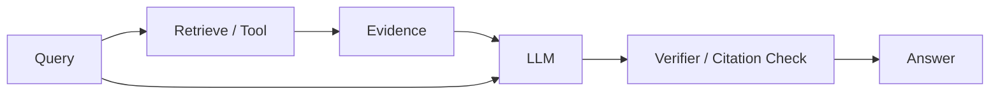

# Hallucination và Grounding trong Large ngôn ngữ (language / 언어) các mô hình (models / 모델들)

> **Mạch đọc:** [README](./README.md) là bản đồ owner của **Hallucination và Grounding trong Large ngôn ngữ (language / 언어) các mô hình (models / 모델들)**; nhìn vào vị trí đó trước để biết file này đang phục vụ nhánh kiến thức nào. **Vì sao hallucination xảy ra?** mở đối tượng chính của file và câu hỏi cần theo dõi; sau đó sang **Fluency và factuality là hai trục khác nhau** để mở rộng đối tượng sang phạm vi kế cận. Mạch này nối hallucination với grounding, retrieval, citation và uncertainty, để giảm sai bằng nguồn kiểm chứng được.

**Hallucination (환각 / thông tin bịa hoặc không được hỗ trợ)** là dạng thất bại (failure mode / 실패 모드) khi mô hình (model / 모델) tạo đầu ra (output / 출력) fluent, plausible nhưng không được hỗ trợ (support / 지원) bởi facts, bằng chứng (evidence / 증거) hoặc nguồn (source / 소스) ngữ cảnh (context / 맥락) cần thiết. Đây không phải bug lạ ngoài thiết kế (design / 설계); autoregressive ngôn ngữ (language / 언어) mô hình (model / 모델) được optimize để sinh đơn vị từ (token / 토큰) chuỗi (sequence / 시퀀스) probable, không phải để guarantee truth.

## Vì sao hallucination xảy ra?

LLM học:

\[
P(next\ token\mid context)
\]

Mục tiêu (objective / 목표) này thưởng ngôn ngữ (language / 언어) continuation phù hợp huấn luyện (training / 학습) phân phối (distribution / 분포). Nếu ngữ cảnh (context / 맥락) thiếu fact cụ thể, mô hình (model / 모델) vẫn phải phân phối xác suất (probability / 확률) lên vocabulary và sinh một continuation.

Vì vậy khi bị hỏi một chi tiết mà nó không biết chắc, mô hình (model / 모델) có thể tạo mẫu (pattern / 패턴) “có vẻ đúng” thay vì trả empty kết quả (result / 결과).

Mục tiêu sinh continuation giải thích vì sao câu trả lời có thể trôi chảy mà vẫn sai. Vì vậy, ta cần tách fluency khỏi factuality trước khi bàn đến nguồn tri thức mà mô hình dựa vào.

## Fluency và factuality là hai trục khác nhau

Một câu có thể grammatical hoàn hảo nhưng factual sai. Đây là lý do human dễ bị thuyết phục bởi hallucination: style confidence không phản ánh epistemic confidence.

Môi trường vận hành (production / 운영 환경) evaluation cần tách ít nhất:

```text
fluency
factual correctness
source support
task usefulness
```

Parametric knowledge là những regularity được mã hóa trong weights, hữu ích cho mẫu ngôn ngữ nhưng không tự cung cấp nguồn kiểm chứng cho sự kiện mới. Vì thế, grounding phải đưa bằng chứng bên ngoài vào quy trình sinh.

## Parametric kiến thức (knowledge / 지식)

Facts learned trong weights được gọi informal là **parametric kiến thức (knowledge / 지식)**. Nó có ba limitation lớn: cutoff/freshness, provenance và chính xác (exact / 정확한) retrieval độ tin cậy (reliability / 신뢰성).

Nếu người dùng (user / 사용자) hỏi “chính sách (policy / 정책) mới nhất của công ty”, weights không phải authoritative nguồn (source / 소스).

Grounding bổ sung context hoặc công cụ truy hồi để câu trả lời có thể dựa trên nguồn được chọn. Nhưng “bám theo nguồn” và “nói đúng sự thật” là hai tiêu chí khác nhau, cần được đánh giá riêng.

## Grounding

**Grounding (근거 기반 생성 / neo câu trả lời vào nguồn)** nghĩa đầu ra (output / 출력) được điều kiện (condition / 조건) và ràng buộc bởi bằng chứng (evidence / 증거) ngoài mô hình (model / 모델) parameters, ví dụ:

- retrieved documents;
- cơ sở dữ liệu (database / 데이터베이스) rows;
- API results;
- công cụ (tool / 도구) outputs;
- verified trạng thái (state / 상태).

RAG là một grounding kiến trúc (architecture / 아키텍처) quan trọng.

Faithfulness hỏi câu trả lời có phản ánh đúng bằng chứng đã đưa hay không, còn correctness hỏi chính bằng chứng hoặc kết luận có đúng với thực tế hay không. Ngay cả khi phân biệt được hai trục này, retrieval vẫn không tự động loại bỏ hallucination.

## Faithfulness vs tính đúng đắn (correctness / 정확성)

Hai concept cần tách:

**tính đúng đắn (correctness / 정확성)**: answer có đúng với world không?

**Faithfulness/groundedness**: answer có được hỗ trợ (support / 지원) bởi supplied sources không?

Một answer có thể correct by chance nhưng không faithful với nguồn (source / 소스). Hoặc nguồn (source / 소스) itself outdated nên answer faithful nhưng real-world wrong.

Do đó nguồn (source / 소스) chất lượng (quality / 품질) cũng phải evaluate.

Retriever có thể lấy nhầm, thiếu hoặc đưa các đoạn mâu thuẫn; mô hình vẫn có thể suy diễn quá mức từ context đó. Một failure mode dễ nhận biết là trích dẫn được tạo ra nhưng không thực sự hỗ trợ claim.

## Retrieval không tự động loại hallucination

RAG có thể thất bại (fail / 실패) vì:

```text
retriever không lấy đúng document
retrieved chunk thiếu context
model bỏ qua evidence
model combine sources sai
source conflict
source outdated
```

RAG biến một phần bài toán (problem / 문제) từ “mô hình (model / 모델) nhớ fact không?” thành “retrieval + bằng chứng (evidence / 증거) use có đúng không?”, nhưng không loại bỏ bất định (uncertainty / 불확실성).

Citation hallucination xảy ra khi nguồn hoặc số liệu được nêu không tồn tại, không chứa claim, hoặc bị gán sai ngữ cảnh. Khi bằng chứng không đủ, hành vi an toàn hơn là nêu rõ giới hạn và abstain.

## Citation hallucination

Mô hình (model / 모델) có thể tạo citation trông hợp lệ nhưng nguồn (source / 소스) không tồn tại hoặc không hỗ trợ (support / 지원) claim. Nếu ứng dụng (application / 애플리케이션) cần citation, nên generate citation IDs từ retrieved sources có structured siêu dữ liệu (metadata / 메타데이터) thay vì cho mô hình (model / 모델) invent freely.

Chuỗi xử lý (pipeline / 파이프라인) tốt:

```text
retrieval returns source_id + text
→ model cites source_id
→ renderer maps source_id to trusted metadata
```

Abstention không chỉ là trả lời “không biết”, mà là một quyết định dựa trên ngưỡng bằng chứng và mức rủi ro của tác vụ. Khi các nguồn đưa ra kết luận khác nhau, hệ thống cần chuyển sang xử lý xung đột thay vì chọn bừa.

## Abstention

Một reliable mô hình (model / 모델) cần biết khi nào không đủ bằng chứng (evidence / 증거). **Abstention** là hành vi (behavior / 동작) từ chối khẳng định khi confidence/bằng chứng (evidence / 증거) thấp.

Tuy nhiên calibration khó. Prompt “nếu không biết hãy nói không biết” giúp một phần nhưng không guarantee.

Abstention tốt thường cần combination:

- retrieval score thresholds;
- nguồn (source / 소스) coverage checks;
- mô hình (model / 모델) confidence signals;
- verifier;
- chính sách (policy / 정책) rules.

Với nguồn xung đột, hệ thống nên giữ lại provenance, thời điểm và phạm vi áp dụng của từng nguồn, rồi giải thích vì sao chọn hoặc chưa thể chọn một kết luận. Bước này đặc biệt quan trọng với claim phụ thuộc thời gian.

## Conflicting sources

Nếu nguồn (source / 소스) A nói chính sách (policy / 정책) cũ và nguồn (source / 소스) B chính sách (policy / 정책) mới, mô hình (model / 모델) cần lập luận (reasoning / 추론) về timestamp/authority, không chỉ concatenate văn bản (text / 텍스트).

Siêu dữ liệu (metadata / 메타데이터) như publication date, phiên bản (version / 버전), đơn vị sở hữu (owner / 오너) và document status trở thành first-class dữ liệu (data / 데이터).

Temporal hallucination xuất hiện khi mô hình trộn lẫn các mốc thời gian, coi thông tin cũ là hiện tại hoặc dự đoán như sự kiện đã xảy ra. Sau thời gian, số liệu là một lớp lỗi khác cần kiểm tra bằng phép tính và nguồn gốc rõ ràng.

## Temporal hallucination

LLM có thể answer hiện tại (current / 현재) events bằng outdated prior. truy vấn (query / 쿼리) rõ “today/latest” nên trigger fresh tìm kiếm (search / 검색)/retrieval.

Time-sensitive facts là trường hợp (case / 사례) điển hình mà bên ngoài (external / 외부) tools quan trọng hơn raw mô hình (model / 모델) quy mô (scale / 규모).

Số liệu có thể bị sao chép sai hoặc tính sai dù phần văn bản xung quanh vẫn nghe hợp lý. Với các giá trị quan trọng, cần chuyển phép tính sang calculator hoặc code rồi kiểm tra entity mà con số gắn với.

## Numerical hallucination

LLM có thể bản sao (copy / 복사) numbers sai hoặc arithmetic sai. Với financial/kỹ thuật (engineering / 엔지니어링) outputs, calculations nên chuyển sang calculator/mã (code / 코드) và nguồn (source / 소스) values phải traceable.

Entity hallucination là việc gán sai tên, vai trò, quan hệ hoặc định danh cho một thực thể. Knowledge graph và database thường phù hợp hơn văn bản tự do khi độ chính xác định danh là yêu cầu cốt lõi.

## Thực thể (entity / 엔터티) hallucination

Mô hình (model / 모델) có thể merge attributes của entities tên giống nhau. thực thể (entity / 엔터티) resolution hoặc structured IDs giúp giảm lỗi.

Kiến thức (knowledge / 지식) đồ thị (graph / 그래프)/cơ sở dữ liệu (database / 데이터베이스) thường tốt hơn plain văn bản (text / 텍스트) khi định danh (identity / 식별자) chính xác quan trọng.

Temperature chỉ điều chỉnh độ ngẫu nhiên của sampling; hạ temperature không biến một nguồn sai thành nguồn đúng. Vì vậy cần các tín hiệu detection độc lập với decoding.

## Hallucination và temperature

Temperature thấp có thể giảm randomness nhưng không guarantee truth. mô hình (model / 모델) có thể confidently choose same wrong high-probability continuation every thời gian (time / 시간).

Deterministic decoding ≠ factual decoding.

Detection có thể dựa trên kiểm tra entailment với nguồn, consistency giữa nhiều lần sinh, schema validation hoặc bộ kiểm tra chuyên biệt. Với tác vụ rủi ro cao, các tín hiệu này phải nằm ngoài lời tự đánh giá của chính LLM.

## Hallucination detection

Có thể dùng verifier mô hình (model / 모델), retrieval entailment check, rule-based kiểm tra hợp lệ (validation / 검증) hoặc consistency checks. Nhưng detector cũng có false positives/negatives.

High-stakes workflow cần authoritative kiểm tra hợp lệ (validation / 검증) ngoài LLM.

Grounded generation kết hợp truy hồi, xếp hạng nguồn, ràng buộc sinh và kiểm tra sau sinh thành một pipeline. Kiến trúc đó chỉ đáng tin khi từng lớp có provenance và tiêu chí lỗi rõ ràng; dữ liệu đầu vào cũng phải còn mới.

## Grounded generation kiến trúc (architecture / 아키텍처)

Phần này chuyển khái niệm Computer Science thành cấu trúc, ví dụ hoặc quy trình có thể kiểm tra. Hãy xác định câu hỏi mà mục trả lời rồi nối kết luận với phần kế tiếp.


```mermaid
flowchart LR
    Q[Query] --> R[Retrieve / Tool]
    R --> E[Evidence]
    E --> L[LLM]
    Q --> L
    L --> V[Verifier / Citation Check]
    V --> A[Answer]
```

Trọng yếu (critical / 중요) idea: mô hình (model / 모델) không phải nguồn (source / 소스) of bản ghi (record / 레코드).

Freshness là thuộc tính của nguồn và quy trình cập nhật, không phải đặc tính tự động của weights. Mental model tiếp theo sẽ gom các ranh giới đó thành cách suy luận khi thiết kế hệ thống.

## Kiến thức (knowledge / 지식) freshness

Dữ liệu (data / 데이터) that changes frequently should live outside weights when possible:

```text
prices
account state
inventory
current policy
calendar
latest news
```

Weights phù hợp cho ngôn ngữ (language / 언어)/general patterns; cơ sở dữ liệu (database / 데이터베이스)/API phù hợp cho động (dynamic / 동적) truth.

Mô hình tư duy ở đây tách bốn câu hỏi: mô hình biết gì từ weights, nguồn nào được truy hồi, claim có được nguồn hỗ trợ không, và hệ thống xử lý bất định thế nào. Các ngộ nhận sau đây giúp kiểm tra bốn câu hỏi đó.

## Mô hình tư duy (mental model / 사고 모델)

> Hallucination xuất hiện khi **generation pressure lớn hơn bằng chứng (evidence / 증거) ràng buộc (constraint / 제약조건)**.

Grounding làm bằng chứng (evidence / 증거) trở thành part of computation, nhưng độ tin cậy (reliability / 신뢰성) cuối cùng vẫn là hệ thống (system / 시스템) thuộc tính (property / 속성).

Những ngộ nhận như “có citation là đã đúng” hoặc “temperature thấp thì hết hallucination” đều bỏ qua lớp kiểm chứng bên ngoài. Phần liên kết cuối cùng chỉ rõ nơi tiếp tục học về retrieval, evaluation và hệ thống nguồn.

## Dùng chung (common / 공통) Misconceptions

### “mô hình (model / 모델) lớn sẽ hết hallucination”

Quy mô (scale / 규모) có thể giảm một số errors nhưng mục tiêu (objective / 목표) vẫn không guarantee truth.

### “RAG = zero hallucination”

Không. Retrieval và evidence-use đều có thất bại (failure / 실패) modes.

### “Temperature 0 nghĩa answer factual”

Nó chỉ làm sampling ít random hơn.

Các liên kết dưới đây đặt hallucination và grounding vào mạch rộng hơn của LLM: từ retrieval và citation đến evaluation, safety và data freshness. Người học có thể dùng chúng để kiểm tra từng giả định thay vì xem grounding như một lời bảo đảm tuyệt đối.

## Liên kết kiến thức (knowledge connection / 지식 연결)

Hallucination nối [Pretraining](./04_pretraining.md), [Probability](../01_mathematical_foundations/02_probability_for_ai.md), thông tin (information / 정보) Retrieval và RAG.

Xem tiếp: [LLM Evaluation](./14_llm_evaluation.md).

> **Bàn giao:** Sau **Liên kết kiến thức (knowledge connection / 지식 연결)**, hãy giữ lại kết luận và ranh giới của mục này; quay về [README](./README.md) khi cần định vị owner hoặc chọn nhánh học tiếp theo.
