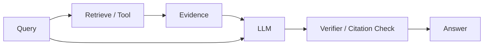

# Hallucination và Grounding trong Large ngôn ngữ (language / 언어) các mô hình (models / 모델들)

> **Mạch đọc:** Đặt **Hallucination và Grounding trong Large ngôn ngữ (language / 언어) các mô hình (models / 모델들)** trong bản đồ [README](./README.md) để thấy đơn vị sở hữu (owner / 오너) và vị trí của nó. Nội dung đi từ **Vì sao hallucination xảy ra?** sang **Fluency và factuality là hai trục khác nhau**; điểm nối này chuẩn bị câu hỏi cho các mục sau thay vì dừng ở định nghĩa đầu tiên.


**Hallucination (환각 / thông tin bịa hoặc không được hỗ trợ)** là dạng thất bại (failure mode / 실패 모드) khi mô hình (model / 모델) tạo đầu ra (output / 출력) fluent, plausible nhưng không được hỗ trợ (support / 지원) bởi facts, bằng chứng (evidence / 증거) hoặc nguồn (source / 소스) ngữ cảnh (context / 맥락) cần thiết. Đây không phải bug lạ ngoài thiết kế (design / 설계); autoregressive ngôn ngữ (language / 언어) mô hình (model / 모델) được optimize để sinh đơn vị từ (token / 토큰) chuỗi (sequence / 시퀀스) probable, không phải để guarantee truth.

## Vì sao hallucination xảy ra?

LLM học:

\[
P(next\ token\mid context)
\]

Mục tiêu (objective / 목표) này thưởng ngôn ngữ (language / 언어) continuation phù hợp huấn luyện (training / 학습) phân phối (distribution / 분포). Nếu ngữ cảnh (context / 맥락) thiếu fact cụ thể, mô hình (model / 모델) vẫn phải phân phối xác suất (probability / 확률) lên vocabulary và sinh một continuation.

Vì vậy khi bị hỏi một chi tiết mà nó không biết chắc, mô hình (model / 모델) có thể tạo mẫu (pattern / 패턴) “có vẻ đúng” thay vì trả empty kết quả (result / 결과).

## Fluency và factuality là hai trục khác nhau

Một câu có thể grammatical hoàn hảo nhưng factual sai. Đây là lý do human dễ bị thuyết phục bởi hallucination: style confidence không phản ánh epistemic confidence.

Môi trường vận hành (production / 운영 환경) evaluation cần tách ít nhất:

```text
fluency
factual correctness
source support
task usefulness
```

## Parametric kiến thức (knowledge / 지식)

Facts learned trong weights được gọi informal là **parametric kiến thức (knowledge / 지식)**. Nó có ba limitation lớn: cutoff/freshness, provenance và chính xác (exact / 정확한) retrieval độ tin cậy (reliability / 신뢰성).

Nếu người dùng (user / 사용자) hỏi “chính sách (policy / 정책) mới nhất của công ty”, weights không phải authoritative nguồn (source / 소스).

## Grounding

**Grounding (근거 기반 생성 / neo câu trả lời vào nguồn)** nghĩa đầu ra (output / 출력) được điều kiện (condition / 조건) và ràng buộc bởi bằng chứng (evidence / 증거) ngoài mô hình (model / 모델) parameters, ví dụ:

- retrieved documents;
- cơ sở dữ liệu (database / 데이터베이스) rows;
- API results;
- công cụ (tool / 도구) outputs;
- verified trạng thái (state / 상태).

RAG là một grounding kiến trúc (architecture / 아키텍처) quan trọng.

## Faithfulness vs tính đúng đắn (correctness / 정확성)

Hai concept cần tách:

**tính đúng đắn (correctness / 정확성)**: answer có đúng với world không?

**Faithfulness/groundedness**: answer có được hỗ trợ (support / 지원) bởi supplied sources không?

Một answer có thể correct by chance nhưng không faithful với nguồn (source / 소스). Hoặc nguồn (source / 소스) itself outdated nên answer faithful nhưng real-world wrong.

Do đó nguồn (source / 소스) chất lượng (quality / 품질) cũng phải evaluate.

## Retrieval không tự động loại hallucination

RAG có thể thất bại (fail / 실패) vì:

```text
retriever không lấy đúng document
retrieved chunk thiếu context
model bỏ qua evidence
model combine sources sai
source conflict
source outdated
```

RAG biến một phần bài toán (problem / 문제) từ “mô hình (model / 모델) nhớ fact không?” thành “retrieval + bằng chứng (evidence / 증거) use có đúng không?”, nhưng không loại bỏ bất định (uncertainty / 불확실성).

## Citation hallucination

Mô hình (model / 모델) có thể tạo citation trông hợp lệ nhưng nguồn (source / 소스) không tồn tại hoặc không hỗ trợ (support / 지원) claim. Nếu ứng dụng (application / 애플리케이션) cần citation, nên generate citation IDs từ retrieved sources có structured siêu dữ liệu (metadata / 메타데이터) thay vì cho mô hình (model / 모델) invent freely.

Chuỗi xử lý (pipeline / 파이프라인) tốt:

```text
retrieval returns source_id + text
→ model cites source_id
→ renderer maps source_id to trusted metadata
```

## Abstention

Một reliable mô hình (model / 모델) cần biết khi nào không đủ bằng chứng (evidence / 증거). **Abstention** là hành vi (behavior / 동작) từ chối khẳng định khi confidence/bằng chứng (evidence / 증거) thấp.

Tuy nhiên calibration khó. Prompt “nếu không biết hãy nói không biết” giúp một phần nhưng không guarantee.

Abstention tốt thường cần combination:

- retrieval score thresholds;
- nguồn (source / 소스) coverage checks;
- mô hình (model / 모델) confidence signals;
- verifier;
- chính sách (policy / 정책) rules.

## Conflicting sources

Nếu nguồn (source / 소스) A nói chính sách (policy / 정책) cũ và nguồn (source / 소스) B chính sách (policy / 정책) mới, mô hình (model / 모델) cần lập luận (reasoning / 추론) về timestamp/authority, không chỉ concatenate văn bản (text / 텍스트).

Siêu dữ liệu (metadata / 메타데이터) như publication date, phiên bản (version / 버전), đơn vị sở hữu (owner / 오너) và document status trở thành first-class dữ liệu (data / 데이터).

## Temporal hallucination

LLM có thể answer hiện tại (current / 현재) events bằng outdated prior. truy vấn (query / 쿼리) rõ “today/latest” nên trigger fresh tìm kiếm (search / 검색)/retrieval.

Time-sensitive facts là trường hợp (case / 사례) điển hình mà bên ngoài (external / 외부) tools quan trọng hơn raw mô hình (model / 모델) quy mô (scale / 규모).

## Numerical hallucination

LLM có thể bản sao (copy / 복사) numbers sai hoặc arithmetic sai. Với financial/kỹ thuật (engineering / 엔지니어링) outputs, calculations nên chuyển sang calculator/mã (code / 코드) và nguồn (source / 소스) values phải traceable.

## Thực thể (entity / 엔터티) hallucination

Mô hình (model / 모델) có thể merge attributes của entities tên giống nhau. thực thể (entity / 엔터티) resolution hoặc structured IDs giúp giảm lỗi.

Kiến thức (knowledge / 지식) đồ thị (graph / 그래프)/cơ sở dữ liệu (database / 데이터베이스) thường tốt hơn plain văn bản (text / 텍스트) khi định danh (identity / 식별자) chính xác quan trọng.

## Hallucination và temperature

Temperature thấp có thể giảm randomness nhưng không guarantee truth. mô hình (model / 모델) có thể confidently choose same wrong high-probability continuation every thời gian (time / 시간).

Deterministic decoding ≠ factual decoding.

## Hallucination detection

Có thể dùng verifier mô hình (model / 모델), retrieval entailment check, rule-based kiểm tra hợp lệ (validation / 검증) hoặc consistency checks. Nhưng detector cũng có false positives/negatives.

High-stakes workflow cần authoritative kiểm tra hợp lệ (validation / 검증) ngoài LLM.

## Grounded generation kiến trúc (architecture / 아키텍처)

Phần này chuyển khái niệm Computer Science thành cấu trúc, ví dụ hoặc quy trình có thể kiểm tra. Hãy xác định câu hỏi mà mục trả lời rồi nối kết luận với phần kế tiếp.


```mermaid
flowchart LR
    Q[Query] --> R[Retrieve / Tool]
    R --> E[Evidence]
    E --> L[LLM]
    Q --> L
    L --> V[Verifier / Citation Check]
    V --> A[Answer]
```

Trọng yếu (critical / 중요) idea: mô hình (model / 모델) không phải nguồn (source / 소스) of bản ghi (record / 레코드).

## Kiến thức (knowledge / 지식) freshness

Dữ liệu (data / 데이터) that changes frequently should live outside weights when possible:

```text
prices
account state
inventory
current policy
calendar
latest news
```

Weights phù hợp cho ngôn ngữ (language / 언어)/general patterns; cơ sở dữ liệu (database / 데이터베이스)/API phù hợp cho động (dynamic / 동적) truth.

## Mô hình tư duy (mental model / 사고 모델)

> Hallucination xuất hiện khi **generation pressure lớn hơn bằng chứng (evidence / 증거) ràng buộc (constraint / 제약조건)**.

Grounding làm bằng chứng (evidence / 증거) trở thành part of computation, nhưng độ tin cậy (reliability / 신뢰성) cuối cùng vẫn là hệ thống (system / 시스템) thuộc tính (property / 속성).

## Dùng chung (common / 공통) Misconceptions

### “mô hình (model / 모델) lớn sẽ hết hallucination”

Quy mô (scale / 규모) có thể giảm một số errors nhưng mục tiêu (objective / 목표) vẫn không guarantee truth.

### “RAG = zero hallucination”

Không. Retrieval và evidence-use đều có thất bại (failure / 실패) modes.

### “Temperature 0 nghĩa answer factual”

Nó chỉ làm sampling ít random hơn.

## Liên kết kiến thức (knowledge connection / 지식 연결)

Hallucination nối [Pretraining](./04_pretraining.md), [Probability](../01_mathematical_foundations/02_probability_for_ai.md), thông tin (information / 정보) Retrieval và RAG.

Xem tiếp: [LLM Evaluation](./14_llm_evaluation.md).
